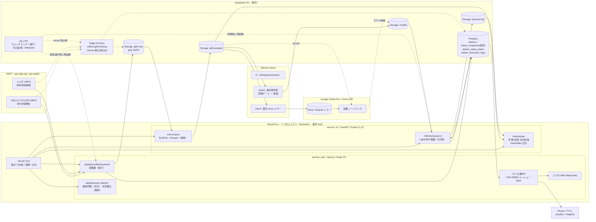

# BikeChance 開発プラン v1.2

作成日：2026-09-04（金）　改訂：2026-09-04（v1.2）　作成：Claude Code（Fable 5.1）　入力：`docs/260903_memo.md`

---

## 0. この文書について

- **目的**：`docs/260903_memo.md` に書かれた構想を、実測とリサーチに基づいて「何を・どの順で・どう作るか」まで落とした開発計画にする。以後の実装・意思決定はこの文書を起点にし、変更は該当章と §15 の決定記録を更新して残す（ADR 方式）。
- **前提**：開発者 1 名。開発機は MacBook Air（Xcode 26.6 / Node 22 / Python 3.12）、実機は iPhone 17 Pro。本番は **Vercel Pro**（商用利用と他プロジェクトとの共用を想定。v1.1 で Hobby から変更）と **Supabase Pro**、補助に Google Colab Pro+ と Google Drive 2 TB。
- **表記**：「推奨」は本プランの前提となる案。§15 の決定記録に決定済み事項・代替案・判断時期をまとめた。数値は 2026-09-04 に実測・確認したもので、出典は §16 に示す。
- **変更履歴**：v1.0（2026-09-04）初版。**v1.1（2026-09-04）Vercel Pro を前提に推論・スケジューリング・収集器の配置・費用・商用化の考慮を再設計（§4〜§5、§8、§11〜§15）。「AI と人間で別 API を作らない」原則を CLAUDE.md と本書から削除し、API 層の採用理由を技術的根拠に書き直した。§15 の推奨を決定として確定し、Vercel Pro に伴う新規論点 D-17〜D-21 を追加。** v1.2（2026-09-04）D-17〜D-21 を決定として確定。CLAUDE.md をプランに沿って改訂。v1.2a（2026-09-06）§15 の D-04 に ODPT の認証方式とレート制限の実測値を追記（決定内容は変更なし）。
- **章構成**：§1 要約 → §2 プロダクト → §3 データ調査 → §4 アーキテクチャ → §5 データ蓄積（最優先） → §6–7 学習・評価 → §8 推論・API → §9–10 アプリ → §11 運用 → §12 リポジトリ → §13 ロードマップ → §14 リスク → §15 決定記録 → §16 付録。

## 1. エグゼクティブサマリー

**BikeChance は「ポートに着いたとき、自転車を借りられる／返せる確率」を、降水確率のように示す iPhone アプリ**である。HELLO CYCLING とドコモ・バイクシェアの公開 GBFS データを 1 分間隔で蓄積し、LightGBM でポート別・到着時刻別の確率を 5 分毎にサーバー側で先回り計算し、アプリは結果を読むだけにする。

**実測で分かったこと（§3）**

- 対象は 2 システム・**20,661 ポート**（HELLO 14,861、ドコモ 5,800）、GBFS v2.3。フィードの実更新周期は **HELLO 約 5 分、ドコモ約 80 秒**（`ttl=60` の表記と乖離）。
- 金曜 15 時の時点で **約 19〜23% のポートが車両ゼロ、21〜24% が返却枠ゼロ**。課題は実在する。
- **予約情報の明示フィールドは無い**。HELLO の `容量 − 台数 − 返却枠` の差分（20% のポートで 1〜7）が予約・整備中の代理指標になり得る。ドコモの `capacity` は固定ラック数ではなく動的値。
- ライセンスは両社 **CC BY 4.0**（HELLO は ODC-BY/ODbL も選択可）。履歴蓄積・ML 学習・予測表示・**商用利用**を禁じる条項は無い。クレジット文言は ODPT FAQ の「改変して利用する場合」の書式に従う。
- 1 回の更新で台数が変わるポートは数%（HELLO 約 2%/5 分、ドコモ約 1.7%/80 秒）で、**台数ゼロのポートは 60 分後も 9 割がゼロのまま**。短い水平では持続予測が強く、モデルの価値は遷移の予測と 1 時間超の水平にある。HELLO の `gap` が増えた直後は台数減少率が約 3.4 倍になり、予約の代理指標として機能する（§3.4b）。

**設計の骨子（§4–8）— プラットフォームは Vercel Pro と Supabase Pro の 2 つに集約**

| 層 | 決定 |
|---|---|
| 収集（最優先） | **Vercel Cron（毎分）→ Next.js Route Handler（Node）** → 生 gzip JSON を Storage（約 67 MB/日）、配列形式のスナップショットを Postgres（60 日保持で約 3 GB）。pg_cron は DB 保守と**ウォッチドッグ**（Cron の配信漏れ時に再起動、Vercel 障害時はバックアップ収集器を起動）。**9/9 稼働目標** |
| アーカイブ | Vercel Cron 毎時 → Python サービスで Parquet 化（約 5〜10 MB/日、実測 0.3〜0.7 B/行）→ Storage。Google Drive へは週次でミラー。生 JSON が一次ソース |
| 学習 | Python 一本（Colab で実験、GitHub Actions で週次再学習）。5 分グリッド、水平 5〜180 分の 10 点、`P(台数≥1)`・`P(返却枠≥1)`、全ポート共通の LightGBM。時系列分割・パージ・Brier/ECE・校正。ベースライン 4 種を 10% 以上上回ることを配信条件にする |
| 推論 | **Vercel Pro の Python サービス（FastAPI + LightGBM、Fluid compute）** を Vercel Cron が 5 分毎に起動し、全ポート × 10 水平 × 2 指標 ≈ 41 万件を予測して `station_forecasts` に書く。学習と同じ特徴量コード。実測 CPU 10〜25 秒/サイクル（M 系 Mac）→ 東京リージョン単価で **月 $12〜16 の使用量**（Pro の $20 クレジット内）。3 時間超は 168 時間のプロファイルモデル |
| 配信 | Next.js `/v1` API（CDN 60 秒キャッシュ、Vercel WAF でレート制限）。iOS と Web が同じ API を使う |
| iOS | SwiftUI + MapKit、最小 iOS 26。ビューポート内だけ描画、自転車 ETA で到着時刻を自動算出。**確率（%）＋3 段階ラベルを主、台数を従**に表示 |
| 費用 | **Vercel Pro $20/月**（1 シート、$20 分の使用量クレジット込み）＋ **Supabase Pro $25/月** ＋ Apple $99/年。Vercel の使用量は約 $20/月でクレジットとほぼ相殺（チームで他プロジェクトと共用する場合は BikeChance 分約 $20 が課金対象）。商用化時は天気データの有料プランを追加 |

**進め方（§13）**：12 週間。W1 で収集を本番稼働、W4 でベースライン予測を地図に表示、W6 で LightGBM v1、W7 で TestFlight 内部ベータ、W10 で外部ベータ、W12 で App Store 申請。モデルの品質はデータ日数で決まるため、アプリを先に作り、モデルを後から差し替える。

**決定事項（§15）**：D-01〜D-21 を 2026-09-04 に決定済み。要点は、D-05 推論ランタイム＝**Vercel Pro の Python サービス**、D-13 商用利用を前提に **Vercel Pro**、D-17 **Vercel Cron を主スケジューラ**（pg_cron はウォッチドッグ・保守）、D-18 **Services で 1 プロジェクト**（`web` + `ml`）、D-19 **収集器の一次系は Vercel**（Edge Function はバックアップ）、D-20 商用化と同時に **Open-Meteo 有料プラン**へ、D-21 ML サービスは**まず東京**（W5 の実測で `iad1` 移行を判断）。

## 2. プロダクト定義

### 2.1 一言で

> **「着いたときに借りられる？返せる？」に、確率で答える。**

公式アプリや Google マップ・Yahoo!乗換案内（2026-08 から台数表示開始）は「今の台数」を見せる。BikeChance は「**あなたが着く時刻**の確率」を見せる。差別化は予測と行程チェックにある。

### 2.2 ターゲットユーザーと主要ユースケース

| ユーザー | 状況 | 問い | BikeChance の答え |
|---|---|---|---|
| 通勤・通学の常用者 | 自宅から最寄りポートまで徒歩 8 分 | 出るときに 2 台あるけど、着いたら残ってる？ | 到着 8 分後に借りられる確率 72%（中）。隣のポートなら 94% |
| 帰宅時の利用者 | 職場最寄りのポートは夕方に空になりがち | 何時までに出れば借りられる？ | 時刻スライダーで確率の推移を表示 |
| 目的地で返す人 | 駅前ポートは満車が多い | 30 分後に着く駅前ポートに返せる？ | 返却できる確率 55%（低）。300 m 先のポートなら 90% |
| 計画する人 | 明朝 8:30 に出発したい | 明日の朝、あのポートに自転車ある？ | 傾向ベースの確率（曜日・時刻・天気予報を反映） |
| 複数人 | 友人 2 人と利用 | 2 台以上ある？ | k 台以上の確率（v1.1） |

### 2.3 スコープ

| 版 | 含む | 含まない |
|---|---|---|
| **MVP（TestFlight 内部、W7）** | 地図・ポート詳細・到着時刻選択・借りる/返す確率（3 時間以内）・行程チェック・お気に入り（ローカル）・クレジット | アカウント、通知、Widget、Web |
| **v1.0（App Store、W12）** | MVP ＋ 7 日先の傾向表示 ＋ 天気反映 ＋ k 台以上 ＋ スマホ Web MVP | 決済、予約代行 |
| **v1.x** | Widget・通知（閾値アラート）、Live Activity、Siri ショートカット、iCloud 同期のお気に入り | Android |
| **商用化（v1.x、時期は外部ベータ後に判断）** | 収益モデル候補：無料（地図・確率）＋ Pro 機能（アラート・Widget・長期予測・広告非表示）の月額 IAP。インフラは初日から商用利用可の構成（Vercel Pro、CC BY 4.0、商用可の地図タイル、天気データは有料プランへ切替） | 広告ネットワーク（プライバシーラベル・ATT が複雑化するため当面見送り） |
| **恒久的に非スコープ** | 予約・解錠・決済（公式アプリへディープリンク）、独自の経路案内（MapKit の ETA 利用のみ）、独自の天気予報の発表（気象業務法） | — |

### 2.4 成功指標（KPI）

| 種別 | 指標 | 目標（v1.0 時点） |
|---|---|---|
| モデル | Brier score（水平別）／Brier Skill Score 対 気候値 | 全水平で BSS > 0.15、ベースライン最良比 −10% |
| モデル | ECE（15 ビン） | < 0.03 |
| 約束の履行 | `precision@0.9`（「高」表示時の実現率） | ≥ 0.90 |
| データ | スナップショット取得率（期待数に対する実取得） | ≥ 99.5%／週 |
| 運用 | 予測の鮮度（`generated_at` の遅延 p95） | ≤ 7 分 |
| プロダクト | ベータ利用者の「予測を見て行動を変えた」回答率、継続率（週次） | 定性評価 → v1.1 で数値目標化 |
| コスト | 月額費用（Vercel Pro $20 ＋ Supabase Pro $25 ＋ Vercel 使用量のクレジット超過分） | ≤ $50（Apple 年会費除く。商用化時は天気データ有料プラン分を加算） |

### 2.5 競合・周辺サービス（2026-09 時点）

- 公式アプリ（HELLO CYCLING、ドコモ「バイクシェアサービス」→ 2026-05 から「NOLL」へ刷新中）：現在台数・予約・決済。予測なし。
- Google マップ：ドコモのポートと現在の空き状況を表示（2021〜）。
- Yahoo!乗換案内（iOS）：2026-08-26 からルート検索でドコモ・HELLO・LUUP を表示、貸出/返却可能台数を表示（ドコモの台数は後日対応）。
- MaaS 連携（newcal、RYDE PASS、EMot）：予約・決済の統合。予測なし。
- **示唆**：「現在台数」は急速にコモディティ化している。予測・確率・行程チェックに集中し、現在台数は前提機能として最小限で提供する。

## 3. データリソース調査結果（2026-09-04 実測）

> 本章の数値は 2026-09-04（金）14:58〜16:15 JST に、このリポジトリから実際にフィードを取得して計測したものです。曜日・時間帯で変わる値（台数ゼロ率など）は「その瞬間のスナップショット」として読んでください。

### 3.1 ODPT 上の対象データセット（全 3 件）

ODPT データカタログ（ckan.odpt.org）を「gbfs / bikeshare / シェアサイクル / cycle」で全文検索した結果、シェアサイクル関連のデータセットは以下の 3 件のみでした（他事業者の GBFS は ODPT には存在しません）。

| # | CKAN データセット | 提供者（クレジット表記名） | ライセンス | GBFS system_id | 備考 |
|---|---|---|---|---|---|
| 1 | `c_bikeshare_gbfs-openstreet` OpenStreet（ハローサイクリング） バイクシェア関連情報 | OpenStreet株式会社 / 公共交通オープンデータ協議会 | CC BY 4.0 / ODC-BY 1.0 / ODbL 1.0（利用者が選択） | `hellocycling` | 日本全国 |
| 2 | `c_bikeshare_gbfs-d-nationwide-bikeshare` ドコモ・バイクシェア バイクシェア関連情報 | 株式会社ドコモ・バイクシェア / 公共交通オープンデータ協議会 | CC BY 4.0 | `docomo-cycle` | 全国（東京を含む） |
| 3 | `c_bikeshare_gbfs-d-bikeshare` ドコモ・バイクシェア バイクシェア関連情報（東京エリア） | 同上 | CC BY 4.0 | `docomo-cycle-tokyo` | #2 の東京都内サブセット。**収集対象から除外**（#2 に包含。実測で 1,902 ID 中 1,895 が #2 と一致、残り 7 は取得タイミング差と推定） |

**エンドポイント**（すべて GBFS v2.3、`gbfs.json` が自動発見ファイル）

| 種別 | URL パターン | 認証 | 実測 |
|---|---|---|---|
| 公開 | `https://api-public.odpt.org/api/v4/gbfs/{system_id}/{feed}.json` | 不要 | 200。内容はトークン版と完全一致 |
| 認証付き | `https://api.odpt.org/api/v4/gbfs/{system_id}/{feed}.json?acl:consumerKey=<TOKEN>` | `ODPT_ACCESS_TOKEN` | 200（トークン無しは 403） |

CKAN の各リソースページは、CC BY 等のライセンスのデータについて「データを説明したページに掲載されている API の URL（api-public）をそのまま利用」できると案内し、開発者登録後は認証付き URL からも取得できるとしている（開発者登録は CC BY データには必須ではない）。公開エンドポイントの応答には `Cache-Control: max-age=60` が付く。

参考：MobilityData の `systems.csv` に登録された日本の GBFS は 5 件（上記 3 件＋ CyclOcity 富山（GBFS 3.0）＋ kotobike（到達不可））で、ODPT 外のシステムは本プロジェクトの対象外。HELLO CYCLING はオリジンフィード（`openapi.hellocycling.jp`、ttl 0）を持ち ODPT はそのミラー（ttl 60）と見られる。**ODPT ミラーの実更新周期が 5 分である一方、オリジンがより高頻度に更新されている可能性がある**ため、W2 でオリジンの更新周期を計測し、5 分より細かい場合は「同一ライセンス（CC BY 4.0）の第 2 ソース」として採用を検討する（メモの方針どおり ODPT を正とする）。

方針：**認証付きエンドポイントを正**（登録済み開発者としての利用を ODPT 側で識別でき、負荷面の連絡が取れる）、**公開エンドポイントを自動フォールバック**にする（D-04）。トークンはクエリ文字列に載るため、ログ・例外メッセージ・テスト出力に URL を出力しない（CLAUDE.md §5）。ODPT 利用規約はトークンを第三者に開示しないことを求めており、**iPhone アプリにトークンを埋め込まない**（アプリは自前 API のみを叩く）。

### 3.2 フィード構成

| feed | HELLO CYCLING | ドコモ（全国） | 用途 / 収集頻度 |
|---|---|---|---|
| `gbfs.json` | ttl 60 | ttl 60 | 自動発見。日次で構成変化を監視 |
| `system_information.json` | あり（ttl 1800）。運営者・ライセンス URL・アプリ URL・ブランド色 | あり（最小限） | 日次 |
| `station_information.json` | あり。**7.8 MB**（gzip 0.9 MB）。住所・rental_uris を含む | あり。0.74 MB（gzip 0.19 MB） | 日次＋差分検知（ポート追加/廃止/容量変更の履歴化） |
| `station_status.json` | あり。**4.2 MB**（gzip 約 0.09〜0.11 MB） | あり。0.9 MB（gzip 約 0.03〜0.04 MB） | **常時収集の主対象** |
| `vehicle_types.json` | あり（1 車種） | **なし（404）** | 日次 |
| `free_bike_status.json` / `system_regions.json` / `system_alerts.json` / `system_pricing_plans.json` | なし | なし | — |

### 3.3 フィールド辞書（実測ベース）

**station_information**

| フィールド | HELLO | ドコモ | 意味・注意点 |
|---|---|---|---|
| `station_id` | 文字列（数値 17〜27428） | 文字列（数値 1〜94001） | システム内で一意。**ドコモは 10 件の完全重複行あり**（同 ID・同内容）→ 取り込み時に重複排除 |
| `name` | 例「新御徒町ステーション」 | 例「D6-05.新宿中央公園（水の広場）」（先頭にエリア記号） | 表示用 |
| `lat` / `lon` | あり | あり。**1 件が経度 39.55（誤り、正しくは 139.55 と推定）** | 範囲チェック（日本の BBox 外は要フラグ） |
| `address` | あり（都道府県から） | なし | 都道府県の抽出に利用可 |
| `capacity` | **なし** | あり（整数）。0 が 252 件（4.3%）。**値は分単位で変動する**（§3.6） | GBFS 標準では「設置された総ドック数」だが、ドコモでは `bikes + docks` として動的に計算された値。0 は「休止/仮登録」と推定（台数も 0） |
| `vehicle_capacity` | **文字列**（例 "8"）。GBFS 2.3 ではバーチャルステーション用オブジェクト型 → **非標準** | なし | HELLO の実効容量として利用（`Number()` で変換、Zod で検証） |
| `region_id` | なし | あり（"1"〜"18"）。**全国フィードでは地域の意味が一貫しない**（同じ "2" に大阪 A-13 と東京 B4- が混在） | 地域キーには使わない。座標から都道府県・市区町村を導出する |
| `rental_uris` | ios/android/web（`?referrer=odpt` 付き） | なし | 公式アプリへのディープリンク（アプリ UI で使用） |
| `parking_type` / `parking_hoop` / `contact_phone` / `is_charging_station` | あり（street_parking 全件、hoop false 全件、充電ポート 273 件） | なし | 参考情報 |

**station_status**

| フィールド | HELLO | ドコモ | 意味・注意点 |
|---|---|---|---|
| `num_bikes_available` | あり | あり | 貸出可能な車両数（GBFS：物理的に存在し貸出に提供し得る正常車両）。**予約済み車両は含まれないと解釈**（後述） |
| `num_docks_available` | あり | あり。**常に `capacity − bikes` と一致（100%）** | 返却可能数。ドコモは事業者が宣言する「返却可能枠」で、固定ラック数ではない（§3.6） |
| `is_installed` / `is_renting` / `is_returning` | あり。renting=false が 149 件（1.0%） | あり。renting=false が 24 件（0.4%） | 休止ポート。GBFS 仕様では `is_renting=false` でも `num_bikes_available` は「貸出を許可していれば貸せる台数」を保持する（ゼロにしない）ため、ラベル定義は `bikes ≥ 1 ∧ is_renting` とする。予測時は休止中なら「借りられる確率 = 0」 |
| `last_reported` | **ポート毎に異なる**（feed の last_updated から 0〜42 秒前に分布、42〜43 種類の値） | **全ポート同一値（= last_updated）** | HELLO のみ鮮度がポート単位で分かる |
| `vehicle_types_available` / `vehicle_docks_available` | あり（車種 "2" のみ、合計は bikes と常に一致） | なし | 将来の多車種化に備え保存 |
| `num_bikes_disabled` / `num_docks_disabled` | なし | なし | 故障車両は観測不能 |

**vehicle_types（HELLO のみ）**：`vehicle_type_id="2"`, `form_factor=bicycle`, `propulsion_type=electric_assist`, `max_range_meters=70000`, `max_permitted_speed=25`, `return_constraint=any_station`, `default_reserve_time=30`（分）。ただし HELLO CYCLING の予約有効時間は **2026-02-03 に 30 分から 10 分に短縮**されており（公式 note）、この値は未更新。車種は 1 種のみで、電動サイクル（特定小型原付）等は区別されない。

### 3.4 実測統計

| 指標 | HELLO CYCLING | ドコモ（全国） |
|---|---|---|
| ポート数 | **14,861** | **5,800**（行数 5,810、重複 10） |
| 総容量 | 105,535（vehicle_capacity 合計） | 50,427 |
| 容量の中央値 / 最大 | 6 / 116 | 6 / 133 |
| 容量分布 | 1–3: 2,397 / 4–6: 7,014 / 7–10: 3,489 / 11–20: 1,567 / 21+: 394 | 0: 252 / 1–3: 1,136 / 4–6: 1,630 / 7–10: 1,395 / 11–20: 970 / 21+: 427 |
| 貸出可能車両の合計（15:00 時点） | 52,337 | 21,629 |
| **台数ゼロのポート比率（金 15:00）** | **18.7%**（2,777） | **23.4%**（1,358） |
| **ドック（返却枠）ゼロの比率** | **21.5%**（3,200） | 24.4%（1,415） |
| 休止（is_renting=false） | 149 | 24 |
| フィードの実更新周期（last_updated の進み） | **約 300 秒**（299, 301 秒を観測。ttl=60 と乖離） | **約 80 秒**（76〜81 秒） |
| 公開までの遅延（last_updated → 当方取得成功までの最短） | 47〜48 秒 | 11〜17 秒 |
| 1 更新あたり台数が変化したポート | **2.3〜2.4%**（341〜362 件 / 5 分） | 1.5〜1.9% / 80 秒（**5 分換算 約 5.6%**） |
| 1 更新で 4 台以上ジャンプしたポート（再配置候補） | 1〜3 件 / 5 分 | 0〜1 件 / 80 秒 |
| 連続スナップショット間のポート ID 出入り | 0 | **5〜19 件**（ID が現れたり消えたりする） |
| 都道府県分布（上位） | 東京 3,989 / 神奈川 2,432 / 埼玉 2,425 / 大阪 2,003 / 千葉 1,604 / 兵庫 464 / 静岡 374 / 愛知 302 / 沖縄 256 / 奈良 222 / 京都 178（28 都道府県） | 座標クラスタ推定：東京 23 区周辺 1,929 / 大阪 748 / 名古屋 671 / 横浜・川崎 346 / 広島 201 / 仙台 181 / 岡山 94 / 札幌 65 / 沖縄 43 / 鹿児島 31 / 松江 10 / その他 1,491 |

**読み取れること**

- 金曜 15 時の時点で **約 5 ポートに 1 つは車両ゼロ、返却枠ゼロも同程度**。「行ってみたら無かった／返せなかった」は日常的に起きており、本アプリの課題設定は妥当。
- HELLO は 5 分に 1 回しか更新されないため、**5 分より細かい観測は原理的に不可能**。ドコモは 80 秒周期で、1 分ポーリングなら概ね全更新を捕捉できる。
- 1 回の更新で状態が変わるポートは数%。差分（変化のみ）保存や列指向圧縮が非常に効く。
- ドコモはポート ID が数件単位で出入りするため、「存在しない＝廃止」と即断せず、**一定期間（例 3 日）観測されないポートを非アクティブ扱い**にする。

### 3.4b 短時間ダイナミクス（60 分連続計測：15:12〜16:12 JST、1 分間隔で取得）

| 指標 | HELLO CYCLING | ドコモ（全国） |
|---|---|---|
| 取得したフィード更新 | 13 回（間隔 299〜301 秒、極めて規則的） | 45 回（間隔 76〜81 秒。1 回だけ 167 秒＝1 更新スキップ） |
| 公開遅延（`last_updated` → 取得可能になるまで） | 55〜57 秒で安定 | 0〜60 秒（80 秒周期と 60 秒ポーリングの位相差で鋸歯状に変動） |
| 1 更新で台数が変わったポート | 1.9〜2.4%（275〜362 件 / 5 分） | 1.3〜2.2%（73〜127 件 / 80 秒） |
| 60 分間に 1 回以上台数が変わったポート | 17.9%（2,659 件） | 32.2%（1,830 件） |
| 台数ゼロの持続（開始時ゼロ → 60 分後もゼロ） | **91%**（2,527 / 2,780） | **86%**（1,149 / 1,331） |
| 返却枠ゼロの持続（同上） | — | **97%**（1,343 / 1,389） |
| 4 台以上のジャンプ（再配置候補） | 0〜3 件 / 5 分 | 0〜2 件 / 80 秒 |
| ポート ID の出入り | 0 | 3〜18 件 / 更新 |
| `gap`（容量 − 台数 − 返却枠）が変化したポート | 5.6%（833 件 / 60 分） | 観測不能 |
| **`gap` が増えた直後 10 分以内に台数が減る確率** | **6.1%**（n=607）。通常時は **1.8%**（n=148,610）→ 約 3.4 倍 | — |
| Parquet 圧縮率（zstd、60 分・約 19〜26 万行） | **0.73 B/行** | **0.29 B/行** |

ドコモの返却枠の挙動（60 分間に台数が変化した 1,830 ポートを分類）：

| 挙動 | 割合 | 意味 |
|---|---|---|
| 返却枠（`docks`）が一定のまま、`capacity` が台数と連動して動く | **58.5%** | 返却枠は事業者が設定した値で、ラックの物理的な空きではない |
| `capacity` が一定で `docks = capacity − bikes`（固定ラック型） | 12.5% | GBFS 本来の意味に近い挙動 |
| 混在・その他 | 29.0% | 設定変更や再配置を含む |
| 一定だった返却枠の値 | 0 が最多（389 ポート）、次いで 2〜5 | `docks=0` が長時間続くポートは「返却停止中」の運用状態 |

**読み取れること**

- **「空は空のまま」**：台数ゼロのポートは 60 分後も 9 割前後がゼロ。短い水平では持続ベースライン（B0/B1）が強く、モデルの価値は「いつ補充されるか／いつ空になるか」という **遷移の予測**と、1 時間を超える水平にある（§7.1、文献の知見とも一致）。
- **HELLO の `gap` は予約の代理として機能している**：`gap` が増えた直後は台数減少率が通常の約 3.4 倍。10 分予約→持ち出しの流れと整合する。特徴量として採用する根拠になる（金曜午後 60 分のみの観測なので、学習データで再検証する）。
- **ドコモの「返せるか」は運用設定でほぼ決まる**：返却枠は 6 割のポートで台数と独立に一定で、`docks=0` は 1 時間で 97% 持続する。`is_limited_port`（過去に `docks=0` を観測）と「`docks=0` の継続時間」が返却予測の主要特徴量になり、UI では「返却停止中（事業者設定）」と明示できる。
- **Parquet の実効サイズは 1 時間分で 0.73 / 0.29 B/行**まで下がり（10 分分では 3.4 / 0.9）、日次ではさらに下がる。年間の学習用アーカイブは **2〜4 GB** に収まる（§5.2 を更新）。
- ドコモの更新は稀にスキップされる（167 秒）。フィード停滞の警報閾値は「3 周期（4 分）以上」にする（§5.5）。

### 3.5 予約情報の有無（結論）

- **明示的な予約フィールドは両社ともに無い**。GBFS で予約を表せるのは `free_bike_status.json` の `is_reserved`（車両単位）だが、両社とも同フィードを提供していない。ステーション単位で予約数を表す標準フィールドは GBFS に存在しない。
- **HELLO**：`vehicle_capacity − num_bikes_available − num_docks_available` の差分が 3,027 ポート（20.4%）で 1〜7 台（超過は 0 件）。GBFS の定義上 `num_bikes_available` は「貸出に提供し得る正常車両」、`num_docks_available` は「返却可能な正常ドック」なので、この差分は **予約済み車両＋故障車両＋返却予約枠** の合計と解釈できる。予約有効時間（現在 10 分）から、差分の一部は「10 分以内に持ち出される予定の車両」である可能性が高い（§3.4b の計測で、`gap` が増えた直後 10 分間の台数減少率が通常の約 3 倍になることを確認）。**この差分を `reserved_or_disabled` 派生特徴量として保存し、予測力を検証する**（本プロジェクト独自の有力特徴量になり得る）。
- **ドコモ**：`capacity = bikes + docks` が常に成り立つため、予約・故障は観測不能。予約車両は `num_bikes_available` から既に除かれている（貸出不可）と推定するが、検証はできない。
- **事業者アプリの予約仕様（公式ページ・FAQ で確認）**
  - HELLO CYCLING：車両予約は **10 分間有効**（2026-02-03 に 30 分→10 分、1 アカウント 1 台）。**返却予約**は返却先ラックを 30 分前から確保でき、30 分で自動キャンセル。アプリに表示されない車両は「他の利用者が予約中／レンタル中」または「メンテナンスが必要な車両」。
  - ドコモ・バイクシェア：利用予約は **20 分以内に利用しないと自動キャンセル**。**返却ポート予約**（2024-05 導入）は利用中に返却先を 30 分間確保。予約できない車両＝他者予約中・回収待ち・バッテリー低下。
  - つまり両社とも「予約された車両」と「返却予約された枠」は数十分の時間スケールで台数を先食いする。GBFS の台数はこれを差し引いた「今すぐ使える数」と解釈するのが自然で、予測モデルは「ユーザーが到着した時点で GBFS 上の台数が 1 以上か」を学習することで、予約による減少を暗黙的に学習する。
- 参考：別時刻の計測では HELLO で `bikes + docks > vehicle_capacity` となるポートが 5 件観測された（定員超過駐輪）。容量は上限の目安であり、厳密な制約として扱わない。

### 3.6 データ品質の課題と対処方針

| 課題 | 影響 | 対処 |
|---|---|---|
| HELLO の `ttl=60` と実更新周期 300 秒の乖離 | 1 分ポーリングでも 5 回に 4 回は同一内容 | `last_updated` が前回と同じスナップショットは保存しない（重複排除）。取得ログには残す |
| ドコモの重複 station_id（10 件） | 集計の二重計上 | 取り込み時に `station_id` で一意化（内容一致を検証、不一致なら警告） |
| ドコモの座標異常（経度 39.55） | 地図上で日本国外に表示 | 日本 BBox（lat 20–46, lon 122–154）外は `geo_suspect=true` として地図非表示、時系列は保持 |
| ドコモ `capacity=0`（252 件） | 常に 0/0 で学習ノイズ | `capacity=0` は「非稼働」扱い。学習・推論から除外、UI では「休止中」 |
| ドコモ `region_id` の意味の不一致 | 地域特徴量の汚染 | 使わない。座標→都道府県・市区町村（国土数値情報 行政区域）を自前で付与 |
| HELLO `vehicle_capacity` が文字列（非標準） | パース失敗リスク | Zod で `z.string().regex(/^\d+$/)` → 数値化。型ガードで検証 |
| **ドコモ `capacity` が動的**（別時刻の計測で 5 分間に 297 ポートの capacity が変化。常に `capacity = bikes + docks`） | 「容量」を固定値として扱うと誤る。`capacity` は「現在台数＋事業者が宣言する返却可能枠」であり、ラック数ではない | 学習・推論では `capacity_est = 過去 7 日の max(bikes + docks)` を使う。`docks` は「事業者が返却可としている数」としてそのまま扱う（返却可否のラベル定義はこれで両社共通になる）。返却枠に上限を設けているポートか（過去に `docks=0` を観測したか）を特徴量化 |
| ドコモ `last_reported` が全件同一 | ポート単位の鮮度不明 | 特徴量 `staleness` は HELLO のみ有効。ドコモは feed 単位の遅延を使う |
| ポート ID の出入り（ドコモ 5〜19 件 / 更新） | 「新設/廃止」の誤検知 | 72 時間未観測で非アクティブ化。再出現で復帰（SCD Type 2 で履歴化） |
| 再配置（トラックによる一括移動） | 需要とは無関係なジャンプ | ジャンプ検知（abs(Δbikes) ≥ 4 かつ 1 更新以内）をフラグ化し、特徴量とラベル処理で扱う（§6.5） |
| フィード停止・遅延 | 欠損 | 取得ログで検知し通知。欠損区間は学習サンプル生成時に除外（補間しない） |
| GBFS バージョン変更（3.0 移行の可能性） | スキーマ変更 | 生 JSON を必ず保存（後から再パース可能）。Zod スキーマは `passthrough` で未知フィールドも保存 |

### 3.7 ライセンス・クレジット表示・利用条件

- **ドコモ・バイクシェア**：CC BY 4.0（CKAN ページに明記。クレジットは ODPT FAQ 参照と記載）。
- **HELLO CYCLING**：CC BY 4.0 / ODC-BY 1.0 / ODbL 1.0 の三者択一（`hellocycling_gbfs_licence.txt`）。本プロジェクトは **CC BY 4.0 を選択**（ODbL は派生 DB の同一ライセンス公開義務があり、予測 DB に波及するため避ける）。
- **ODPT FAQ「CC BY 4.0 ライセンスのデータを利用する際、どのようにクレジット等を記載すればよいでしょうか」**（developer.odpt.org/ja/faq-info 実測引用）：
  - 改変せず複製する場合：`【コンテンツ等の提供者名】、【コンテンツ等の名称】、クリエイティブ・コモンズ・ライセンス　表示4.0国際（https://creativecommons.org/licenses/by/4.0/deed.ja）`
  - **改変して利用する場合（本アプリはこちら）**：`この【作品・アプリ・データベース等】は、以下の著作物を改変して利用しています。【コンテンツ等の提供者名】、【コンテンツ等の名称】、クリエイティブ・コモンズ・ライセンス　表示4.0国際（https://creativecommons.org/licenses/by/4.0/deed.ja）`
  - 提供者名は CKAN 各データセットページの記載に従う。
- **アプリ内クレジット文（案）**：

  > このアプリは、以下の著作物を改変して利用しています。
  > OpenStreet株式会社 / 公共交通オープンデータ協議会、「OpenStreet（ハローサイクリング） バイクシェア関連情報」、クリエイティブ・コモンズ・ライセンス 表示4.0国際（https://creativecommons.org/licenses/by/4.0/deed.ja）
  > 株式会社ドコモ・バイクシェア / 公共交通オープンデータ協議会、「ドコモ・バイクシェア バイクシェア関連情報」、クリエイティブ・コモンズ・ライセンス 表示4.0国際（https://creativecommons.org/licenses/by/4.0/deed.ja）
  > 表示される台数・確率は公共交通オープンデータセンターで提供されるデータを基に当アプリが独自に予測したものであり、各事業者が提供・保証するものではありません。本アプリの表示内容について事業者へ問い合わせないでください。

- **ODPT 開発者ガイドライン 3.1 の通知文**（形式上は「公共交通オープンデータ基本ライセンス」対象データ向けだが、ODPT は開発者サイトでも同旨を求めており、本アプリでも掲示する）：

  > 本アプリケーションが利用する公共交通データは、公共交通オープンデータセンターにおいて提供されるものです。
  > 公共交通事業者により提供されたデータを元にしていますが、必ずしも正確・完全なものとは限りません。本アプリケーションの表示内容について、公共交通事業者への直接の問合せは行わないでください。
  > 本アプリケーションに関するお問い合わせは、以下のメールアドレスにお願いします。
  > ［開発者のメールアドレス］

- **利用規約上の確認事項**（開発者サイトの規約本文と Wayback 保存版で照合）：CC BY 4.0 データは開発者登録なしで利用可。**履歴の蓄積・統計/ML 学習・予測値の表示を禁じる条項は ODPT 側・事業者側のどちらにも無い**。CC BY 4.0 は営利・非営利を問わず利用を許諾するため、**有料アプリ・アプリ内課金でも追加の許諾は不要**（クレジット表示は必須）。数値のレート制限は公表されていないが、「著しい負荷」は利用停止事由（第 10 条）。ガイドライン 2.1 は動的データの生成時刻表示と ttl 超過データを「現在値」として表示しないことを求める → UI では実測値に必ず観測時刻を添え、予測値と明確に区別する。ODbL を選ぶと派生 DB に share-alike が生じるため CC BY 4.0 を選択する。
- 表示場所：iOS アプリの「設定 › データについて/クレジット」画面（クレジット＋上記通知文＋予測に関する独自の免責）、App Store の説明文（「公共交通オープンデータセンターのデータを利用」）、Web アプリのフッター、API の `X-Data-Attribution` ヘッダと `/v1/meta`。CKAN ページのライセンス表記は月次で確認する（規約は随時改定され得る）。

## 4. 全体アーキテクチャ

### 4.1 設計原則

1. **データ収集を最優先し、他の全てから隔離する**。収集器は DB・モデル・アプリの障害に影響されず、生データを必ず残す（後から何度でも再処理できる）。
2. **サーバー側で先回り推論、アプリは DB を読むだけ**（メモの方針）。アプリは軽く、オフライン時も直近の値を表示できる。
3. **単方向のデータフロー**：ODPT → 生スナップショット → ホット DB → 特徴量 → モデル → 予測テーブル → API → iOS / Web。逆流させない。
4. **言語の役割分担で「学習と推論の特徴量ズレ」を構造的に防ぐ**：ML（データセット構築・特徴量・学習・評価・推論）は **Python 一本**（Vercel の Python サービス、Colab、GitHub Actions）、収集器・API・Web・ジョブ起動は **TypeScript**（Next.js on Vercel）、iOS は **Swift**。
5. **プラットフォームを 2 つに集約する**：スケジューラ・関数・API・Web は **Vercel Pro**、DB・Storage・DB 内保守・バックアップ収集器は **Supabase Pro**。第 3 のベンダーは追加しない。GitHub Actions は CI と週次の再学習・ミラーに限定する。
6. **予算上限**：固定費は Vercel Pro（$20/月）＋ Supabase Pro（$25/月）＋ Apple Developer Program（$99/年）。Vercel の従量課金は月 $20 の使用量クレジット内に収める設計にし、超過が続く場合は §8.2 の削減策（スキップ規則・木の本数・リージョン）を適用する。
7. **観測可能性**：全ジョブが実行ログをテーブルに残し、日次 QA レポートと異常通知を自動化する。
8. **API 層を置く理由は技術的なもの**：iOS・Web は Postgres を直接読まず Next.js の `/v1` API を経由する。CDN キャッシュで DB 負荷とレイテンシを抑える、アプリにキーを埋め込まない、スキーマ変更をサーバー側で吸収する、レート制限を一箇所で掛ける、の 4 点が理由。将来アカウント機能で書き込みが必要になれば supabase-swift の併用を再検討する（D-10）。

### 4.2 構成図



### 4.3 コンポーネント別の選定理由と代替案

| コンポーネント | 採用 | 理由 | 代替案（不採用理由） |
|---|---|---|---|
| スケジューラ | **Vercel Cron**（Pro：毎分・分単位精度、1 プロジェクト 100 本）を主に、**pg_cron** を DB 保守・ウォッチドッグ・SQL 監視に使う | アプリ側ジョブの定義（`vercel.json`）・実行・ログが 1 か所に揃う。配信は「ベストエフォート（欠落・二重あり、再試行なし）」なので、冪等設計＋pg_cron のウォッチドッグで補完する（§5.4） | pg_cron → pg_net → Vercel 関数を主にする案（起動経路が 1 段増え、既定 2 秒のタイムアウト管理が要る）／GitHub Actions（5 分粒度、遅延） |
| 収集器（一次系） | **Next.js Route Handler（Node 22）** を Vercel Cron が毎分起動 | API と同一コードベース・同一デプロイ・同一ログ。`packages/gbfs-core` を共有。Node 実測で 4.2 MB JSON のパース＋配列化 27 ms・gzip 16 ms | Supabase Edge Function を一次系にする案（Deno のツールチェーンが増える。バックアップとして採用） |
| 収集器（バックアップ） | **Supabase Edge Function**（pg_cron が Vercel 側の停止を検知した時のみ起動） | Vercel の障害・デプロイ事故に対するプラットフォーム独立の冗長化。追加費用ゼロ | 常時二重化（ODPT への負荷が倍になる）／第 3 のベンダー |
| 生データ保管 | **Supabase Storage**（gzip JSON） | 100 GB 込み、超過 $0.0213/GB。S3 互換 API で Python から読める | Vercel Blob（Storage が既に込みで付いている） |
| ホット DB | **Postgres 配列スナップショット**（月次パーティション、保持 60 日） | 1 スナップショット = 1 行で 8 GB 以内に収まる（§5.2）。書き込みが軽く Micro コンピュートで足りる | 1 ポート 1 行の長形式（1 日 1,000 万行 → 8 GB を数週間で超過） |
| 最新状態 | Postgres `station_status_latest` | アプリの「現在台数」表示。変化した行だけ更新 | — |
| 圧縮・アーカイブ | **Vercel Cron 毎時 → Python サービス `/ml/compact`** | 1 時間分（HELLO 12 件＋ドコモ 45 件 ≈ 90 MB の JSON）を 30〜60 秒で Parquet 化。プラットフォームを増やさない | GitHub Actions 日次（v1.0 案。フォールバックとして残す） |
| Drive ミラー | **GitHub Actions 週次**（rclone） | Colab は Storage を S3 API で直接読めるため、Drive はバックアップ用途。無料枠で十分 | Vercel から Google Drive API（サービスアカウント設定が増える） |
| 学習（実験） | **Colab Pro+**（高メモリ） | 大規模特徴量探索。Storage の Parquet を直接読む | — |
| 学習（定期） | **GitHub Actions 週次** | 30 分・4 GB を超え得る処理は Vercel 関数に載せない。2 コア/7 GB・6 時間で十分 | Colab（スケジュール実行不可） |
| モデル登録 | Storage `models/` ＋ `model_versions` テーブル | 単純。`status='active'` の 1 件を推論が参照 | MLflow サーバ（過剰） |
| 推論 | **Vercel Pro の Python サービス**（FastAPI + LightGBM、Fluid compute、2 GB/1 vCPU、`maxDuration` 300 秒） | 学習と同じ Python コードをそのまま実行。実測 CPU 10〜25 秒/サイクル → 東京単価で **月 $12〜16** の使用量（$20 クレジット内）。フェアユース制約は Pro では無い | Edge Function（CPU 2 秒で不可）／常駐ワーカー（Fly.io 等。新規ベンダーが不要になったため取り下げ）／TS 移植（学習との特徴量ズレのリスク） |
| 予測保管 | Postgres `station_forecasts`（ポート 1 行、配列で水平×指標） | 21k 行・数 MB。5 分毎に全更新 | — |
| 公開 API | **Next.js Route Handlers `/v1/*`**（TS + Zod、リージョン `hnd1`、WAF レート制限） | iOS / Web 共通。読み取り専用で CDN キャッシュが効き、関数コストは小さい（§4.1 原則 8） | PostgREST 直叩き（キー配布・キャッシュ・スキーマ結合の観点で不利）／Supabase の `api` スキーマ RPC を契約にする案（アカウント機能を入れる段階で再検討） |
| iOS | **SwiftUI + MapKit**（§9.1） | ネイティブ地図体験・Widget・省電力 | Expo / React Native（§9.1 で比較） |
| Web | Next.js + MapLibre GL JS | API 共有。商用可の無料タイル | — |
| 監視・通知 | pg_cron の SQL チェック → pg_net で Webhook（Discord/Slack）＋ Vercel Observability（Plus は Pro 新規チームで既定有効、30 日保持、異常検知） | 追加サービス不要 | Better Stack 等（後日） |

### 4.4 プラットフォーム制約と設計上の含意（2026-09-04 時点の公式ドキュメント確認値）

| プラットフォーム | 制約 | 含意 |
|---|---|---|
| **Vercel Pro（Cron）** | 1 プロジェクト 100 本、**最短 1 分・分単位精度**（指定分の 0〜59 秒内に起動）。HTTP GET を本番デプロイに対して発行（UA `vercel-cron/1.0`、`x-vercel-cron-schedule` ヘッダ）。タイムゾーンは UTC 固定。**配信はベストエフォート：一時的なネットワーク障害で欠落し得る（ログも残らない）、同じ回が二重に起動し得る、失敗時の再試行なし**。前回が終わる前に次回が起動し得る（同時実行の抑止は自前）。リダイレクトを追わない。Instant Rollback では Cron は更新されない | 全ジョブを **冪等** に作る（`last_updated` / `base_observed_at` をキーに二重処理を無害化）。**Postgres アドバイザリロック**で同時実行を抑止。**pg_cron のウォッチドッグ**が「最終成功時刻の停滞」を毎分検知して再起動（§5.4）。`CRON_SECRET` で認証（Vercel が `Authorization: Bearer` を自動付与）。日本時間の設定は UTC に換算して記述 |
| **Vercel Pro（関数）** | Fluid compute。既定 300 秒、**最長 800 秒**（GA）、拡張で 1,800 秒（ベータ、関数単位設定）。メモリ既定 2 GB / 1 vCPU（プロジェクト既定を 4 GB / 2 vCPU に変更可。ダッシュボードのみ）。バンドル 250 MB（**Python 500 MB**）。本文 4.5 MB。Python 3.12（既定）/3.13/3.14、依存は `pyproject.toml`（uv.lock 可）/`requirements.txt`。**Services** で Next.js と FastAPI を 1 プロジェクトに同居（サービス毎に `functions` 設定可、内部バインディングで相互呼出） | 推論は Python サービスで 300 秒上限に設定。Standard（2 GB/1 vCPU）で十分。LightGBM＋numpy＋polars＋psycopg ≈ 200 MB で 500 MB 以内 |
| **Vercel Pro（料金）** | シート $20/月（1 メンバー）＋ **$20 の使用量クレジット**。使用量は従量：**東京（hnd1）Active CPU $0.202/時、Provisioned Memory $0.0167/GB 時**、呼出 $0.60/100 万回（米国東部 iad1 は $0.128/$0.0106 と約 6 割）。Active CPU は「コードが実行中の時間のみ」、メモリは「インスタンスが生きている時間」。Fast Data Transfer 1 TB、Edge Requests 1,000 万回込み。ログ保持 1 日（Observability Plus で 30 日、$1.20/100 万イベント） | 使用量見積り §4.6（月 約 $20、クレジットとほぼ相殺）。チームで他プロジェクトと共用する場合は BikeChance 分が課金対象になる。使用量アラート（Spend Management）を設定。ML サービスだけ iad1 に置く選択肢（D-21） |
| **Vercel Pro（保護）** | WAF レート制限：Pro は **40 ルール/プロジェクト**、IP・JA4 キー、窓 10 秒〜10 分、従量課金。プレビューは Deployment Protection（Vercel Authentication）で保護可 | `/v1/*` に IP 単位のレート制限を 1 ルール。プレビュー環境は認証で閉じる |
| **Supabase Pro** | DB 8 GB 込み（超過 $0.125/GB/月）、Storage 100 GB（超過 $0.0213/GB）、Egress 250 GB、Edge Function 200 万呼出。Micro コンピュート（1 GB RAM、2 コア共有、直接接続 60、プーラー 200）。Edge Function：CPU 2 秒/リクエスト、256 MB。pg_cron：秒単位可、同時 8 ジョブ以下推奨。pg_net：非同期、既定タイムアウト 2 秒（要延長）。サーバーレスからの接続は **Supavisor トランザクションモード（ポート 6543、プリペアドステートメント無効）** | DB は配列スナップショット＋保持期間で 8 GB 内に抑え、6 GB で警報。Vercel からは supabase-js（RPC）またはプーラー経由の psycopg。Edge Function はバックアップ収集器のみ。PITR（$100/月）は使わず日次バックアップ（7 日）＋Storage の生データで復旧 |
| **GitHub Actions** | 私有リポ 2,000 分/月。スケジュール最短 5 分、遅延あり。ジョブ最長 6 時間 | CI・週次再学習・週次 Drive ミラーのみ（月 300 分以下） |
| **Colab Pro+** | 連続実行最長 24 時間、リソース非保証、スケジュール実行なし | 実験・大規模学習専用 |
| **Apple** | Developer Program $99/年。TestFlight 内部 100 人・外部 10,000 人 | W6 までに登録（§9.5） |

### 4.5 コスト見積り（月額、税抜）

| 項目 | MVP（〜3 か月） | 運用期（1 年後） | 備考 |
|---|---|---|---|
| Vercel Pro シート | $20 | $20 | 1 メンバー。チームで他プロジェクトと共用可 |
| Vercel 使用量（BikeChance 分） | 約 $18〜22 | 約 $20〜30 | 内訳は §4.6。$20 クレジットで相殺。他プロジェクトと共用する場合は BikeChance 分が課金対象 |
| Supabase Pro | $25 | $25〜30 | DB 8 GB 内。Storage は 2 年目で 100 GB 超過の可能性（超過 24 GB → 約 $0.5） |
| GitHub Actions | $0 | $0 | 月 300 分以下 |
| Colab Pro+ / Google Drive 2TB | 既契約 | 既契約 | 実験、Parquet ミラー |
| Apple Developer Program | $99/年 | $99/年 | |
| 天気データ | $0（非商用の間は Open-Meteo 無料枠） | 商用化後は Open-Meteo API Standard（価格は購読画面で確認、目安 月 数十ドル） | D-20 |
| **合計** | **約 $45〜50/月 ＋ $99/年**（クレジット相殺後） | **約 $45〜75/月 ＋ $99/年 ＋ 天気有料分** | v1.0 案（Hobby ＋ 常駐ワーカー $32/月）より約 $15 増だが、商用利用可・ベンダー 2 社に集約 |

**Vercel 使用量の内訳（東京単価、月）**

| ジョブ | 頻度 | 1 回の CPU / 生存時間 | 月間 CPU 時間 / GB 時間 | 概算 |
|---|---|---|---|---|
| 推論 `/ml/infer`（2 システム） | 5 分毎 → 8,640 回 | 25 秒 CPU / 40 秒 × 2 GB | 60 CPU 時間 / 192 GB 時間 | $12.1 ＋ $3.2 ＝ **$15.3** |
| 収集 `/api/jobs/collect`（2 システム） | 毎分 → 86,400 回 | 0.06 秒 / 2 秒 × 2 GB | 1.4 / 96 | $0.3 ＋ $1.6 ＋ 呼出 $0.05 ＝ **$2.0** |
| 圧縮 `/ml/compact` | 毎時 → 720 回 | 40 秒 / 60 秒 × 2 GB | 8 / 24 | $1.6 ＋ $0.4 ＝ **$2.0** |
| 評価・プロファイル・属性同期・天気 | 日次〜毎時 | — | 約 3 / 15 | **約 $0.9** |
| 公開 API（CDN ミス分） | 利用者次第（MVP で月 20 万回想定） | 50 ms / 0.2 秒 × 2 GB | 2.8 / 22 | **約 $1.0** |
| **合計** | | | 約 75 CPU 時間 / 350 GB 時間 | **約 $21**（スキップ規則で推論 −25% なら約 $17。ML サービスを iad1 に置けば約 $15） |

### 4.6 Vercel Pro 採用による影響の総括（v1.0 → v1.1）

| 領域 | v1.0（Hobby 前提） | v1.1（Pro 前提） | 理由・注意点 |
|---|---|---|---|
| スケジューラ | Supabase Cron（pg_cron）→ pg_net → Edge Function | **Vercel Cron（毎分）→ Vercel 関数**。pg_cron は DB 保守・ウォッチドッグ・SQL 監視 | Pro は分単位 Cron が使える。配信がベストエフォートなので冪等設計＋ウォッチドッグを必須にした |
| 収集器 | Edge Function（Deno、CPU 2 秒） | **Next.js Route Handler（Node）**。Edge Function はバックアップに降格 | API と同一コードベース・デプロイ・ログ。Deno ツールチェーンは最小化 |
| 推論 | Fly.io の常駐 Python ワーカー（新規ベンダー） | **Vercel の Python サービス（FastAPI + LightGBM）** | フェアユース制約が消え従量課金に。月 $12〜16 でクレジット内。新規ベンダー不要 |
| 毎時・日次ジョブ | GitHub Actions | **Vercel Cron**（Python / Node） | 1 か所で管理。GitHub Actions は CI・週次再学習・週次ミラーのみ |
| 公開 API | Hobby（非商用限定、フェアユース） | Pro（商用可、WAF レート制限、Fast Data Transfer 1 TB） | 有料化・広告が規約上可能に |
| 監視 | pg_cron → Webhook | 同左 ＋ Observability Plus（30 日保持、異常検知） | ログ保持が 1 日→30 日 |
| 費用 | Supabase $25 ＋ ワーカー $7 ＝ $32 | Vercel $20 ＋ Supabase $25 ＋ 使用量（クレジット相殺）≈ $45〜50 | 東京リージョンの単価は米国東部の約 1.6 倍 |
| 商用化 | 不可（Hobby） | **可**。天気（Open-Meteo）は商用化時に有料プラン、地図タイル（OpenFreeMap）は商用可、ODPT データ（CC BY 4.0）は商用可 | §6.4、§9.5、§10、D-20 |
| プロジェクト構成 | Next.js 1 プロジェクト＋ Supabase 中心 | **Vercel Services で 1 プロジェクト（web + ml）** | Services は 2026 年の新機能。問題があれば 2 プロジェクトに分割（コード配置は同じ） |
| 単一障害点 | Vercel 依存は API のみ | 収集・推論も Vercel 依存 | Edge Function のバックアップ収集器（Vercel 停止時に pg_cron が起動）で収集だけは守る。推論停止時は API が `stale` を返し現在値表示に退避 |
| 学習 | Colab ＋ GitHub Actions | 変更なし | 30 分・4 GB を超える処理は Vercel に載せない |
| iOS / Web | 変更なし | 変更なし（API 契約は同じ） | — |

## 5. データ蓄積設計（最優先事項）

### 5.1 収集周期の決定

**結論：両システムとも 1 分間隔でポーリングし、`last_updated` が変わったスナップショットだけを保存する。**

| 観点 | HELLO CYCLING | ドコモ |
|---|---|---|
| フィード実更新周期（実測） | 約 300 秒 | 約 80 秒 |
| 5 分固定ポーリングの問題 | 位相が合わないと毎回 4 分遅れ、周期ゆらぎで 1 回抜ける | 5 分に 3.75 回の更新があり 3 回分を捨てる |
| 1 分ポーリング＋重複排除 | 公開から平均 1 分以内に捕捉。保存は 12 件/時 | 全更新を捕捉。保存は 45 件/時 |
| ODPT への負荷 | gzip 約 100 KB × 60 回/時（ttl=60 はスペック上「毎分再取得して良い」の意味） | gzip 約 35 KB × 60 回/時 |

- 「学習・推論の時間グリッド」は **5 分**（メモの想定どおり）。5 分グリッドの状態は「その時刻以前の最新スナップショット」を as-of 結合で取る。ドコモの 80 秒分解能は生データ/Parquet に残し、将来の細粒度実験に使う。
- 収集器の起動は **システム毎に別の Cron エントリ**（片方の障害を分離し、ログも分ける）。呼出は 2 × 1,440 = 2,880 回/日 ≈ 8.6 万回/月（Vercel の呼出課金 $0.60/100 万回 → 約 $0.05/月。§4.5）。

### 5.2 保存形式と容量見積り（実測ベース）

| 層 | 形式 | 1 日あたり | 1 年あたり | 保持 |
|---|---|---|---|---|
| **生データ**（Storage `gbfs-raw`） | フィード JSON そのまま gzip。HELLO 約 100 KB × 288、ドコモ 約 35 KB × 1,080 | **約 67 MB** | **約 24 GB** | 無期限（12 か月超は Drive へ移し Storage から削除、または Parquet で代替可と確認後に削減） |
| **ホット DB**（Postgres `status_snapshots`） | 1 スナップショット 1 行、ポート毎の値は `smallint[]`。HELLO 約 104 KB/行（TOAST 圧縮後 40〜60 KB）、ドコモ 約 41 KB/行（15〜20 KB） | 約 30〜40 MB | — | **60 日**（約 2〜2.5 GB）。推論に必要なのは 8 日分 |
| **最新状態**（`station_status_latest`） | 21k 行 | — | — | 常に最新のみ |
| **学習用アーカイブ**（Storage `gbfs-parquet` ＋ Drive ミラー） | 毎時 Parquet（zstd、station→time でソート、`date=/hour=` パーティション）。実測 HELLO **0.73 B/行**、ドコモ **0.29 B/行**（60 分サンプル、§3.4b。日次規模ではさらに低下） | **約 5〜10 MB** | **約 2〜4 GB** | 無期限 |
| **予測ログ**（Storage `forecast-log`） | 5 分毎の全ポート予測行列を gzip（約 150 KB） | 約 43 MB | 約 16 GB | 12 か月（評価済みは Parquet 化して縮小） |
| **予測**（`station_forecasts`） | 21k 行 × 約 200 B | — | — | 最新のみ |

- Postgres 合計は **60 日保持で約 3 GB** に収まり、Pro の 8 GB・Micro コンピュート推奨上限 10 GB に対して余裕がある。**DB サイズ 6 GB で警報**、保持日数は設定値で調整する。
- Storage は 1 年で約 44 GB（生 24 GB ＋ Parquet 4 GB ＋ 予測ログ 16 GB）。2 年目に 100 GB を超える前に、生データの Drive 移管と予測ログの Parquet 化で 60 GB/年程度に抑える。
- 「1 ポート 1 行」の長形式を Postgres に置く案は、1 日約 1,000 万行（HELLO 14,861 × 288 ＋ ドコモ 5,800 × 1,080）・約 450 MB/日で **8 GB を 3 週間で使い切る**ため不採用。

### 5.3 スキーマ（DDL 案 v1）

配列スナップショット方式の要点：各ポートに **システム内で一度だけ割り当てる密な整数インデックス `idx`** を持たせ、スナップショット行の配列の `idx+1` 番目にそのポートの値を置く。新ポートは末尾に追加されるだけで、過去行の配列は短いまま（欠けは -1）。

```sql
-- 事業者システム
create table systems (
  system_id        text primary key,            -- 'hellocycling' | 'docomo-cycle'
  display_name     text not null,
  operator_name    text not null,               -- クレジット表記用
  dataset_name     text not null,               -- CKAN データセット名（クレジット表記用）
  license_url      text not null,
  poll_interval_s  integer not null default 60,
  expected_cadence_s integer not null,          -- 300 / 80（監視用）
  is_active        boolean not null default true
);

-- ポート台帳（配列位置の割り当て。行は削除しない）
create table stations (
  station_key   integer generated always as identity primary key,
  system_id     text not null references systems,
  station_id    text not null,
  idx           integer not null,               -- システム内で一意・不変・0 起点
  first_seen_at timestamptz not null,
  last_seen_at  timestamptz not null,
  is_active     boolean not null default true,  -- 72 時間未観測で false
  unique (system_id, station_id),
  unique (system_id, idx)
);

-- ポート属性の履歴（SCD Type 2。station_information の差分で新行）
create table station_attributes (
  station_key   integer not null references stations,
  valid_from    timestamptz not null,
  valid_to      timestamptz,                    -- null = 現在有効
  name          text not null,
  lat           double precision not null,
  lon           double precision not null,
  capacity      smallint,                       -- HELLO: vehicle_capacity / ドコモ: capacity
  address       text,
  rental_uri_ios text, rental_uri_android text, rental_uri_web text,
  is_charging_station boolean,
  pref_code     smallint,                       -- 座標から導出（JIS X 0401）
  muni_code     integer,                        -- 座標から導出（JIS X 0402）
  geo_suspect   boolean not null default false, -- 日本 BBox 外など
  raw           jsonb not null,                 -- GBFS オブジェクト全体（未知フィールド保全）
  primary key (station_key, valid_from)
);

-- スナップショット（1 フィード更新 = 1 行）。配列は stations.idx 順
create table status_snapshots (
  system_id      text not null references systems,
  observed_at    timestamptz not null,          -- フィードの last_updated
  fetched_at     timestamptz not null,
  n_stations     integer not null,
  bikes          smallint[] not null,           -- num_bikes_available（欠け = -1）
  docks          smallint[] not null,           -- num_docks_available
  gap            smallint[] not null,           -- capacity - bikes - docks（HELLO のみ有効、他 -1）
  flags          smallint[] not null,           -- bit0 installed / bit1 renting / bit2 returning
  reported_age_s smallint[],                    -- observed_at - last_reported（HELLO のみ）
  raw_path       text not null,                 -- Storage 上の gzip JSON パス
  primary key (system_id, observed_at)
) partition by range (observed_at);             -- 月次パーティション（pg_partman）

-- 最新状態（アプリ・API 用）。変化した行だけ更新
create table station_status_latest (
  station_key   integer primary key references stations,
  observed_at   timestamptz not null,
  bikes         smallint not null,
  docks         smallint not null,
  gap           smallint,
  is_installed  boolean not null,
  is_renting    boolean not null,
  is_returning  boolean not null,
  last_reported timestamptz
) with (fillfactor = 70);

-- 取得ログ（毎回の呼出を記録。重複排除の判断材料）
create table feed_fetch_log (
  id                 bigint generated always as identity primary key,
  system_id          text not null,
  fetched_at         timestamptz not null,
  endpoint           text not null,             -- 'token' | 'public'（URL は保存しない）
  http_status        smallint,
  feed_last_updated  timestamptz,
  is_new_snapshot    boolean not null,
  n_stations         integer,
  bytes              integer,
  duration_ms        integer,
  cpu_ms             integer,
  error              text
);

-- システム毎の収集状態（重複排除・監視）
create table feed_state (
  system_id           text primary key references systems,
  last_observed_at    timestamptz,
  last_success_at     timestamptz,
  consecutive_errors  integer not null default 0
);

-- 予測（短期モデル）。確率は ×1000 の整数
create table station_forecasts (
  station_key      integer primary key references stations,
  generated_at     timestamptz not null,
  base_observed_at timestamptz not null,        -- 予測の基準となった観測時刻
  model_version    text not null,
  horizons_min     smallint[] not null,         -- {5,10,15,20,30,45,60,90,120,180}
  p_bike_x1000     smallint[] not null,         -- P(bikes >= 1)
  p_dock_x1000     smallint[] not null,         -- P(docks >= 1)
  bikes_q10        smallint[],                  -- 台数の予測区間（v1.1）
  bikes_q50        smallint[],
  bikes_q90        smallint[],
  confidence       smallint not null            -- 0: 参考 / 1: 低 / 2: 中 / 3: 高（データ鮮度・履歴量）
) with (fillfactor = 50);

-- 予測（長期プロファイルモデル。7 日 × 24 時間）
create table station_profile_forecasts (
  station_key       integer primary key references stations,
  generated_at      timestamptz not null,
  model_version     text not null,
  start_hour        timestamptz not null,
  hourly_p_bike_x1000 smallint[] not null,      -- 168 要素
  hourly_p_dock_x1000 smallint[] not null
);

-- モデル登録
create table model_versions (
  model_version  text primary key,              -- 例 'short-lgbm-v1.2-20261015'
  kind           text not null,                 -- 'short' | 'profile'
  created_at     timestamptz not null,
  artifact_path  text not null,                 -- Storage models/...
  feature_set    text not null,                 -- 特徴量セットの版
  train_window   tstzrange not null,
  metrics        jsonb not null,                -- 検証指標（Brier / ECE / AUC 水平別）
  status         text not null                  -- 'candidate' | 'shadow' | 'active' | 'retired'
);

-- 日次評価（予測ログ × 実測）
create table model_daily_metrics (
  model_version text not null,
  metric_date   date not null,
  horizon_min   smallint not null,
  target        text not null,                  -- 'bike' | 'dock'
  n             integer not null,
  brier         real not null,
  brier_climatology real not null,
  log_loss      real not null,
  auc           real,
  ece           real,
  primary key (model_version, metric_date, horizon_min, target)
);

-- 推論・ジョブのログ
create table inference_log (
  id             bigint generated always as identity primary key,
  system_id      text not null,
  generated_at   timestamptz not null,
  base_observed_at timestamptz not null,
  model_version  text not null,
  n_rows         integer not null,
  duration_ms    integer not null,
  cpu_ms         integer,
  error          text
);
create table job_runs (
  id           bigint generated always as identity primary key,
  job_name     text not null,                    -- 'compact_daily' | 'evaluate_daily' | 'retrain_weekly' | ...
  started_at   timestamptz not null,
  finished_at  timestamptz,
  status       text not null,                    -- 'running' | 'ok' | 'failed'
  detail       jsonb
);
create table daily_quality (
  system_id        text not null,
  quality_date     date not null,
  expected_snapshots integer not null,
  actual_snapshots integer not null,
  gap_minutes      integer not null,             -- 欠損区間の合計
  n_stations_min   integer, n_stations_max integer,
  n_new_stations   integer, n_gone_stations integer,
  n_rebalance_events integer,
  primary key (system_id, quality_date)
);

-- 外部データ
create table jp_holidays (holiday_date date primary key, name text not null);
create table weather_hourly (
  cluster_id smallint not null, ts timestamptz not null,
  precip_mm real, temp_c real, wind_ms real, source text not null,
  is_forecast boolean not null,
  primary key (cluster_id, ts, is_forecast)
);
```

補助：`stations` の座標クラスタ（天気用）は `station_attributes` に `weather_cluster_id smallint` を持たせる。`station_profiles`（履歴プロファイル、§6.3）、`station_neighbors`（近傍リスト）、`rebalance_events`（§6.5）は W3 の特徴量パイプラインと同時に追加する（v1.1 マイグレーション）。RLS は全テーブルで有効化し、匿名ロールには **読み取り用ビューのみ**（`station_status_latest`・`station_forecasts` 等）を許可。書き込みは Vercel の関数（Node / Python）とバックアップ収集器（Edge Function）からサービスロールまたは専用ロールで行う。Vercel の関数からの接続は supabase-js（RPC、PostgREST 経由）を基本とし、大量行の COPY が必要な Python サービスは Supavisor トランザクションモード（ポート 6543、プリペアドステートメント無効）で psycopg を使う。

### 5.4 収集パイプライン（Vercel Cron → Next.js Route Handler `collect`）

```
vercel.json crons:
  { "path": "/api/jobs/collect/hellocycling",  "schedule": "* * * * *" }
  { "path": "/api/jobs/collect/docomo-cycle",  "schedule": "* * * * *" }

Vercel Cron（毎分、指定分の 0〜59 秒内に起動）
  └─ GET /api/jobs/collect/{system}   （Next.js Route Handler、Node 22、hnd1、maxDuration 60 秒）
       1. Authorization: Bearer <CRON_SECRET> を検証（Vercel が自動付与。pg_cron のウォッチドッグも同じヘッダで呼ぶ）。不一致は 401
       2. pg_try_advisory_lock(hashtext('collect:' || system)) を取れなければ 200 {skipped:'locked'}（同時実行の抑止）
       3. feed_state.last_fetch_at が 40 秒以内なら 200 {skipped:'recent'}（Cron の二重配信を無害化）
       4. station_status.json を取得（AbortSignal.timeout(20_000)、Accept-Encoding: gzip）
          認証付き URL → 4xx/5xx/タイムアウト時は公開 URL にフォールバック
       5. JSON パース → Zod 検証（passthrough。数値文字列の容量等を正規化）
          Node 22 実測：4.2 MB のパース＋配列化 27 ms、gzip（level 6）16 ms
       6. last_updated を feed_state と比較。同じなら feed_fetch_log に is_new_snapshot=false で記録して終了
       7. 新スナップショット：station_id で重複排除 → 未知の ID を RPC register_stations() で登録し idx を取得
          → 配列を構築（bikes / docks / gap / flags / reported_age_s）
       8. 生 JSON を gzip 圧縮し Storage gbfs-raw/{system}/{YYYY}/{MM}/{DD}/station_status_{last_updated}.json.gz に保存
          （既存なら上書きせずスキップ ＝ 冪等）
       9. RPC ingest_snapshot() を 1 トランザクションで実行：
          status_snapshots 挿入（PK 重複は無視）／station_status_latest を変化行のみ更新／
          stations.last_seen_at 更新／feed_state 更新
      10. feed_fetch_log に記録し、200 {system, last_updated, n_stations, is_new, duration_ms} を返す
          （Vercel の Cron ログに結果が残る。307/308 は返さない：Cron はリダイレクトを追わない）
       例外は必ず捕捉し、文脈（system, phase, http_status, duration）付きで記録。URL・トークンは記録しない
```

- **なぜ Route Handler か**：API と同じ Next.js アプリ・同じデプロイ・同じ `packages/gbfs-core`（純粋関数）を使え、Deno 固有のツールが要らない。処理は 1〜3 秒（I/O 待ちが大半）で、Active CPU は 0.1 秒未満。
- **Cron 配信の性質への対処**（§4.4）：欠落 → pg_cron ウォッチドッグ（下記）が 1〜2 分で補完。二重起動 → 手順 2・3 と PK で無害化。長時間化 → `maxDuration` 60 秒で強制終了し次回に任せる。
- **pg_cron ウォッチドッグ（毎分）**：`feed_state.last_fetch_at` が 150 秒より古いシステムがあれば、Vault に置いた `CRON_SECRET` 付きで `net.http_post`（`timeout_milliseconds := 10000`）により同じエンドポイントを起動する。Vercel Cron の配信漏れをプラットフォーム内で補完する。
- **バックアップ収集器（Supabase Edge Function `collect-gbfs-backup`、W3 で追加）**：pg_cron（5 分毎）が `feed_state.last_success_at` の 6 分超の停滞を検知した時だけ起動し、同じ RPC・同じ Storage パスに書く（重複は PK と「既存ならスキップ」で無害）。Vercel 全体の障害・デプロイ事故でも収集が続く。`packages/gbfs-core` を Deno から import して実装を共有する。
- **日次ジョブ**（Vercel Cron `0 19 * * *` = 04:00 JST → `/api/jobs/sync-stations`）：`gbfs.json` / `system_information` / `station_information` / `vehicle_types` を取得し、`station_attributes` を SCD2 で更新（座標→都道府県・市区町村の付与、BBox チェック）。フィード構成の変化（feed 追加・バージョン変更）は通知。
- **保守ジョブ（pg_cron）**：`status_snapshots` の古いパーティション削除（60 日）、`feed_fetch_log` の 30 日超削除、`cron.job_run_details` の 7 日超削除、`stations.is_active` の更新（72 時間未観測）。

### 5.5 監視・通知

| チェック（pg_cron 10 分毎） | 条件 | 通知 |
|---|---|---|
| フィード停滞 | `feed_state.last_observed_at` が期待周期の 3 倍以上前（HELLO 15 分、ドコモ 4 分。ドコモは 1 更新スキップが実測されているため 2 倍では誤報になる） | 即時（Webhook） |
| 収集器の停止（Cron 配信漏れ・Vercel 障害） | `feed_state.last_fetch_at` が 150 秒超 → ウォッチドッグが再起動。6 分超 → バックアップ収集器を起動し、あわせて通知 | 即時 |
| 取得失敗率 | 直近 1 時間の `feed_fetch_log` で error 率 > 20% | 即時 |
| ポート数の急変 | 直近スナップショットの `n_stations` が 7 日中央値から ±5% 超 | 即時 |
| 値の異常 | bikes+docks > capacity、負値、全ポート同一値 | 即時 |
| ジョブ失敗 | `job_runs.status='failed'`（圧縮・評価・同期）、`inference_log` の停滞 12 分超 | 即時 |
| DB / Storage サイズ | DB > 6 GB、Storage 月間増加が想定の 2 倍 | 日次 |
| 日次 QA レポート（07:00 JST） | 期待スナップショット数に対する取得率、欠損区間一覧、Cron 二重起動・ウォッチドッグ起動の回数、新規/消失ポート、ジャンプ検知件数、Vercel 使用量（CPU 時間） | 日次（Webhook + `daily_quality` テーブル） |

通知先は Discord または Slack の Incoming Webhook（無料）。URL は Vault に保存し `pg_net` から POST する。Vercel 側では Observability（Plus は Pro 新規チームで既定有効）の異常検知（エラー率スパイク）をメール通知に設定し、Spend Management で使用量アラート（例：$25）を設定する。

### 5.6 リテンション・アーカイブ・バックアップ

- **生 gzip JSON が一次ソース**（source of truth）。Postgres が壊れても Storage から全量を再構築できる（再構築スクリプト `apps/ml/bikechance_ml/jobs/rebuild_hot_store.py` を Week 2 に用意し、実際に一度実行して検証する）。
- **毎時圧縮ジョブ**（Vercel Cron `7 * * * *` → Python サービス `/ml/compact`）：前の 1 時間分の生 JSON（HELLO 12 件＋ドコモ 45 件、gzip 約 3 MB）を S3 互換 API で読み、システム毎に Parquet（zstd、`station_id, observed_at` でソート、`bikes/docks/gap/flags/last_reported` 列）を `gbfs-parquet/{system}/date=YYYY-MM-DD/hour=HH/part.parquet` に書く。日次のマージは不要（時間パーティションのままデータセットとして読める）。件数・欠損を `daily_quality` に加算し、`job_runs` に記録。冪等（同じ時間帯は上書き）。
- **Drive ミラー**（GitHub Actions 週次、rclone）：`gbfs-parquet/` と `models/` を Google Drive `BikeChance/` に同期。Colab は通常 Storage を S3 API で直接読み、Drive はバックアップ兼オフライン作業用。
- Supabase の日次バックアップ（7 日）は DB のメタデータ（stations、model_versions 等）の復旧用。PITR は導入しない。
- 生 JSON は 12 か月経過後に Drive へ移し Storage から削除する（Parquet で完全再現できることを確認済みの期間のみ）。

### 5.7 冗長化の方針

三層で守る。(1) **Vercel Cron の配信漏れ** → pg_cron ウォッチドッグが 1〜2 分で同じ関数を再起動。(2) **Vercel 全体の障害・デプロイ事故** → pg_cron が 6 分超の停滞を検知し Supabase Edge Function のバックアップ収集器を起動（W3 で実装。Week 1〜2 は (1) のみ）。(3) **Supabase の障害** → 収集も保存も止まるが、Supabase Pro の日次バックアップと生 JSON から復旧する。ODPT への負荷を倍にしないため常時二重化はしない。1 週間の欠損率が 0.5% を超える、または 30 分以上の連続欠損が月 2 回以上起きる場合に設計を見直す。

### 5.8 Week 1（9/7〜9/11）の実装手順

1. **Vercel Pro**：チーム作成（既存チームがあれば BikeChance プロジェクトを追加）、GitHub 連携、プロジェクト作成（`vercel.json` に `services`（まず `web` のみ）・`crons`）、関数リージョン `hnd1`、環境変数（`CRON_SECRET`、Supabase の URL・サービスロールキー、`ODPT_ACCESS_TOKEN`）。Spend Management で使用量アラートを設定。
2. **Supabase Pro**：プロジェクト作成（Tokyo）。`supabase init`、`supabase link`。Vault に `CRON_SECRET`・Webhook URL を登録（ウォッチドッグ用）。
3. マイグレーション v1（§5.3）＋ RPC（`register_stations`, `ingest_snapshot`）＋ RLS ＋ pg_partman 設定。ローカル（`supabase start`）で適用テスト。
4. `packages/gbfs-core`（Zod スキーマ・純粋関数：`parseFeed` / `dedupeStations` / `buildArrays` / `computeGap`）を Vitest でテスト（本調査で取得した実 JSON をフィクスチャ化。個人情報は含まない）。
5. `apps/web` に `/api/jobs/collect/[system]` Route Handler を実装（副作用は `io/` に分離）。`vercel dev` でローカル実行し、本番デプロイ。`vercel.json` の Cron を毎分 × 2 で有効化。
6. pg_cron にウォッチドッグ（毎分）と保守ジョブ、SQL 監視＋Webhook 通知を登録。
7. `/api/jobs/sync-stations`（station_information の SCD2、座標→都道府県）を実装し日次 Cron に登録。
8. 24 時間運転し、取得率・Cron の欠落/二重起動回数・DB 増分・Vercel 使用量を確認 → **収集の本番稼働を宣言**（目標 9/9）。
9. `docs/data_dictionary.md`（本章 3.3 の拡張版）を作成。

> 学習に使えるデータは「収集開始日から」しか存在しません。Week 1 の 8. が最重要マイルストーンで、以降の全ての工程は並行して進めても良いが、収集の稼働を遅らせてはいけない。

## 6. 学習データ・特徴量設計

### 6.1 予測ターゲットの定義

| 記号 | 定義 | 備考 |
|---|---|---|
| 基準時刻 `t` | 5 分グリッド（JST 00:00 起点） | 状態は as-of 結合：`t` 以前の最新スナップショット。`t − observed_at > 10 分` なら欠損扱い |
| 水平 `h` | {5, 10, 15, 20, 30, 45, 60, 90, 120, 180} 分 | ユーザーの「到着までの時間」を網羅。3 時間超は長期モデル（§8.1） |
| `y_bike(t,h)` | `1[ bikes(t+h) ≥ 1 ∧ is_renting(t+h) ]` | 「到着時に 1 台以上借りられる」 |
| `y_dock(t,h)` | `1[ docks(t+h) ≥ 1 ∧ is_returning(t+h) ]` | 「到着時に返却できる」。ドコモの `docks` は事業者が宣言する返却可能数（§3.6）であり、両社で「事業者が返却可としている」という同じ意味になる |
| `y_bike_k(t,h)`（v1.1） | `1[ bikes(t+h) ≥ k ]`, k = 2, 3 | 複数人での利用 |
| 台数分布（v2） | `P(bikes(t+h) = n)` | 順序回帰または区分多クラス（§7.7） |

除外規則：`capacity=0` または非アクティブなポート、フィード欠損区間にかかるサンプル（`t` または `t+h` の状態が欠損）、フィード全体が異常と判定された時刻。**補間はしない**。

### 6.2 学習サンプルの構築

- 母集団：ポート 20,661 × 1 日 288 基準時刻 × 10 水平 ≈ **6,000 万サンプル/日**。全件は不要かつ非効率。
- **サンプリング（v1）**
  1. 一様サンプル：（ポート, 基準時刻）ペアの 1% を無作為抽出し、10 水平すべてをラベル化（約 60 万行/日）。
  2. 難しい領域の重点サンプル：基準時刻に `bikes ≤ 2` または `docks ≤ 2` のペア（実測では全ペアの 4 割前後。容量中央値が 6 と小さいため）を追加で 3% 抽出（約 80 万行/日）。判断が分かれる領域＝アプリの価値が出る領域を厚くする。
  3. 各サンプルに **逆抽出確率の重み** を付け、LightGBM の `weight` に渡す（確率推定の不偏性を保つ）。校正・評価は重み付きで行う。
- 合計 約 140 万行/日、**60 日で約 8,500 万行**。LightGBM の内部ビニング（1 特徴 1 バイト）で約 5 GB となり Colab 高メモリで学習できる。GitHub Actions（2 コア / 7 GB）で週次再学習する場合は抽出率を半分にするか 8 週窓にして 3,000〜4,000 万行に抑える。特徴量は日次で Parquet 化（`features/date=YYYY-MM-DD/`）し、再学習時は必要期間だけ読む。
- **リーク防止の原則**
  - 特徴量は `t` 以前の観測のみから計算する（未来の天気「予報」は `t` 時点で入手可能だった予報値を使う。実績値を使わない）。
  - ポート単位の履歴プロファイル（ターゲットエンコーディング）は、`t` の **前日 23:59 までのデータ**で計算した値のみ使う。
  - 時系列分割のみ（ランダム分割禁止）。学習期間の終端と検証期間の始端の間に **最大水平（3 時間）以上のパージ期間**（実務上は 1 日）を置く。
  - `t+h` が学習期間の終端を超えるサンプルは学習に含めない。

### 6.3 特徴量カタログ（v1 → v1.1）

| グループ | 特徴量 | 計算 | 備考 |
|---|---|---|---|
| **水平** | `h_min`、`target_hour_sin/cos`、`target_dow_type` | `t+h` の時刻属性 | 1 モデルで全水平を扱う鍵 |
| **時刻（基準）** | `minute_of_day` の sin/cos、`dow`、`dow_type`（平日/土/日祝）、`is_holiday`、`is_day_before_holiday`、`month`、`is_last_business_day` | `t` から | 祝日は `jp_holidays` |
| **ポート静的** | `system`、`capacity`（HELLO: vehicle_capacity、ドコモ: 過去 7 日の `max(bikes+docks)`）、`lat`/`lon`、`pref_code`、`urban_density`（半径 500 m 内の他ポート数）、`is_charging_station`、`station_age_days`、`is_limited_port`（ドコモ：過去 30 日に `docks=0` を観測したか） | 属性テーブル | ドコモの容量は動的なので推定値を使う |
| **現在状態** | `bikes`、`docks`、`gap`（HELLO のみ、他は -1）、`fill_ratio = bikes/capacity`、`is_renting`、`is_returning`、`staleness_s`（HELLO の last_reported 経過秒）、`feed_delay_s` | 最新スナップショット | `gap` は「予約中＋整備中＋返却予約」の代理（§3.5） |
| **ラグ・トレンド** | `bikes_lag_{5,10,15,30,60}`、`delta_{15,30,60}`、`roll_mean_60`、`roll_min_60`、`roll_max_60`、`n_changes_60`（活動量）、`rentals_60`（負の Δ の合計）、`returns_60`（正の Δ の合計）、`minutes_since_last_change` | 直近 3 時間の配列 | ドコモは 5 分グリッドに as-of 変換した系列で計算 |
| **同時刻履歴** | `bikes_same_time_1d`、`bikes_same_time_7d`、`y_bike_same_time_1d/7d`（`t+h` と同時刻の 1 日前・7 日前の実績） | 過去スナップショット | 強力。`t` 時点で既知の過去のみ |
| **ポート履歴プロファイル** | `prof_p_bike[dow_type][slot15]`、`prof_p_dock[...]`、`prof_mean_bikes[...]`、`prof_std_bikes[...]`、`prof_rentals_per_hour[dow_type][hour]`、`prof_returns_per_hour[...]` | 過去 28 日（前日まで）の集計 | 日次で更新し `station_profiles` テーブル/配列に保存 |
| **近傍** | `nb_bikes_sum_300m`、`nb_docks_sum_300m`、`nb_fill_ratio_mean_500m`、`nb_n_empty_500m`、`nb_same_system_only` | 最新スナップショット × 近傍リスト（日次更新） | 局所的な需要圧力・代替可能性 |
| **再配置** | `minutes_since_rebalance`、`rebalance_count_24h`、`prof_rebalance_rate` | §6.5 の検知結果 | |
| **天気（v1.1）** | `precip_mm_now`、`precip_mm_fcst_target`（`t` 時点の予報）、`precip_prob_fcst`、`temp_c`、`wind_ms`、`is_raining_now` | `weather_hourly`（クラスタ単位） | 降雨はシェアサイクル需要の最大の外生要因。導入前後で Brier を比較 |
| **カレンダー拡張（v1.2）** | `is_school_holiday`、`is_event_day`（大規模イベント） | 手動テーブル | 効果を見て判断 |

- 特徴量の定義は **`ml/bikechance_ml/features/` に単一実装**し、学習（Parquet 入力）と推論（Postgres 配列入力）で同じ関数を呼ぶ。入力アダプタだけを分ける。
- 特徴量セットには版番号（`feature_set = "fs-v1"`）を付け、`model_versions.feature_set` に記録する。

### 6.4 外部データとライセンス

| データ | ソース | 更新 | ライセンス/条件 | 用途 |
|---|---|---|---|---|
| 祝日 | 内閣府「国民の祝日」CSV（`https://www8.cao.go.jp/chosei/shukujitsu/syukujitsu.csv`、Shift_JIS、2027-11-23 まで収録、毎年 2 月に翌年分追加） | 月次で再取得・差分確認 | 政府標準利用規約（出典明記） | `jp_holidays`（学習・推論の単一ソース）。**年末年始（12/29–1/3）とお盆（8/13–16）は収録されないため手動ルールで補う**。`day_type ∈ {平日, 土, 日, 祝, 飛び石, 年末年始, お盆}` を導出 |
| 天気予報（配信用特徴量） | **Open-Meteo** `jma_msm`（気象庁 MSM、約 5 km、1 時間値、4 日先、3 時間毎更新）：降水量・気温・風速・天気コード。ポート座標を約 50 クラスタに分け代表点で取得（約 1,200 呼出/日） | 毎時 | **無料枠は非商用限定**（600 呼出/分、10,000/日、300,000/月）、データは CC BY 4.0（リンク表示）。**商用化（課金・広告）と同時に API Standard（月 100 万コール、商用可、Stripe 購読。価格は購読画面で確認）へ切替**（D-20） | `weather_hourly(is_forecast=true)` |
| 天気予報（学習用バックフィル） | Open-Meteo **Historical Forecast API**（`jma_msm` の過去の予報値、2016 年〜） | 一括 | 同上 | **配信時と同じ「予報値」で学習できる**（実況値で学習すると予報誤差の分だけ楽観的になる） |
| 天気実況（検証・補助） | 気象庁 AMeDAS JSON（10 分値、1,286 地点。`bosai` 配下の非公式エンドポイント） | 10 分毎（保守的に取得） | 公共データ利用規約 v1.0（CC BY 4.0 互換、商用可、「出典：気象庁ホームページ」表記） | 実況の降水フラグ。エンドポイントは継続保証なし → アダプタとスキーマ検証で隔離 |
| 行政区域（都道府県・市区町村） | 国土数値情報 行政区域データ（N03） | 年 1 回 | 国土数値情報 利用規約（出典明記） | 座標→ `pref_code` / `muni_code` |
| 日の出・日の入り | 計算（`astral`） | — | — | `is_daylight`（v1.2） |

注意：気象業務法上、独自の天気予報を一般に発表することは制限される。BikeChance は気象庁/Open-Meteo の予報を特徴量として使うだけで、天気予報そのものは表示しない（表示する場合は出典どおりに転載する）。

### 6.5 再配置（リバランス）の検知と扱い

- **検知規則（v1）**：連続する 2 スナップショット（HELLO 5 分、ドコモ 80 秒）で `|Δbikes| ≥ max(4, 0.5 × capacity)`、かつ HELLO では `Δgap` で説明できない変化 → `rebalance_event(station, ts, delta)`。実測では HELLO で 5 分あたり 1〜3 件。
- 検知結果は学習・推論の両方で特徴量（`minutes_since_rebalance` 等）と、ポート毎の「再配置され易さ」プロファイルに使う。
- **ラベルは加工しない**（ユーザーが体験するのは再配置後の現実）。ただし評価は「直前 60 分に再配置があったサンプル」と「無かったサンプル」に分けて報告し、再配置起因の誤差を可視化する。
- HELLO は 2 時間ごとの目標台数に基づく再配置を運用しており（千葉の実証、2026-08 公表）、時刻依存の再配置パターンが学習可能な可能性がある。

### 6.6 データ量の見通しとモデル投入時期

| 収集日数 | 可能になること |
|---|---|
| 7 日 | EDA、ベースライン（持続・条件付き持続）、収集品質の確定 |
| 14 日 | 曜日プロファイル、LightGBM v0（学習 10 日 / 検証 3 日）で **配線確認** |
| 28〜42 日 | LightGBM v1（学習 4 週 / 検証 1 週 / テスト 1 週）。**TestFlight に載せる最低ライン** |
| 90 日 | 月次の季節変動、天気特徴量の効果検証、再学習の自動化 |
| 365 日 | 通年季節性（梅雨・猛暑・年末年始）。長期モデルの本格化 |

## 7. モデリングと評価

### 7.1 ベースライン（LightGBM が超えるべき基準）

| ID | モデル | 説明 |
|---|---|---|
| B0 | 持続（Persistence） | `P = 1[bikes(t) ≥ 1]`（返却も同様）。「今あるから着いてもある」というユーザーの素朴な判断そのもの |
| B1 | 条件付き持続表 | 学習期間から `P̂(y=1 ∣ system, bikes_bucket(t), h)` を集計した参照表。**非 ML の強力な基準**。文献でも短水平では持続系が最強で、1 時間を超えると過信になることが示されている |
| B2 | 気候値（Climatology） | `P̂(y=1 ∣ station, dow_type, slot15(t+h))`。文献では 1 時間超の水平で持続予測を上回り、2〜3 時間を超えると現在台数は情報を持たなくなる（§8.1 の 3 時間境界の根拠） |
| B3 | ブレンド | B1・B2 のロジットと `h` を入力とするロジスティック回帰 |

**採用基準**：LightGBM v1 は全水平・両ターゲットで **B3 の Brier を 10% 以上改善**し、ECE が 0.03 未満であること。満たさない水平は B3 をそのまま配信する（モデルごとに配信する水平を選ぶ）。

### 7.2 LightGBM v1 の設計

- 目的関数：`binary`（logloss）。ターゲット別に 2 モデル（bike / dock）。**水平は特徴量**として 1 モデルで全水平を扱う案を第一候補とし、水平別 10 モデルと比較する。
- 全ポート共通の **Global Model**（メモの方針）。ポート固有性は履歴プロファイル特徴量で表現し、`station_id` をカテゴリとしては使わない（21k カテゴリの過学習を避ける）。カテゴリ特徴量は `system`、`pref_code`、`dow_type` のみ。
- 単調制約：`P(y_bike)` は `bikes(t)` に対して単調非減少、`P(y_dock)` は `docks(t)` に対して単調非減少（`monotone_constraints`）。異常な予測を構造的に防ぐ。
- ハイパーパラメータ初期値：`num_leaves 127`、`learning_rate 0.05`、`min_data_in_leaf 1000`、`feature_fraction 0.8`、`bagging_fraction 0.8`、`lambda_l2 10`、早期終了は時系列検証セットで 100 ラウンド。木の本数は推論 CPU 予算（§8.2）を考慮して 300〜500 本に制限し、必要なら `num_leaves` を増やす。
- サンプル重み：§6.2 の逆抽出確率。
- 学習環境：Colab Pro+（高メモリ）で実験、確定した設定を `ml/configs/short-v1.yaml` に固定し GitHub Actions で再学習。

### 7.3 評価プロトコル

- **分割**：日単位の時系列分割。学習 → パージ 1 日 → 検証 7 日 → テスト 7 日。**ローリング（3 折）**で期間依存を確認。ランダム分割・K-fold は使わない。
- **主指標**：Brier score（重み付き）。副指標：Brier Skill Score（対 B2）、log loss、AUC、ECE（15 等頻度ビン）、信頼度図。
- **スライス**：system、水平、容量バケット、時間帯（朝・昼・夕・夜・深夜）、平日/土/日祝、都道府県、難領域（`bikes ≤ 2`）、再配置直後、鮮度（`staleness`）。
- **意思決定指標**（アプリの約束を数値化）：
  - `precision@0.9`：確率 0.9 以上と表示した時に実際に借りられた割合（目標 ≥ 0.9）
  - `coverage@0.9`：0.9 以上と表示できた割合
  - 「高」「中」「低」の 3 段階に丸めた時の各段階の実現率
- **モデルカード**：`docs/model_cards/short-vX.md` に上記を水平別の表と図で記録し、モデル登録時に必須とする。

### 7.4 確率校正

1. LightGBM（logloss）の生確率をまず評価する。多くの場合、概ね校正されている。
2. ECE が 0.02 を超える、または信頼度図で系統的な歪みがある場合、**検証期間**で水平グループ別（≤30 分 / ≤90 分 / ≤180 分）に isotonic regression（データが少なければ Platt / beta 校正）を学習し、**テスト期間**で効果を確認する。校正器はモデル成果物に同梱する。
3. 校正はスライス別にも確認する（system 別・容量別に歪みが偏っていないか）。歪む場合は特徴量に戻して修正する（校正器で塗り潰さない）。

### 7.5 実験管理

- ノートブックは探索専用。再現可能な処理は `ml/bikechance_ml/` のモジュールに移し、`pytest` で境界値（`capacity=0`、欠損区間、フィード停止、ポート新設・廃止、うるう秒/夏時間なし=JST 固定）をテストする。
- 実験ごとに `ml/experiments/{date}-{name}.json`（データ範囲・Parquet ハッシュ・設定・指標）を残す。
- 乱数シード固定。データの版は「使用した Parquet ファイル一覧＋ハッシュ」で固定する。

### 7.6 深層モデル導入のゲート条件

LSTM / Transformer / GNN は、以下を **すべて** 満たした時点で検討する（メモの方針）。
1. 6 か月以上のデータがある。
2. LightGBM が特徴量改良 3 回で頭打ち（Brier 改善 < 1%）。
3. 同一のローリング評価で、プロトタイプが LightGBM を **3% 以上** Brier で上回る。
4. 推論が予算（CPU 時間・メモリ）内に収まる。

### 7.7 台数分布への拡張（v2）

- 順序（累積）モデル：`P(bikes(t+h) ≥ k)` を k = 1..5 で学習し、単調性を後処理で保証（`P(≥k+1) ≤ P(≥k)`）。`P(=n)` は差分で得る。
- 代替：台数を {0, 1, 2, 3–4, 5–7, 8+} に区分した多クラス LightGBM。
- どちらも「予想台数レンジ（P10–P90）」と「k 台以上の確率」を同時に提供できる。UI の「台数表示」はこの分布から導く（点推定は出さない）。

## 8. 推論・配信設計

### 8.1 推論周期と予測レンジ

| モデル | 対象レンジ | 更新周期 | 出力 | 使い方 |
|---|---|---|---|---|
| **短期モデル**（LightGBM、§7） | 5〜180 分先 | **5 分毎**（Vercel Cron。HELLO の公開タイミングに位相を合わせる） | ポート毎に 10 水平 × {P(bike), P(dock)}（v1.1 で台数分位） | 到着時刻が 3 時間以内の問い合わせ。水平間は線形補間 |
| **長期プロファイルモデル** | 3 時間〜7 日先 | **1 時間毎** | ポート毎に 168 時間分の {P(bike), P(dock)} | 明朝・週末の計画。天気予報で補正（v1.1）。UI では「傾向ベース」と明示 |
| 現在値 | 0 分 | フィード更新毎 | `station_status_latest` | 「今」の表示。鮮度（更新時刻）を必ず添える |

- 5 分毎・全ポート一括の「先回り推論」により、アプリは DB を読むだけになる（メモの方針）。1 回の推論で 20,661 ポート × 10 水平 × 2 ターゲット ≈ **41 万件**の確率を生成する。
- 予測結果は `station_forecasts` を全件 UPSERT で置き換える（数 MB）。同時に予測行列を gzip して Storage `forecast-log/` に保存し、後日の評価に使う。
- **位相合わせ**：HELLO の `last_updated` は毎時 :01:34 から 5 分周期、公開は約 55 秒後、収集器は毎分起動なので **:03:59 までに DB に入る**。推論 Cron を `4-59/5 * * * *`（:04, :09, …）にすると、常に最新スナップショットの 1〜2 分後に予測できる。ドコモ（80 秒周期）は `1-59/5` で 5 分グリッド毎に 1 回。

### 8.2 推論ランタイム（Vercel Pro の Python サービス）— D-05 決定

**実測に基づく前提**：本プランの作成時に LightGBM 4.6 で推論コストを計測した（M 系 Mac、単一スレッド、特徴量 60、ダミーデータ）。

| モデル構成 | 1 行あたり CPU | 1 サイクル（20,661 ポート × 10 水平 × 2 ターゲット = 41.3 万行） |
|---|---|---|
| 150 木 × 63 葉 | 約 25 µs | 約 10 秒 |
| 300 木 × 31 葉 | 約 33 µs | 約 14 秒 |
| 300 木 × 127 葉 | 約 31 µs | 約 13 秒 |
| 500 木 × 127 葉 | 約 55 µs | 約 23 秒 |

クラウドの vCPU は M 系の 1.5〜2 倍遅いと見込むと **1 サイクル 15〜45 秒 CPU**。Vercel Pro は Active CPU の従量課金（東京 $0.202/時）なので、5 分毎 8,640 回で **約 60 CPU 時間 ≈ $12、メモリ分を含めて月 $15 前後**（§4.5）。Hobby のフェアユース（4 CPU 時間/月）では成立しなかったが、Pro なら $20 クレジットの範囲で成立する。

**構成**

| 項目 | 内容 |
|---|---|
| 配置 | Vercel プロジェクト内の **サービス `ml`**（`apps/ml`、FastAPI、Python 3.12）。`vercel.json` の `services` に `root: "apps/ml"`, `entrypoint: "bikechance_ml.api:app"`。公開ルートは `rewrites` で `/ml/(.*)` を `ml` サービスへ |
| 依存 | `pyproject.toml` ＋ `uv.lock`（Vercel は uv をゼロ設定で使う）。LightGBM・numpy・polars・psycopg・boto3（S3 互換 API）。バンドルは約 200 MB（上限 500 MB） |
| 実行環境 | Fluid compute、Standard（2 GB / 1 vCPU）。`functions` で `apps/ml/bikechance_ml/api.py` に `maxDuration: 300`。バイトコード事前コンパイルでコールドスタートは 1〜2 秒 |
| 起動 | Vercel Cron：`/ml/infer/hellocycling` を `4-59/5 * * * *`、`/ml/infer/docomo-cycle` を `1-59/5 * * * *`。`/ml/profiles`（長期モデル）を `30 * * * *`。認証は `CRON_SECRET` |
| 冪等性・同時実行 | `inference_log` に unique (system_id, base_observed_at)。同じスナップショットに対する二重推論はスキップ。`pg_try_advisory_lock('infer:' || system)` で同時実行を抑止 |
| ウォッチドッグ | pg_cron（5 分毎）：`station_forecasts` の max(generated_at) が 12 分より古ければ `net.http_post` で `/ml/infer/{system}` を起動 |
| DB 接続 | Supavisor トランザクションモード（ポート 6543、`prepare_threshold=None`）で psycopg。予測の書き込みは一時テーブルへ COPY → UPSERT |
| モデル成果物 | `model_versions` の `status='active'` を毎サイクル確認し、版が変われば Storage から取得して `/tmp` とモジュール変数にキャッシュ（ウォーム時は再取得しない） |

**1 サイクルの処理**

```
GET /ml/infer/{system}
  1. CRON_SECRET 検証 → アドバイザリロック → feed_state から base_observed_at を決定 → inference_log に既存なら 200 {skipped}
  2. active モデル（＋校正器）をロード（キャッシュ済みなら 0 秒）
  3. Postgres から取得：直近 3 時間の status_snapshots（配列）、1 日前・7 日前の該当時刻の行、
     station_attributes（現行）、station_profiles、近傍リスト、jp_holidays、weather_hourly
  4. bikechance_ml.features（学習と同一コード）で特徴量行列を作成（ポート × 水平）
  5. 予測 → 校正器適用 → confidence 付与（鮮度・履歴量・再配置直後で減点）
  6. 一時テーブルへ COPY → station_forecasts に UPSERT（1 トランザクション）
  7. 予測行列を gzip → Storage forecast-log/{system}/{YYYY}/{MM}/{DD}/{generated_at}.json.gz
  8. inference_log に記録（所要時間・CPU・行数・モデル版）。200 {system, base_observed_at, n_rows, duration_ms}
```

- **費用の抑え方**（超過が続く場合に順に適用）：(1) スキップ規則：`bikes ≥ 8 ∧ docks ≥ 8` かつ水平 ≤ 30 分のような「ほぼ確実」な組は B1 参照表で埋め、モデル呼出を 20〜30% 減らす（境界は評価で決める）。(2) 木の本数・葉数を減らす（300 × 63 で約 2 割減）。(3) 遠い水平（90〜180 分）は 10 分毎に更新。(4) **ML サービスだけ米国東部 `iad1` に置く**（単価 $0.128/$0.0106 で約 35% 減。Supabase 東京との往復は 1 サイクル数十回のクエリで数秒の追加。D-21）。
- **代替案と採否**：Edge Function（CPU 2 秒で不可）／Node への TS 移植（学習との特徴量ズレのリスク、不採用）／常駐ワーカー（Fly.io 等。Pro 採用で不要。Vercel の Python ランタイムに致命的な問題が出た場合の退避先として記録）／Vercel Queues による「新スナップショット到着 → 推論」のイベント駆動（ベータ、Python SDK あり。ラグを 1〜2 分縮められるため GA 後に検討）／コンテナランタイム（依存が 500 MB を超えた場合）。
- **フェイルセーフ**：推論が 15 分以上更新されない場合、API は `stale=true` を返し、アプリは「現在の台数のみ」＋注記を表示。モデル成果物の取得失敗時は B3（ブレンドベースライン）で代替する。

### 8.3 公開 API（Next.js Route Handlers, `/v1`）

すべて読み取り専用・匿名。レスポンスは Zod スキーマから生成した型を `packages/shared` で iOS 用 OpenAPI/JSON Schema にも出力し、Swift の `Codable` を生成する。

| エンドポイント | 目的 | 主なパラメータ | 応答（要旨） |
|---|---|---|---|
| `GET /v1/stations` | 地図表示 | `bbox`、`zoom`、`at`（到着時刻 ISO）または `in_min`、`system`（任意） | ポート配列：id、名称、座標、現在 bikes/docks、`p_bike`/`p_dock`（`at` に補間）、`confidence`、`observed_at`。低ズームでは `zoom` に応じたグリッド集約を返す（主に Web 向け。iOS は端末内の台帳でクラスタ化する、§9.1） |
| `GET /v1/stations/{system}/{station_id}` | 詳細 | — | 属性、現在値、短期予測曲線（10 水平）、長期 168 時間、直近 24 時間の実績（時間別平均）、公式アプリのディープリンク、クレジット |
| `GET /v1/trip-check` | 行程チェック | `from`、`to`、`depart_at`、`ride_min`（省略時はサーバーが直線距離÷14 km/h で概算） | 出発ポートの `p_bike@depart_at`、到着ポートの `p_dock@arrive_at`、`p_trip = p_bike × p_dock`（独立仮定の注記付き）、代替ポート候補（半径 400 m） |
| `GET /v1/search` | ポート名・住所検索 | `q`、`near` | 上位 20 件 |
| `GET /v1/meta` | 鮮度・版・クレジット | — | `data_updated_at`（system 別）、`model_version`、`attribution[]`、`notice` |

- **キャッシュ**：`Cache-Control: public, s-maxage=60, stale-while-revalidate=120`。`bbox` は Web メルカトルのタイル境界に量子化して CDN ヒット率を上げる。`at` は 5 分に丸める。
- **レート制限**：Vercel WAF のレート制限ルール（Pro は 40 ルール/プロジェクト、IP キー、窓 10 秒〜10 分）で `/v1/*` を保護（初期値：IP あたり 600 リクエスト/10 分で 429。カウンタはリージョン単位）。
- **エラー**：RFC 9457 Problem Details。上流欠損時は 200 で `stale` フラグ（クライアントは表示を落とさない）。
- **クレジット**：`/v1/meta.attribution` と全レスポンスの `X-Data-Attribution` ヘッダ。
- **リージョン**：関数は `hnd1`（東京）。Supabase（東京）との往復を短くする。

### 8.4 モデルのデプロイと切替

1. 再学習ジョブが `candidate` として `model_versions` に登録（成果物・モデルカード・指標）。
2. 評価ゲート（§7.1 採用基準、直近 7 日ホールドアウト）通過で `shadow` に昇格。推論サービスは `active` と `shadow` の両方で予測し、`shadow` の結果は Storage のみに書く（アプリには出さない）。
3. 3 日間の実運用 Brier（§8.5）で `shadow` が `active` を下回らなければ `active` に昇格、旧版は `retired`。悪化時は自動ロールバック。
4. 切替はテーブルの `status` 更新のみ。推論サービスは毎サイクル `active` を参照するためデプロイ不要。

### 8.5 継続評価（予測 vs 実測）

- 日次ジョブ（Vercel Cron `40 19 * * *` = 04:40 JST → `/ml/evaluate`）：前日の `forecast-log` と Parquet 実測を結合し、モデル版・水平・ターゲット別に Brier / ECE / AUC / precision@0.9 を計算 → `model_daily_metrics`。B2 気候値の Brier も併記して Skill を追跡。処理は数分・メモリ 1 GB 以内（日単位で読む）。
- 週次ダイジェスト（Webhook）：Brier の 7 日移動平均、悪化スライス上位、データ欠損率、推論 CPU 時間と Vercel 使用量。
- ドリフト検知：主要特徴量（`bikes`、`fill_ratio`、`n_changes_60`）の分布を週単位で比較（PSI > 0.2 で通知）。ポート数・容量分布の急変（NOLL ブランド移行、共同ポート再開などの運用変更）もここで捕捉する。

## 9. iPhone アプリ設計

### 9.1 技術選定（D-09）

**結論：SwiftUI + MapKit のネイティブ実装、最小 iOS 26。**

| 観点 | SwiftUI ネイティブ（採用） | Expo / React Native（不採用） |
|---|---|---|
| 地図 | MapKit（無料・MAU 課金なし）。SwiftUI `Map` に `Marker`/`Annotation`/`MapCircle`/`MapPolyline`、`onMapCameraChange` によるビューポート取得。iOS 26 SDK で **自転車ルートの ETA**（`MKDirections` `.cycling`）が利用可能（macOS からの実測：東京駅→渋谷駅 自転車 38 分/8.8 km） | `expo-maps` は 2026-09 時点でまだ alpha（クラスタリング無し）。現実的な選択は MapLibre RN v11（Apple 地図ではなく OSM 系の地図表現になる） |
| OS 統合 | WidgetKit（iOS 26 の **プッシュ更新** で予測の変化を Widget に反映可）、Live Activities、App Intents / Siri（「○○ポートの自転車を確認」）、Liquid Glass | `expo-widgets` 等で可能だが App Intents はドキュメント未整備 |
| 学習コスト | Swift は新規習得だが、UI 層のみ。ドメインロジックは API 側（TS/Python）に置くため薄い | TS 資産を活かせるが、地図まわりのネイティブ問題を 2 ランタイムで追う負担 |
| 配布 | Xcode 26.6 で完結。TestFlight | EAS 無料枠は月 15 ビルド、Expo Go はログイン必須 |
| 判断 | iPhone 優先・地図中心・OS 統合が差別化になる本アプリではネイティブの利点が大きい | 数か月内に Android 同時展開が必須なら再検討 |

**最小 iOS バージョン = 26**：Apple 計測（2026-06-07）で全 iPhone の 79%、直近 4 年の機種の 86% が iOS 26。iOS 27 は 2026-09 中に公開見込みで、11 月の申請時には「1 世代前」になる。iOS 26 に揃えることで `#available` 分岐が不要になり、`Observations`・WidgetKit プッシュ・自転車 ETA を無条件に使える。対応外となるのは iPhone XS/XR 以前（2018 年）と未更新端末。日本の Web トラフィック統計では iOS 18 が約 14%（2026-08、二次情報）残るため、外部ベータの反応で必要なら iOS 18 対応を検討する（iOS 17 は 18 と同じ機種集合なので選ばない）。

**アプリ側の技術スタック**

| 領域 | 採用 |
|---|---|
| 言語・並行性 | Swift 6（strict concurrency、Approachable Concurrency、MainActor 既定）。純粋ロジックは `nonisolated` のパッケージへ |
| 状態管理 | `@Observable`（Observation フレームワーク） |
| 位置情報 | `CLLocationUpdate.liveUpdates()`（async シーケンス）、When-In-Use のみ。目的文字列は日本語ローカライズ |
| 地図 | SwiftUI `Map`。**ビューポート内のみ描画（`onMapCameraChange(frequency: .onEnd)`）、表示上限 約 300 マーカー**、低ズームでは端末内で事前計算したグリッドクラスタを表示。性能不足時は `MKMapView` + `clusteringIdentifier` の `UIViewRepresentable` に切替（設計上の逃げ道を最初から用意） |
| 検索 | `MKLocalSearchCompleter` → `MKLocalSearch`（`regionPriority = .required`） |
| ETA | `MKDirections.calculateETA`（`.walking` / `.cycling`、`arrivalDate` 対応）。**目的地と候補数件のみに限定**（端末単位でスロットリングされる）。応答の `transportType` は誤表記の既知バグがあるため分岐に使わない |
| ネットワーク | `URLSession` + `Codable`（`packages/shared` の JSON Schema から生成）。`/v1` のみを叩く。Authorization ヘッダを付けない（CDN キャッシュを有効にするため） |
| 永続化 | ポート台帳（約 1 MB JSON）と直近の予測を App Group コンテナにキャッシュ（Widget から読める）。お気に入りはローカル（SwiftData は小さなユーザーデータのみ） |
| テスト | Swift Testing（`@Test` / `#expect`）、UI テストは XCTest。契約テストはフィクスチャ JSON のデコード |
| 品質 | SwiftLint / SwiftFormat、Xcode Organizer のプライバシーレポート |

### 9.2 情報設計と画面

| 画面 | 内容 | データ |
|---|---|---|
| **マップ（ホーム）** | 現在地周辺のポートを色付きマーカーで表示（色＝選択した到着時刻の確率）。上部に「到着 10:35 に **借りられる**」チップ（タップで時刻・借りる/返す切替）。検索、現在地、お気に入りへの導線 | `/v1/stations?bbox&at`（60 秒キャッシュ） |
| **ポート詳細（シート）** | 事業者バッジ、現在の台数/返却枠と観測時刻、選択時刻の確率（大きく）、0〜3 時間の予測タイムライン（帯付き）、7 日 × 24 時間の傾向ヒートマップ、直近 24 時間の実績、Look Around プレビュー（無い場合は非表示）、「公式アプリで開く」（HELLO は `rental_uris`、ドコモは App Store/アプリ URL） | `/v1/stations/{system}/{id}` |
| **行程チェック（Trip Check）** | 出発ポート（最寄り自動 or 選択）→ 目的地検索 → 目的地最寄りポート候補 → 出発時刻 → 出発ポートで借りられる確率、到着ポート（到着時刻＝出発＋自転車 ETA）で返せる確率、代替候補 | `/v1/trip-check`、MapKit ETA |
| **お気に入り** | 登録ポートの現在値と「いつもの時刻」の確率。Widget の元 | `/v1/stations/{id}` バッチ |
| **設定 / データについて** | クレジット（§3.7 の文言）、ODPT 通知文、予測の免責、プライバシーポリシー、問い合わせ先、モデル版・データ鮮度（`/v1/meta`） | `/v1/meta` |

- 初回起動は位置情報許可なしでも使える（検索・地図移動で完結。App Store 審査ガイドライン 5.1.2）。
- **鮮度の表示は必須**（ODPT ガイドライン 2.1）：実測値には「○分前の観測」、予測値には「○時○分時点の予測」を必ず添える。API が `stale=true` の時は予測を隠し、現在値と注記のみ表示。

### 9.3 UI/UX の中核決定：確率か台数か（D-06）

**結論：確率（%）＋ 3 段階ラベルを主表示、台数は「現在値」と（v2 で）「到着時の予測レンジ」を従表示にする。点推定の「○台」は出さない。**

理由：
1. **ユーザーの意思決定は二値**（行くか/別ポートか/時刻を変えるか）。決定に必要な量は「成功確率」であり、期待台数ではない。「2 台」という点推定は 30 分先では ±3 台の不確かさを隠し、過信を生む。
2. **日本のユーザーには「降水確率」という共通の心的モデルがある**。「借りられる確率 80%」は説明不要で伝わる。BikeChance は「シェアサイクルの降水確率」として位置づける。
3. **確率は校正できる**（Brier / ECE で品質を保証し、改善を測れる）。「80% と表示したときに実際 80% 借りられる」という約束は検証可能で、信頼の基盤になる。台数の点推定は精度指標がユーザー体験に直結しない。
4. ただし台数には固有の価値がある：複数人での利用（k 台以上）、現在値による納得感、確率の説明。**v1 は「現在 3 台（2 分前）」＋「到着時 84%」、v2 で「到着時 1〜4 台（80% 区間）」と「2 台以上 61%」を追加**する。

表示ルール：

| 確率 | ラベル | 色 | 補足 |
|---|---|---|---|
| ≥ 85% | 高（ほぼ大丈夫） | 緑 | 99% を上限に表示（100% は出さない） |
| 60–84% | 中（余裕を持って） | 黄 | 代替ポートを提案 |
| < 60% | 低（別の手を） | 赤 | 近くの「高」ポートを提案 |
| 休止・データ不足 | — | 灰 | 「休止中」「データ蓄積中」を明示 |

- % は 5% 刻みに丸めて表示（過度な精度を見せない）。`confidence` が低い（新設ポート、鮮度不良、再配置直後）場合は「参考値」バッジ。
- 行程チェックでは「借りる」「返す」の両確率を並べ、全体は「両方うまくいく確率 ≈ 積」を補助的に表示（独立仮定の注記）。
- 外部ベータで「% 表示」と「3 段階のみ」を比較し、理解度と行動（実際に行ったか）を計測して最終決定する。

### 9.4 データ取得・キャッシュ・オフライン

- ポート台帳は日次の静的 JSON（版付き）として取得しキャッシュ。地図表示はローカル台帳＋ビューポート内の予測取得で成立させ、API 呼出を最小化する。
- 予測・現在値は 60 秒キャッシュの `/v1/stations` をビューポート単位（タイル境界に量子化）で取得。ポーリングは前面時のみ 60 秒間隔。Realtime は使わない。
- オフライン時は最後に取得した値を「○分前」の注記付きで表示。
- 将来（v1.2）：WidgetKit プッシュで「お気に入りポートの確率が閾値を下回った」通知、サイレントプッシュ（1 時間 2〜3 回上限）でキャッシュ更新。

### 9.5 App Store 提出チェックリスト

| 項目 | 対応 |
|---|---|
| Apple Developer Program | $99/年。W6 までに登録・App ID・TestFlight 設定 |
| 位置情報 | `NSLocationWhenInUseUsageDescription`（例：「現在地周辺のシェアサイクルポートと空き予測を地図に表示するために位置情報を使用します。」）。Always は使わない |
| プライバシーマニフェスト | `PrivacyInfo.xcprivacy`：`NSPrivacyTracking=false`、UserDefaults の理由コード CA92.1、収集データ種別 |
| プライバシー栄養ラベル | サーバーに送る座標はタイル/丸め済みで保持しない設計 → 「データを収集しない」または「おおよその位置（連結なし・機能目的）」。アカウント導入時はユーザー ID を追加 |
| ATT | 不要（トラッキングなし） |
| クレジット・免責 | §3.7 の文言を「設定 › データについて」に掲示。App Store 説明文に「公共交通オープンデータセンターのデータを利用」 |
| 年齢区分 | 4+ |
| 輸出コンプライアンス | `ITSAppUsesNonExemptEncryption = NO`（HTTPS のみ） |
| スクリーンショット | 6.9 インチ必須（1320×2868 等）。日本語 |
| サポート URL / プライバシーポリシー URL | Web アプリ上に用意（W11） |
| 審査メモ | データ出典（ODPT、CC BY 4.0）、予測の性質、位置情報の用途を記載 |
| MSCA（日本のスマホソフトウェア競争促進法） | 無料・App Store のみの配信では追加義務なし |
| 商用化（IAP 導入）時 | App Store Connect の有料 App 契約・税務・銀行情報、価格設定、利用規約・プライバシーポリシーの改訂、特定商取引法に基づく表記の要否確認、プライバシーラベルに購入履歴を追加。天気データ・地図タイルの商用条件を再確認（§6.4、§10） |

### 9.6 iPhone 17 Pro 実機で W2〜W5 に検証すること

1. `calculateETA(.cycling)` が国内の複数地点で妥当な値を返すか（応答の `transportType` は信用しない）。
2. SwiftUI `Map` に約 300 マーカー＋カメラ移動時のクラスタ切替でフレームレートが保てるか。保てなければ `MKMapView` に切替。
3. 台帳 JSON（約 1 MB）の初回取得・デコード時間。
4. Widget の更新頻度（`.after(15〜30 分)`）とプッシュ更新の到達。

## 10. スマートフォン Web アプリ（W10〜）

- **位置づけ**：iPhone 以外のユーザーと、リンク共有（「このポートの確率」URL）の受け皿。iOS を優先し、W10 以降に MVP を作る。
- **構成**：Next.js（`apps/web`）に同居。地図は **MapLibre GL JS 6**（WebGL2、GeoJSON `cluster: true` で 2 万点を GPU 描画）。タイルは **OpenFreeMap**（無料・キー不要・**商用利用可**・SLA なし。帰属表示「OpenFreeMap © OpenMapTiles Data from OpenStreetMap」が必須。日本語ラベルは `name:ja` を優先するスタイル上書き）で開始し、SLA が必要になれば Protomaps の日本抽出 PMTiles を Cloudflare R2 に自前ホスト。Apple MapKit JS（1 日 25 万マップビュー無料）も選択肢。
- **API**：iOS と同じ `/v1`。サーバー側 ETA が必要なら Apple Maps Server API `/v1/etas`（Cycling 対応、1 日 25,000 呼出）を検討。
- **クレジット**：ODPT/CC BY のクレジット＋「© OpenStreetMap contributors」＋ OpenFreeMap。
- PWA（ホーム画面追加・オフラインキャッシュ）は v1.2 で検討。

## 11. 再学習・運用（MLOps）

### 11.1 再学習の方針

| 項目 | 方針 |
|---|---|
| 定期再学習 | **週次**（日曜 03:00 JST、GitHub Actions）。学習窓は直近 12 週（データが 12 週未満の間は全期間）。検証は直近 7 日（パージ 1 日）。30 分・4 GB を超え得るため Vercel 関数では行わない |
| 通年データ後 | 12 か月を超えたら「全期間＋指数的な新しさ重み（半減期 8 週）」と「直近 12 週」を比較し、良い方を採用 |
| 事象トリガー | 実運用 Brier の 7 日平均がモデルカード値より 10% 悪化／ポート数が 5% 以上変動／特徴量 PSI > 0.2／フィード構成変更 → 臨時再学習（手動承認、GitHub Actions の `workflow_dispatch`） |
| 昇格 | candidate → shadow（3 日） → active（§8.4）。自動ロールバック |
| 特徴量セット変更 | 版を上げ（fs-v2）、旧版モデルと同一期間で比較してから切替。推論側の特徴量コードは学習と同じパッケージ版に固定（`pyproject` の版とモデルの `feature_set` を照合し、不一致なら推論を停止して通知） |
| 成果物 | `models/{kind}/{version}/model.txt`、`calibrator.pkl`、`meta.json`（学習期間・特徴量一覧・指標・データハッシュ）、`model_card.md` |

### 11.2 監視の全体像

| レイヤ | 監視項目 | 手段 | 通知 |
|---|---|---|---|
| データ | 取得成功率、フィード停滞、Cron 配信漏れ・二重起動、ポート数、値域、DB/Storage サイズ | pg_cron SQL（§5.5） | Webhook 即時＋日次 QA |
| ジョブ | 収集・圧縮・評価・同期・推論の成否と所要時間 | `job_runs` / `inference_log` テーブル＋ Vercel Cron のログ（Observability Plus で 30 日保持） | 失敗時即時（pg_cron が `job_runs` を監視） |
| モデル | 実運用 Brier/ECE（水平別）、Skill、precision@0.9、ドリフト PSI | 日次評価ジョブ（§8.5） | 週次ダイジェスト、閾値超過は即時 |
| 推論 | 最終 `generated_at` の鮮度、所要 CPU、失敗率 | `inference_log`＋pg_cron ウォッチドッグ | 12 分停滞で再起動、15 分で通知 |
| API/Web | エラー率、p75 レイテンシ、CDN ヒット率、WAF のレート制限発動数 | Vercel Observability（異常検知アラートをメール通知） | 週次確認 |
| コスト | Vercel 使用量（Active CPU・メモリ・呼出）、Supabase の DB/Storage/Egress | Vercel Spend Management のアラート（$25 と $40）＋ 月初のチェックリスト | 即時（アラート）／月次 |

### 11.3 ランブック（主要インシデント）

| 事象 | 一次対応 | 復旧 |
|---|---|---|
| フィード停止（ODPT/事業者側） | 通知確認、公開/認証エンドポイントの手動確認。欠損として記録（補間しない） | 復旧後は自動再開。欠損区間は学習サンプルから除外 |
| Vercel Cron の配信漏れ・二重起動 | ウォッチドッグの自動補完を `feed_fetch_log` で確認。Cron 設定画面で実行履歴を確認 | 頻発する場合は Vercel サポートへ。間隔・位相の見直し |
| Vercel 全体の障害・デプロイ事故 | pg_cron が 6 分超の停滞でバックアップ収集器（Edge Function）を起動。Instant Rollback（Cron は旧設定のまま動く点に注意） | 復旧後、`feed_fetch_log` で欠損を確認。生 JSON はバックアップ側の保存分で補完済み |
| 推論停滞 | Vercel の Cron Jobs 画面から `/ml/infer/{system}` を手動実行、または `vercel curl /ml/infer/hellocycling`。ログ確認 | 復旧しない間は API が `stale=true`、アプリは現在値のみ表示。必要ならモデルを B3 に切替 |
| Vercel 使用量の超過 | 使用量ダッシュボードで内訳（推論 CPU が支配的）を確認 | §8.2 の削減策（スキップ規則 → 木数 → 遠い水平の間引き → ML サービスを iad1 へ） |
| DB 6 GB 警報 | 保持日数を 60→45 日に短縮、パーティション削除 | 原因（ログ肥大等）を特定し恒久対応 |
| モデル劣化 | shadow/旧版へロールバック（`status` 更新） | 原因分析（運用変更・季節・データ品質）→ 臨時再学習 |
| Postgres 損失 | 日次バックアップから復元し、`rebuild_hot_store.py` で生 JSON から `status_snapshots` を再構築 | 四半期ごとに復旧演習 |

## 12. リポジトリ構成・開発規約・品質ゲート

### 12.1 モノレポ構成（案）

```
BikeChance/
├─ vercel.json                  # services（web / ml）、rewrites（/ml/* → ml）、crons、functions（maxDuration）
├─ apps/
│  ├─ web/                      # service: web — Next.js（App Router）
│  │  ├─ app/v1/...             #   公開 API Route Handlers
│  │  ├─ app/api/jobs/...       #   Cron 用ジョブ（collect/[system], sync-stations, weather）
│  │  ├─ app/(web)/...          #   スマホ Web（MapLibre）
│  │  └─ app/admin/...          #   管理画面（鮮度・指標。Deployment Protection で保護）
│  ├─ ml/                       # service: ml — FastAPI（Python 3.12、uv）
│  │  ├─ bikechance_ml/         #   パッケージ：api（FastAPI）/ datasets / features / baselines / train / evaluate / calibrate / infer / jobs（compact, evaluate, profiles, rebuild_hot_store）/ io
│  │  ├─ configs/               #   学習設定（YAML）
│  │  ├─ notebooks/             #   Colab 実験（成果はモジュールへ移す）
│  │  ├─ experiments/           #   実験ログ（JSON）
│  │  ├─ tests/
│  │  └─ pyproject.toml / uv.lock
│  └─ ios/                      # Xcode プロジェクト（SwiftUI）。SwiftPM でモジュール分割（Core / API / Map / Features）
├─ packages/
│  ├─ shared/                   # Zod スキーマ（GBFS・API）、型、定数（水平・閾値）、OpenAPI 生成
│  └─ gbfs-core/                # 収集器の純粋関数（parseFeed / dedupe / buildArrays / computeGap）。Node と Deno 両対応
├─ supabase/
│  ├─ migrations/               # DDL（§5.3）、RPC、RLS、pg_cron（ウォッチドッグ・保守・監視）
│  ├─ functions/
│  │  └─ collect-gbfs-backup/   # バックアップ収集 Edge Function（W3）
│  └─ seed/                     # systems・jp_holidays 初期データ
├─ fixtures/gbfs/               # 実フィードの縮約サンプル（テスト用、個人情報なし）
├─ docs/                        # 本プラン、データ辞書、モデルカード、決定記録（ADR）、ランブック
└─ .github/workflows/           # ci.yml（lint/typecheck/test）、retrain.yml（週次）、drive-mirror.yml（週次）
```

`vercel.json` の骨子：

```json
{
  "services": {
    "web": { "root": "apps/web" },
    "ml":  { "root": "apps/ml", "entrypoint": "bikechance_ml.api:app",
             "functions": { "bikechance_ml/api.py": { "maxDuration": 300 } } }
  },
  "rewrites": [
    { "source": "/ml/(.*)", "destination": { "service": "ml" } },
    { "source": "/(.*)",    "destination": { "service": "web" } }
  ],
  "crons": [
    { "path": "/api/jobs/collect/hellocycling",  "schedule": "* * * * *" },
    { "path": "/api/jobs/collect/docomo-cycle",  "schedule": "* * * * *" },
    { "path": "/ml/infer/hellocycling",          "schedule": "4-59/5 * * * *" },
    { "path": "/ml/infer/docomo-cycle",          "schedule": "1-59/5 * * * *" },
    { "path": "/ml/compact",                     "schedule": "7 * * * *" },
    { "path": "/ml/profiles",                    "schedule": "30 * * * *" },
    { "path": "/api/jobs/weather",               "schedule": "15 * * * *" },
    { "path": "/api/jobs/sync-stations",         "schedule": "0 19 * * *" },
    { "path": "/ml/evaluate",                    "schedule": "40 19 * * *" }
  ]
}
```

（Cron は UTC。`0 19` は 04:00 JST、`40 19` は 04:40 JST。Services の設定キーは 2026-08 時点の公式リファレンスに基づく。導入時に最新の書式を確認する。）

### 12.2 ツールチェーン

| 領域 | 採用 |
|---|---|
| TypeScript | pnpm workspaces、TypeScript strict、Zod、Vitest、ESLint（typescript-eslint）＋ Prettier。`any` 禁止・`as` 禁止は lint ルールで機械的に強制（`@typescript-eslint/consistent-type-assertions: never`） |
| Vercel | Vercel CLI（`vercel dev` で web と ml を同時にローカル実行、`vercel curl` でジョブ手動実行）、Git 連携デプロイ、Spend Management |
| Python | 3.12、`uv`（Vercel もゼロ設定で対応）、FastAPI、`ruff`（lint/format）、`mypy --strict`、`pytest`、`polars`/`pyarrow`、`lightgbm`、`scikit-learn`、`psycopg[binary]` |
| Deno（バックアップ収集器のみ） | Supabase CLI、`deno test`。`packages/gbfs-core` を相対 import で共有 |
| Swift | Xcode 26、Swift 6（strict concurrency）、Swift Testing、SwiftLint、SwiftFormat |
| インフラ | Supabase CLI（マイグレーション・関数デプロイ）、GitHub Actions（CI・週次） |
| 秘密情報 | `.env`（gitignore）、Vercel 環境変数（`CRON_SECRET`、サービスロールキー、`ODPT_ACCESS_TOKEN`）、Supabase Vault（ウォッチドッグ用の `CRON_SECRET`・Webhook URL）、GitHub Secrets。**トークンや完全 URL をログ・例外・テスト出力に出さない** lint（正規表現チェック）を CI に追加 |

### 12.3 品質ゲート（CI 必須）

1. `lint` / `typecheck` / `unit test` を TS・Python・Swift（と Deno のバックアップ収集器）の全てで実行（PR ブロック）。
2. **境界値テストを厚く**：空フィード、重複 ID、`capacity=0`、文字列容量、負値、BBox 外座標、`last_updated` 後退、ポート出入り、欠損区間、Cron の二重起動（同一 `last_updated` の連続投入）、夏時間なし（JST 固定）、うるう年、年末年始の祝日。
3. **ゴールデンテスト**：固定フィクスチャから作った特徴量行列・予測値を保存し、変更時に差分を確認（学習・推論の同一性の担保）。
4. **契約テスト**：`/v1` の Zod スキーマから生成した JSON Schema で iOS の `Codable` デコードを検証。
5. マイグレーションはローカル `supabase db reset` で適用テスト。Vercel の Preview デプロイでジョブ経路（`/api/jobs/*`、`/ml/*`）をステージング Supabase に対して手動実行。
6. Git 運用は CLAUDE.md §4 に従う（フィーチャーブランチ → PR → merge commit。`main` 直 push・force push・squash 禁止。書き込み系 git は都度確認）。

### 12.4 環境

| 環境 | 構成 | 用途 |
|---|---|---|
| local | `supabase start`（Docker）＋ `vercel dev`（web と ml）＋ Xcode シミュレータ。フィクスチャで動作 | 開発・テスト |
| preview（staging） | Vercel Preview デプロイ（Deployment Protection で認証）＋ Supabase 無料プロジェクト（収集は 5 分毎・保持 7 日）。Cron は本番デプロイのみで動くため、Preview のジョブは手動実行で検証 | 収集器・推論・API の変更検証 |
| production | Vercel Production（Pro、`hnd1`）＋ Supabase Pro（Tokyo） | 本番。収集は止めない |

## 13. ロードマップ（12 週間：2026-09-07 〜 2026-11-27）

前提：開発者 1 名、週 5 日。データ収集を最初の 1 週間で本番稼働させ、以降は **収集を止めずに** 並行トラックで進める。ML の品質はデータ日数に依存する（§6.6）ため、アプリ開発を先行させ、モデルは後から差し替える設計にする。

| 週 | 期間 | データ / 基盤 | ML | バックエンド / API | iOS / Web | マイルストーン |
|---|---|---|---|---|---|---|
| W1 | 9/7–9/11 | Vercel Pro プロジェクト（Services・`hnd1`・Cron・環境変数・使用量アラート）、Supabase Pro、スキーマ v1、収集器 Route Handler＋毎分 Cron、pg_cron ウォッチドッグ・保守、監視通知、24 時間検証 | — | — | — | **M0（9/9）収集本番稼働**、M1（9/11）24h QA 合格 |
| W2 | 9/14–9/18 | `ml` サービス雛形（FastAPI）＋毎時圧縮 `/ml/compact`（Parquet → Storage）、再構築スクリプト検証、データ辞書 | EDA #1（周期・ゼロ率の時間帯分布・変化率） | モノレポ・CI、`/v1/stations`（現在値のみ）、`/v1/meta` | Xcode プロジェクト、地図に現在値表示 | M2 Parquet アーカイブ開始 |
| W3 | 9/21–9/25 | 祝日・行政区域の取り込み、近傍リスト、プロファイル日次ジョブ、**バックアップ収集器（Edge Function）** | ベースライン B0–B3、特徴量パイプライン v0＋テスト | `/ml/infer` を B3 で稼働（予測テーブルを埋め始める）、ウォッチドッグ | ポート詳細画面（現在値・履歴） | — |
| W4 | 9/28–10/2 | 天気取り込み（毎時 Cron、Open-Meteo 無料枠） | LightGBM v0（配線確認）、評価ハーネス、モデルカード雛形 | `/v1/stations` に予測を追加、`/v1/trip-check` | 到着時刻ピッカー、確率表示 | **M3 予測が地図に出る（ベースライン）** |
| W5 | 10/5–10/9 | 推論の CPU・費用を Vercel 使用量で実測 → 削減策・リージョン（D-21）を判断 | 校正、スライス評価 | `/v1/stations/{id}` 予測曲線、キャッシュ、WAF レート制限 | Trip Check 画面、お気に入り | 実運用 Brier 計測開始 |
| W6 | 10/12–10/16 | — | **LightGBM v1**（学習 4 週）→ ゲート → shadow | 予測ログ・日次評価 `/ml/evaluate` | クレジット/免責画面、プライバシーマニフェスト、Developer Program 登録 | **M4 LightGBM v1 active** |
| W7 | 10/19–10/23 | 保持ポリシー・コスト確認 | モデルカード v1 | 管理画面（鮮度・指標） | **TestFlight 内部ベータ** | M5 内部ベータ |
| W8 | 10/26–10/30 | — | 天気特徴量（v1.1）実験、k≥2 | 週次再学習（GitHub Actions）・昇格の自動化 | フィードバック反映、UI 改善 | — |
| W9 | 11/2–11/6 | — | 長期プロファイルモデル `/ml/profiles` | `/v1` 168 時間予測 | 長期表示（傾向ベース）、Widget 試作 | — |
| W10 | 11/9–11/13 | — | ドリフト監視 | スマホ Web（MapLibre）MVP | **TestFlight 外部ベータ** | M6 外部ベータ |
| W11 | 11/16–11/20 | 四半期復旧演習 | v2（台数分布）設計 | 負荷・レート制限の確認、収益モデルの判断（D-13 の続き：IAP の有無・時期） | App Store 素材、審査メモ（データ出典） | — |
| W12 | 11/23–11/27 | — | — | — | **App Store 申請** | M7 申請 |

以降：月次モデルレビュー、季節データの蓄積、2027-03（6 か月）に深層モデルのゲート判定（§7.6）。商用化を決めた時点で天気データを有料プランへ切替（D-20）。

## 14. リスクと対策

| # | リスク | 起こりやすさ | 影響 | 対策 / トリガー |
|---|---|---|---|---|
| R1 | ODPT・事業者フィードの停止/仕様変更（GBFS 3.0 移行、NOLL ブランド移行、共同ポート） | 中 | 高 | 生 JSON 保全、Zod passthrough、日次の構成監視、ドリフト検知。CKAN のライセンス表記を月次確認 |
| R2 | Vercel Cron の配信漏れ・二重起動・同時実行 | 中（仕様上「ベストエフォート」） | 中 | 冪等設計（`last_updated` / `base_observed_at` キー）、アドバイザリロック、pg_cron ウォッチドッグで 1〜2 分以内に補完。回数を日次 QA で可視化 |
| R3 | DB 8 GB 超過 | 低 | 中 | 配列スナップショット＋60 日保持、6 GB 警報、保持短縮 |
| R4 | Vercel 使用量が $20 クレジットを超過（東京単価は米国東部の約 1.6 倍。他プロジェクトとクレジットを共用） | 中 | 低〜中 | Spend Management アラート、スキップ規則・木数削減・遠い水平の間引き、ML サービスの `iad1` 配置（D-21）。超過は月数ドル規模 |
| R5 | 学習データ不足で MVP 時点の精度が低い | 高（時期の問題） | 中 | ベースラインで先に配信し UI を磨く。モデルは差し替え式。確度ラベル（confidence）で誠実に表示 |
| R6 | 予約・故障・再配置が観測不能で確率が過信される | 中 | 中 | 校正の徹底、`gap` 特徴量、再配置検知、UI で「確率」を強調し断定表現を避ける |
| R7 | 学習と推論の特徴量ズレ | 中 | 高 | Python 単一実装、特徴量セット版の照合、ゴールデンテスト |
| R8 | App Store 審査（位置情報の説明、第三者データの権利、予測の誤解） | 中 | 中 | 目的文字列・プライバシーマニフェスト・クレジット・免責を W6 までに整備。審査メモに出典を明記 |
| R9 | ODPT への過負荷とみなされる | 低 | 高 | サーバー側 1 分ポーリングのみ（二重化しない）。端末から直接叩かない。UA に連絡先を含める |
| R10 | 開発者 1 名の帯域 | 高 | 中 | MVP スコープ厳守（§2.3）。収集 → API → iOS の順に価値を出す。自動化を優先 |
| R11 | 商用化時の外部データ条件（Open-Meteo 無料枠は非商用限定） | 中 | 低 | 商用化と同時に API Standard へ切替（D-20）。地図タイル（OpenFreeMap）と ODPT データ（CC BY 4.0）は商用可を確認済み |
| R12 | 共同ポート（HELLO×ドコモ）で「借りられる」の意味が事業者アプリ依存になる | 低 | 低 | system 別に表示。共同ポートは両システムの情報を並べて表示 |
| R13 | Vercel 全体の障害・デプロイ事故で収集が止まる（収集・推論・API が同一ベンダー） | 低 | 高 | pg_cron が 6 分超の停滞で Supabase Edge Function のバックアップ収集器を起動（W3）。推論停止時は API が `stale` を返し現在値表示に退避 |
| R14 | Vercel Services（2026 年の新機能）の不具合・仕様変更 | 低〜中 | 低 | 2 プロジェクト（web / ml）への分割で同等構成にできる（コード配置は同じ）。導入時に公式リファレンスの書式を再確認 |
| R15 | Vercel の Python ランタイムで LightGBM の性能・互換性問題 | 低 | 中 | W3 の B3 稼働時と W5 の実測で確認。問題があればコンテナランタイム、最終手段として常駐ワーカー |

## 15. 決定記録と未決事項

2026-09-04 に D-01〜D-21 を決定した（D-05・D-13 は Vercel Pro に伴い内容を更新。D-17〜D-21 は Vercel Pro の採用で新たに生じた論点で、推奨どおり決定）。異なる判断をする場合は該当章と本表を更新する。2026-09-06 に D-04 を実測で再検討し、内容を変えずに根拠を追記した。

| ID | 論点 | 決定 / 推奨 | 代替案 | 状態 |
|---|---|---|---|---|
| D-01 | 収集周期 | 1 分ポーリング＋`last_updated` 重複排除（HELLO 実質 5 分、ドコモ 80 秒） | 5 分固定 | **決定** |
| D-02 | ホット DB の形式 | 配列スナップショット（1 更新 1 行）、60 日保持 | 長形式（14 日保持） | **決定** |
| D-03 | 生データの一次ソース | Storage の gzip JSON（無期限）＋毎時 Parquet | Parquet のみ | **決定** |
| D-04 | 認証付き/公開エンドポイント | 認証付きを正、公開をフォールバック。**2026-09-06 の実測で維持を再確認**：ODPT はクエリ `acl:consumerKey` 以外でキーを受け付けず（`Authorization: Bearer`・`x-api-key`・同名ヘッダーはいずれも 403）、トークンが URL に載ることは認証付きを使う限り避けられない。一方で**レート制限ヘッダー（分 60 / 時 3,600 / 日 24,000 と各残量）を返すのは認証付きだけ**で、想定使用量 2,880 回/日＝上限の 12% を数値で監視できる（R9 の直接的な対策）。公開に替えるとこの可視性が失われ、残量は認証付きリクエストのみを数えるため折衷案も成立しない。同時刻の応答は本文がバイト単位で一致し ETag も同一。トークンの漏洩面は W1-21（`docs/260905_week1_data_collection.md` §4.2b）の仕組みで閉じる | 公開のみ（登録不要）／公開を正・認証付きをフォールバック（W1 プラン v1.1 初稿で提案 → 上記の実測により取り下げ） | **決定**（2026-09-06 に実測で再確認、内容は不変） |
| D-05 | 推論ランタイム | **Vercel Pro の Python サービス（FastAPI + LightGBM、Fluid compute）**。実測 CPU 10〜25 秒/サイクル、月 $12〜16 の使用量（§8.2） | 常駐ワーカー（Fly.io、v1.0 案）／Edge Function（不可） | **決定（v1.1 で変更）** |
| D-06 | UI の主表示 | 確率（%）＋ 3 段階ラベルを主、台数レンジを従（§9.3） | 台数の点推定 | **決定** |
| D-07 | 短期モデルの水平 | {5,10,15,20,30,45,60,90,120,180} 分、5 分更新 | 60 分まで／10 分更新 | **決定** |
| D-08 | 長期予測 | 168 時間プロファイルモデル、1 時間更新、UI で「傾向ベース」表示 | 提供しない | **決定** |
| D-09 | iOS 技術 | SwiftUI + MapKit、最小 iOS 26 | Expo / React Native | **決定** |
| D-10 | iOS↔バックエンド | `/v1` API 経由（理由は §4.1 原則 8：CDN キャッシュ・キー非配布・スキーマ吸収・レート制限） | supabase-swift 直結（アカウント機能導入時に併用を再検討） | **決定** |
| D-11 | 天気データ | Open-Meteo（非商用の間は無料枠、CC BY）で開始 | 気象庁 JSON／有料 API | **決定**（商用化時は D-20） |
| D-12 | リポジトリ公開範囲 | 私有（GitHub Actions 2,000 分/月で足りる） | 公開 | **決定** |
| D-13 | 商用利用・プラン | **商用利用を前提に Vercel Pro**（他プロジェクトとの共用も想定）。収益モデル（無料＋ Pro 機能の IAP 等）と時期は外部ベータ後（W11）に判断 | Hobby（非商用限定） | **決定（v1.1 で変更）** |
| D-14 | Global Model の範囲 | 両システム共通の 1 モデル（system は特徴量） | システム別モデル | **決定**（W6 に比較実験で確認） |
| D-15 | 予約情報の扱い | `gap`（HELLO）を特徴量化して効果検証。明示的予約データは存在しない | — | **決定** |
| D-16 | 冗長化 | 単一収集器＋ウォッチドッグ＋バックアップ収集器（§5.7）。欠損率で見直し | 常時二重化 | **決定** |
| D-17 | スケジューラ | **Vercel Cron を主**（毎分・分単位精度）、pg_cron は DB 保守・ウォッチドッグ・SQL 監視 | pg_cron → pg_net → Vercel 関数を主にする | **決定** |
| D-18 | Vercel のプロジェクト構成 | **Services で 1 プロジェクト**（`web` = Next.js、`ml` = FastAPI）。共有ドメイン・共有環境変数・1 デプロイ | web と ml を別プロジェクトにする（Services に問題が出た場合の退避） | **決定** |
| D-19 | 収集器の配置 | **一次系を Vercel（Next.js Route Handler）**、Supabase Edge Function は Vercel 停止時のみ動くバックアップ | 一次系を Edge Function（v1.0 案） | **決定** |
| D-20 | 商用化時の天気データ | Open-Meteo **API Standard**（月 100 万コール、商用可。価格は購読画面で確認）へ切替。代替は気象庁データのみで特徴量を構成（Brier の悪化を評価） | 気象庁のみ／他社 API | **決定**（切替は商用化と同時に実施） |
| D-21 | ML サービスのリージョン | まず東京 `hnd1`（データ局所性・単純さ）。W5 の実測で使用量がクレジットを超えるなら `iad1` へ移す（約 35% 減） | 最初から `iad1` | **決定**（まず `hnd1`。W5 の実測で `iad1` 移行を判断） |

## 16. 付録

### 16.A メモ（260903_memo.md）との対応表

| メモの項目 | 本プランでの扱い |
|---|---|
| データリソース：HELLO CYCLING / ドコモの ODPT GBFS | §3.1〜3.4（3 データセット・エンドポイント・実測） |
| 目的：希望時刻/到着時刻に借りられるか・返却できるか | §2（プロダクト定義）、§6.1（ターゲット定義） |
| iPhone アプリ優先、スマホ Web も | §9（iOS）、§10（Web は W10 以降） |
| リアルタイムデータを蓄積し学習データにする | §5（蓄積設計）、§6.2（学習サンプル構築） |
| 台数か確率か、UI/UX の検討 | §9.3（結論：確率主・台数従。D-06） |
| Accuracy だけでなく校正・Brier を重視 | §7.3〜7.4（Brier / ECE / 信頼度図 / 校正） |
| 時系列評価でランダム split をしない、未来リーク防止 | §6.2（リーク防止原則）、§7.3（時系列分割・パージ） |
| 初期モデルは LightGBM、深層は根拠が出てから | §7.2（LightGBM v1）、§7.6（ゲート条件） |
| 特徴量を徹底的に考え、精度を見てブラッシュアップ | §6.3（カタログ）、§6.5（再配置）、§11.1（特徴量セットの版管理） |
| 全ポート共通の Global Model、データを見て決める | §7.2、D-14 |
| 開発環境 Mac / 本番 Vercel + Supabase Pro / Colab / Drive / iPhone 17 Pro | §4（アーキテクチャ）、§4.4（制約）、§4.6（Vercel Pro 採用の影響）、§12.4（環境）。v1.1 で Vercel Pro を前提にし、推論も Vercel の Python サービスで実行（D-05 決定） |
| どこに何を蓄積し、どこで学習・推論し、どうアプリに出すか | §4.2（構成図）、§5、§7、§8 |
| データ容量を考慮した保存形式 | §5.2（実測ベースの容量見積り）、§5.3（配列スキーマ） |
| 蓄積環境の構築と実行が最優先 | §5.8（W1 手順）、§13（M0 = 9/9） |
| 全データを確認し各データの意味を整理 | §3.2〜3.3（フィールド辞書）、§3.6（品質） |
| 予約情報の有無を確認 | §3.5（結論：明示フィールド無し。HELLO の gap が代理） |
| 収集周期 5 分想定、データを見て決める | §5.1（結論：1 分ポーリング＋重複排除、学習は 5 分グリッド。D-01） |
| サーバー側で一括先回り推論、アプリは DB を読むだけ | §8.1〜8.3 |
| 推論周期・予測レンジの検討 | §8.1（短期 5 分毎 5〜180 分、長期 1 時間毎 168 時間。D-07/D-08） |
| 再学習方針の検討 | §11.1 |
| ODPT のライセンス・クレジット・利用条件を守る | §3.7、§9.5、§15 |
| トークンは `.env` の `ODPT_ACCESS_TOKEN` | §3.1、§5.4（Vault 保管、ログに出さない） |

### 16.B 実測ログ（2026-09-04、MacBook Air からの取得）

| 項目 | HELLO CYCLING | ドコモ（全国） | ドコモ（東京） |
|---|---|---|---|
| `station_information.json` | 7,781,512 B（gzip 892,755 B）、14,861 件 | 740,141 B（gzip 192,309 B）、5,810 行 | 243,392 B（gzip 60,191 B）、1,904 行 |
| `station_status.json` | 4,204,793 B（gzip 90,915〜111,039 B）、14,861 件 | 902,251 B（gzip 31,475〜37,214 B）、5,810 行 | 296,353 B、1,904 行 |
| `system_information.json` | 1,289 B、ttl 1800 | 264 B、ttl 60 | 270 B |
| `vehicle_types.json` | 652 B（1 車種） | 404 | 404 |
| `last_updated` の間隔（10 分＋60 分の計測） | 299〜301 秒（13 更新） | 76〜81 秒（45 更新、1 回 167 秒） | — |
| 公開までの遅延 | 55〜57 秒（60 分計測では安定） | 0〜60 秒（ポーリング位相に依存） | — |
| 取得時間（4.2 MB / 0.9 MB） | 0.77 秒 | 0.23 秒 | 0.13 秒 |
| 認証付き vs 公開 | 完全一致 | 完全一致 | 完全一致 |
| Node.js での処理コスト（4.2 MB） | JSON パース＋配列化 27 ms CPU、gzip（level 6）16 ms CPU | — | — |
| Parquet 圧縮率（zstd） | 10 分: 3.39 B/行 → 60 分: **0.73 B/行** | 10 分: 0.92 B/行 → 60 分: **0.29 B/行** | — |

LightGBM 推論ベンチマーク（Python 3.12 / LightGBM 4.6 / 単一スレッド / 特徴量 60）は §8.2 の表を参照。計測スクリプト（`poll.py`, `analyze.py`, `changes.py`, `docomo_dyn.py`, `bench_parse.mjs`）と取得した生 JSON は作業ディレクトリに保存してあり、W1 でテスト用フィクスチャ（`fixtures/gbfs/2026-09-04/`）として縮約・コミットする。

### 16.C 参考資料

**ODPT・ライセンス・事業者**
- CKAN：https://ckan.odpt.org/dataset/c_bikeshare_gbfs-openstreet ／ https://ckan.odpt.org/dataset/c_bikeshare_gbfs-d-nationwide-bikeshare ／ https://ckan.odpt.org/dataset/c_bikeshare_gbfs-d-bikeshare
- ODPT 開発者 FAQ（クレジット表記）：https://developer.odpt.org/ja/faq-info#cc-by-credit
- ODPT 利用規約・基本ライセンス・開発者ガイドライン：https://developer.odpt.org/terms/center_use_rules.html ／ https://developer.odpt.org/terms/data_basic_license.html ／ https://developer.odpt.org/terms/data_basic_use_guideline.html（本文は SPA 内。Wayback 保存版 developer-dc.odpt.org と照合）
- ODPT ライセンス分離のお知らせ（2021-06-01）：https://www.odpt.org/2021/06/01/news20210601_1/ ／ バイクシェアデータ公開プレス（2022-06-28）：https://www.odpt.org/2022/06/28/press20220628_bikeshare/
- HELLO CYCLING ライセンス文：https://d1yl7kw204zjxn.cloudfront.net/gbfs/v2/public/hellocycling_gbfs_licence.txt ／ OpenStreet 技術記事（マルチライセンス・GBFS 2.3）：https://note.com/openstreet/n/n2f4b51cd52b3 ／ 予約時間変更（2026-02）：https://note.com/openstreet/n/na4e1d281be2f
- HELLO CYCLING 公式：料金 https://www.hellocycling.jp/price/tokyo/ ／ 予約 https://www.hellocycling.jp/getting-started/book-from-remote/ ／ 返却予約 https://www.hellocycling.jp/getting-started/make-return-reservation/ ／ FAQ https://support.hellocycling.jp/faq ／ 再配置実証（千葉、2026-08）：https://www.openstreet.co.jp/news/hellocycling/tokyounimitsui
- ドコモ・バイクシェア公式：https://docomo-cycle.jp/tokyo/price ／ https://docomo-cycle.jp/howto ／ FAQ https://faq.docomo-cycle.jp/ ／ 返却ポート予約（2024-05）：https://www.watch.impress.co.jp/docs/news/1595729.html ／ NOLL 刷新（2026）：https://www.watch.impress.co.jp/docs/news/2090006.html ／ GBFS クレジット記載：https://nttdocomo-developers.jp/entry/202212241200_3
- 周辺：Yahoo!乗換案内のシェアサイクル表示（2026-08-26）：https://www.lycorp.co.jp/ja/news/release/020738/ ／ Google マップのドコモ対応（2021-09）：https://www.itmedia.co.jp/news/articles/2109/13/news156.html

**GBFS 仕様**
- v2.3 本文：https://github.com/MobilityData/gbfs/blob/v2.3/gbfs.md ／ v3.0 リリースノート：https://github.com/MobilityData/gbfs/releases/tag/v3.0 ／ systems.csv：https://github.com/MobilityData/gbfs/blob/master/systems.csv
- Google の GBFS 消費者向け定義（予約・故障車両の扱い）：https://developers.google.com/micromobility/reference/gbfs-definitions ／ バリデータ規則：https://github.com/MobilityData/gbfs-validator/blob/master/RULES.md
- station_status に予約配列を入れない決定（PR #261）：https://github.com/MobilityData/gbfs/pull/261 ／ 非営業時間の台数（Issue #94）：https://github.com/MobilityData/gbfs/issues/94

**プラットフォーム**
- Vercel（プラン・料金）：Pro https://vercel.com/docs/plans/pro-plan ／ Fluid compute 料金（リージョン別単価）https://vercel.com/docs/functions/usage-and-pricing ／ 関数制限 https://vercel.com/docs/functions/limitations ／ 最長実行時間 https://vercel.com/docs/functions/configuring-functions/duration ／ メモリ/CPU https://vercel.com/docs/functions/configuring-functions/memory ／ CDN キャッシュ https://vercel.com/docs/caching/cdn-cache ／ Hobby（参考）https://vercel.com/docs/plans/hobby
- Vercel（Cron・Python・Services）：Cron https://vercel.com/docs/cron-jobs ／ Cron の管理（配信・冪等性・同時実行）https://vercel.com/docs/cron-jobs/manage-cron-jobs ／ Cron の制限 https://vercel.com/docs/cron-jobs/usage-and-pricing ／ Python ランタイム https://vercel.com/docs/functions/runtimes/python ／ Services https://vercel.com/docs/services ／ Services 設定 https://vercel.com/docs/services/config-reference ／ Services 料金 https://vercel.com/docs/services/pricing ／ `@vercel/functions`（`after()`・`attachDatabasePool`）https://vercel.com/docs/functions/functions-api-reference/vercel-functions-package ／ WAF レート制限 https://vercel.com/docs/vercel-firewall/vercel-waf/rate-limiting ／ Observability Plus https://vercel.com/docs/observability/observability-plus ／ Queues（ベータ）https://vercel.com/docs/queues
- Supabase：料金 https://supabase.com/pricing ／ コンピュート https://supabase.com/docs/guides/platform/compute-and-disk ／ Cron https://supabase.com/docs/guides/cron ／ Edge Function のスケジュール https://supabase.com/docs/guides/functions/schedule-functions ／ pg_net https://supabase.com/docs/guides/database/extensions/pg_net ／ Edge Function 制限 https://supabase.com/docs/guides/functions/limits ／ バックグラウンド処理 https://supabase.com/docs/guides/functions/background-tasks ／ バックアップ https://supabase.com/docs/guides/platform/backups ／ Storage S3 https://supabase.com/docs/guides/storage/s3/authentication ／ Egress https://supabase.com/docs/guides/platform/manage-your-usage/egress ／ API キー https://supabase.com/docs/guides/api/api-keys
- GitHub Actions：課金 https://docs.github.com/en/billing/managing-billing-for-your-products/managing-billing-for-github-actions/about-billing-for-github-actions ／ schedule https://docs.github.com/en/actions/writing-workflows/choosing-when-your-workflow-runs/events-that-trigger-workflows ／ 制限 https://docs.github.com/en/actions/reference/limits
- Supabase（接続プーラー）：https://supabase.com/docs/guides/database/connecting-to-postgres
- 検討したが不採用の代替：Cloudflare Workers/R2 https://developers.cloudflare.com/workers/platform/limits/ ／ Fly.io https://fly.io/docs/about/pricing/ ／ Railway https://railway.com/pricing ／ Oracle Always Free https://docs.oracle.com/en-us/iaas/Content/FreeTier/freetier_topic-Always_Free_Resources.htm ／ Colab FAQ（学習専用）https://research.google.com/colaboratory/faq.html

**Apple / iOS**
- Developer Program 費用：https://developer.apple.com/support/enrollment/ ／ TestFlight：https://developer.apple.com/help/app-store-connect/test-a-beta-version/testflight-overview ／ iOS 採用率：https://developer.apple.com/support/app-store/
- MapKit for SwiftUI：https://developer.apple.com/documentation/mapkit/mapkit-for-swiftui ／ MapCameraUpdateContext：https://developer.apple.com/documentation/mapkit/mapcameraupdatecontext ／ MapSelection：https://developer.apple.com/documentation/mapkit/mapselection ／ クラスタリング非対応（フォーラム）：https://developer.apple.com/forums/thread/787802 ／ MKDirectionsTransportType：https://developer.apple.com/documentation/mapkit/mkdirectionstransporttype ／ スロットリング：https://developer.apple.com/documentation/mapkit/mkerror/code/loadingthrottled ／ Apple Maps Server API：https://developer.apple.com/documentation/applemapsserverapi ／ WWDC25 MapKit：https://developer.apple.com/videos/play/wwdc2025/204/
- WidgetKit プッシュ：https://developer.apple.com/documentation/WidgetKit/Updating-widgets-with-widgetkit-push-notifications ／ Live Activities：https://developer.apple.com/documentation/activitykit/displaying-live-data-with-live-activities ／ バックグラウンド：https://developer.apple.com/documentation/backgroundtasks/choosing-background-strategies-for-your-app ／ CLLocationUpdate：https://developer.apple.com/documentation/corelocation/cllocationupdate ／ Swift 6.2：https://www.swift.org/blog/swift-6.2-released/
- 審査・提出：ガイドライン https://developer.apple.com/app-store/review/guidelines/ ／ 位置情報の目的文字列 https://developer.apple.com/documentation/bundleresources/information-property-list/nslocationwheninuseusagedescription ／ プライバシーマニフェスト https://developer.apple.com/documentation/bundleresources/privacy-manifest-files ／ プライバシー詳細 https://developer.apple.com/app-store/app-privacy-details/ ／ 年齢区分 https://developer.apple.com/help/app-store-connect/reference/age-ratings-values-and-definitions/ ／ スクリーンショット https://developer.apple.com/help/app-store-connect/reference/screenshot-specifications ／ 日本の配信制度 https://developer.apple.com/support/app-distribution-in-japan/
- Expo / MapLibre：https://docs.expo.dev/versions/latest/ ／ https://docs.expo.dev/versions/latest/sdk/maps/ ／ https://expo.dev/pricing ／ https://github.com/maplibre/maplibre-react-native/releases ／ https://github.com/maplibre/maplibre-gl-js/releases ／ OpenFreeMap https://openfreemap.org/tos/ ／ Protomaps https://docs.protomaps.com/basemaps/downloads ／ MapKit JS https://developer.apple.com/maps/web/

**外部データ**
- 内閣府 祝日 CSV：https://www8.cao.go.jp/chosei/shukujitsu/syukujitsu.csv（概要 https://www8.cao.go.jp/chosei/shukujitsu/gaiyou.html）
- 気象庁：AMeDAS 地点表 https://www.jma.go.jp/bosai/amedas/const/amedastable.json ／ 予報 JSON `https://www.jma.go.jp/bosai/forecast/data/forecast/{code}.json` ／ 利用規約 https://www.jma.go.jp/jma/kishou/info/coment.html ／ 公共データ利用規約 v1.0 https://www.digital.go.jp/resources/open_data/public_data_license_v1.0
- Open-Meteo：規約 https://open-meteo.com/en/terms ／ 料金 https://open-meteo.com/en/pricing ／ JMA API https://open-meteo.com/en/docs/jma-api ／ 過去データ https://open-meteo.com/en/docs/historical-weather-api
- 国土数値情報 行政区域（N03）：https://nlftp.mlit.go.jp/ksj/gml/datalist/KsjTmplt-N03-2025.html

**予測研究（主要）**
- Froehlich, Neumann, Oliver (IJCAI 2009) Bicing の可用性予測（持続 vs 履歴 vs ベイジアンネット）：http://nuriaoliver.com/bicing/IJCAI09_Bicing.pdf
- Kaltenbrunner ら (2010) Bicing の時空間パターンと予測：https://arxiv.org/abs/0810.4187
- Gast, Massonnet, Reijsbergen, Tribastone (CIKM 2015) Vélib' の確率予測（Brier、1 時間超で気候値が持続を上回る）：https://www.pure.ed.ac.uk/ws/files/23608488/Gast_et_al_2015_Probablistic_Forecasts.pdf
- Li ら (SIGSPATIAL 2015) GBRT による需要予測 ／ Yang ら (MobiSys 2016) 杭州 RF ／ Ashqar ら (2017) RF の水平別誤差：https://arxiv.org/abs/2006.08352
- Hulot, Aloise, Jena (KDD 2018) BIXI の GBT と天気の寄与：https://publications.polymtl.ca/3160/1/2018_PierreHulot.pdf
- Lin, He, Peeta (TR-C 2018) GCNN vs XGBoost：https://arxiv.org/abs/1712.04997 ／ Chai ら (2018) 多重グラフ GCN：https://arxiv.org/abs/1807.10934
- Liu & Pelechrinis (PLOS ONE 2021) Skellam 回帰 vs XGBoost、需要の打ち切り：https://doi.org/10.1371/journal.pone.0252894
- Cenni ら (2021) 小規模都市での RF/GBM と天気予報特徴量：http://ksiresearch.org/seke/dmsviva21paper/paper001.pdf
- Kochi (東京大学 2024) 千葉市 HELLO CYCLING の ODPT 5 分データを LightGBM で 3 クラス分類：https://www.ut.t.u-tokyo.ac.jp/hp/thesis/2024/Kochi.pdf
- NTT ドコモ「ドコモ・バイクシェアにおける AI を活用した自転車の再配置作業最適化の取組み」（テクニカル・ジャーナル Vol.28 No.4、XGBoost+RNN、24 時間先）：https://www.docomo.ne.jp/binary/pdf/corporate/technology/rd/technical_journal/bn/vol28_4/vol28_4_005jp.pdf
- 東京大学 × 三井不動産 × OpenStreet 千葉再配置実証（2026-08）：https://prtimes.jp/main/html/rd/p/000001111.000051782.html
- Qiita「東京都心部におけるシェアサイクルの貸出状況分析」（ODPT GBFS の実践例）：https://qiita.com/Dong_hrc/items/920488c07168c5d25874

**モデリング・評価**
- 時系列 CV：https://scikit-learn.org/stable/modules/generated/sklearn.model_selection.TimeSeriesSplit.html ／ https://otexts.com/fpp3/tscv.html ／ Cerqueira ら (2020)：https://arxiv.org/abs/1905.11744
- 校正：Niculescu-Mizil & Caruana (2005) https://www.cs.cornell.edu/~alexn/papers/calibration.icml05.crc.rev3.pdf ／ Guo ら (2017) https://arxiv.org/abs/1706.04599 ／ Kull ら (2017) beta calibration http://proceedings.mlr.press/v54/kull17a.html ／ Naeini ら (2015) ECE https://pmc.ncbi.nlm.nih.gov/articles/PMC4410090/ ／ sklearn calibration https://scikit-learn.org/stable/modules/calibration.html
- Brier 分解・BSS：https://www.cawcr.gov.au/projects/verification/
- 台数分布：Frank & Hall (2001) 累積二値 https://ml.cms.waikato.ac.nz/publications/2001/ordinal_tech_report.pdf ／ 単調化（rearrangement）https://arxiv.org/abs/0704.3649 ／ LightGBMLSS https://github.com/StatMixedML/LightGBMLSS ／ NGBoost https://arxiv.org/abs/1910.03225
- LightGBM パラメータ（`is_unbalance` は確率推定を歪める）：https://lightgbm.readthedocs.io/en/latest/Parameters.html ／ ONNX 変換 https://onnx.ai/sklearn-onnx/auto_tutorial/plot_gexternal_lightgbm_reg.html ／ lleaves https://github.com/siboehm/lleaves

### 16.D 用語集

| 用語 | 意味 |
|---|---|
| GBFS | General Bikeshare Feed Specification。シェアサイクルのリアルタイム公開データ形式。本プロジェクトは v2.3 |
| ODPT | 公共交通オープンデータセンター。事業者データを配信・ライセンス管理する |
| `last_updated` / `ttl` / `last_reported` | フィード生成時刻／次回更新までの秒数（宣言値）／各ポートが事業者サーバーへ最後に報告した時刻 |
| スナップショット | ある `last_updated` 時点の全ポート状態。本プランの保存単位 |
| 5 分グリッド | 学習・推論の時間軸。各グリッド時刻の状態は直前の最新スナップショット（as-of 結合） |
| 水平（horizon, `h`） | 基準時刻から予測対象時刻までの分数 |
| 持続予測（Persistence） | 「今の状態がそのまま続く」というベースライン |
| 気候値（Climatology） | ポート × 曜日種別 × 時刻の過去平均というベースライン |
| Brier score | 確率予測の平均二乗誤差。0 が最良。BSS（Skill Score）は基準に対する改善率 |
| ECE | Expected Calibration Error。予測確率と実現率のずれの平均 |
| 校正（Calibration） | 「80% と言ったら 80% 起きる」状態にすること。isotonic / Platt / beta |
| パージ（purge） | 学習と検証の間に置く空白期間。ラベル窓の重なりによるリークを防ぐ |
| SCD Type 2 | 属性の履歴を有効期間付きの行で保持する方式 |
| TOAST | Postgres の大きな値（配列など）の圧縮・外部格納機構 |
| pg_cron / pg_net | Postgres 内のスケジューラ／非同期 HTTP クライアント拡張 |
| Edge Function | Supabase の Deno ベースのサーバーレス関数 |
| Parquet / zstd | 列指向ファイル形式／圧縮アルゴリズム |
| Global Model | 全ポート共通の 1 つのモデル（ポート別モデルの対義） |
| shadow デプロイ | 新モデルを本番データで並走させ、結果を出さずに比較する運用 |
| PSI | Population Stability Index。特徴量分布のドリフト指標 |
| `gap` | HELLO の `容量 − 台数 − 返却枠`。予約・整備中の代理指標（本プラン独自） |
