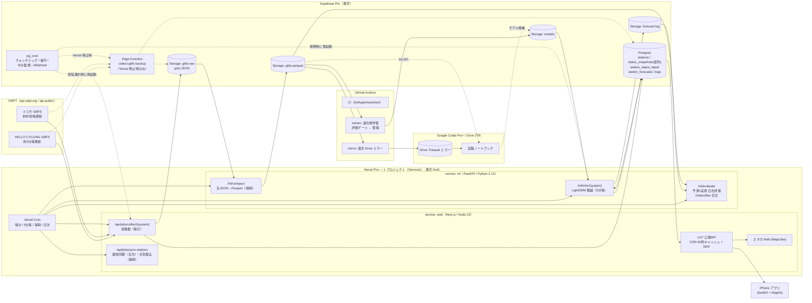

# BikeChance 開発プラン v1.2

作成日：2026-09-04（金）　改訂：2026-09-04（v1.2）　作成：Claude Code（Fable 5.1）　入力：`docs/260903_memo.md`

---

## 0. この文書について

- **目的**：`docs/260903_memo.md` に書かれた構想を、実測とリサーチに基づいて「何を・どの順で・どう作るか」まで落とした開発計画にする。以後の実装・意思決定はこの文書を起点にし、変更は該当章と §15 の決定記録を更新して残す（ADR 方式）。
- **前提**：開発者 1 名。開発機は MacBook Air（Xcode 26.6 / Node 22 / Python 3.12）、実機は iPhone 17 Pro。本番は **Vercel Pro**（商用利用と他プロジェクトとの共用を想定。v1.1 で Hobby から変更）と **Supabase Pro**、補助に Google Colab Pro+ と Google Drive 2 TB。
- **表記**：「推奨」は本プランの前提となる案。§15 の決定記録に決定済み事項・代替案・判断時期をまとめた。数値は 2026-09-04 に実測・確認したもので、出典は §16 に示す。
- **変更履歴**：**v1.57（2026-09-13）当てはめ直しを 1 行にし、成果物が古びたら鳴るようにした（§11.2、W5 の PR M、migration 0048）。** `fit_baseline` は**期間を書かなくても走る**（`--to` の既定は**昨日**、日数の既定は **7 日**。`--from` と `--days` は排他）——**PR D が「窓を延ばす理由」を消した**ので、`features/` を読むのは B1（120 セル）と B3（係数 4 つ）だけになり、1 日 205 万行で 1 セルあたり 1.7 万行になる。**`check_model_freshness()` を `monitor_jobs` の 7 つ目の検査**として足し、`active` な版の `train_days` の最終日が **`model_stale_days`（既定 8 日）**以上前なら 6 時間ごとに 1 回鳴らす（`active` が無いときも別の鍵で鳴る）。**閾値は「異常の定義」ではなく「鳴った日の行動」から決めた**——当初プランの 3 日では**正常な週次運用でも毎週 4 日ぶん鳴る**（W5 プラン §12 の 155）。**昇格は 1 つも自動化していない**（CLAUDE.md §6）。`promote_model_version` を**呼ぶ形**がコードにもワークフローにも現れないことを **`ci.yml` の 3 段**で見張る（**名前の不在では測れなかった**——散文で境界を説明している行が 2 つある。**置き場所も `apps/ml` の pytest では足りなかった**——`python.yml` は `apps/ml/**` が変わった PR でしか走らない。§12 の 156）。**`--upload` は同じ名前の成果物を上書きする**——当てはめ直しが 1 行になったぶん踏みやすくなった落とし穴で、3 か所に書いた（§12 の 157）。**v1.56（2026-09-13）ポート詳細のエンドポイントを実装した（§8.3・§9.2、W5 の PR F、migration 0045〜0047）。** **`capacity_est` / `capacity_days` を `/v1` に出した**——W4-09 の宿題（「ドコモの 5,837 ポートに大きさを表す数が 1 つも無い」）が閉じた（実測：`capacity` は null のまま `capacity_est = 35`）。**値は Storage にしか無かった**ので、**同じジョブ（`build_reference`）が DB にも写す**形にした（SQL で数え直すと 900 万行の unnest になり、同じ量を 2 つの実装が持つ。W5 プラン §12 の 150）。**直近 24 時間は毎時 1 回まとめる表にした**——素直なビューは**本番で 1 ポート 1 日ぶん 616 ms**で、お気に入り（PR H）が 20 件叩くと 1 画面 12 秒になる（§12 の 151）。**集計 3.5 秒／時・表 63 MB（26 時間）・詳細の応答 115〜204 ms**。**`capacity_est = 0` は「分からない」ではなく観測だった**（実測 37 件。0 と NULL を分ける約束。§12 の 152）。**外れ値（1000 以上が 12 件・最大 9999）はそのまま通す**——丸めるなら計算するところで、**モデルも同じ数を読んでいる**ので影響を測ってから（W6。§12 の 153）。契約テストは**本番の実応答 3 本**で固定した。**v1.55（2026-09-13）配信を `baseline-b3-v0-20260912` に入れ替えた（11:50 JST。migration 0044）。** **気候値をプロファイルから作った最初の配信版**で、学習 6 日・ポート 20,663・B2 の使えるセル 198 万（平日のみ）。**成果物は 3.36 → 8.6 MB**（開くピークメモリ 303 → 405 MB、上限 2 GB）。**推論は伸びていない**（HELLO 15,612 ms・ドコモ 20,636 ms。上限 60 秒）。**成果物に無いポートが HELLO 45 → 0・ドコモ 11 → 1**。**9/13 には確率も `confidence` も変わらない**——日曜で、成果物の `sun_holiday` のセルが 0 だからである（W5 プラン §12 の 149）。**効き始めるのは平日の 9/14 から**で、土日祝は **9/21 に当てはめ直して**から。`station_forecasts.confidence` の列コメントを 0044 で直した（0026 の「気候値が無いので最大 2」は W3 段 8 の文言）。**昇格の前に本番で試し打ちした**（`?model=`。どこにも書かない経路）。**v1.54（2026-09-13）B2（気候値）をポートプロファイルから作るようにした（§7.1、W5 の PR D）。** **配信の分岐は 1 つも増えていない**——変えたのは表の作り方だけで、`climatology.predict` はそのままである。 **B2 が B1 に落ちた割合は 30.5% → 4.2%**（平日の検証日。土曜なら 100% のまま。2 日目は 09-19）、**B3 の Brier は B1 を下回った**（hello/bike 総合 0.03342 → 0.02971、B1 は 0.03003。BSS は +1.4% → +12.3%）、**ECE も半分以下**（docomo/bike h=5 で 0.01921 → 0.00648）。**台数バケツ別はほぼ全面的に符号が変わった。** **プランの「`predict_leave_one_out` をそのまま使う」は成立しなかった**——抽出重みは 25 と 100 で、プロファイルの 1 セルは高々 84 点なので分母が負になる（W5 プラン §12 の 143）。**引く量に `Own` という名前を付け、プロファイルからは「その行の日ぶん」を引く**（配信は「その日を 1 点も含まないプロファイル」で予測するため）。**「気候値が引けたか」を確率の一致で判定するのをやめた**（プロファイルの率は53.1% がちょうど 1.0 で、B1 の 120 セルにも 1.0 が在る。§12 の 144）——これで `confidence` の 2 が**「そのポート・その時刻の履歴が足りない」だけ**を意味するようになった（W5-06。**平日昼の 3 は 99.78%**）。**ポートの並びを `Samples.ports` の 1 か所にした**（§12 の 142。§12 の 132 と同じ形が隣に在った）。成果物は **3.36 MB → 8.6 MB**（読み込み 2.71 秒）。**相異なる確率は丸め前で 120〜276**、`x1000` 後は 30〜165 で、**上限を決めているのはもうモデルではなく 1/1000 の刻み**である（§12 の 146）。**v1.53（2026-09-13）測り方を 1 か所に決めた（§7.3・§7.4、W5 の PR C）。** **ECE の判定を「等頻度 15 区間」に揃えた**——プランは最初からそう書いていたのに、実装は **20 等幅**だった（W5 プラン §12 の 133）。**等幅も残して報告書に 2 つ並べる**（§8.1 が等頻度、§8.2 が等幅）——2026-09-13 より前の記録はすべて等幅である。**同じ成果物・同じデータで測り直したら、v0 の ECE は 0.03589 → 0.03568 で判定は動かなかった**（どちらも基準 0.03 を超える）。**差が出るのは LightGBM ではなく B3 のほう**だった（最大 0.01562）——確率が上端に固まっているほど等幅で潰れる。**Brier の値は 1 つも変わらず**、乱数の種の固定（§7.5）も同時に確かめられた。**曜日種別と到着時刻の時間帯**をスライスに足した（鮮度とプロファイルの日数は列が無いので足さない。**軸を足しても既存の数字は動かない**）。**曜日種別の番号の正を `DOW_TYPE_ORDER` 1 つにした**——学習と配信が別々に `sorted()` を呼んでいて、片方を「直す」と過去の成果物が別のセルを指す状態だった。** **v1.52（2026-09-13）ポートプロファイルを作った（§6.3・§8.2・§4.5b、W5 の PR B、migration 0043）。** **気候値（B2）と `prof_*` は同じ量だった**ので、表を 1 つにして両方が引く形にした（W5-01）。**`station_profiles` は DB ではなく Storage の `profiles/date=…/`**（推論が 5 分毎に 200 万行を引かないため。W5-04）。**「9 月では日数が足りない」は誤りだった**——痩せていたのは抽出のせいで、**全格子から数えれば 2 日目に下限を満たすセルが 44.35% → 99.72%** になる（実測）。**28 日を待たず**、`n_days` を持って下限は読む側が決める（W5-03）。作り方は `profile(D) = profile(D-1) + daily(D) - daily(D-28)` で、**読むのは 3 ファイルだけ**。実測は 1 日 199 万セル・`daily` 2.2 MB・`profile` 7.85 MB（6 日）・所要 20 秒・ピーク 1.01 GB。**休止した時間を分母に入れるかは読む側が決める**（`n_suspended` を列に持つ。**99.68% のセルで差が無く、0.28% で最大 0.93 違う**）。Storage は **5〜6 GB/年**増える（`profile` はキャッシュなので短く保てば 0.8 GB/年）。** **v1.51（2026-09-13）予測ログ（`forecast-log/`）を実装した（D-24・R21 を閉じた。§8.2、W5 の PR A、migration 0042）。** **W6 の最初から前倒した**——`station_forecasts` は 5 分毎に上書きされるので、**記録しなかったサイクルは作り直すしかなく**、作り直しには `weather_hourly`（30 日）が要る。**実測は 1 サイクル 129,281 B・1 日 37.2 MB・1 年 13.6 GB**（W4 の PR N の見込み 37.4 MB と一致）。**`maxDuration` を 120 → 240 秒に上げ**、`COMPACT_MAX_DURATION_S` と `INFER_MAX_DURATION_S` を **`ML_MAX_DURATION_S` の 1 つにまとめた**（`vercel.json` の glob は 1 本しかなく、**同じ物理量に名前が 2 つ付いていた**）。**置けなくても推論は落とさない**が、**失敗が記録にしか出ない経路**ができるので、`check_inference` に 3 つ目の条件を足した（直近 3 時間に置けなかった回があれば 6 時間ごとに通知。**理由と、何が失われるかを本文に書く**）。** **v1.50（2026-09-12）Vercel の使用量の内訳が分かった（§4.5a、W4 プラン §6.3d）。** 請求サイクル（09-05〜10-05）の 7 日で **$5.90**、うち **Build CPU が $4.52（77%）**。Fluid の Active CPU は $0.88 で、**その 70% は推論**（`inference_log` の実測 3.04 CPU 時）。**収集・圧縮・天気・属性同期・公開 API を全部合わせて 1 日 0.19 CPU 時・月 $1.95**——§4.5a の積み上げ「約 $4/月」の半分。**§4.5a が「実力値と見てはいけない」と書いた $11.5/月 は、大半がビルドだった。** **推論 ＋ ビルド以外は月 $14.09 でクレジット $20 の内側**だが、**ビルド $19.37 を足すと $33.47 で超える**。**超える要因は推論ではない**——D を入れてもなお $26.8 で超えるので、W4-11 は「**D を採らない**」で決着。** **v1.49（2026-09-12）予測ログ（`forecast-log/`）の置き場と形を決めた（D-24、§4.5b・§5.2・§8.2・§8.5、W4 の PR N）。** **新しいバケット**に **Parquet**（1 ポート 1 行・確率は配列・zstd・UTC の `date=`/`hour=`）。**JSON 列ごと gz のほうが 28% 小さい**が、**読みが 34 倍速い**ほうを採った——効くのは日次評価ではなく**あとから 1 か月ぶんを測り直したくなったとき**である。**定数は覚え書きではなく列に持つ**（+1.7%）：**1 日ぶんを `concat_tables` した瞬間に覚え書きは消える**。**`active` と `shadow` の両方**が書く。**量は実測で 1 日 37.4 MB・12 か月保持で定常 13.7 GB**（§5.2 の見込み 43 MB は大きめだった）——**Storage の残り時間が約 4 か月縮む**ので、D-22 の見直しが 2028-03 → **2027-11** に早まる。**`shadow` は `maxDuration` 120 秒に収まらない**（HELLO 77.7 → 約 144 秒）ので、W6 の最初に 240 秒へ上げる。§8.5 に「オフラインの評価と比べられる形にする」4 条件を書いた。**R21 の設計ぶんを閉じた。** ** **v1.48（2026-09-12）生 JSON からの再構築を本番で確かめた（§5.2、§12 の復旧演習、W4 の PR M）。** 1 日ぶんを**両システムとも**突き合わせ、**4,164 万個の値が 1 つも違わなかった**。**`--dry-run` は生 JSON を 1 バイトも読んでいなかった**（一覧とパーティションを数えるだけ）ので、読んで・解いて・突き合わせるところを作った。規則は `packages/gbfs-core/src/rebuild-check.ts` に置き、**フィクスチャで CI が毎回通す**。復旧演習の欄に実施日を入れた（次は 2026-11-30 まで）。** **v1.47（2026-09-12）天気を生アーカイブから戻せることを本番で確かめ、`job_runs` を刈ってはいけないことを §5.5 に書いた（W4 の PR L）。** 3 発行を組み直して **57,280 値で食い違い 0**。手順書は `docs/260912_runbook_weather_restore.md`（次に見るのは **2026-10-08** より前——最古の発行がその日に消える）。**戻す入口は `v_weather_files` で、これは `job_runs` の `archive_weather` の記録から作られている**ので、`job_runs` を刈ると生アーカイブが在っても戻せなくなる。行は 1 日 2,100 件・年 77 万行増える。** **v1.46（2026-09-12）通知の本文に「理由」と「取り返せるか」を書くようにした（§5.5、W4 の PR K）。** 理由は `job_runs.detail` の**実際に書かれている 4 つの形**から取り出し、どれにも当てはまらなければ生の断片を返す。**再実行では取り返せないジョブ**には `monitored_jobs.failure_note` の一文を足す（いまは `archive_weather` だけ）。** **v1.45（2026-09-12）PR J を本番で確認し、`schedule` の遅れを実測値にした。** **定時の回は 21:00 UTC の予定に対し 22:55 UTC に始まった（1 時間 55 分遅れ）。** 害は無い（対象日は実行時刻から決まるので、遅れが JST の日付をまたがない限り正しい日を作る。またぐには 18 時間要る）が、**見張りの余裕は 30 時間そのものではない**——日次の素の間隔が 24 時間なので、**遅れに使える余裕は 6 時間**である。§4 の制約表と §11.1 に書いた。**閾値は変えない**（1 回の観測で動かさない）。`features/` は **5 日ぶん**そろった。** **v1.44（2026-09-11）学習サンプルの保持と作る場所を決めた（D-22・D-23、§4.5b）。** **`features/` は当面ためる**——捨てる判断の前提は「必要なら作り直せる」ことで、その確認は **PR L（期限 2026-10-08）**である。**確かめていないものを前提に捨てる決定はできない。** 急ぐ理由も無い（13 GB/年で Storage 全体の 3 割、100 GB まで約 2.4 年。先に効くのは `gbfs-raw` の 24 GB/年で、そちらは Drive へ移す手当てが §5.2 に在る）。**見直す合図は Storage 合計 60 GB、または W6 の週次再学習を組むとき。** **作る場所は GitHub Actions**（毎日 06:00 JST、`training` 環境）——Vercel の枠には収まるが、**5 分毎の推論と同じサービスに 3 分・1.3 GB のバッチを混ぜない**（W4-27）。**R20 を閉じた**（日次化と見張りが入った）。** **v1.43（2026-09-11）「特徴量の版は『値が入っている』ことを語らない」を §6.3 と §11.1 に書いた**（W4 の PR I）。手元の 3 日ぶんは**すべて `v3`** だが、天気 4 列が入っている行の割合は **0.000% / 98.589% / 99.977%** である。**同じ版で中身が違う日を混ぜると、配信では必ず天気が在るのに、学習には「天気を一度も見ていない日」の枝ができる**——例外は出ず、確率だけが静かにずれる。**被覆は Parquet を読んだ人がその場で数え**（`features/coverage.py`）、**学習日と検証日で 3 ポイント以上違えば `fit_lightgbm` は成果物を書かない**（`--allow-mixed-weather` で通せるが、`model_versions.metrics.weather` に `spread_pp` と `max_spread_pp` が並ぶ）。§11.1 の再学習の表に「学習データの素性」の行を足した。** **v1.42（2026-09-11）**D-12 を「公開」に書き換えた**。計画時は「私有」と決めていたが、**実態は最初から公開**で、確認のうえ公開を正とした。**費用**：公開リポジトリでは **GitHub Actions が無制限・無料**（2,000 分/月の制約が消える）。**秘密**：全 164 コミットの履歴を走査して**混入 0 件**、`.env` も未コミット。**制約**：秘密を使うワークフローは **`schedule` / `workflow_dispatch` だけ**で起動する（`pull_request` では動かさない）。§4 の制約表と §4.5 の費用表も揃えた。あわせて W4 の **PR H** を実装した（推論の記録に診断 3 つ。W4 プラン §6.8）。** **v1.41（2026-09-11）**費用の計算を実測の Active CPU で出し直した**。Vercel が課金するのは**実時間ではなく Active CPU** で、推論の 1 周期は**実時間 31.4 秒に対し CPU 18.3 秒**（`inference_log.detail.cpu_ms`。`time.process_time_ns()`）である。差は PostgREST から読む待ち時間で、**実時間で計算すると 1.7 倍に見積もる**。§4.5b と §8.2 の表を直した：**いまの使用量は $24 → $14**（クレジット $20 の内側）、LightGBM は $81 → **$71**、C に戻して $61 → **$52**。**結論は変わらない**（LightGBM はクレジットを超える）が、**いまは超えていない**。§6.3c の観測値『$0.38/日＝月 $11.5』と整合するのは直した後の数字である——**照合できる数字が手元にありながら使っていなかった**。あわせて **D-12 の「私有」が実態と食い違っている**ことを記録した（リポジトリは公開。**Actions は無制限・無料**になるが、PR J で Secrets を入れるならワークフローの起動条件に注意が要る）。履歴の秘密スキャンは **0 件**。** **v1.40（2026-09-11）点検で出た宿題を **W5 ではなく W4 のうちに**閉じることにした（W4 プラン §6.8、PR H〜N）。9/12 の Usage と 9/16 の測り直しを待つあいだに並行して進める——**日付で決まっているものが 3 つある**（`weather_hourly` の 30 日保持で **2026-10-08**、`status_snapshots` の 60 日保持で **2026-11-30**、そして毎日積むもの）ことと、**W5 は「貯まったものを使う」側**（校正・履歴プロファイル）なので貯める側の欠けを先に閉じるほうが安いため。§13 のロードマップを W4 に戻し、R20 と R21 の対応先を PR J・PR N にした。**W4-27：学習サンプルの日次生成は GitHub Actions**——実測 41〜65 秒・ピーク 1.28 GB でVercel の枠（300 秒・2 GB）には収まるが、**推論と同じサービスに 3 分・1.3 GB のバッチを混ぜない**。**W4-28：予報の齢は特徴量に足さない**（実効的な先読みはほとんど `h_min` で決まり、齢が伸びるのは 82 発行に 1 回。全部作り直す理由にならない）。** **v1.39（2026-09-11）W4 完了時点の点検（W4 プラン §8.5）を反映した。§8.2 の「1 サイクルの処理」を**実装に合わせて書き直した**——アドバイザリロック（同じ節の構成表と矛盾していた）・校正器・`station_profiles`・一時テーブルへの COPY・**予測ログ `forecast-log/`** の5 点がずれていた。**`forecast-log/` は W6 の `shadow` の前提**なので、W6 の最初の PR に置くと明記した。§5.6・§14 の**再構築スクリプトのパスを実在するものに直した**（`rebuild_hot_store.py` は無い。実装は `scripts/rebuild-snapshots.ts`。期限 2026-11-30 は生きている）。§4.5b に**容量の実測**（DB 定常 約 1.3 GB／Storage 約 41 GB/年。**`features/` の保持を決めていない**）。§13 の W5 に「点検で出た宿題を先に片づける」、W6 に `forecast-log/` を足した。§14 に **R20〜R22** を追加し、**R15（LightGBM の互換性問題）を「実際に起きた」に更新**した。** **v1.38（2026-09-11）W4 の PR G（`/v1/trip-check`）を実装した（migration 0039）。§8.3 の行程チェックの行を実装に合わせ、**`system` を必須にした**（事業者をまたぐ行程は成立しないので表現できなくする。W4-21）。**到着（出発 ＋ 乗車）も水平の範囲で見る**——見ないと「180 分の確率」を 210 分の答えとして黙って返す。**代替候補は確率の高い順に 5 件**（距離順だと 6 番目の 90% が 5 番目の 40% に隠れる）。所見 129：**`lat` / `lon` を「非 null」と宣言していた根拠（bbox で引くから）が、ID で引いた瞬間に崩れた**——本番に座標の無いポートが10 件あり、うち 1 件は予測を持っていた。** **v1.37（2026-09-11）配信の評価器の判断を洗い直した（W4 プラン §12 の 128、W4-20）。§8.2 に numpy と LightGBM の C の**ネイティブ実測（CPU 秒で 1.5〜1.6 倍）**と「**並列化は Active CPU の秒数を 13〜18% 増やす**」を記録し（再現は `scripts/measure-tree-evaluators.py`）、§4.5 の見積り表に**本番実測からの費用の突き合わせ**を足した。**`libgomp.so.1` を同梱すれば `lightgbm` は動く**が、C に戻しても使用量は $61 で**クレジット $20 には届かない**。**効く順は ①行数と木の本数 → ②特徴量の経路 → ③評価器**——特徴量の組み立てだけで月 $13、いまの推論費用の 83% を占める。** **v1.36（2026-09-10）W4 の PR E′（木を numpy で歩く）を実装し、**W4-15 を取り消した**（W4-19）。§8.2 の依存とモデル成果物、§7.2 の v0 の実装、§15 の D-05 を直した。**`lightgbm` は Vercel の Python ランタイムでは読み込めない**——ホイールが要求する `libgomp.so.1` が無く `import lightgbm` が `OSError` で落ちる（W4 プラン §12 の 126）。**ビルドもバンドルの大きさの検査も通る**ので、「入れても動く」は**本番と同じ土台のコンテナで `import` して**確かめる規則にした。配信は木を numpy で歩き、**一致は当てはめ時の照合（2,070,413 行で差 9.992e-16）とゴールデン 21 件と、`lightgbm` を import できない子プロセスでの検査**の 3 段で担保する。本番の依存は 334 → **212 MB**。**マージ後に本番で試し打ちして通ることを確認した**（PR E で `OSError` になったところ）。**ただし速さの見込みが外れた**：クラウドは手元の 1.5〜2 倍ではなく **3.0 倍**遅く、1 サイクルは HELLO **77.7 秒**。`maxDuration` には収まるが、**配ると推論費用が月 $16 → $65 になり $20 のクレジットを超える**（W4 プラン §12 の 127）。**W6 の昇格前に決める。** **v1.35（2026-09-10）W4 の PR E（LightGBM v0 ＋ `model_versions`）を実装した（migration 0038）。§5.3 の DDL に実装との差分を書いた（`kind` は `baseline` / `lightgbm`、`train_days text[]`、**`active` と `shadow` は 1 つだけ**、**昇格の関数には誰にも grant しない**）。§8.2 のモデル成果物の行を実装に合わせ、**環境変数 `BASELINE_MODEL_VERSION` をやめた**。§7.2 に v0 の実装（62 列・カテゴリ 6・語彙はコードの定数・早期終了なし）を書き足した。**`lightgbm` を `apps/ml` の本番依存に入れた**：上限は **500 MB**（Python の関数）で、入れても 334 MB に収まる（W4 プラン §12 の 123。`pyproject.toml` の「250 MB」は Node の数字だった）。** **v1.34（2026-09-10）W4 の PR D（`weather_hourly` と天気の特徴量）を実装した（migration 0037）。§5.3 の DDL に実装との差分を書いた（**`cluster_id` は無く 595 格子の整数添字、時間帯は配列、`wind_ms` ではなく `wind_kmh`**）。§6.2 のリーク防止を「`hour_epoch + 1 時間`（保守的な既定）」から「**`available_at <= t`（厳密版）**」に置き換えた。§6.3 の天気の行を実装に合わせ、**`precip_prob_fcst` と湿度は作れない**ことを明記した（`jma_msm` は降水確率を返さず、湿度は取得していない）。§4.5a の容量に `weather_hourly`（**5.2 MB/日・保持 30 日で約 152 MB**、実測）を足した。** **v1.33（2026-09-10）W4 の PR C（推論側の特徴量経路）を実装した。**推論も学習と同じ `features/` を通り、57 列が完全に一致する**ことをゴールデンで固定した（W4 プラン §6.3a）。§6.2 の train/serve skew に 1 件を足す：**`minutes_since_last_change` は読んだ窓の長さで値が変わる**唯一の列だったので、上限 180 分を入れて閉じ、`FEATURE_SET` をv2 に上げた（W4-10）。除外規則は `features/exclude.py` の 1 実装になり、`jobs/infer.py` の `is_predictable` は消えた。推論の実測は HELLO 10.7 秒・ドコモ 14.0 秒。** **v1.32（2026-09-10）§5.5 に「**ジョブを足したら `monitored_jobs` にも足す**」を書いた。日次の参照スナップショット（`/ml/reference`）が `job_runs` に何も書かず、**止まっても気づけない**状態だった（W4 プラン §12 の 116。migration 0036 で解消）。あわせて W4 §3 の確認を実施し、**`rebuild_geo` は 6.61 秒で定常**・**参照スナップショットの cron は初回から成功**（`capacity_days` が 4 に到達）を確認した。** **v1.31（2026-09-09）W4 の PR B′ を実装した（migration 0035）。§8.3 の `capacity` を「実装予定」から「実装済み」に直した。**ビューが動的な系統の `capacity` を NULL にする**ので、「容量 5・借りられる 12」という矛盾は公開の面から消えた。iOS も**サーバーが数を送ってきても出さない**（古いキャッシュへの備え）。** **v1.30（2026-09-09）§8.3 に「**`capacity` は固定のラック数を意味する列にする**」を足した（W4-09。実装は W4 の PR B′）。ドコモの `capacity` は日次同期の瞬間の `bikes + docks` が凍結された値で、`/v1` がそのまま渡していたため **628 ポート（10.8%）で「容量 5・借りられる 12」のような矛盾**が画面に出ていた（W4 プラン §12 の 115）。動的なシステムでは NULL を返し、ポートの大きさは W5 に `capacity_est` を別の欄として足す。** **v1.29（2026-09-09）W4 の PR B（iOS の到着時刻と確率、M3）を実装し、§9.3 に表示の規則を 4 つ書き足した：**到着は 5 分格子の絶対時刻で送り、絶対時刻で表示する**（相対だと CDN に留まった応答が別の到着を指す）、**借りる／返すは片方だけを出す**（切替では取りに行かない）、**現在値の色と予測の色を同時に出さない**、**5% 刻みと「100% と言わない」は上の端でぶつかり 99% だけが刻みから外れる**。詳細画面の 10 水平の曲線は W5（`/v1/stations` は補間した 1 つしか返さない）。** **v1.28（2026-09-09）§8.3 に「**予測が指す時刻は `generated_at ＋ forecast_in_min`**」を足した（W4 の PR A′）。水平の起点は推論を回した時刻で、PR A はそこに `in_min` をそのまま渡していたため、**利用者の到着より中央 2.1 分早い時刻の確率**を返していた（30 分先で 2.62% が表示の刻みを跨ぐ）。サーバーは行の年齢を足して補間するようにし、CDN 由来の最大 3 分はクライアント側の表示で吸収する。** **v1.27（2026-09-09）W4 の PR A を実装し、§8.3 に `/v1` の予測の規約を書いた。**予測は `at` / `in_min` があるときだけ、補間した 1 到着時刻ぶんを `forecast` に入れて返す**（10 水平の曲線は W5 の詳細画面の持ち場。W4 プラン §9 の契約 4）。**鮮度の判定は TypeScript に置き、SQL には 900 を書かない**（正を 2 つ作らない）。`in_min` の範囲外は張り付けずに 400。本番の実測：予測の付くポートは **99.15% / 99.59%**、結合の増分は **5.4 → 9.1 ms**（468 ポート）、15 分より古い行は 17 時間で **9 件**（0.04%）。** **v1.26（2026-09-09）W4 の実装プラン（`docs/260909_week4_serving_and_model_v0.md`）を作成し、§13 から参照を張った。**W3 が 10 日早く終わったので W4 を 9/10〜9/19 に前倒し**、M3（予測が地図に出る）は 9/17 見込みになった。§13 の W4 の行をプランに合わせて書き直した：天気は **`jma_msm` 一本**（水平 180 分に対し覆域 76 時間で余り、30〜40 度では差が 0.00%）、LightGBM v0 は **`candidate` 止まり**（shadow は予測ログの置き場が要るので W6）、`/v1` は **`base_observed_at` が 15 分より古い予測を返さない**（`FORECAST_STALE_AFTER_S` は定義済みで未使用だった）。**推論側の特徴量経路（`build_now`）と、学習との一致のゴールデンが W4 の本体**である。** **v1.25（2026-09-09）0031 の検知が初回で実物を捕まえたが、**その行は自分では閉じない**ため通知が鳴り続けることが分かった。日次の保守が 1 時間超の `running` を `failed`（`error = 'never_finished'`）にして閉じるようにした（0032。W3 プラン §14.8）。**検知を入れたら解消の経路も一緒に作る。** あわせて `cpu_ms` の初実測（HELLO は実時間 5,907 ms のうち CPU 2,218 ms＝37.5%、ドコモは 1,756 ms のうち 269 ms＝15.3%）を得た。§4.5a の費用の見積りを詰めるときの材料になる。** **v1.24（2026-09-09）W3 の §14.2 の 4・5 を実装した（0031）。`inference_log` の保持を**90 日・`ok` のみ**にし（失敗と二重抑止と閉じられなかった行は残す）、**閉じられずに `running` のまま残った行**の検知を `check_inference` に足した（W3 プラン §12 の 111）。§5.3 の `cpu_ms` は**列にせず `detail` に入れる**ことにし、§5.5 の「所要 CPU は記録していない」を解消した。** **v1.23（2026-09-09）日次の参照スナップショットを実装し、`build_features` を切り替えた（`FEATURE_SET` v0 → v1。W3 プラン §14.3・§14.6）。§3 の `capacity_est` は**計画どおり過去 7 日**になり、ビルド窓から独立した。同じ日を新旧で作って突き合わせたところ、**動いたのは 65 列中 5 列**で全部 `capacity` の下流、**抽出と除外は 1 件も変わらなかった**。副産物として `is_over_capacity` が意味のある列になった（true が 0.07% → ドコモの 2.7%。旧定義では当日の観測を含む累積最大なので定義上ほぼ超えられなかった）。** **v1.22（2026-09-09）W3 の残りの実装を切り分けた（W3 プラン §14）。**日次の参照スナップショット**（`reference/date=YYYY-MM-DD/` に `stations` と `neighbors` の Parquet を 1 組）を導入し、§6.2 の参照データの as-of（§13.2）と §3 の `capacity_est`（§13.3）を一度に閉じる。**学習も推論も「基準時刻の前日の版」を読む**規則にする。`inference_log` の保持は W7 から W3 の残り期間へ前倒した。`/v1` の鮮度切りと推論側の観測履歴は W4 のプランへ送る。** **v1.21（2026-09-09）W3 完了時点の点検を反映した（W3 プラン §13・§14）。§6.2 のリーク防止に「**参照データは『いまの値』を使っている**」を追加（属性は現行行だけ、近傍は履歴が無い、行政区画は上書き。目的変数の漏洩ではないが再現性が担保されない）。§3 の `capacity_est` を実装に合わせて注記（**計画は 7 日、実装は約 49 時間**の累積最大）。§5.3 の `inference_log.cpu_ms` は**実装に列が無い**ことを明記し、§5.5 の監視の記述も直した。§13 の W7 に `inference_log` の保持を足した。** **v1.20（2026-09-09）W3 の段 8 の手順 5（推論のウォッチドッグ）を実装し、§8.2 のウォッチドッグの行を実装に合わせた。発火の条件に「**まだ推論していない観測がある**」を足した（収集の停滞で叩いても進まないため。あちらは `monitor_feeds` の持ち場）。鮮度は `inference_log` ではなく `station_forecasts` で測る（推論が失敗していても `inference_log` には行が増える）。`generated_at` に索引は張らない（HOT 更新率 100% が崩れる）。** **v1.19（2026-09-08）W3 の段 8（`/ml/infer` の配線）を実装した。§8.2 の冪等の記述を直した：**PostgREST 越しにアドバイザリロックは効かない**ので、`inference_log` の一意制約に行を入れられたかどうかで掴む（W3 プラン §12 の 103）。モデル成果物の指定を、`model_versions` がまだ無い段階では環境変数で行うことにした。§5.3 の予測テーブルは実装の台帳（`(system_id, station_id)`）に合わせ、台数の予測区間と `model_versions` は作っていない（W3 プラン §5.10）。** **v1.18（2026-09-08）W3 の段 7（ベースライン B0〜B3 と評価ハーネス）を実装し、§7.1 を実測に合わせて更新した。**採用基準を「バケツ別 ＋ Brier ≥ 0.001 の絶対下限」に変えた**（W3-16。総合値だけだと、価値のある 0〜2 台の領域で負けていても合格する）。B1 のバケツは当てる対象と同じ側の台数で切ると明記し（W3 プラン §12 の 100）、B2 のセルの下限に**日数**の条件を足した（同 101）。ベースラインは §6.1 の除外規則を通した集合の上でだけ測ることも明記した（W3-15）。結果は `docs/260908_eda_02_baseline.md`。** **v1.17（2026-09-08）W3 の段 6（特徴量パイプライン v0）を実装した。§6.2 の重点サンプリングについて実測を追記：難所を「`bikes ≤ 2` または `docks ≤ 2`」と定義すると母集団の **83.9%**（HELLO 86.9%・ドコモ 76.5%）になり、**層化がほとんど効かない**（1 日 2,053,383 行・34.8 MB。見積り 140 万行に対し ＋47%）。重みは厳密なままなので v0 は定義どおりにし、閾値の見直しは W4 でベースラインの評価と一緒に判断する（W3 プラン §12 の 99）。あわせて HELLO の as-of が常に約 205 秒古いことを実測した（同 98）。** **v1.16（2026-09-08）W3 の段 5（`pref_code` / `muni_code` と近傍リスト）を実装し、本文を実装に合わせた。行政区域の出どころを国土数値情報 N03 から**総務省「全国地方公共団体コード」への住所の前方一致**に変え（§6.4）、§5.3 の DDL コメントを「座標から導出」から「住所から導出」に直した。**LightGBM のカテゴリ特徴量から `pref_code` を外し `muni_code` に替えた**（§7）：近傍が 1 つも無いポート（行政区画コードが実際に働く唯一の場面）で `pref` は全体平均より MAE が 0.0102 悪く、`muni` は 0.0259 良い。計測は `scripts/measure-geo-fallback.sql` で再現できる（W3 プラン §10.2a）。** v1.0（2026-09-04）初版。**v1.1（2026-09-04）Vercel Pro を前提に推論・スケジューリング・収集器の配置・費用・商用化の考慮を再設計（§4〜§5、§8、§11〜§15）。「AI と人間で別 API を作らない」原則を CLAUDE.md と本書から削除し、API 層の採用理由を技術的根拠に書き直した。§15 の推奨を決定として確定し、Vercel Pro に伴う新規論点 D-17〜D-21 を追加。** v1.2（2026-09-04）D-17〜D-21 を決定として確定。CLAUDE.md をプランに沿って改訂。v1.2a（2026-09-06）§15 の D-04 に ODPT の認証方式とレート制限の実測値を追記（決定内容は変更なし）。v1.2b（2026-09-06）§15.1 に W1 実装での決定（W1-01〜W1-31）を転記し、§5.3 の DDL と実装の食い違いを明記。v1.2c（2026-09-06）§5.2 に本番での容量実測を追記（生データは見積りどおり、配列は見積りの半分以下）。v1.2d（2026-09-07）§5.2 の容量を 24 時間観測で確定（DB 22.2 MB/日、60 日で約 1.3 GB）。ドコモの実更新周期を 80.9 秒と確認。v1.2e（2026-09-07）§8.3 に「属性の無いポート」と `geo_suspect` の扱いを追記し、§5.3 の実装差分に `geo_suspect` の復活と `capacity_is_dynamic` を追記。v1.2f（2026-09-07）§8.3 の「属性の無いポート」の根拠を本番の実測に合わせて訂正（恒常的に 11 件ではなく、新しいポートが最大 1 日のあいだ持たない）。**v1.15（2026-09-08）天気アーカイブの `forecast_days` を 2 → 3 に広げた。窓は取得時刻によらず JST 当日 0 時から始まるため先の覆いが時刻とともに縮み、`2` では夜のファイルが約 25 時間先までしか無かった。`jma_msm` が値を返すのは当日 0 時から 76 時間ちょうどで、**3 日（72 時間）が欠けない最大**である。費用は容量 +45%（4.4 → 約 6.4 MB/日、年 2.3 GB）、所要 +6%、呼び出し回数は不変。§4.5a の容量を更新した。あわせて 2 モデルの食い違いが緯度で決まることを 371,280 値で確認し（30〜40 度で 0.00%、沖縄・北海道北部で 21〜48%）、`constants.ts` の「バイト単位で同値」というコメントとデータ辞書 §8.3 を直した。** **v1.14（2026-09-08）W3 の実装プラン（`docs/260909_week3_dataset_and_baseline.md`）を作成し、§13 から参照を張った。あわせて §13 の W3 の行を実装プランに合わせて整理した：**`job_runs` の保持を W7 へ移し**（`archive_weather` の行は天気予報の入手時刻の記録そのもので、素直に「N 日より古い行を消す」と書くと W3 の④が使う材料を消してしまう）、**履歴プロファイルの日次ジョブを W4〜W5 へ**（過去 28 日の集計で、9 月の時点では日数が足りない）、行政区域は HELLO の住所から `pref_code` と `muni_code` を埋めるところまでとした（ドコモ向けの N03 ポリゴン照合は見送り。実測で、地理の特徴量は近傍リストのほうが市区町村より当たり〔LOO R² 0.201 対 0.132〕、近傍の残差に市区町村が足すのは 1.49%、N03 で埋まるのは「ドコモかつ 1 km 以内に近傍 0 件」の 136 ポート〔0.66%〕だけだった。根拠は W3 プラン §10.2a）。** **v1.13（2026-09-08）§13 の W3 に、点検で見つけた 4 件の実装順を書き入れた（詳細は W2 プラン §14）。** v1.12（2026-09-08）W2 完了時点の点検を反映。§6.2 のリーク防止に 2 つの規則を追加（as-of 結合は `fetched_at` で切る／天気の予報ファイルは `hour_epoch + 1 時間` から使う）。§6.3 の `gap` は生 JSON でなく DB の値で計算してよいと緩和（丸めは 0.038%）。§5.5 に「監視できていないもの」を明記し、§14 に R19（ジョブの失敗と Parquet の欠落が無監視）を追加。§13 のロードマップを W2 の実績に更新。** v1.11（2026-09-08）EDA #1（`docs/260908_eda_01.md`）の結果を反映。§6.1 の除外規則に「実在しないポート」（ドコモ `5753`）を追加し、§3.4b に「毎分収集の価値はシステムで違う」（HELLO 0.0% / ドコモ 14.8%）を追記した。** v1.10（2026-09-08）`docs/data_dictionary.md`（データ辞書）を新設し、§6.7 から参照を張った。実測にもとづく訂正 2 件：`parking_type` / `parking_hoop` は分散ゼロで特徴量にならない（W4 で見る必要は無い）、`is_charging_station` は 1.8% が true で使える。** v1.9（2026-09-08）§4.5 に「見積りと実測の突き合わせ」（§4.5a）を追加。呼び出し回数・所要・課金・容量を本番の実測と並べ、圧縮の見積りが 1 桁大きかったこと（40 秒想定に対し 3.3 秒）を記録した。§14 に R18（Spend Management の自動停止で収集が止まる）を追加。** v1.8（2026-09-08）§8.3 に W2 の PR E で確定した `/v1` の規約を反映（bbox はサーバー側で 0.01 度に量子化、件数の上限 1,000 件、Problem Details の書式、DB 不達時の扱い、`stale` の意味）。** v1.7（2026-09-08）M2 達成に伴い §5.2 の学習用アーカイブを実測で確定（4.05 MB/日、年 1.5 GB、0.61 / 0.26 B/行）。§5.6 の毎時圧縮ジョブの入力を「生 JSON を S3 互換で読む」から「`status_snapshots` を PostgREST で読む」に訂正（実装に合わせた）。§12.1 の `vercel.json` を `services.<name>.functions` の形に訂正。** v1.6（2026-09-08）§6.7 に「配列長は時系列で単調とは限らない」を追記（再構築を挟むと逆転する）。 v1.5（2026-09-07）§13 から W2 の実装プラン（`docs/260907_week2_archive_and_serving.md`）へ参照を張った。** v1.4（2026-09-07）§13 の W1 を実績に更新し、W2 の着手順（天気バックフィルの検証 → 通知先の設定 → Parquet 化 → 再構築）を明記。§5.5 を W1 の実装に合わせ、通知先が未設定であることを記録。** v1.3（2026-09-07）W1 完了時点で蓄積データを学習の観点から点検し、§6.1 の除外規則を書き直し（`is_active` と `capacity=0` による除外をやめた）、§6.3 を実測のフィールドに合わせ、§6.7「データの棚卸し」と R16・R17 を追加、§5.6 に再構築の期限（2026-11-30）を明記。**
- **章構成**：§1 要約 → §2 プロダクト → §3 データ調査 → §4 アーキテクチャ → §5 データ蓄積（最優先） → §6–7 学習・評価 → §8 推論・API → §9–10 アプリ → §11 運用 → §12 リポジトリ → §13 ロードマップ → §14 リスク → §15 決定記録 → §16 付録。

## 1. エグゼクティブサマリー

**BikeChance は「ポートに着いたとき、自転車を借りられる／返せる確率」を、降水確率のように示す iPhone アプリ**である。HELLO CYCLING とドコモ・バイクシェアの公開 GBFS データを 1 分間隔で蓄積し、LightGBM でポート別・到着時刻別の確率を 5 分毎にサーバー側で先回り計算し、アプリは結果を読むだけにする。

**実測で分かったこと（§3）**

- 対象は 2 システム・**20,661 ポート**（HELLO 14,861、ドコモ 5,800）、GBFS v2.3。フィードの実更新周期は **HELLO 約 5 分、ドコモ約 80 秒**（`ttl=60` の表記と乖離）。
- 金曜 15 時の時点で **約 19〜23% のポートが車両ゼロ、21〜24% が返却枠ゼロ**。課題は実在する。
- **予約情報の明示フィールドは無い**。HELLO の `容量 − 台数 − 返却枠` の差分（20% のポートで 1〜7）が予約・整備中の代理指標になり得る。ドコモの `capacity` は固定ラック数ではなく動的値。
- ライセンスは両社 **CC BY 4.0**（HELLO は ODC-BY/ODbL も選択可）。履歴蓄積・ML 学習・予測表示・**商用利用**を禁じる条項は無い。クレジット文言は ODPT FAQ の「改変して利用する場合」の書式に従う。
- 1 回の更新で台数が変わるポートは数%（HELLO 約 2%/5 分、ドコモ約 1.7%/80 秒）で、**台数ゼロのポートは 60 分後も 9 割がゼロのまま**。短い水平では持続予測が強く、モデルの価値は遷移の予測と 1 時間超の水平にある。HELLO の `gap` が増えた直後は台数減少率が約 3.4 倍になり、予約の代理指標として機能する（§3.4b）。

**設計の骨子（§4–8）— プラットフォームは Vercel Pro と Supabase Pro の 2 つに集約**

| 層 | 決定 |
|---|---|
| 収集（最優先） | **Vercel Cron（毎分）→ Next.js Route Handler（Node）** → 生 gzip JSON を Storage（**実測 69 MB/日**）、配列形式のスナップショットを Postgres（**実測 22.2 MB/日、60 日保持で約 1.3 GB**）。pg_cron は DB 保守と**ウォッチドッグ**（Cron の配信漏れ時に再起動、Vercel 障害時はバックアップ収集器を起動）。**2026-09-06 稼働開始（M0）** |
| アーカイブ | Vercel Cron 毎時 → Python サービスで Parquet 化（**実測 4.05 MB/日**、0.26〜0.61 B/行）→ Storage。**2026-09-08 稼働開始（M2）**。Google Drive へは週次でミラー。生 JSON が一次ソース |
| 学習 | Python 一本（Colab で実験、GitHub Actions で週次再学習）。5 分グリッド、水平 5〜180 分の 10 点、`P(台数≥1)`・`P(返却枠≥1)`、全ポート共通の LightGBM。時系列分割・パージ・Brier/ECE・校正。ベースライン 4 種を 10% 以上上回ることを配信条件にする |
| 推論 | **Vercel Pro の Python サービス（FastAPI + LightGBM、Fluid compute）** を Vercel Cron が 5 分毎に起動し、全ポート × 10 水平 × 2 指標 ≈ 41 万件を予測して `station_forecasts` に書く。学習と同じ特徴量コード。実測 CPU 10〜25 秒/サイクル（M 系 Mac）→ 東京リージョン単価で **月 $12〜16 の使用量**（Pro の $20 クレジット内）。3 時間超は 168 時間のプロファイルモデル |
| 配信 | Next.js `/v1` API（CDN 60 秒キャッシュ、Vercel WAF でレート制限）。iOS と Web が同じ API を使う |
| iOS | SwiftUI + MapKit、最小 iOS 26。ビューポート内だけ描画、自転車 ETA で到着時刻を自動算出。**確率（%）＋3 段階ラベルを主、台数を従**に表示 |
| 費用 | **Vercel Pro $20/月**（1 シート、$20 分の使用量クレジット込み）＋ **Supabase Pro $25/月** ＋ Apple $99/年。Vercel の使用量は約 $20/月でクレジットとほぼ相殺（チームで他プロジェクトと共用する場合は BikeChance 分約 $20 が課金対象）。商用化時は天気データの有料プランを追加 |

**進め方（§13）**：12 週間。W1 で収集を本番稼働、W4 でベースライン予測を地図に表示、W6 で LightGBM v1、W7 で TestFlight 内部ベータ、W10 で外部ベータ、W12 で App Store 申請。モデルの品質はデータ日数で決まるため、アプリを先に作り、モデルを後から差し替える。

**決定事項（§15）**：D-01〜D-21 を 2026-09-04 に決定済み。要点は、D-05 推論ランタイム＝**Vercel Pro の Python サービス**、D-13 商用利用を前提に **Vercel Pro**、D-17 **Vercel Cron を主スケジューラ**（pg_cron はウォッチドッグ・保守）、D-18 **Services で 1 プロジェクト**（`web` + `ml`）、D-19 **収集器の一次系は Vercel**（Edge Function はバックアップ）、D-20 商用化と同時に **Open-Meteo 有料プラン**へ、D-21 ML サービスは**まず東京**（W5 の実測で `iad1` 移行を判断）。

## 2. プロダクト定義

### 2.1 一言で

> **「着いたときに借りられる？返せる？」に、確率で答える。**

公式アプリや Google マップ・Yahoo!乗換案内（2026-08 から台数表示開始）は「今の台数」を見せる。BikeChance は「**あなたが着く時刻**の確率」を見せる。差別化は予測と行程チェックにある。

### 2.2 ターゲットユーザーと主要ユースケース

| ユーザー | 状況 | 問い | BikeChance の答え |
|---|---|---|---|
| 通勤・通学の常用者 | 自宅から最寄りポートまで徒歩 8 分 | 出るときに 2 台あるけど、着いたら残ってる？ | 到着 8 分後に借りられる確率 72%（中）。隣のポートなら 94% |
| 帰宅時の利用者 | 職場最寄りのポートは夕方に空になりがち | 何時までに出れば借りられる？ | 時刻スライダーで確率の推移を表示 |
| 目的地で返す人 | 駅前ポートは満車が多い | 30 分後に着く駅前ポートに返せる？ | 返却できる確率 55%（低）。300 m 先のポートなら 90% |
| 計画する人 | 明朝 8:30 に出発したい | 明日の朝、あのポートに自転車ある？ | 傾向ベースの確率（曜日・時刻・天気予報を反映） |
| 複数人 | 友人 2 人と利用 | 2 台以上ある？ | k 台以上の確率（v1.1） |

### 2.3 スコープ

| 版 | 含む | 含まない |
|---|---|---|
| **MVP（TestFlight 内部、W7）** | 地図・ポート詳細・到着時刻選択・借りる/返す確率（3 時間以内）・行程チェック・お気に入り（ローカル）・クレジット | アカウント、通知、Widget、Web |
| **v1.0（App Store、W12）** | MVP ＋ 7 日先の傾向表示 ＋ 天気反映 ＋ k 台以上 ＋ スマホ Web MVP | 決済、予約代行 |
| **v1.x** | Widget・通知（閾値アラート）、Live Activity、Siri ショートカット、iCloud 同期のお気に入り | Android |
| **商用化（v1.x、時期は外部ベータ後に判断）** | 収益モデル候補：無料（地図・確率）＋ Pro 機能（アラート・Widget・長期予測・広告非表示）の月額 IAP。インフラは初日から商用利用可の構成（Vercel Pro、CC BY 4.0、商用可の地図タイル、天気データは有料プランへ切替） | 広告ネットワーク（プライバシーラベル・ATT が複雑化するため当面見送り） |
| **恒久的に非スコープ** | 予約・解錠・決済（公式アプリへディープリンク）、独自の経路案内（MapKit の ETA 利用のみ）、独自の天気予報の発表（気象業務法） | — |

### 2.4 成功指標（KPI）

| 種別 | 指標 | 目標（v1.0 時点） |
|---|---|---|
| モデル | Brier score（水平別）／Brier Skill Score 対 気候値 | 全水平で BSS > 0.15、ベースライン最良比 −10% |
| モデル | ECE（15 ビン） | < 0.03 |
| 約束の履行 | `precision@0.9`（「高」表示時の実現率） | ≥ 0.90 |
| データ | スナップショット取得率（期待数に対する実取得） | ≥ 99.5%／週 |
| 運用 | 予測の鮮度（`generated_at` の遅延 p95） | ≤ 7 分 |
| プロダクト | ベータ利用者の「予測を見て行動を変えた」回答率、継続率（週次） | 定性評価 → v1.1 で数値目標化 |
| コスト | 月額費用（Vercel Pro $20 ＋ Supabase Pro $25 ＋ Vercel 使用量のクレジット超過分） | ≤ $50（Apple 年会費除く。商用化時は天気データ有料プラン分を加算） |

### 2.5 競合・周辺サービス（2026-09 時点）

- 公式アプリ（HELLO CYCLING、ドコモ「バイクシェアサービス」→ 2026-05 から「NOLL」へ刷新中）：現在台数・予約・決済。予測なし。
- Google マップ：ドコモのポートと現在の空き状況を表示（2021〜）。
- Yahoo!乗換案内（iOS）：2026-08-26 からルート検索でドコモ・HELLO・LUUP を表示、貸出/返却可能台数を表示（ドコモの台数は後日対応）。
- MaaS 連携（newcal、RYDE PASS、EMot）：予約・決済の統合。予測なし。
- **示唆**：「現在台数」は急速にコモディティ化している。予測・確率・行程チェックに集中し、現在台数は前提機能として最小限で提供する。

## 3. データリソース調査結果（2026-09-04 実測）

> 本章の数値は 2026-09-04（金）14:58〜16:15 JST に、このリポジトリから実際にフィードを取得して計測したものです。曜日・時間帯で変わる値（台数ゼロ率など）は「その瞬間のスナップショット」として読んでください。

### 3.1 ODPT 上の対象データセット（全 3 件）

ODPT データカタログ（ckan.odpt.org）を「gbfs / bikeshare / シェアサイクル / cycle」で全文検索した結果、シェアサイクル関連のデータセットは以下の 3 件のみでした（他事業者の GBFS は ODPT には存在しません）。

| # | CKAN データセット | 提供者（クレジット表記名） | ライセンス | GBFS system_id | 備考 |
|---|---|---|---|---|---|
| 1 | `c_bikeshare_gbfs-openstreet` OpenStreet（ハローサイクリング） バイクシェア関連情報 | OpenStreet株式会社 / 公共交通オープンデータ協議会 | CC BY 4.0 / ODC-BY 1.0 / ODbL 1.0（利用者が選択） | `hellocycling` | 日本全国 |
| 2 | `c_bikeshare_gbfs-d-nationwide-bikeshare` ドコモ・バイクシェア バイクシェア関連情報 | 株式会社ドコモ・バイクシェア / 公共交通オープンデータ協議会 | CC BY 4.0 | `docomo-cycle` | 全国（東京を含む） |
| 3 | `c_bikeshare_gbfs-d-bikeshare` ドコモ・バイクシェア バイクシェア関連情報（東京エリア） | 同上 | CC BY 4.0 | `docomo-cycle-tokyo` | #2 の東京都内サブセット。**収集対象から除外**（#2 に包含。実測で 1,902 ID 中 1,895 が #2 と一致、残り 7 は取得タイミング差と推定） |

**エンドポイント**（すべて GBFS v2.3、`gbfs.json` が自動発見ファイル）

| 種別 | URL パターン | 認証 | 実測 |
|---|---|---|---|
| 公開 | `https://api-public.odpt.org/api/v4/gbfs/{system_id}/{feed}.json` | 不要 | 200。内容はトークン版と完全一致 |
| 認証付き | `https://api.odpt.org/api/v4/gbfs/{system_id}/{feed}.json?acl:consumerKey=<TOKEN>` | `ODPT_ACCESS_TOKEN` | 200（トークン無しは 403） |

CKAN の各リソースページは、CC BY 等のライセンスのデータについて「データを説明したページに掲載されている API の URL（api-public）をそのまま利用」できると案内し、開発者登録後は認証付き URL からも取得できるとしている（開発者登録は CC BY データには必須ではない）。公開エンドポイントの応答には `Cache-Control: max-age=60` が付く。

参考：MobilityData の `systems.csv` に登録された日本の GBFS は 5 件（上記 3 件＋ CyclOcity 富山（GBFS 3.0）＋ kotobike（到達不可））で、ODPT 外のシステムは本プロジェクトの対象外。HELLO CYCLING はオリジンフィード（`openapi.hellocycling.jp`、ttl 0）を持ち ODPT はそのミラー（ttl 60）と見られる。**ODPT ミラーの実更新周期が 5 分である一方、オリジンがより高頻度に更新されている可能性がある**ため、W2 でオリジンの更新周期を計測し、5 分より細かい場合は「同一ライセンス（CC BY 4.0）の第 2 ソース」として採用を検討する（メモの方針どおり ODPT を正とする）。

方針：**認証付きエンドポイントを正**（登録済み開発者としての利用を ODPT 側で識別でき、負荷面の連絡が取れる）、**公開エンドポイントを自動フォールバック**にする（D-04）。トークンはクエリ文字列に載るため、ログ・例外メッセージ・テスト出力に URL を出力しない（CLAUDE.md §5）。ODPT 利用規約はトークンを第三者に開示しないことを求めており、**iPhone アプリにトークンを埋め込まない**（アプリは自前 API のみを叩く）。

### 3.2 フィード構成

| feed | HELLO CYCLING | ドコモ（全国） | 用途 / 収集頻度 |
|---|---|---|---|
| `gbfs.json` | ttl 60 | ttl 60 | 自動発見。日次で構成変化を監視 |
| `system_information.json` | あり（ttl 1800）。運営者・ライセンス URL・アプリ URL・ブランド色 | あり（最小限） | 日次 |
| `station_information.json` | あり。**7.8 MB**（gzip 0.9 MB）。住所・rental_uris を含む | あり。0.74 MB（gzip 0.19 MB） | 日次＋差分検知（ポート追加/廃止/容量変更の履歴化） |
| `station_status.json` | あり。**4.2 MB**（gzip 約 0.09〜0.11 MB） | あり。0.9 MB（gzip 約 0.03〜0.04 MB） | **常時収集の主対象** |
| `vehicle_types.json` | あり（1 車種） | **なし（404）** | 日次 |
| `free_bike_status.json` / `system_regions.json` / `system_alerts.json` / `system_pricing_plans.json` | なし | なし | — |

### 3.3 フィールド辞書（実測ベース）

**station_information**

| フィールド | HELLO | ドコモ | 意味・注意点 |
|---|---|---|---|
| `station_id` | 文字列（数値 17〜27428） | 文字列（数値 1〜94001） | システム内で一意。**ドコモは 10 件の完全重複行あり**（同 ID・同内容）→ 取り込み時に重複排除 |
| `name` | 例「新御徒町ステーション」 | 例「D6-05.新宿中央公園（水の広場）」（先頭にエリア記号） | 表示用 |
| `lat` / `lon` | あり | あり。**1 件が経度 39.55（誤り、正しくは 139.55 と推定）** | 範囲チェック（日本の BBox 外は要フラグ） |
| `address` | あり（都道府県から） | なし | 都道府県の抽出に利用可 |
| `capacity` | **なし** | あり（整数）。0 が 252 件（4.3%）。**値は分単位で変動する**（§3.6） | GBFS 標準では「設置された総ドック数」だが、ドコモでは `bikes + docks` として動的に計算された値。0 は「休止/仮登録」と推定（台数も 0） |
| `vehicle_capacity` | **文字列**（例 "8"）。GBFS 2.3 ではバーチャルステーション用オブジェクト型 → **非標準** | なし | HELLO の実効容量として利用（`Number()` で変換、Zod で検証） |
| `region_id` | なし | あり（"1"〜"18"）。**全国フィードでは地域の意味が一貫しない**（同じ "2" に大阪 A-13 と東京 B4- が混在） | 地域キーには使わない。座標から都道府県・市区町村を導出する |
| `rental_uris` | ios/android/web（`?referrer=odpt` 付き） | なし | 公式アプリへのディープリンク（アプリ UI で使用） |
| `parking_type` / `parking_hoop` / `contact_phone` / `is_charging_station` | あり（street_parking 全件、hoop false 全件、充電ポート 273 件） | なし | 参考情報 |

**station_status**

| フィールド | HELLO | ドコモ | 意味・注意点 |
|---|---|---|---|
| `num_bikes_available` | あり | あり | 貸出可能な車両数（GBFS：物理的に存在し貸出に提供し得る正常車両）。**予約済み車両は含まれないと解釈**（後述） |
| `num_docks_available` | あり | あり。**常に `capacity − bikes` と一致（100%）** | 返却可能数。ドコモは事業者が宣言する「返却可能枠」で、固定ラック数ではない（§3.6） |
| `is_installed` / `is_renting` / `is_returning` | あり。renting=false が 149 件（1.0%） | あり。renting=false が 24 件（0.4%） | 休止ポート。GBFS 仕様では `is_renting=false` でも `num_bikes_available` は「貸出を許可していれば貸せる台数」を保持する（ゼロにしない）ため、ラベル定義は `bikes ≥ 1 ∧ is_renting` とする。予測時は休止中なら「借りられる確率 = 0」 |
| `last_reported` | **ポート毎に異なる**（feed の last_updated から 0〜42 秒前に分布、42〜43 種類の値） | **全ポート同一値（= last_updated）** | HELLO のみ鮮度がポート単位で分かる |
| `vehicle_types_available` / `vehicle_docks_available` | あり（車種 "2" のみ、合計は bikes と常に一致） | なし | 将来の多車種化に備え保存 |
| `num_bikes_disabled` / `num_docks_disabled` | なし | なし | 故障車両は観測不能 |

**vehicle_types（HELLO のみ）**：`vehicle_type_id="2"`, `form_factor=bicycle`, `propulsion_type=electric_assist`, `max_range_meters=70000`, `max_permitted_speed=25`, `return_constraint=any_station`, `default_reserve_time=30`（分）。ただし HELLO CYCLING の予約有効時間は **2026-02-03 に 30 分から 10 分に短縮**されており（公式 note）、この値は未更新。車種は 1 種のみで、電動サイクル（特定小型原付）等は区別されない。

### 3.4 実測統計

| 指標 | HELLO CYCLING | ドコモ（全国） |
|---|---|---|
| ポート数 | **14,861** | **5,800**（行数 5,810、重複 10） |
| 総容量 | 105,535（vehicle_capacity 合計） | 50,427 |
| 容量の中央値 / 最大 | 6 / 116 | 6 / 133 |
| 容量分布 | 1–3: 2,397 / 4–6: 7,014 / 7–10: 3,489 / 11–20: 1,567 / 21+: 394 | 0: 252 / 1–3: 1,136 / 4–6: 1,630 / 7–10: 1,395 / 11–20: 970 / 21+: 427 |
| 貸出可能車両の合計（15:00 時点） | 52,337 | 21,629 |
| **台数ゼロのポート比率（金 15:00）** | **18.7%**（2,777） | **23.4%**（1,358） |
| **ドック（返却枠）ゼロの比率** | **21.5%**（3,200） | 24.4%（1,415） |
| 休止（is_renting=false） | 149 | 24 |
| フィードの実更新周期（last_updated の進み） | **約 300 秒**（299, 301 秒を観測。ttl=60 と乖離） | **約 80 秒**（76〜81 秒） |
| 公開までの遅延（last_updated → 当方取得成功までの最短） | 47〜48 秒 | 11〜17 秒 |
| 1 更新あたり台数が変化したポート | **2.3〜2.4%**（341〜362 件 / 5 分） | 1.5〜1.9% / 80 秒（**5 分換算 約 5.6%**） |
| 1 更新で 4 台以上ジャンプしたポート（再配置候補） | 1〜3 件 / 5 分 | 0〜1 件 / 80 秒 |
| 連続スナップショット間のポート ID 出入り | 0 | **5〜19 件**（ID が現れたり消えたりする） |
| 都道府県分布（上位） | 東京 3,989 / 神奈川 2,432 / 埼玉 2,425 / 大阪 2,003 / 千葉 1,604 / 兵庫 464 / 静岡 374 / 愛知 302 / 沖縄 256 / 奈良 222 / 京都 178（28 都道府県） | 座標クラスタ推定：東京 23 区周辺 1,929 / 大阪 748 / 名古屋 671 / 横浜・川崎 346 / 広島 201 / 仙台 181 / 岡山 94 / 札幌 65 / 沖縄 43 / 鹿児島 31 / 松江 10 / その他 1,491 |

**読み取れること**

- 金曜 15 時の時点で **約 5 ポートに 1 つは車両ゼロ、返却枠ゼロも同程度**。「行ってみたら無かった／返せなかった」は日常的に起きており、本アプリの課題設定は妥当。
- HELLO は 5 分に 1 回しか更新されないため、**5 分より細かい観測は原理的に不可能**。ドコモは 80 秒周期で、1 分ポーリングなら概ね全更新を捕捉できる。
- 1 回の更新で状態が変わるポートは数%。差分（変化のみ）保存や列指向圧縮が非常に効く。
- ドコモはポート ID が数件単位で出入りするため、「存在しない＝廃止」と即断せず、**一定期間（例 3 日）観測されないポートを非アクティブ扱い**にする。

### 3.4b 短時間ダイナミクス（60 分連続計測：15:12〜16:12 JST、1 分間隔で取得）

| 指標 | HELLO CYCLING | ドコモ（全国） |
|---|---|---|
| 取得したフィード更新 | 13 回（間隔 299〜301 秒、極めて規則的） | 45 回（間隔 76〜81 秒。1 回だけ 167 秒＝1 更新スキップ） |
| 公開遅延（`last_updated` → 取得可能になるまで） | 55〜57 秒で安定 | 0〜60 秒（80 秒周期と 60 秒ポーリングの位相差で鋸歯状に変動） |
| 1 更新で台数が変わったポート | 1.9〜2.4%（275〜362 件 / 5 分） | 1.3〜2.2%（73〜127 件 / 80 秒） |
| 60 分間に 1 回以上台数が変わったポート | 17.9%（2,659 件） | 32.2%（1,830 件） |
| 台数ゼロの持続（開始時ゼロ → 60 分後もゼロ） | **91%**（2,527 / 2,780） | **86%**（1,149 / 1,331） |
| 返却枠ゼロの持続（同上） | — | **97%**（1,343 / 1,389） |
| 4 台以上のジャンプ（再配置候補） | 0〜3 件 / 5 分 | 0〜2 件 / 80 秒 |
| ポート ID の出入り | 0 | 3〜18 件 / 更新 |
| `gap`（容量 − 台数 − 返却枠）が変化したポート | 5.6%（833 件 / 60 分） | 観測不能 |
| **`gap` が増えた直後 10 分以内に台数が減る確率** | **6.1%**（n=607）。通常時は **1.8%**（n=148,610）→ 約 3.4 倍 | — |
| Parquet 圧縮率（zstd、60 分・約 19〜26 万行） | **0.73 B/行** | **0.29 B/行** |

ドコモの返却枠の挙動（60 分間に台数が変化した 1,830 ポートを分類）：

| 挙動 | 割合 | 意味 |
|---|---|---|
| 返却枠（`docks`）が一定のまま、`capacity` が台数と連動して動く | **58.5%** | 返却枠は事業者が設定した値で、ラックの物理的な空きではない |
| `capacity` が一定で `docks = capacity − bikes`（固定ラック型） | 12.5% | GBFS 本来の意味に近い挙動 |
| 混在・その他 | 29.0% | 設定変更や再配置を含む |
| 一定だった返却枠の値 | 0 が最多（389 ポート）、次いで 2〜5 | `docks=0` が長時間続くポートは「返却停止中」の運用状態 |

**読み取れること**

- **「空は空のまま」**：台数ゼロのポートは 60 分後も 9 割前後がゼロ。短い水平では持続ベースライン（B0/B1）が強く、モデルの価値は「いつ補充されるか／いつ空になるか」という **遷移の予測**と、1 時間を超える水平にある（§7.1、文献の知見とも一致）。
- **HELLO の `gap` は予約の代理として機能している**：`gap` が増えた直後は台数減少率が通常の約 3.4 倍。10 分予約→持ち出しの流れと整合する。特徴量として採用する根拠になる（金曜午後 60 分のみの観測なので、学習データで再検証する）。
- **ドコモの「返せるか」は運用設定でほぼ決まる**：返却枠は 6 割のポートで台数と独立に一定で、`docks=0` は 1 時間で 97% 持続する。`is_limited_port`（過去に `docks=0` を観測）と「`docks=0` の継続時間」が返却予測の主要特徴量になり、UI では「返却停止中（事業者設定）」と明示できる。
- **毎分収集の価値はシステムで違う**（EDA #1、2026-09-08、43 時間の実測）。5 分グリッドに落としたときに失う台数の動きは **HELLO 0.0% / ドコモ 14.8%**。HELLO は本来の更新周期が 5 分なので、毎分ポーリングしても**解像度は上がらない**。それでも毎分で取るのは「公開のたびに取りこぼさない」ためであり、目的が違う。ドコモは W1 の実測 13% と整合し、毎分収集を続ける根拠になる。
- **Parquet の実効サイズは 1 時間分で 0.73 / 0.29 B/行**まで下がり（10 分分では 3.4 / 0.9）、日次ではさらに下がる。年間の学習用アーカイブは **2〜4 GB** に収まる（§5.2 を更新）。→ **2026-09-08 に本番の 1 日で確定：0.61 / 0.26 B/行、4.05 MB/日、年 1.5 GB。見立ての下限をさらに下回った。**
- ドコモの更新は稀にスキップされる（167 秒）。フィード停滞の警報閾値は「3 周期（4 分）以上」にする（§5.5）。

### 3.5 予約情報の有無（結論）

- **明示的な予約フィールドは両社ともに無い**。GBFS で予約を表せるのは `free_bike_status.json` の `is_reserved`（車両単位）だが、両社とも同フィードを提供していない。ステーション単位で予約数を表す標準フィールドは GBFS に存在しない。
- **HELLO**：`vehicle_capacity − num_bikes_available − num_docks_available` の差分が 3,027 ポート（20.4%）で 1〜7 台（超過は 0 件）。GBFS の定義上 `num_bikes_available` は「貸出に提供し得る正常車両」、`num_docks_available` は「返却可能な正常ドック」なので、この差分は **予約済み車両＋故障車両＋返却予約枠** の合計と解釈できる。予約有効時間（現在 10 分）から、差分の一部は「10 分以内に持ち出される予定の車両」である可能性が高い（§3.4b の計測で、`gap` が増えた直後 10 分間の台数減少率が通常の約 3 倍になることを確認）。**この差分を `reserved_or_disabled` 派生特徴量として保存し、予測力を検証する**（本プロジェクト独自の有力特徴量になり得る）。
- **ドコモ**：`capacity = bikes + docks` が常に成り立つため、予約・故障は観測不能。予約車両は `num_bikes_available` から既に除かれている（貸出不可）と推定するが、検証はできない。
- **事業者アプリの予約仕様（公式ページ・FAQ で確認）**
  - HELLO CYCLING：車両予約は **10 分間有効**（2026-02-03 に 30 分→10 分、1 アカウント 1 台）。**返却予約**は返却先ラックを 30 分前から確保でき、30 分で自動キャンセル。アプリに表示されない車両は「他の利用者が予約中／レンタル中」または「メンテナンスが必要な車両」。
  - ドコモ・バイクシェア：利用予約は **20 分以内に利用しないと自動キャンセル**。**返却ポート予約**（2024-05 導入）は利用中に返却先を 30 分間確保。予約できない車両＝他者予約中・回収待ち・バッテリー低下。
  - つまり両社とも「予約された車両」と「返却予約された枠」は数十分の時間スケールで台数を先食いする。GBFS の台数はこれを差し引いた「今すぐ使える数」と解釈するのが自然で、予測モデルは「ユーザーが到着した時点で GBFS 上の台数が 1 以上か」を学習することで、予約による減少を暗黙的に学習する。
- 参考：別時刻の計測では HELLO で `bikes + docks > vehicle_capacity` となるポートが 5 件観測された（定員超過駐輪）。容量は上限の目安であり、厳密な制約として扱わない。

### 3.6 データ品質の課題と対処方針

| 課題 | 影響 | 対処 |
|---|---|---|
| HELLO の `ttl=60` と実更新周期 300 秒の乖離 | 1 分ポーリングでも 5 回に 4 回は同一内容 | `last_updated` が前回と同じスナップショットは保存しない（重複排除）。取得ログには残す |
| ドコモの重複 station_id（10 件） | 集計の二重計上 | 取り込み時に `station_id` で一意化（内容一致を検証、不一致なら警告） |
| ドコモの座標異常（経度 39.55） | 地図上で日本国外に表示 | 日本 BBox（lat 20–46, lon 122–154）外は `geo_suspect=true` として地図非表示、時系列は保持 |
| ドコモ `capacity=0`（252 件） | 常に 0/0 で学習ノイズ | `capacity=0` は「非稼働」扱い。学習・推論から除外、UI では「休止中」 |
| ドコモ `region_id` の意味の不一致 | 地域特徴量の汚染 | 使わない。座標→都道府県・市区町村（国土数値情報 行政区域）を自前で付与 |
| HELLO `vehicle_capacity` が文字列（非標準） | パース失敗リスク | Zod で `z.string().regex(/^\d+$/)` → 数値化。型ガードで検証 |
| **ドコモ `capacity` が動的**（別時刻の計測で 5 分間に 297 ポートの capacity が変化。常に `capacity = bikes + docks`） | 「容量」を固定値として扱うと誤る。`capacity` は「現在台数＋事業者が宣言する返却可能枠」であり、ラック数ではない | 学習・推論では `capacity_est = 過去 7 日の max(bikes + docks)` を使う（**2026-09-09 に実装をここへ寄せた**：日次の参照スナップショットが `capacity_est` を持ち、ビルド窓から独立した。それまでは `running_capacity` がビルド窓の累積最大を取っていた。W3 プラン §13.3・§14.6）。`docks` は「事業者が返却可としている数」としてそのまま扱う（返却可否のラベル定義はこれで両社共通になる）。返却枠に上限を設けているポートか（過去に `docks=0` を観測したか）を特徴量化 |
| ドコモ `last_reported` が全件同一 | ポート単位の鮮度不明 | 特徴量 `staleness` は HELLO のみ有効。ドコモは feed 単位の遅延を使う |
| ポート ID の出入り（ドコモ 5〜19 件 / 更新） | 「新設/廃止」の誤検知 | 72 時間未観測で非アクティブ化。再出現で復帰（SCD Type 2 で履歴化） |
| 再配置（トラックによる一括移動） | 需要とは無関係なジャンプ | ジャンプ検知（abs(Δbikes) ≥ 4 かつ 1 更新以内）をフラグ化し、特徴量とラベル処理で扱う（§6.5） |
| フィード停止・遅延 | 欠損 | 取得ログで検知し通知。欠損区間は学習サンプル生成時に除外（補間しない） |
| GBFS バージョン変更（3.0 移行の可能性） | スキーマ変更 | 生 JSON を必ず保存（後から再パース可能）。Zod スキーマは `passthrough` で未知フィールドも保存 |

### 3.7 ライセンス・クレジット表示・利用条件

- **ドコモ・バイクシェア**：CC BY 4.0（CKAN ページに明記。クレジットは ODPT FAQ 参照と記載）。
- **HELLO CYCLING**：CC BY 4.0 / ODC-BY 1.0 / ODbL 1.0 の三者択一（`hellocycling_gbfs_licence.txt`）。本プロジェクトは **CC BY 4.0 を選択**（ODbL は派生 DB の同一ライセンス公開義務があり、予測 DB に波及するため避ける）。
- **ODPT FAQ「CC BY 4.0 ライセンスのデータを利用する際、どのようにクレジット等を記載すればよいでしょうか」**（developer.odpt.org/ja/faq-info 実測引用）：
  - 改変せず複製する場合：`【コンテンツ等の提供者名】、【コンテンツ等の名称】、クリエイティブ・コモンズ・ライセンス　表示4.0国際（https://creativecommons.org/licenses/by/4.0/deed.ja）`
  - **改変して利用する場合（本アプリはこちら）**：`この【作品・アプリ・データベース等】は、以下の著作物を改変して利用しています。【コンテンツ等の提供者名】、【コンテンツ等の名称】、クリエイティブ・コモンズ・ライセンス　表示4.0国際（https://creativecommons.org/licenses/by/4.0/deed.ja）`
  - 提供者名は CKAN 各データセットページの記載に従う。
- **アプリ内クレジット文（案）**：

  > このアプリは、以下の著作物を改変して利用しています。
  > OpenStreet株式会社 / 公共交通オープンデータ協議会、「OpenStreet（ハローサイクリング） バイクシェア関連情報」、クリエイティブ・コモンズ・ライセンス 表示4.0国際（https://creativecommons.org/licenses/by/4.0/deed.ja）
  > 株式会社ドコモ・バイクシェア / 公共交通オープンデータ協議会、「ドコモ・バイクシェア バイクシェア関連情報」、クリエイティブ・コモンズ・ライセンス 表示4.0国際（https://creativecommons.org/licenses/by/4.0/deed.ja）
  > 表示される台数・確率は公共交通オープンデータセンターで提供されるデータを基に当アプリが独自に予測したものであり、各事業者が提供・保証するものではありません。本アプリの表示内容について事業者へ問い合わせないでください。

- **ODPT 開発者ガイドライン 3.1 の通知文**（形式上は「公共交通オープンデータ基本ライセンス」対象データ向けだが、ODPT は開発者サイトでも同旨を求めており、本アプリでも掲示する）：

  > 本アプリケーションが利用する公共交通データは、公共交通オープンデータセンターにおいて提供されるものです。
  > 公共交通事業者により提供されたデータを元にしていますが、必ずしも正確・完全なものとは限りません。本アプリケーションの表示内容について、公共交通事業者への直接の問合せは行わないでください。
  > 本アプリケーションに関するお問い合わせは、以下のメールアドレスにお願いします。
  > ［開発者のメールアドレス］

- **利用規約上の確認事項**（開発者サイトの規約本文と Wayback 保存版で照合）：CC BY 4.0 データは開発者登録なしで利用可。**履歴の蓄積・統計/ML 学習・予測値の表示を禁じる条項は ODPT 側・事業者側のどちらにも無い**。CC BY 4.0 は営利・非営利を問わず利用を許諾するため、**有料アプリ・アプリ内課金でも追加の許諾は不要**（クレジット表示は必須）。数値のレート制限は公表されていないが、「著しい負荷」は利用停止事由（第 10 条）。ガイドライン 2.1 は動的データの生成時刻表示と ttl 超過データを「現在値」として表示しないことを求める → UI では実測値に必ず観測時刻を添え、予測値と明確に区別する。ODbL を選ぶと派生 DB に share-alike が生じるため CC BY 4.0 を選択する。
- 表示場所：iOS アプリの「設定 › データについて/クレジット」画面（クレジット＋上記通知文＋予測に関する独自の免責）、App Store の説明文（「公共交通オープンデータセンターのデータを利用」）、Web アプリのフッター、API の `X-Data-Attribution` ヘッダと `/v1/meta`。CKAN ページのライセンス表記は月次で確認する（規約は随時改定され得る）。

## 4. 全体アーキテクチャ

### 4.1 設計原則

1. **データ収集を最優先し、他の全てから隔離する**。収集器は DB・モデル・アプリの障害に影響されず、生データを必ず残す（後から何度でも再処理できる）。
2. **サーバー側で先回り推論、アプリは DB を読むだけ**（メモの方針）。アプリは軽く、オフライン時も直近の値を表示できる。
3. **単方向のデータフロー**：ODPT → 生スナップショット → ホット DB → 特徴量 → モデル → 予測テーブル → API → iOS / Web。逆流させない。
4. **言語の役割分担で「学習と推論の特徴量ズレ」を構造的に防ぐ**：ML（データセット構築・特徴量・学習・評価・推論）は **Python 一本**（Vercel の Python サービス、Colab、GitHub Actions）、収集器・API・Web・ジョブ起動は **TypeScript**（Next.js on Vercel）、iOS は **Swift**。
5. **プラットフォームを 2 つに集約する**：スケジューラ・関数・API・Web は **Vercel Pro**、DB・Storage・DB 内保守・バックアップ収集器は **Supabase Pro**。第 3 のベンダーは追加しない。GitHub Actions は CI と週次の再学習・ミラーに限定する。
6. **予算上限**：固定費は Vercel Pro（$20/月）＋ Supabase Pro（$25/月）＋ Apple Developer Program（$99/年）。Vercel の従量課金は月 $20 の使用量クレジット内に収める設計にし、超過が続く場合は §8.2 の削減策（スキップ規則・木の本数・リージョン）を適用する。
7. **観測可能性**：全ジョブが実行ログをテーブルに残し、日次 QA レポートと異常通知を自動化する。
8. **API 層を置く理由は技術的なもの**：iOS・Web は Postgres を直接読まず Next.js の `/v1` API を経由する。CDN キャッシュで DB 負荷とレイテンシを抑える、アプリにキーを埋め込まない、スキーマ変更をサーバー側で吸収する、レート制限を一箇所で掛ける、の 4 点が理由。将来アカウント機能で書き込みが必要になれば supabase-swift の併用を再検討する（D-10）。

### 4.2 構成図



### 4.3 コンポーネント別の選定理由と代替案

| コンポーネント | 採用 | 理由 | 代替案（不採用理由） |
|---|---|---|---|
| スケジューラ | **Vercel Cron**（Pro：毎分・分単位精度、1 プロジェクト 100 本）を主に、**pg_cron** を DB 保守・ウォッチドッグ・SQL 監視に使う | アプリ側ジョブの定義（`vercel.json`）・実行・ログが 1 か所に揃う。配信は「ベストエフォート（欠落・二重あり、再試行なし）」なので、冪等設計＋pg_cron のウォッチドッグで補完する（§5.4） | pg_cron → pg_net → Vercel 関数を主にする案（起動経路が 1 段増え、既定 2 秒のタイムアウト管理が要る）／GitHub Actions（5 分粒度、遅延） |
| 収集器（一次系） | **Next.js Route Handler（Node 22）** を Vercel Cron が毎分起動 | API と同一コードベース・同一デプロイ・同一ログ。`packages/gbfs-core` を共有。Node 実測で 4.2 MB JSON のパース＋配列化 27 ms・gzip 16 ms | Supabase Edge Function を一次系にする案（Deno のツールチェーンが増える。バックアップとして採用） |
| 収集器（バックアップ） | **Supabase Edge Function**（pg_cron が Vercel 側の停止を検知した時のみ起動） | Vercel の障害・デプロイ事故に対するプラットフォーム独立の冗長化。追加費用ゼロ | 常時二重化（ODPT への負荷が倍になる）／第 3 のベンダー |
| 生データ保管 | **Supabase Storage**（gzip JSON） | 100 GB 込み、超過 $0.0213/GB。S3 互換 API で Python から読める | Vercel Blob（Storage が既に込みで付いている） |
| ホット DB | **Postgres 配列スナップショット**（月次パーティション、保持 60 日） | 1 スナップショット = 1 行で 8 GB 以内に収まる（§5.2）。書き込みが軽く Micro コンピュートで足りる | 1 ポート 1 行の長形式（1 日 1,000 万行 → 8 GB を数週間で超過） |
| 最新状態 | Postgres `station_status_latest` | アプリの「現在台数」表示。変化した行だけ更新 | — |
| 圧縮・アーカイブ | **Vercel Cron 毎時 → Python サービス `/ml/compact`** | 1 時間分（HELLO 12 件＋ドコモ 45 件 ≈ 90 MB の JSON）を 30〜60 秒で Parquet 化。プラットフォームを増やさない | GitHub Actions 日次（v1.0 案。フォールバックとして残す） |
| Drive ミラー | **GitHub Actions 週次**（rclone） | Colab は Storage を S3 API で直接読めるため、Drive はバックアップ用途。無料枠で十分 | Vercel から Google Drive API（サービスアカウント設定が増える） |
| 学習（実験） | **Colab Pro+**（高メモリ） | 大規模特徴量探索。Storage の Parquet を直接読む | — |
| 学習（定期） | **GitHub Actions 週次** | 30 分・4 GB を超え得る処理は Vercel 関数に載せない。2 コア/7 GB・6 時間で十分 | Colab（スケジュール実行不可） |
| モデル登録 | Storage `models/` ＋ `model_versions` テーブル | 単純。`status='active'` の 1 件を推論が参照 | MLflow サーバ（過剰） |
| 推論 | **Vercel Pro の Python サービス**（FastAPI + LightGBM、Fluid compute、2 GB/1 vCPU、`maxDuration` 300 秒） | 学習と同じ Python コードをそのまま実行。実測 CPU 10〜25 秒/サイクル → 東京単価で **月 $12〜16** の使用量（$20 クレジット内）。フェアユース制約は Pro では無い | Edge Function（CPU 2 秒で不可）／常駐ワーカー（Fly.io 等。新規ベンダーが不要になったため取り下げ）／TS 移植（学習との特徴量ズレのリスク） |
| 予測保管 | Postgres `station_forecasts`（ポート 1 行、配列で水平×指標） | 21k 行・数 MB。5 分毎に全更新 | — |
| 公開 API | **Next.js Route Handlers `/v1/*`**（TS + Zod、リージョン `hnd1`、WAF レート制限） | iOS / Web 共通。読み取り専用で CDN キャッシュが効き、関数コストは小さい（§4.1 原則 8） | PostgREST 直叩き（キー配布・キャッシュ・スキーマ結合の観点で不利）／Supabase の `api` スキーマ RPC を契約にする案（アカウント機能を入れる段階で再検討） |
| iOS | **SwiftUI + MapKit**（§9.1） | ネイティブ地図体験・Widget・省電力 | Expo / React Native（§9.1 で比較） |
| Web | Next.js + MapLibre GL JS | API 共有。商用可の無料タイル | — |
| 監視・通知 | pg_cron の SQL チェック → pg_net で Webhook（Discord/Slack）＋ Vercel Observability（Plus は Pro 新規チームで既定有効、30 日保持、異常検知） | 追加サービス不要 | Better Stack 等（後日） |

### 4.4 プラットフォーム制約と設計上の含意（2026-09-04 時点の公式ドキュメント確認値）

| プラットフォーム | 制約 | 含意 |
|---|---|---|
| **Vercel Pro（Cron）** | 1 プロジェクト 100 本、**最短 1 分・分単位精度**（指定分の 0〜59 秒内に起動）。HTTP GET を本番デプロイに対して発行（UA `vercel-cron/1.0`、`x-vercel-cron-schedule` ヘッダ）。タイムゾーンは UTC 固定。**配信はベストエフォート：一時的なネットワーク障害で欠落し得る（ログも残らない）、同じ回が二重に起動し得る、失敗時の再試行なし**。前回が終わる前に次回が起動し得る（同時実行の抑止は自前）。リダイレクトを追わない。Instant Rollback では Cron は更新されない | 全ジョブを **冪等** に作る（`last_updated` / `base_observed_at` をキーに二重処理を無害化）。**Postgres アドバイザリロック**で同時実行を抑止。**pg_cron のウォッチドッグ**が「最終成功時刻の停滞」を毎分検知して再起動（§5.4）。`CRON_SECRET` で認証（Vercel が `Authorization: Bearer` を自動付与）。日本時間の設定は UTC に換算して記述 |
| **Vercel Pro（関数）** | Fluid compute。既定 300 秒、**最長 800 秒**（GA）、拡張で 1,800 秒（ベータ、関数単位設定）。メモリ既定 2 GB / 1 vCPU（プロジェクト既定を 4 GB / 2 vCPU に変更可。ダッシュボードのみ）。バンドル 250 MB（**Python 500 MB**）。本文 4.5 MB。Python 3.12（既定）/3.13/3.14、依存は `pyproject.toml`（uv.lock 可）/`requirements.txt`。**Services** で Next.js と FastAPI を 1 プロジェクトに同居（サービス毎に `functions` 設定可、内部バインディングで相互呼出） | 推論は Python サービスで 300 秒上限に設定。Standard（2 GB/1 vCPU）で十分。LightGBM＋numpy＋polars＋psycopg ≈ 200 MB で 500 MB 以内 |
| **Vercel Pro（料金）** | シート $20/月（1 メンバー）＋ **$20 の使用量クレジット**。使用量は従量：**東京（hnd1）Active CPU $0.202/時、Provisioned Memory $0.0167/GB 時**、呼出 $0.60/100 万回（米国東部 iad1 は $0.128/$0.0106 と約 6 割）。Active CPU は「コードが実行中の時間のみ」、メモリは「インスタンスが生きている時間」。Fast Data Transfer 1 TB、Edge Requests 1,000 万回込み。ログ保持 1 日（Observability Plus で 30 日、$1.20/100 万イベント） | 使用量見積り §4.6（月 約 $20、クレジットとほぼ相殺）。チームで他プロジェクトと共用する場合は BikeChance 分が課金対象になる。使用量アラート（Spend Management）を設定。ML サービスだけ iad1 に置く選択肢（D-21） |
| **Vercel Pro（保護）** | WAF レート制限：Pro は **40 ルール/プロジェクト**、IP・JA4 キー、窓 10 秒〜10 分、従量課金。プレビューは Deployment Protection（Vercel Authentication）で保護可 | `/v1/*` に IP 単位のレート制限を 1 ルール。プレビュー環境は認証で閉じる |
| **Supabase Pro** | DB 8 GB 込み（超過 $0.125/GB/月）、Storage 100 GB（超過 $0.0213/GB）、Egress 250 GB、Edge Function 200 万呼出。Micro コンピュート（1 GB RAM、2 コア共有、直接接続 60、プーラー 200）。Edge Function：CPU 2 秒/リクエスト、256 MB。pg_cron：秒単位可、同時 8 ジョブ以下推奨。pg_net：非同期、既定タイムアウト 2 秒（要延長）。サーバーレスからの接続は **Supavisor トランザクションモード（ポート 6543、プリペアドステートメント無効）** | DB は配列スナップショット＋保持期間で 8 GB 内に抑え、6 GB で警報。Vercel からは supabase-js（RPC）またはプーラー経由の psycopg。Edge Function はバックアップ収集器のみ。PITR（$100/月）は使わず日次バックアップ（7 日）＋Storage の生データで復旧 |
| **GitHub Actions** | **公開リポは無制限・無料**（私有なら 2,000 分/月。D-12）。スケジュール最短 5 分、**遅延あり（実測 1 時間 55 分。2026-09-12）**。**60 日無活動で `schedule` は自動停止**。ジョブ最長 6 時間 | CI・**学習サンプルの日次生成**（06:00 JST。D-23）・週次再学習・週次 Drive ミラー。**秘密を使うワークフローは `schedule` / `workflow_dispatch` だけで起動し、鍵は `training` 環境に置く** |
| **Colab Pro+** | 連続実行最長 24 時間、リソース非保証、スケジュール実行なし | 実験・大規模学習専用 |
| **Apple** | Developer Program $99/年。TestFlight 内部 100 人・外部 10,000 人 | W6 までに登録（§9.5） |

### 4.5 コスト見積り（月額、税抜）

| 項目 | MVP（〜3 か月） | 運用期（1 年後） | 備考 |
|---|---|---|---|
| Vercel Pro シート | $20 | $20 | 1 メンバー。チームで他プロジェクトと共用可 |
| Vercel 使用量（BikeChance 分） | 約 $18〜22 | 約 $20〜30 | 内訳は §4.6。$20 クレジットで相殺。他プロジェクトと共用する場合は BikeChance 分が課金対象 |
| Supabase Pro | $25 | $25〜30 | DB 8 GB 内。Storage は 2 年目で 100 GB 超過の可能性（超過 24 GB → 約 $0.5） |
| GitHub Actions | $0 | $0 | **公開リポジトリなので無制限・無料**（D-12。2026-09-11 に決定を公開へ書き換えた）。実績は CI 1.0 分・Python 0.6 分・SQL 2.6 分／回、iOS のみ macOS ランナー |
| Colab Pro+ / Google Drive 2TB | 既契約 | 既契約 | 実験、Parquet ミラー |
| Apple Developer Program | $99/年 | $99/年 | |
| 天気データ | $0（非商用の間は Open-Meteo 無料枠） | 商用化後は Open-Meteo API Standard（価格は購読画面で確認、目安 月 数十ドル） | D-20 |
| **合計** | **約 $45〜50/月 ＋ $99/年**（クレジット相殺後） | **約 $45〜75/月 ＋ $99/年 ＋ 天気有料分** | v1.0 案（Hobby ＋ 常駐ワーカー $32/月）より約 $15 増だが、商用利用可・ベンダー 2 社に集約 |

**Vercel 使用量の内訳（東京単価、月）**

| ジョブ | 頻度 | 1 回の CPU / 生存時間 | 月間 CPU 時間 / GB 時間 | 概算 |
|---|---|---|---|---|
| 推論 `/ml/infer`（2 システム） | 5 分毎 → 8,640 回 | 25 秒 CPU / 40 秒 × 2 GB | 60 CPU 時間 / 192 GB 時間 | $12.1 ＋ $3.2 ＝ **$15.3** |
| 収集 `/api/jobs/collect`（2 システム） | 毎分 → 86,400 回 | 0.06 秒 / 2 秒 × 2 GB | 1.4 / 96 | $0.3 ＋ $1.6 ＋ 呼出 $0.05 ＝ **$2.0** |
| 圧縮 `/ml/compact` | 毎時 → 720 回 | 40 秒 / 60 秒 × 2 GB | 8 / 24 | $1.6 ＋ $0.4 ＝ **$2.0** |
| 評価・プロファイル・属性同期・天気 | 日次〜毎時 | — | 約 3 / 15 | **約 $0.9** |
| 公開 API（CDN ミス分） | 利用者次第（MVP で月 20 万回想定） | 50 ms / 0.2 秒 × 2 GB | 2.8 / 22 | **約 $1.0** |
| **合計** | | | 約 75 CPU 時間 / 350 GB 時間 | **約 $21**（スキップ規則で推論 −25% なら約 $17。ML サービスを iad1 に置けば約 $15） |

**2026-09-10 の実測との突き合わせ**（推論の 1 周期を本番で測った値から計算。請求書ではない）。**推論 25 秒 CPU という見積りは、ベースラインを配っている限り妥当**（実測 32 秒/周期・両系）だが、**LightGBM を配ると 133 秒/周期になり見積りを大きく超える**。

| 配信しているもの | **Active CPU 秒/周期**（両系） | 推論（CPU＋メモリ） | 使用量計 | **請求額** |
|---|---:|---:|---:|---:|
| B3（いま） | **18 秒** | $11 | **$14** | **$20**（クレジット内） |
| LightGBM（numpy） | 121 秒 | $69 | $71 | **$71** |
| LightGBM（C・`num_threads=1`） | 88 秒 | $50 | $52 | **$52** |
| numpy ＋ 木半分 ＋ スキップ規則 | 63 秒 | $36 | $38 | **$38** |

> **Vercel が課金するのは実時間ではなく Active CPU である。** 推論の 1 周期は**実時間 31.4 秒／CPU 18.3 秒**（`inference_log.detail.cpu_ms` の実測）で、差は PostgREST から読む待ち時間。**実時間で計算すると 1.7 倍に見積もる**（2026-09-11 に直した。W4 プラン §12 の 128）。

**どれもクレジット $20 に収まらない。** 判断は W4-11（9/12〜13 の Usage）と W4-20（評価器）で行う。

#### 4.5a 見積りと実測の突き合わせ（2026-09-08）

W2 の PR E まで入った時点で、上の見積りを本番の実測と突き合わせた。**推論（`/ml/infer`）は
まだ無い**ので、いま動いているのは収集・圧縮・天気・属性同期・公開 API の 5 つである。

**呼び出し回数**（自前のログから数えた 1 日ぶん。2026-09-08）

| ジョブ | 見積り（月） | 実測（1 日） | 月換算 | 判定 |
|---|---|---|---|---|
| 収集 `/api/jobs/collect` | 86,400 | **2,879** | 86,370 | ほぼ一致（欠落 1 回） |
| 圧縮 `/ml/compact` | 720 | 24 | 720 | 一致 |
| 天気 `/api/jobs/archive-weather` | （その他に内包） | 24 | 720 | — |
| 属性同期 `/api/jobs/sync-stations` | （その他に内包） | 2 | 60 | — |
| 推論 `/ml/infer` | 8,640 | **0** | 0 | **未実装** |
| 公開 API `/v1` | 200,000 想定 | ほぼ 0 | — | 2026-09-08 に公開したばかり |

ウォッチドッグ経由の収集は **0 回**。Vercel Cron は 30 時間の観測で 1 回も配信を落としていない。

**1 回あたりの所要**

| ジョブ | 見積り | 実測 | 判定 |
|---|---|---|---|
| 収集 | 0.06 秒 CPU / 2 秒 × 2 GB | Active CPU 約 85 ms（W1）、取得〜取り込みが平均 608 ms・p95 1.30 秒 | 見積りどおり |
| 圧縮 | **40 秒 CPU / 60 秒 × 2 GB** | **3.1〜3.5 秒（壁時計）** | **見積りが 1 桁大きい**。44 万行を 3.3 秒で畳めている |
| 天気 | （その他に内包） | 約 4 秒（595 格子を 6 分割） | — |
| 公開 API | 50 ms / 0.2 秒 × 2 GB | DB 側 1.4 ms、端末から見て p50 165 ms / p75 176 ms | 見積りどおり |

**圧縮の $2.0 は約 $0.15 に下方修正できる。** いまの構成に対応する見積りは、
収集 $2.0 ＋ 圧縮 $0.15 ＋ その他 $0.9 ＋ 公開 API $1.0 で **約 $4/月**（推論を除く）。

**課金の実績**

| 見たもの | 値 |
|---|---|
| 請求サイクル | 2026-09-05 〜 10-05 |
| 経過 | 3.0 日（10%） |
| 含まれるクレジットの消費 | **$1.16 / $20.00（5.8%）** |
| 平均 | $0.38/日 → 30 日換算 **約 $11.5** |

> **✅ 内訳が分かった（2026-09-12 に確認。画面は 2026-09-11 時点。W4 プラン §6.3d）。** サイクルの 7 日で **$5.90**、うち **Build CPU が $4.52（77%）**。Fluid の Active CPU は $0.88 で、そのうち **70% は推論**（`inference_log` の実測 3.04 CPU 時）。**収集・圧縮・天気・属性同期・公開 API を全部合わせて 1 日 0.19 CPU 時・月 $1.95** で、下の積み上げ「約 $4/月」の半分である。**$11.5 の大半はビルドだった。**
>
> **月額は ビルド以外 $14.09 ＋ ビルド $19.37 ＝ $33.47。** いまの開発ペース（1 日 24.9 デプロイ）ではクレジット $20 を超える。**ビルドに使える枠は月 $5.91**（227 デプロイ ＝ 1 日 7.6 回）。**W4 は 2 日で PR 8 本という異常な週**なので、W5 で測り直す。

**この $11.5 をそのまま実力値と見てはいけない。** 3 日のうち毎分収集は 9/6 20:07 から、
天気は 9/8 00:17 から、圧縮と `/v1` は 9/8 からで、形が毎日変わっている。加えて 9/8 は
PR を 5 本デプロイしており、**ビルドの消費が混ざっている**。上の積み上げ（約 $4）との差は
ビルドで説明が付く可能性が高いが、Usage 画面の内訳を見ないと分解できない。

→ **いまの構成のまま 1 週間回してから Usage の内訳（Function Invocations / Active CPU /
Provisioned Memory / Build / Edge Requests）を確認して確定させる。** そのときに推論を
足した見通しも引き直す。

**容量の実測（§5.2 の再確認）**

| 項目 | 見積り | 実測（2026-09-08） | 判定 |
|---|---|---|---|
| 生データ `gbfs-raw` | 約 67 MB/日 | **70 MB/日**（1,354 オブジェクト／9-07） | ほぼ一致 |
| DB の増分 | 22.2 MB/日（W1 で確定） | 9-07 の `db_bytes_delta` は 39 MB。ただし**属性履歴の一度きりの 15 MB を含む**。スナップショット本体は **約 16 MB/日** | 一致（一度きりの分を除けば） |
| 天気 `weather-raw` | 約 4.3 MB/日 | **4.4 MB/日**（182 kB/時） | 一致。**2026-09-09 に `forecast_days` を 2 → 3 に広げたので、以降は約 6.4 MB/日（265 kB/時）の見込み**（W3 プラン §12 の 77）。年 2.3 GB で、Storage の 100 GB に対して問題にならない |
| 学習用 Parquet | 4.05 MB/日（v1.7 で確定） | 4.05 MB/日 | 一致 |
| DB の `weather_hourly` | （見積り無し） | **5.2 MB/日**（372 B/行 × 595 格子 × 24 発行。2026-09-10 に実測） | **保持 30 日で約 152 MB**。生アーカイブから作り直せる派生物なので、長く持たない |

**属性履歴（SCD2）は増え続けていない。** 20,749 行のうち閉じた行は **7 行**だけで、
日次同期が版を量産していないことを確認した（`capacity_is_dynamic` で動的容量を比較から
外した効果。§5.3）。15 MB は `raw jsonb` を全ポート 1 版ずつ持つ一度きりの重さである。

#### 4.5b 容量の実測（2026-09-11、W4 完了時点）

W4 が入り、収集 5 日・完全な暦日 4 日の時点で測り直した（W4 プラン §8.5.1）。**どちらも予算の内側**だが、`features/`（学習サンプル）が **2 番目に大きい成長要因**になっている。

| | 1 日 | 定常（保持期間まで） | 予算 |
|---|---:|---:|---|
| DB `status_snapshots`（60 日保持） | 18 MB | **1.08 GB** | — |
| DB 合計 | — | **約 1.3 GB** | **8 GB**（6 GB で警報） |
| Storage `gbfs-raw`（**無期限**。一次ソース） | 67 MB | **24 GB/年** | — |
| Storage `features/`（**当面ためる**。下の段） | 36 MB | **13 GB/年** | — |
| Storage `gbfs-parquet` の毎時ぶん | 4.3 MB | 1.6 GB/年 | — |
| Storage `weather-raw` | 3.8 MB | 1.4 GB/年 | — |
| Storage `forecast-log`（**12 か月保持**。2026-09-13 から） | **37.2 MB** | **定常 13.6 GB** | — |
| Storage `profiles/`（2026-09-13 から。**`daily` ＋ `profile`**） | **見込み 14〜17 MB** | **5〜6 GB/年** | — |
| Storage 合計 | — | **約 46 GB/年 ＋ 定常 13.6 GB** | 100 GB（**約 1.9 年**） |

**`profiles/` の大半は作り直せる。** `profile.parquet`（12〜15 MB/日）は直近 28 日の `daily.parquet`（2.2 MB/日）から何度でも組み直せる**キャッシュ**なので、**`daily` を全部残して `profile` を短く保てば 5〜6 GB/年 → 約 0.8 GB/年**になる。**いまは決めない**——D-22 と同じ時期（Storage が 60 GB に近づくとき）にまとめて決める。

**`features/` は当面ためる**（2026-09-11 に決定。W4 の PR J）。これは**導出データ**で、`status_snapshots`（60 日）と `weather_hourly`（30 日）から作り直せる——**30 日以内なら**。30 日を過ぎると天気は生アーカイブから戻す手順が要る（W4 プラン §8.5.2）。

**「捨てる」を選べる状態になっていない。** 捨てる判断の前提は「必要なら作り直せる」ことで、その前提（30 日より前の天気を戻せる）は **PR L で確かめる**（期限 2026-10-08）。**確かめていないものを前提に捨てる決定はできない。**

**急ぐ理由も無い。** `features/` は 13 GB/年で Storage 全体（41 GB/年）の 3 割、100 GB まで**約 2.4 年**ある。**先に効くのは `gbfs-raw`**（24 GB/年）で、そちらは「12 か月超は Drive へ移す」という手当てが §5.2 に元から在る。**貯めておけば「あるモデルを作った正確なバイト列」が残る**という利点もある。

**見直す合図**：Storage 合計が **60 GB** に達したとき、または W6 の週次再学習を組むとき。そのとき PR L が済んでいれば「N か月で捨てる」を選べる（**PR L は 2026-09-12 に済んだ**——生アーカイブから戻せることを確かめてある）。

**予測ログ（W6 から）がこの合図を約 4 か月早める。** 12 か月保持で定常 13.7 GB を積み増すので、60 GB は **2028-03 ごろ → 2027-11 ごろ**、100 GB は **2029-03 ごろ → 2028-11 ごろ**になる（W4 プラン §6.8 の PR N）。**超えても崖ではない**（従量 $0.021/GB/月）。

### 4.6 Vercel Pro 採用による影響の総括（v1.0 → v1.1）

| 領域 | v1.0（Hobby 前提） | v1.1（Pro 前提） | 理由・注意点 |
|---|---|---|---|
| スケジューラ | Supabase Cron（pg_cron）→ pg_net → Edge Function | **Vercel Cron（毎分）→ Vercel 関数**。pg_cron は DB 保守・ウォッチドッグ・SQL 監視 | Pro は分単位 Cron が使える。配信がベストエフォートなので冪等設計＋ウォッチドッグを必須にした |
| 収集器 | Edge Function（Deno、CPU 2 秒） | **Next.js Route Handler（Node）**。Edge Function はバックアップに降格 | API と同一コードベース・デプロイ・ログ。Deno ツールチェーンは最小化 |
| 推論 | Fly.io の常駐 Python ワーカー（新規ベンダー） | **Vercel の Python サービス（FastAPI + LightGBM）** | フェアユース制約が消え従量課金に。月 $12〜16 でクレジット内。新規ベンダー不要 |
| 毎時・日次ジョブ | GitHub Actions | **Vercel Cron**（Python / Node） | 1 か所で管理。GitHub Actions は CI・週次再学習・週次ミラーのみ |
| 公開 API | Hobby（非商用限定、フェアユース） | Pro（商用可、WAF レート制限、Fast Data Transfer 1 TB） | 有料化・広告が規約上可能に |
| 監視 | pg_cron → Webhook | 同左 ＋ Observability Plus（30 日保持、異常検知） | ログ保持が 1 日→30 日 |
| 費用 | Supabase $25 ＋ ワーカー $7 ＝ $32 | Vercel $20 ＋ Supabase $25 ＋ 使用量（クレジット相殺）≈ $45〜50 | 東京リージョンの単価は米国東部の約 1.6 倍 |
| 商用化 | 不可（Hobby） | **可**。天気（Open-Meteo）は商用化時に有料プラン、地図タイル（OpenFreeMap）は商用可、ODPT データ（CC BY 4.0）は商用可 | §6.4、§9.5、§10、D-20 |
| プロジェクト構成 | Next.js 1 プロジェクト＋ Supabase 中心 | **Vercel Services で 1 プロジェクト（web + ml）** | Services は 2026 年の新機能。問題があれば 2 プロジェクトに分割（コード配置は同じ） |
| 単一障害点 | Vercel 依存は API のみ | 収集・推論も Vercel 依存 | Edge Function のバックアップ収集器（Vercel 停止時に pg_cron が起動）で収集だけは守る。推論停止時は API が `stale` を返し現在値表示に退避 |
| 学習 | Colab ＋ GitHub Actions | 変更なし | 30 分・4 GB を超える処理は Vercel に載せない |
| iOS / Web | 変更なし | 変更なし（API 契約は同じ） | — |

## 5. データ蓄積設計（最優先事項）

### 5.1 収集周期の決定

**結論：両システムとも 1 分間隔でポーリングし、`last_updated` が変わったスナップショットだけを保存する。**

| 観点 | HELLO CYCLING | ドコモ |
|---|---|---|
| フィード実更新周期（実測） | 約 300 秒 | 約 80 秒 |
| 5 分固定ポーリングの問題 | 位相が合わないと毎回 4 分遅れ、周期ゆらぎで 1 回抜ける | 5 分に 3.75 回の更新があり 3 回分を捨てる |
| 1 分ポーリング＋重複排除 | 公開から平均 1 分以内に捕捉。保存は 12 件/時 | 全更新を捕捉。保存は 45 件/時 |
| ODPT への負荷 | gzip 約 100 KB × 60 回/時（ttl=60 はスペック上「毎分再取得して良い」の意味） | gzip 約 35 KB × 60 回/時 |

- 「学習・推論の時間グリッド」は **5 分**（メモの想定どおり）。5 分グリッドの状態は「その時刻以前の最新スナップショット」を as-of 結合で取る。ドコモの 80 秒分解能は生データ/Parquet に残し、将来の細粒度実験に使う。
- 収集器の起動は **システム毎に別の Cron エントリ**（片方の障害を分離し、ログも分ける）。呼出は 2 × 1,440 = 2,880 回/日 ≈ 8.6 万回/月（Vercel の呼出課金 $0.60/100 万回 → 約 $0.05/月。§4.5）。

### 5.2 保存形式と容量見積り（実測ベース）

| 層 | 形式 | 1 日あたり | 1 年あたり | 保持 |
|---|---|---|---|---|
| **生データ**（Storage `gbfs-raw`） | フィード JSON そのまま gzip。HELLO 約 100 KB × 288、ドコモ 約 35 KB × 1,080 | **約 67 MB** | **約 24 GB** | 無期限（12 か月超は Drive へ移し Storage から削除、または Parquet で代替可と確認後に削減） |
| **ホット DB**（Postgres `status_snapshots`） | 1 スナップショット 1 行、ポート毎の値は `smallint[]`。HELLO 約 104 KB/行（TOAST 圧縮後 40〜60 KB）、ドコモ 約 41 KB/行（15〜20 KB） | 約 30〜40 MB | — | **60 日**（約 2〜2.5 GB）。推論に必要なのは 8 日分 |
| **最新状態**（`station_status_latest`） | 21k 行 | — | — | 常に最新のみ |
| **学習用アーカイブ**（Storage `gbfs-parquet` ＋ Drive ミラー） | 毎時 Parquet（zstd、station→time でソート、`date=/hour=` パーティション）。**1 日実測（2026-09-07、48 ファイル・1,047 万行）で HELLO 0.61 B/行、ドコモ 0.26 B/行**（60 分サンプルの 0.73 / 0.29 から予想どおり低下） | **実測 4.05 MB** | **約 1.5 GB** | 無期限 |
| **予測ログ**（Storage `forecast-log`） | 5 分毎の全ポート予測を **Parquet（1 ポート 1 行・確率は配列・zstd）**。**実測 HELLO 93.8 KB ＋ ドコモ 36.0 KB ＝ 129.8 KB/サイクル**（2026-09-12。W4 プラン §6.8 の PR N） | **37.4 MB** | **13.7 GB** | **12 か月**（作り直せるので、Storage が詰まれば先に縮める） |
| **予測**（`station_forecasts`） | 21k 行 × 約 200 B | — | — | 最新のみ |

- Postgres 合計は **60 日保持で約 3 GB** に収まり、Pro の 8 GB・Micro コンピュート推奨上限 10 GB に対して余裕がある。**DB サイズ 6 GB で警報**、保持日数は設定値で調整する。
- **本番での実測（2026-09-06、W1 の PR E2 直前）**：生 gzip は HELLO 108 KB・ドコモ 36 KB（いずれも中央値）で**見積りどおり**（合計 約 70 MB/日）。配列 4 本の TOAST 圧縮後は HELLO **22.5 KB/行**・ドコモ **9.9 KB/行**で、上表の 40〜60 KB・15〜20 KB を**下回った**（合計 約 17 MB/日）。`smallint[]` に対する pglz が想定より効いている。**24 時間観測（9/6 20:56 〜 9/7 20:56 JST）で確定**：DB 全体の増分は **22.2 MB/日**（`pg_database_size` の差。配列 16.3 MB にインデックス・行ヘッダ等が 36% 上乗せ）で、**60 日保持で約 1.3 GB**。生データは 69 MB/日で見積り 67 MB に一致した。ドコモの実更新周期は 80.9 秒（24 時間で 1,068 回公開）で、`expected_cadence_s` を 81 に訂正した（W1 プラン §5.6 の 43）。
- Storage は 1 年で約 42 GB（生 24 GB ＋ Parquet **1.5 GB**（実測）＋ 予測ログ 16 GB）。2 年目に 100 GB を超える前に、生データの Drive 移管と予測ログの Parquet 化で 60 GB/年程度に抑える。
- 「1 ポート 1 行」の長形式を Postgres に置く案は、1 日約 1,000 万行（HELLO 14,861 × 288 ＋ ドコモ 5,800 × 1,080）・約 450 MB/日で **8 GB を 3 週間で使い切る**ため不採用。

### 5.3 スキーマ（DDL 案 v1）

配列スナップショット方式の要点：各ポートに **システム内で一度だけ割り当てる密な整数インデックス `idx`** を持たせ、スナップショット行の配列の `idx+1` 番目にそのポートの値を置く。新ポートは末尾に追加されるだけで、過去行の配列は短いまま（欠けは -1）。

> **実装が正**（2026-09-06 追記）：以下の DDL は設計時の案であり、**実際に適用したのは `supabase/migrations/` の 0001〜0010** である。W1 の実装で次の点が変わった。契約の詳細は W1 プランの §11 にある。
>
> - **`status_snapshots.gap` 列を作らない**（W1-7）。容量は日次同期の `station_attributes` に有効期間つきで入るため、特徴量の段階で結合して導出する。収集の最短経路から容量参照を外せる
> - **主キーは代理キー `station_key` ではなく自然キー `(system_id, station_id)`**。行数が小さく、結合が素直になる
> - **`station_status_latest.observed_at` は `last_changed_at` に改名し、`is_present` を追加**（W1-16）。「最後に変化した時刻」と「最後に観測した時刻」を混同させないため
> - **`systems.lock_key smallint unique` を追加**（W1-5）。`hashtext()` のような文書化されていない内部関数に依存しない
> - **`feed_state` に `last_fetch_at` / `last_etag` を追加**し、列ごとに書く者を固定（W1-14）
> - **`feed_fetch_log` に `source` と `ratelimit_remaining_day` を追加**（W1-21、§5 の 25）
> - **予測・モデル系のテーブル（`station_forecasts`・`model_versions`・`model_daily_metrics`・`station_profile_forecasts`）は W1 では作らない**（W1-10）。使う予定のない空テーブルを先に作らない
> - **`station_attributes.geo_suspect` は 0003 で落としていたが、0014（PR F）で戻した**。上の DDL 案どおりの列で、§14 の対処に必要
> - **`systems.capacity_is_dynamic` を追加**（0014）。ドコモの `capacity` は動的値なので、属性履歴の比較から外す。入れると 1 日約 5,000 版・1 年 180 万行に膨らむ（W1 プラン §5.7 の 45）

```sql
-- 事業者システム
create table systems (
  system_id        text primary key,            -- 'hellocycling' | 'docomo-cycle'
  display_name     text not null,
  operator_name    text not null,               -- クレジット表記用
  dataset_name     text not null,               -- CKAN データセット名（クレジット表記用）
  license_url      text not null,
  poll_interval_s  integer not null default 60,
  expected_cadence_s integer not null,          -- 300 / 80（監視用）
  is_active        boolean not null default true
);

-- ポート台帳（配列位置の割り当て。行は削除しない）
create table stations (
  station_key   integer generated always as identity primary key,
  system_id     text not null references systems,
  station_id    text not null,
  idx           integer not null,               -- システム内で一意・不変・0 起点
  first_seen_at timestamptz not null,
  last_seen_at  timestamptz not null,
  is_active     boolean not null default true,  -- 72 時間未観測で false
  unique (system_id, station_id),
  unique (system_id, idx)
);

-- ポート属性の履歴（SCD Type 2。station_information の差分で新行）
create table station_attributes (
  station_key   integer not null references stations,
  valid_from    timestamptz not null,
  valid_to      timestamptz,                    -- null = 現在有効
  name          text not null,
  lat           double precision not null,
  lon           double precision not null,
  capacity      smallint,                       -- HELLO: vehicle_capacity / ドコモ: capacity
  address       text,
  rental_uri_ios text, rental_uri_android text, rental_uri_web text,
  is_charging_station boolean,
  pref_code     smallint,                       -- 住所から導出（JIS X 0401）。実装は stations 側の列
  muni_code     integer,                        -- 住所から導出（JIS X 0402）。実装は stations 側の列
  geo_suspect   boolean not null default false, -- 日本 BBox 外など
  raw           jsonb not null,                 -- GBFS オブジェクト全体（未知フィールド保全）
  primary key (station_key, valid_from)
);

-- スナップショット（1 フィード更新 = 1 行）。配列は stations.idx 順
create table status_snapshots (
  system_id      text not null references systems,
  observed_at    timestamptz not null,          -- フィードの last_updated
  fetched_at     timestamptz not null,
  n_stations     integer not null,
  bikes          smallint[] not null,           -- num_bikes_available（欠け = -1）
  docks          smallint[] not null,           -- num_docks_available
  gap            smallint[] not null,           -- capacity - bikes - docks（HELLO のみ有効、他 -1）
  flags          smallint[] not null,           -- bit0 installed / bit1 renting / bit2 returning
  reported_age_s smallint[],                    -- observed_at - last_reported（HELLO のみ）
  raw_path       text not null,                 -- Storage 上の gzip JSON パス
  primary key (system_id, observed_at)
) partition by range (observed_at);             -- 月次パーティション（pg_partman）

-- 最新状態（アプリ・API 用）。変化した行だけ更新
create table station_status_latest (
  station_key   integer primary key references stations,
  observed_at   timestamptz not null,
  bikes         smallint not null,
  docks         smallint not null,
  gap           smallint,
  is_installed  boolean not null,
  is_renting    boolean not null,
  is_returning  boolean not null,
  last_reported timestamptz
) with (fillfactor = 70);

-- 取得ログ（毎回の呼出を記録。重複排除の判断材料）
create table feed_fetch_log (
  id                 bigint generated always as identity primary key,
  system_id          text not null,
  fetched_at         timestamptz not null,
  endpoint           text not null,             -- 'token' | 'public'（URL は保存しない）
  http_status        smallint,
  feed_last_updated  timestamptz,
  is_new_snapshot    boolean not null,
  n_stations         integer,
  bytes              integer,
  duration_ms        integer,
  cpu_ms             integer,
  error              text
);

-- システム毎の収集状態（重複排除・監視）
create table feed_state (
  system_id           text primary key references systems,
  last_observed_at    timestamptz,
  last_success_at     timestamptz,
  consecutive_errors  integer not null default 0
);

-- 予測（短期モデル）。確率は ×1000 の整数
create table station_forecasts (
  station_key      integer primary key references stations,
  generated_at     timestamptz not null,
  base_observed_at timestamptz not null,        -- 予測の基準となった観測時刻
  model_version    text not null,
  horizons_min     smallint[] not null,         -- {5,10,15,20,30,45,60,90,120,180}
  p_bike_x1000     smallint[] not null,         -- P(bikes >= 1)
  p_dock_x1000     smallint[] not null,         -- P(docks >= 1)
  bikes_q10        smallint[],                  -- 台数の予測区間（v1.1）
  bikes_q50        smallint[],
  bikes_q90        smallint[],
  confidence       smallint not null            -- 0: 参考 / 1: 低 / 2: 中 / 3: 高（データ鮮度・履歴量）
) with (fillfactor = 50);

-- 予測（長期プロファイルモデル。7 日 × 24 時間）
create table station_profile_forecasts (
  station_key       integer primary key references stations,
  generated_at      timestamptz not null,
  model_version     text not null,
  start_hour        timestamptz not null,
  hourly_p_bike_x1000 smallint[] not null,      -- 168 要素
  hourly_p_dock_x1000 smallint[] not null
);

-- モデル登録
create table model_versions (
  model_version  text primary key,              -- 例 'short-lgbm-v1.2-20261015'
  kind           text not null,                 -- 'short' | 'profile'
  created_at     timestamptz not null,
  artifact_path  text not null,                 -- Storage models/...
  feature_set    text not null,                 -- 特徴量セットの版
  train_window   tstzrange not null,
  metrics        jsonb not null,                -- 検証指標（Brier / ECE / AUC 水平別）
  status         text not null                  -- 'candidate' | 'shadow' | 'active' | 'retired'
);
-- **実装は上と違う**（2026-09-10、migration 0038。W4 プラン §6.5）
--   * `kind` は **`'baseline' | 'lightgbm'`**（`'short' | 'profile'` ではない）。
--     **成果物の読み方**を分ける列で、予測の種類ではない
--   * `train_window tstzrange` ではなく **`train_days text[]`**（分割は日単位なので日で持つ）
--   * `metrics` は **null 可**（ベースラインを遡って登録するときに指標が無いことがある）
--   * **`promoted_at`** を足した（いつから配っていたか）
--   * **`active` と `shadow` は同時に 1 つだけ**（部分一意索引）
--   * 昇格は **`promote_model_version()` だけ**が行い、**この関数には誰にも grant しない**
--     （CLAUDE.md §6。サービスから叩ける口を作らない）

-- 日次評価（予測ログ × 実測）
create table model_daily_metrics (
  model_version text not null,
  metric_date   date not null,
  horizon_min   smallint not null,
  target        text not null,                  -- 'bike' | 'dock'
  n             integer not null,
  brier         real not null,
  brier_climatology real not null,
  log_loss      real not null,
  auc           real,
  ece           real,
  primary key (model_version, metric_date, horizon_min, target)
);

-- 推論・ジョブのログ
create table inference_log (
  id             bigint generated always as identity primary key,
  system_id      text not null,
  generated_at   timestamptz not null,
  base_observed_at timestamptz not null,
  model_version  text not null,
  n_rows         integer not null,
  duration_ms    integer not null,
  cpu_ms         integer,          -- **実装は列にせず `detail` に入れる**（0030・0031。W3 プラン §14.7）
  error          text
);
create table job_runs (
  id           bigint generated always as identity primary key,
  job_name     text not null,                    -- 'compact_daily' | 'evaluate_daily' | 'retrain_weekly' | ...
  started_at   timestamptz not null,
  finished_at  timestamptz,
  status       text not null,                    -- 'running' | 'ok' | 'failed'
  detail       jsonb
);
create table daily_quality (
  system_id        text not null,
  quality_date     date not null,
  expected_snapshots integer not null,
  actual_snapshots integer not null,
  gap_minutes      integer not null,             -- 欠損区間の合計
  n_stations_min   integer, n_stations_max integer,
  n_new_stations   integer, n_gone_stations integer,
  n_rebalance_events integer,
  primary key (system_id, quality_date)
);

-- 外部データ
create table jp_holidays (holiday_date date primary key, name text not null);
create table weather_hourly (
  cluster_id smallint not null, ts timestamptz not null,
  precip_mm real, temp_c real, wind_ms real, source text not null,
  is_forecast boolean not null,
  primary key (cluster_id, ts, is_forecast)
);
```

**`weather_hourly` の実装は上と違う**（2026-09-10、migration 0037。W4 プラン §6.4 の W4-12）。

```sql
create table weather_hourly (
  cell_lat_idx smallint not null,   -- round(lat / 0.05)
  cell_lon_idx smallint not null,   -- round(lon / 0.0625)
  issued_hour  timestamptz not null,
  available_at timestamptz not null,  -- **特徴量はこれで引く**
  precip_mm real[] not null, temp_c real[] not null,
  wind_kmh  real[] not null, weather_code smallint[] not null,
  primary key (cell_lat_idx, cell_lon_idx, issued_hour)
);
```

- **`cluster_id` は無い。** 「約 50 クラスタ」の見積りは 1 桁外れで、実装は **595 格子**（0015 の `weather_grid_cells`）。鍵は**格子の整数添字**にする（度で突き合わせない。応答は float32 で `26.2` を `26.199999` として返す）
- **1 行 1 時刻ではなく、時間帯は配列**（`station_forecasts` と同じ形）。長形式は **13 MB/日**で、元の生アーカイブ（6.4 MB/日・72 時間ぶん）の 2 倍になる。配列は **5.2 MB/日**（どちらも実測）
- **`source` と `is_forecast` は無い。** 入るのは `jma_msm` の**予報**だけである（W4-05）
- **`wind_ms` ではなく `wind_kmh`。** Open-Meteo が返す単位は km/h である
- **降水確率の列は作らない。** `jma_msm` は返さない（210,630 値すべて null）

補助：`stations` の座標クラスタ（天気用）は `station_attributes` に `weather_cluster_id smallint` を持たせる。`station_profiles`（履歴プロファイル、§6.3）、`station_neighbors`（近傍リスト）、`rebalance_events`（§6.5）は W3 の特徴量パイプラインと同時に追加する（v1.1 マイグレーション）。RLS は全テーブルで有効化し、匿名ロールには **読み取り用ビューのみ**（`station_status_latest`・`station_forecasts` 等）を許可。書き込みは Vercel の関数（Node / Python）とバックアップ収集器（Edge Function）からサービスロールまたは専用ロールで行う。Vercel の関数からの接続は supabase-js（RPC、PostgREST 経由）を基本とし、大量行の COPY が必要な Python サービスは Supavisor トランザクションモード（ポート 6543、プリペアドステートメント無効）で psycopg を使う。

### 5.4 収集パイプライン（Vercel Cron → Next.js Route Handler `collect`）

```
vercel.json crons:
  { "path": "/api/jobs/collect/hellocycling",  "schedule": "* * * * *" }
  { "path": "/api/jobs/collect/docomo-cycle",  "schedule": "* * * * *" }

Vercel Cron（毎分、指定分の 0〜59 秒内に起動）
  └─ GET /api/jobs/collect/{system}   （Next.js Route Handler、Node 22、hnd1、maxDuration 60 秒）
       1. Authorization: Bearer <CRON_SECRET> を検証（Vercel が自動付与。pg_cron のウォッチドッグも同じヘッダで呼ぶ）。不一致は 401
       2. pg_try_advisory_lock(hashtext('collect:' || system)) を取れなければ 200 {skipped:'locked'}（同時実行の抑止）
       3. feed_state.last_fetch_at が 40 秒以内なら 200 {skipped:'recent'}（Cron の二重配信を無害化）
       4. station_status.json を取得（AbortSignal.timeout(20_000)、Accept-Encoding: gzip）
          認証付き URL → 4xx/5xx/タイムアウト時は公開 URL にフォールバック
       5. JSON パース → Zod 検証（passthrough。数値文字列の容量等を正規化）
          Node 22 実測：4.2 MB のパース＋配列化 27 ms、gzip（level 6）16 ms
       6. last_updated を feed_state と比較。同じなら feed_fetch_log に is_new_snapshot=false で記録して終了
       7. 新スナップショット：station_id で重複排除 → 未知の ID を RPC register_stations() で登録し idx を取得
          → 配列を構築（bikes / docks / gap / flags / reported_age_s）
       8. 生 JSON を gzip 圧縮し Storage gbfs-raw/{system}/{YYYY}/{MM}/{DD}/station_status_{last_updated}.json.gz に保存
          （既存なら上書きせずスキップ ＝ 冪等）
       9. RPC ingest_snapshot() を 1 トランザクションで実行：
          status_snapshots 挿入（PK 重複は無視）／station_status_latest を変化行のみ更新／
          stations.last_seen_at 更新／feed_state 更新
      10. feed_fetch_log に記録し、200 {system, last_updated, n_stations, is_new, duration_ms} を返す
          （Vercel の Cron ログに結果が残る。307/308 は返さない：Cron はリダイレクトを追わない）
       例外は必ず捕捉し、文脈（system, phase, http_status, duration）付きで記録。URL・トークンは記録しない
```

- **なぜ Route Handler か**：API と同じ Next.js アプリ・同じデプロイ・同じ `packages/gbfs-core`（純粋関数）を使え、Deno 固有のツールが要らない。処理は 1〜3 秒（I/O 待ちが大半）で、Active CPU は 0.1 秒未満。
- **Cron 配信の性質への対処**（§4.4）：欠落 → pg_cron ウォッチドッグ（下記）が 1〜2 分で補完。二重起動 → 手順 2・3 と PK で無害化。長時間化 → `maxDuration` 60 秒で強制終了し次回に任せる。
- **pg_cron ウォッチドッグ（毎分）**：`feed_state.last_fetch_at` が 150 秒より古いシステムがあれば、Vault に置いた `CRON_SECRET` 付きで `net.http_post`（`timeout_milliseconds := 10000`）により同じエンドポイントを起動する。Vercel Cron の配信漏れをプラットフォーム内で補完する。
- **バックアップ収集器（Supabase Edge Function `collect-gbfs-backup`、W3 で追加）**：pg_cron（5 分毎）が `feed_state.last_success_at` の 6 分超の停滞を検知した時だけ起動し、同じ RPC・同じ Storage パスに書く（重複は PK と「既存ならスキップ」で無害）。Vercel 全体の障害・デプロイ事故でも収集が続く。`packages/gbfs-core` を Deno から import して実装を共有する。
- **日次ジョブ**（Vercel Cron `0 19 * * *` = 04:00 JST → `/api/jobs/sync-stations`）：`gbfs.json` / `system_information` / `station_information` / `vehicle_types` を取得し、`station_attributes` を SCD2 で更新（座標→都道府県・市区町村の付与、BBox チェック）。フィード構成の変化（feed 追加・バージョン変更）は通知。
- **保守ジョブ（pg_cron）**：`status_snapshots` の古いパーティション削除（60 日）、`feed_fetch_log` の 30 日超削除、`cron.job_run_details` の 7 日超削除、`stations.is_active` の更新（72 時間未観測）。

### 5.5 監視・通知

W1 で実装した内容（`monitor_feeds` は **5 分毎**、`watchdog_collect` は毎分）。閾値は `app_config.collect_interval_s` から導出し、収集周期を変えると全部が追随する（W1-29）。

| チェック | 条件（毎分収集での実値） | 通知 |
|---|---|---|
| フィード停滞 | `last_observed_at` が `max(期待周期 × 3, 収集周期 × 3) + 収集周期` より前（**HELLO 960 秒・ドコモ 303 秒**） | 即時（Webhook） |
| 収集器の停止（Cron の配信漏れ） | `last_fetch_at` が `収集周期 × 2 + 30`（**150 秒**）より前 → ウォッチドッグが叩き直す | 記録のみ |
| 収集器の無反応 | `last_fetch_at` が 10 分超（ウォッチドッグでも復帰しない）。W3 以降はここでバックアップ収集器を起動する | 即時 |
| 連続失敗 | `feed_state.consecutive_errors ≥ 5` | 即時 |
| 異常スナップショット | 直近 1 時間に `is_anomalous` が 1 件以上 | 即時 |
| DEFAULT パーティションの使用 | `status_snapshots_default` に行がある（保守ジョブが止まっている印） | 即時 |
| ポート数の急変 | 最新スナップショットの `n_stations` が 24 時間前の中央値から ±5% 超 | 即時 |
| DB サイズ | `pg_database_size` > 6 GB | 日 1 回 |
| 日次 QA レポート（07:00 JST） | 取得数／期待数、最大欠損、エラー数、異常数、DB 増分（`daily_quality`） | 日次 |

**フィード停滞の閾値に「＋ 収集周期」が付く理由**：`monitor_feeds` が比べるのは `now() − last_observed_at` で、これは「フィードが公開する間隔 ＋ その公開を我々が取りに行くまでの時間」になる。後半は最大で収集周期ぶんある。24 時間の実測でドコモの観測の遅れは最大 244 秒あり、この項が無い旧式（240 秒）では 1,071 区間のうち 1 回超えていた（W1 プラン §5.6 の 42）。

**通知先（Vault の `alert_webhook_url`）は 2026-09-08 に Discord へ設定済み**（W2 の段 0。強制発火で到達を確認）。`pg_net` から POST される。**未設定でも `alert_state` には記録されるが、誰にも届かない。**

**`job_runs` は刈らない**（2026-09-12、W4 の PR L）。30 日で `weather_hourly` から消えた発行を生アーカイブ（無期限）から戻せるのは、`v_weather_files` が `job_runs` の `archive_weather` の記録を覚えているからである。**ここを刈ると、生アーカイブが在っても「どの発行が在るか」を DB が忘れる。**行は **1 日 2,100 件・年 77 万行**増えるので刈りたくなる日は来る——そのときは `archive_weather` の行を残すか、`v_weather_files` の作り元を移す。壊したら pgTAP が落ちる（`0016_weather_hourly.sql`）。手順は `docs/260912_runbook_weather_restore.md`。

**通知の本文には「理由」と「取り返せるか」を書く**（2026-09-12、W4 の PR K）。理由は `job_runs.detail` から取り出す——`error`（ジョブ全体が落ちた）・`failures`（分割が落ちた）・`systems[].error`（系統が落ちた）・`reason`（起動できなかった）の**実際に書かれている 4 つの形**を順に見て、**どれにも当てはまらなければ生の断片を返す**（`failure_reason()`）。黙って NULL にすると「`last_error: null`」だけが届く。**再実行では取り返せないジョブ**には `monitored_jobs.failure_note` に一文を置き、本文に足す（いまは `archive_weather` だけ。「その時刻の予報は二度と取れません」）。

**⚠️ 監視できていないもの（2026-09-08 の点検で判明）**

上の表が見ているのは `feed_state`・`status_snapshots`・DEFAULT パーティション・ポート数・DB サイズで、**`job_runs` は 1 度も読んでいない**。したがって次はすべて**静かに落ちる**。

| 落ちても気づけないもの | 失われるもの | 深刻度 |
|---|---|---|
| **天気アーカイブ（`archive_weather`）** | **その時刻の予報は永久に失われる**（R16。過去に遡って観測できない唯一の入力） | **高** |
| 毎時 Parquet 化（`compact_parquet`） | 消失はしない（生 JSON と Postgres 60 日が残る）。ただし 9 月分は 2026-11-30 に Postgres から消えるので、それまでに気づかなければ再構築が要る | 中 |
| ポート属性の日次同期（`sync_stations`） | 新しいポートの名称・座標が最大 1 日ぶん遅れる。生 JSON から作り直せる | 低 |

**この表は W2 の PR で解消済み**（`monitor_jobs` が `job_runs` を読む。migration 0020）。**登録するのを忘れると同じ穴が開く**：日次の参照スナップショット（`/ml/reference`）は 2026-09-10 まで `job_runs` に何も書いておらず、**止まっても気づけない**状態だった（W4 プラン §12 の 116。migration 0036 で解消）。**ジョブを足したら `monitored_jobs` にも足す。**

**加えて、毎時 Parquet 化には取りこぼしの自動回復が無い。** 実際に 2026-09-08 の点検で
**15 時間ぶんの畳み忘れ**（ジョブ稼働前の期間）が見つかったが、気づいたのは EDA の入力を
Parquet にしたからで、仕組みが検知したのではない。

→ **W3 で `job_runs` の失敗と Parquet の欠落を `monitor_feeds` に足す**（R19）。欠落検査の
SQL はデータ辞書 §13 にある。

Vercel 側では Observability（Plus は Pro 新規チームで既定有効）の異常検知（エラー率スパイク）をメール通知に設定する。**Spend Management は 2026-09-08 に確認済み**：`Pause Production Deployments` は Off（有効だと支出超過で本番デプロイが止まり、Cron もウォッチドッグも 503 を受けて**収集が止まる**。R18）。On-Demand Budget は既定の $200 では最初の通知が「クレジット超過後さらに $100」になるため **$20** に下げた。

### 5.6 リテンション・アーカイブ・バックアップ

- **生 gzip JSON が一次ソース**（source of truth）。Postgres が壊れても Storage から全量を再構築できる（再構築スクリプトを Week 2 に用意し、実際に一度実行して検証した）。**実装は `scripts/rebuild-snapshots.ts`**——正規化を `packages/gbfs-core` と共有するため TypeScript にした（W2-05）。計画時の名前 `apps/ml/bikechance_ml/jobs/rebuild_hot_store.py` は**存在しない**（W4 プラン §8.5.7）。**2026-09-12 に本番で確かめた**（W4 の PR M）：1 日ぶんを両システムとも突き合わせ、**4,164 万個の値が 1 つも違わなかった**（hellocycling 288 件・docomo-cycle 1,050 件）。**`--dry-run` は「流したら何が起きるか」と「すでに在るものが生 JSON と一致しているか」の両方を見る**（以前は一覧を数えるだけで、生 JSON を 1 バイトも読んでいなかった）。突き合わせの規則は `packages/gbfs-core/src/rebuild-check.ts` に在り、**フィクスチャで CI が毎回通す**。
  - **期限は 2026-11-30。** 60 日保持の削除規則により、`status_snapshots_y2026m09` はこの日以降の保守ジョブで落ちる（`drop_expired_snapshot_partitions` は「上限が保持期間の外」になった月次パーティションを消す。9 月分の上限は 10/01 なので `10/01 + 60 日`）。それまでに Parquet 化か再構築のどちらかが動いていないと、9 月のデータは生 JSON からしか辿れなくなる。
  - **最初の題材は PR 0 期の積み残し**：2026-09-06 06:51〜09:40 UTC に保存した生 JSON（ドコモ 124・HELLO 34 オブジェクト）は、DB 取り込み（PR D）より前なので `status_snapshots` に行が無い。再構築スクリプトの動作確認をここで行えば、実データで「生 JSON → 配列」の経路を通せる。
  - 再構築で復元できないのは `feed_fetch_log.etag` と取得の所要時間だけ。`fetched_at` は Storage オブジェクトの `created_at` で代用する。
- **毎時圧縮ジョブ**（Vercel Cron `7 * * * *` → Python サービス `/ml/compact`）。**これは任意の最適化ではなく必須**：`status_snapshots` は「1 フィード更新 1 行の配列」で書き込みに最適化されており、特定ポートの時系列を取るには全行を展開しなければならない。学習は `station_id, observed_at` でソートした Parquet を読む前提で設計する：前の 1 時間分を **`status_snapshots` から PostgREST 経由で読み**（**実装で変更**：生 JSON を S3 互換 API で読む案から改めた。1 時間は 60 行に満たず、既に検証済みの配列を読むほうが速く、経路も 1 本で済む。生 JSON は再構築スクリプトの入力として使う）、システム毎に Parquet（zstd、`station_id, observed_at` でソート、`bikes/docks/flags/reported_age_s` 列（**`gap` は列として持たない**。W1-7 で導出に変えた。`last_reported` は経過秒に正規化して保存している））を `gbfs-parquet/{system}/date=YYYY-MM-DD/hour=HH/part.parquet` に書く。日次のマージは不要（時間パーティションのままデータセットとして読める）。件数・欠損を `daily_quality` に加算し、`job_runs` に記録。冪等（同じ時間帯は上書き）。
- **Drive ミラー**（GitHub Actions 週次、rclone）：`gbfs-parquet/` と `models/` を Google Drive `BikeChance/` に同期。Colab は通常 Storage を S3 API で直接読み、Drive はバックアップ兼オフライン作業用。
- Supabase の日次バックアップ（7 日）は DB のメタデータ（stations、model_versions 等）の復旧用。PITR は導入しない。
- 生 JSON は 12 か月経過後に Drive へ移し Storage から削除する（Parquet で完全再現できることを確認済みの期間のみ）。

### 5.7 冗長化の方針

三層で守る。(1) **Vercel Cron の配信漏れ** → pg_cron ウォッチドッグが 1〜2 分で同じ関数を再起動。(2) **Vercel 全体の障害・デプロイ事故** → pg_cron が 6 分超の停滞を検知し Supabase Edge Function のバックアップ収集器を起動（W3 で実装。Week 1〜2 は (1) のみ）。(3) **Supabase の障害** → 収集も保存も止まるが、Supabase Pro の日次バックアップと生 JSON から復旧する。ODPT への負荷を倍にしないため常時二重化はしない。1 週間の欠損率が 0.5% を超える、または 30 分以上の連続欠損が月 2 回以上起きる場合に設計を見直す。

### 5.8 Week 1（9/7〜9/11）の実装手順

> **完了（2026-09-06〜09-07）。以下は着手時点の手順案で、実際の実装記録は `docs/260905_week1_data_collection.md` にある。** 実際には PR 0〜F の 8 本に分割し、M0 を 9/6 20:07 JST、M1 を 9/7 20:56 JST に達成した（当初計画より 4 日前倒し）。手順案から変わった主な点：RPC は `register_stations` を作らず `ingest_snapshot` に統合（W1-6）、パーティションは pg_partman を使わず手書き関数（W1-8）、`gap` は列に持たず導出（W1-7）、座標→都道府県は W3 送り。**9 の `docs/data_dictionary.md` は未着手で、W2 に持ち越した**（§13）。

1. **Vercel Pro**：チーム作成（既存チームがあれば BikeChance プロジェクトを追加）、GitHub 連携、プロジェクト作成（`vercel.json` に `services`（まず `web` のみ）・`crons`）、関数リージョン `hnd1`、環境変数（`CRON_SECRET`、Supabase の URL・サービスロールキー、`ODPT_ACCESS_TOKEN`）。Spend Management で使用量アラートを設定。
2. **Supabase Pro**：プロジェクト作成（Tokyo）。`supabase init`、`supabase link`。Vault に `CRON_SECRET`・Webhook URL を登録（ウォッチドッグ用）。
3. マイグレーション v1（§5.3）＋ RPC（`register_stations`, `ingest_snapshot`）＋ RLS ＋ pg_partman 設定。ローカル（`supabase start`）で適用テスト。
4. `packages/gbfs-core`（Zod スキーマ・純粋関数：`parseFeed` / `dedupeStations` / `buildArrays` / `computeGap`）を Vitest でテスト（本調査で取得した実 JSON をフィクスチャ化。個人情報は含まない）。
5. `apps/web` に `/api/jobs/collect/[system]` Route Handler を実装（副作用は `io/` に分離）。`vercel dev` でローカル実行し、本番デプロイ。`vercel.json` の Cron を毎分 × 2 で有効化。
6. pg_cron にウォッチドッグ（毎分）と保守ジョブ、SQL 監視＋Webhook 通知を登録。
7. `/api/jobs/sync-stations`（station_information の SCD2、座標→都道府県）を実装し日次 Cron に登録。
8. 24 時間運転し、取得率・Cron の欠落/二重起動回数・DB 増分・Vercel 使用量を確認 → **収集の本番稼働を宣言**（目標 9/9）。
9. `docs/data_dictionary.md`（本章 3.3 の拡張版）を作成。

> 学習に使えるデータは「収集開始日から」しか存在しません。Week 1 の 8. が最重要マイルストーンで、以降の全ての工程は並行して進めても良いが、収集の稼働を遅らせてはいけない。

## 6. 学習データ・特徴量設計

### 6.1 予測ターゲットの定義

| 記号 | 定義 | 備考 |
|---|---|---|
| 基準時刻 `t` | 5 分グリッド（JST 00:00 起点） | 状態は as-of 結合：`t` 以前の最新スナップショット。`t − observed_at > 10 分` なら欠損扱い |
| 水平 `h` | {5, 10, 15, 20, 30, 45, 60, 90, 120, 180} 分 | ユーザーの「到着までの時間」を網羅。3 時間超は長期モデル（§8.1） |
| `y_bike(t,h)` | `1[ bikes(t+h) ≥ 1 ∧ is_renting(t+h) ]` | 「到着時に 1 台以上借りられる」 |
| `y_dock(t,h)` | `1[ docks(t+h) ≥ 1 ∧ is_returning(t+h) ]` | 「到着時に返却できる」。ドコモの `docks` は事業者が宣言する返却可能数（§3.6）であり、両社で「事業者が返却可としている」という同じ意味になる |
| `y_bike_k(t,h)`（v1.1） | `1[ bikes(t+h) ≥ k ]`, k = 2, 3 | 複数人での利用 |
| 台数分布（v2） | `P(bikes(t+h) = n)` | 順序回帰または区分多クラス（§7.7） |

**除外規則（2026-09-07 の W1 実測で書き直した）**。いずれも **`t` 時点で判定できるものだけ**を使う。

| 除外する | 条件 | 初稿からの変更点 |
|---|---|---|
| フィードの欠損 | `t` または `t+h` の as-of 状態が無い（`t − observed_at > 10 分`） | 変更なし |
| フィード全体の異常 | その時刻の `status_snapshots.is_anomalous` | **Parquet には列が無いが導ける**（`bikes >= 0` の行数 ÷ 全行数 < 0.5）。実測の出現率は最小 0.9911 で、**一度も該当していない**（2026-09-08） |
| ポートが観測されていない | 配列の値が `-1`、または `idx ≥ array_length`（当時まだ台帳に無い） | **追加**。§5.3 の配列規約に対応する |
| 休止中のポート | `t` 時点の `flags` に `is_renting`（ラベルが bike のとき）または `is_returning`（dock のとき）が立っていない | **`stations.is_active` を使わない**ことにした（下記） |
| **実在しないポート** | ドコモの `5753`「【監視】メンテナンスポート」（`docks = 9997` / `capacity = 9999` / 座標が対馬沖の海上）。事業者の監視用 | **追加**（EDA #1、2026-09-08）。`geo_suspect` では捕まらない。**名前で弾かない**（「バプテスト教会」が `%テスト%` に一致する）|

- **`stations.is_active` で除外してはいけない。** これは日次ジョブが上書きする**現在の**状態で、過去のサンプルに遡って効く。9 月に稼働していて 11 月に廃止されたポートは 9 月のサンプルまで消え、**生存者バイアス**が入る。時点の判定は上表の「観測されていない」で行う。
- **`capacity=0` でも除外しない。** ドコモの `capacity` は `bikes + docks` の動的値で、W1 実測では有効行の **233 件（4.0%）が 0**。これは「その瞬間に台数も返却枠も 0」という一時的な状態であって恒久的な休止ではない。しかも属性同期は `capacity` を SCD2 の比較から外しているため（W1 プラン §5.7 の 45）、保存値は取り込み時点の凍結値でしかない。**任意の一瞬の値で 233 ポートを学習から落とすことになる。** 休止の判定は `flags` で行う（実測：HELLO 506 ポート・ドコモ 23 ポートが `flags=1` ＝設置のみで貸出も返却も不可）。

**補間はしない**（欠損は欠損のまま除外する）。

### 6.2 学習サンプルの構築

- 母集団：ポート 20,661 × 1 日 288 基準時刻 × 10 水平 ≈ **6,000 万サンプル/日**。全件は不要かつ非効率。
- **サンプリング（v1）**
  1. 一様サンプル：（ポート, 基準時刻）ペアの 1% を無作為抽出し、10 水平すべてをラベル化（約 60 万行/日）。
  2. 難しい領域の重点サンプル：基準時刻に `bikes ≤ 2` または `docks ≤ 2` のペア（実測では全ペアの 4 割前後。容量中央値が 6 と小さいため）を追加で 3% 抽出（約 80 万行/日）。判断が分かれる領域＝アプリの価値が出る領域を厚くする。
  3. 各サンプルに **逆抽出確率の重み** を付け、LightGBM の `weight` に渡す（確率推定の不偏性を保つ）。校正・評価は重み付きで行う。
- 合計 約 140 万行/日、**60 日で約 8,500 万行**。LightGBM の内部ビニング（1 特徴 1 バイト）で約 5 GB となり Colab 高メモリで学習できる。GitHub Actions（2 コア / 7 GB）で週次再学習する場合は抽出率を半分にするか 8 週窓にして 3,000〜4,000 万行に抑える。特徴量は日次で Parquet 化（`features/date=YYYY-MM-DD/`）し、再学習時は必要期間だけ読む。
- **リーク防止の原則**
  - 特徴量は `t` 以前の観測のみから計算する（未来の天気「予報」は `t` 時点で入手可能だった予報値を使う。実績値を使わない）。
  - **as-of 結合は `observed_at` ではなく `fetched_at` で切る**（2026-09-08 の点検で追加）。本番の推論が使えるのは**取り込み済み**のもの、つまり `fetched_at <= t` のものだけである。`observed_at` で切ると、本番ではまだ届いていないスナップショットで学習することになる。実測の公開遅延は HELLO 平均 72 秒（最大 226 秒）・ドコモ 平均 31 秒（最大 77 秒）で、HELLO は 300 秒周期なので **5 分グリッド点の約 24%** が該当し、そのとき本番が使うのは**最大 300 秒古い**値になる。**学習だけが有利になる train/serve skew** である。`fetched_at` は現時点で Parquet に無いが、生 JSON の `storage.objects.created_at` が平均 0.4〜0.8 秒・最大 4.4 秒しか違わないので完全に代用できる（実測 2,408 件）。W3 で Parquet に列を足す。
  - **天気の予報は `available_at <= t` で引く**（2026-09-08 に発見、2026-09-10 に実装）。パスの `hour_epoch` は取得時刻を「時」に丸めた値で、実際に保存されるのは cron の分（`17 * * * *`）＝ **常に `hour_epoch + 18 分**（実測 17.64〜17.67 分）。「`hour_epoch <= t` の最新」で引くと、`t` が毎正時から 18 分の間にあるとき**まだ発行されていない予報**を使う（**5 分グリッド点の 30% が該当する**）。W2 の点検では保守的な既定（`hour_epoch + 1 時間`）を書いたが、**厳密版を先に作った**（W3-06）：`v_weather_files.available_at`（＝ `job_runs.finished_at`）が「入手できた時刻」で、`weather_hourly` はこれを列で持つ。**どの発行を使うかを決めるのは `features/weather.py` の 1 か所**（`Weather.issue_at`）で、見張り（`WeatherLeakError`）と 3 つの落ちる検査で固定してある（W4 プラン §6.4）。**`hour_epoch` で引いてはいけない。**
  - **参照データ（属性・近傍・行政区画）は「いまの値」を使っている**（2026-09-09 の点検で追加）。`station_attributes` は現行行（`valid_to is null`）だけを読み、`station_neighbors` は日次全置換で履歴が無く、`stations.pref_code` / `muni_code` は上書きである。**ラベルを含まないので目的変数の漏洩ではない**が、`t` の時点で入手できた情報ではなく、**同じ日のサンプルを作り直すと値が変わりうる**。W3 の 3 日では実害はほぼ無い（近傍は 1 日 +78 ペア、属性の変更は 4 日で 10 行）。**W6 の週次再学習の前に決める**（W3 プラン §13.2 に選択肢を 3 つ書いた）。
  - **「どれだけ過去を読んだか」が値に入る列を作らない**（2026-09-10、W4 の PR C で追加）。`minutes_since_last_change` は唯一これに当たり、25 時間読む学習と 3 時間しか読めない推論で**必ず食い違っていた**。上限（180 分）を入れて閉じ、`FEATURE_SET` を v2 に上げた（W4 プラン §4 の W4-10。天気を足した v3 が現行）。**新しい列を足すときは「推論が読める窓で同じ値になるか」を必ず確かめる。** 一致はゴールデン（`tests/test_features_parity.py`）が見張っており、**宣言ではなく落ちる検査**になっている。
  - ポート単位の履歴プロファイル（ターゲットエンコーディング）は、`t` の **前日 23:59 までのデータ**で計算した値のみ使う。
  - 時系列分割のみ（ランダム分割禁止）。学習期間の終端と検証期間の始端の間に **最大水平（3 時間）以上のパージ期間**（実務上は 1 日）を置く。
  - `t+h` が学習期間の終端を超えるサンプルは学習に含めない。

### 6.3 特徴量カタログ（v1 → v1.1）

| グループ | 特徴量 | 計算 | 備考 |
|---|---|---|---|
| **水平** | `h_min`、`target_hour_sin/cos`、`target_dow_type` | `t+h` の時刻属性 | 1 モデルで全水平を扱う鍵 |
| **時刻（基準）** | `minute_of_day` の sin/cos、`dow`、`dow_type`（平日/土/日祝）、`is_holiday`、`is_day_before_holiday`、`month`、`is_last_business_day` | `t` から | 祝日は `jp_holidays` |
| **ポート静的** | `system`、`capacity`（HELLO: vehicle_capacity、ドコモ: 過去 7 日の `max(bikes+docks)`）、`lat`/`lon`、`pref_code`、`urban_density`（半径 500 m 内の他ポート数）、`station_age_days`、`is_limited_port`（ドコモ：過去 30 日に `docks=0` を観測したか）、`is_charging_station`・`parking_type`・`parking_hoop`（**HELLO のみ**）、`region_id`（**ドコモのみ**） | 属性テーブル（`raw` を含む） | ドコモの容量は動的なので推定値を使う。システム別にしか無い列は欠損として扱い、`system` との交互作用で学習させる（§6.7） |
| **現在状態** | `bikes`、`docks`、`gap`（**HELLO のみ。他は欠損**）、`is_over_capacity`（HELLO：定員超過の印）、`fill_ratio = bikes/capacity`、`is_renting`、`is_returning`、`staleness_s`（**HELLO のみ**。ドコモは恒常的に 0 で情報が無いため欠損）、`feed_delay_s` | 最新スナップショット | `gap` は「予約中＋整備中＋返却予約」の代理（§3.5）。**負にもなる。** ~~DB の `docks` は 0 に丸めた値なので生 JSON から計算する~~ → **2026-09-08 の実測で緩和**：丸めが起きるのは HELLO で 1 スナップショットあたり平均 5.6 件（最大 10）、全 14,922 ポートの **0.038%** にすぎない。**DB / Parquet の値で計算してよい**（0.038% の行で `gap` が 1 だけ大きくなる）。60 日分の生 JSON（4.2 GB）を展開する必要は無い。欠損の表現に `-1` を使わない（配列の欠損値と混同するため） |
| **ラグ・トレンド** | `bikes_lag_{5,10,15,30,60}`、`delta_{15,30,60}`、`roll_mean_60`、`roll_min_60`、`roll_max_60`、`n_changes_60`（活動量）、`rentals_60`（負の Δ の合計）、`returns_60`（正の Δ の合計）、`minutes_since_last_change` | 直近 3 時間の配列 | **流量（`n_changes_60`・`rentals_60`・`returns_60`・`minutes_since_last_change`）はフィード本来の周期で計算してからグリッドに集約する。** 5 分グリッドに as-of してから計算すると、ドコモで流量の 13% が消える（§6.7 の実測）。水準（`bikes_lag_*`・`roll_*`）はグリッドでよい |
| **同時刻履歴** | `bikes_same_time_1d`、`bikes_same_time_7d`、`y_bike_same_time_1d/7d`（`t+h` と同時刻の 1 日前・7 日前の実績） | 過去スナップショット | 強力。`t` 時点で既知の過去のみ |
| **ポート履歴プロファイル**（表は 2026-09-13 に作った。**特徴量への取り込みは PR J**） | `prof_p_bike[dow_type][slot15]`、`prof_p_dock[...]`、`prof_mean_bikes[...]`、`prof_std_bikes[...]`、`prof_rentals_per_hour[dow_type][hour]`、`prof_returns_per_hour[...]` | 過去 28 日（前日まで）の集計 | ~~日次で更新し `station_profiles` テーブル/配列に保存~~ → **Storage の `gbfs-parquet` の `profiles/date=…/`**（DB に置かない。推論が 5 分毎に 200 万行を引くことになるため。W5-04）。**これは §7.1 の B2（気候値）と同じ量である**——別々に作ると同じ問いに 2 つの数が出るので、**表を 1 つにして両方が引く**（W5-01）。**2026-09-13 から B2 が実際にここから作られている**（W5 の PR D。`baselines/profile_climatology.py`）。**ただし読むのは当てはめのときだけで、配信は読まない**——成果物が当てはめた時点の気候値を持つ（W5 プラン §9 の契約 20）。**新しい曜日種別を効かせるには当てはめ直す**（同 §7.2）。**抽出した `features/` からは作らない**：1 セル 1 日あたり抽出後 1.62 行に対し**全格子なら 3 点**で、**2 日目に下限を満たすセルが 44.35% → 99.72%** になる（実測。W5 プラン §6.2）。**28 日を待たない**——`n_days` を持ち、下限は読む側が決める（W5-03） |
| **近傍** | `nb_bikes_sum_300m`、`nb_docks_sum_300m`、`nb_fill_ratio_mean_500m`、`nb_n_empty_500m`、`nb_same_system_only` | 最新スナップショット × 近傍リスト（日次更新） | 局所的な需要圧力・代替可能性 |
| **再配置** | `minutes_since_rebalance`、`rebalance_count_24h`、`prof_rebalance_rate` | §6.5 の検知結果 | |
| **天気**（実装済み。`FEATURE_SET` v3） | **`precip_mm_now`**（`t` を含む 1 時間帯の降水量）、**`precip_mm_target`**（`t + h` を含む 1 時間帯。水平で変わる唯一の天気列）、**`temp_c`**、**`wind_kmh`** | `weather_hourly`（**気象格子単位**。緯度 0.05°・経度 0.0625° の 595 セル） | 降雨はシェアサイクル需要の最大の外生要因。導入前後で Brier を比較。**`precip_prob_fcst` と湿度は作れない**：`jma_msm` は降水確率を返さず（210,630 値すべて null）、湿度はそもそも取得していない（W4 プラン §12 の 120）。`is_raining_now` は `precip_mm_now > 0` そのものなので作らない。**単位は km/h**（`wind_ms` は誤り。Open-Meteo の `wind_speed_10m` は km/h。同 121） |
| **カレンダー拡張（v1.2）** | `is_school_holiday`、`is_event_day`（大規模イベント） | 手動テーブル | 効果を見て判断 |

- 特徴量の定義は **`ml/bikechance_ml/features/` に単一実装**し、学習（Parquet 入力）と推論（Postgres 配列入力）で同じ関数を呼ぶ。入力アダプタだけを分ける。
- 特徴量セットには版番号（`feature_set = "fs-v1"`）を付け、`model_versions.feature_set` に記録する。
- **版は「列が在る」ことしか語らない。「値が入っている」ことは別に測る**（2026-09-11、W4 の PR I）。手元の 3 日ぶんは**すべて `v3`** だが、天気 4 列が入っている行の割合は **0.000% / 98.589% / 99.977%** である（天気アーカイブが 2026-09-08 00:17 JST に始まったため）。**同じ版で中身が違う日を混ぜて当てはめると、配信では必ず天気が在るのに、学習には「天気を一度も見ていない日」の枝ができる**——例外は出ず、確率だけが静かにずれる。**被覆は Parquet を読んだ人がその場で数え**（`features/coverage.py`）、**学習日と検証日で 3 ポイント以上違えば `jobs/fit_lightgbm` は成果物を書かない**（`--allow-mixed-weather` で通せるが、`model_versions.metrics.weather` に `spread_pp` と `max_spread_pp` が並ぶので、通したことは後から読める）。

### 6.4 外部データとライセンス

| データ | ソース | 更新 | ライセンス/条件 | 用途 |
|---|---|---|---|---|
| 祝日 | 内閣府「国民の祝日」CSV（`https://www8.cao.go.jp/chosei/shukujitsu/syukujitsu.csv`、Shift_JIS、2027-11-23 まで収録、毎年 2 月に翌年分追加） | 月次で再取得・差分確認 | 政府標準利用規約（出典明記） | `jp_holidays`（学習・推論の単一ソース）。**年末年始（12/29–1/3）とお盆（8/13–16）は収録されないため手動ルールで補う**。`day_type ∈ {平日, 土, 日, 祝, 飛び石, 年末年始, お盆}` を導出 |
| 天気予報（配信用特徴量） | **Open-Meteo** `jma_msm`（気象庁 MSM、約 5 km、1 時間値、4 日先、3 時間毎更新）：降水量・気温・風速・天気コード。ポート座標を約 50 クラスタに分け代表点で取得（約 1,200 呼出/日） | 毎時 | **無料枠は非商用限定**（600 呼出/分、10,000/日、300,000/月）、データは CC BY 4.0（リンク表示）。**商用化（課金・広告）と同時に API Standard（月 100 万コール、商用可、Stripe 購読。価格は購読画面で確認）へ切替**（D-20） | `weather_hourly(is_forecast=true)` |
| 天気予報（学習用バックフィル） | Open-Meteo **Historical Forecast API**（`jma_msm` の過去の予報値、2016 年〜） | 一括 | 同上 | **配信時と同じ「予報値」で学習できる**（実況値で学習すると予報誤差の分だけ楽観的になる） |
| 天気実況（検証・補助） | 気象庁 AMeDAS JSON（10 分値、1,286 地点。`bosai` 配下の非公式エンドポイント） | 10 分毎（保守的に取得） | 公共データ利用規約 v1.0（CC BY 4.0 互換、商用可、「出典：気象庁ホームページ」表記） | 実況の降水フラグ。エンドポイントは継続保証なし → アダプタとスキーマ検証で隔離 |
| 行政区域（都道府県・市区町村） | **総務省「全国地方公共団体コード」**（`https://www.soumu.go.jp/main_content/000925835.xlsx`、1,917 件） | 年 1 回（4/1 更新） | 政府標準利用規約（出典明記） | `muni_codes` 表。**HELLO の住所への前方一致（最長）で** `pref_code` / `muni_code` を埋める（実測 14,922 件すべて一致）。住所を持たないドコモは NULL。**座標からのポリゴン照合（国土数値情報 N03、611 MB）は見送り**（W3-07。埋まるのは「ドコモかつ 1 km 以内に近傍 0 件」の 127 ポートだけ） |
| 日の出・日の入り | 計算（`astral`） | — | — | `is_daylight`（v1.2） |

注意：気象業務法上、独自の天気予報を一般に発表することは制限される。BikeChance は気象庁/Open-Meteo の予報を特徴量として使うだけで、天気予報そのものは表示しない（表示する場合は出典どおりに転載する）。

### 6.5 再配置（リバランス）の検知と扱い

- **検知規則（v1）**：連続する 2 スナップショット（HELLO 5 分、ドコモ 80 秒）で `|Δbikes| ≥ max(4, 0.5 × capacity)`、かつ HELLO では `Δgap` で説明できない変化 → `rebalance_event(station, ts, delta)`。実測では HELLO で 5 分あたり 1〜3 件。
- 検知結果は学習・推論の両方で特徴量（`minutes_since_rebalance` 等）と、ポート毎の「再配置され易さ」プロファイルに使う。
- **ラベルは加工しない**（ユーザーが体験するのは再配置後の現実）。ただし評価は「直前 60 分に再配置があったサンプル」と「無かったサンプル」に分けて報告し、再配置起因の誤差を可視化する。
- HELLO は 2 時間ごとの目標台数に基づく再配置を運用しており（千葉の実証、2026-08 公表）、時刻依存の再配置パターンが学習可能な可能性がある。

### 6.6 データ量の見通しとモデル投入時期

| 収集日数 | 可能になること |
|---|---|
| 7 日 | EDA、ベースライン（持続・条件付き持続）、収集品質の確定 |
| 14 日 | 曜日プロファイル、LightGBM v0（学習 10 日 / 検証 3 日）で **配線確認** |
| 28〜42 日 | LightGBM v1（学習 4 週 / 検証 1 週 / テスト 1 週）。**TestFlight に載せる最低ライン** |
| 90 日 | 月次の季節変動、天気特徴量の効果検証、再学習の自動化 |
| 365 日 | 通年季節性（梅雨・猛暑・年末年始）。長期モデルの本格化 |

### 6.6a いま蓄積しているデータで何ができるか（2026-09-08 時点）

**学習を始められる時期は、データの「量」ではなく「日数」で決まる。** 時系列分割＋1 日の
パージ（§6.2）は、**別々の暦日**を要求する。1 日ぶんが何千万行あっても、split は作れない。

| 入力 | 始まり | 2026-09-08 12:00 JST 時点 | 使えるようになる時期 |
|---|---|---|---|
| GBFS（毎分収集） | **2026-09-06 20:07 JST**（M0） | 完全な暦日 **1 日**（9/7）＋前後の端 | — |
| GBFS（生 JSON・Parquet） | 2026-09-06 15:51 JST | 43 時間・1,813 万行 | — |
| **天気予報（ライブ）** | **2026-09-08 00:17 JST** | 12 時間 | **GBFS より 32.4 時間遅い** |
| ポート属性（SCD2） | 2026-09-06 16:06 JST | 20,749 行（うち閉じた行 7） | — |

- **ベースライン（B0–B3、持続・気候値）は数日で組める。** 気候値は日数が要るが、持続と
  条件付き持続は当日のデータで動く。W3 のベースライン着手に支障は無い
- **LightGBM v1 は「学習 4 週」（W6）。** 9/6 起算で 4 週は 10/4 まで、W6（10/12〜）には
  5 週ぶん揃う。**間に合う**
- **天気特徴量（v1.1、W8）は 9/8 起算。** W8（10/26〜）には 7 週ぶん。**間に合う**
- **休日・雨天・イベント日をまだ 1 度も含んでいない。** 9/7 は平日 1 日だけである。EDA #1 の
  分布（`bikes = 0` が 17.7% など）は**この 1 日の性質**であり、季節や曜日の代表値ではない。
  **W3 以降の EDA で測り直す**

**天気の 32.4 時間の穴の扱いは W4 で決める**（§13）。選べるのは 3 つ。(a) 天気を使う特徴量では
9/8 より前のサンプルを落とす、(b) Historical Forecast API の `previous_dayN` で近似する
（実測で降雨フラグが 15% 食い違う）、(c) 天気なしと天気ありでモデルを分ける。**いまは決めない**
（アーカイブは進んでおり、決める前に失われるものは無い）。

### 6.7 W1 実測にもとづくデータの棚卸し（2026-09-07）

> **入力仕様の正は `docs/data_dictionary.md`（データ辞書）に移した**（W2 の PR F、2026-09-08）。
> この節は「なぜそう決めたか」を残す。**列・センチネル・パス・分布を引くときは辞書を見る。**


収集が本番稼働した時点で、「いま貯めているデータから §6.3 の特徴量が本当に作れるか」を実データで確認した。**結論：ODPT 由来の特徴量はすべて作れる。作れないのは天気だけで、それは唯一あとから取り返せない入力でもある。**

**取り返しがつくもの / つかないもの**

| 入力 | 一次ソース | 消えたら | 判定 |
|---|---|---|---|
| GBFS の全フィールド | Storage の生 gzip JSON（無期限） | 生 JSON から再構築できる | 安全 |
| 配列スナップショット | Postgres（60 日保持） | 生 JSON から作り直せる | 再構築スクリプトが要る（§5.6） |
| ポート属性の履歴 | `station_attributes`（無期限） | 生 `station_information` から作り直せる | 安全 |
| **その時点で入手できた天気予報** | **どこにも無い** | **永久に失われる** | **要検証（R16）** |

天気は「実況」ではなく「`t` 時点で入手できた**予報**」を使う決まりで（§6.2 のリーク防止）、これは過去に遡って観測できない。§6.4 は Open-Meteo の Historical Forecast API で埋める前提だが、**その前提はまだ一度も検証していない**。W2 の早い段階で 1 日分を実際に取得し、`jma_msm` の過去予報が期待どおり返ることを確かめる。返らないなら、その日から予報のアーカイブを始めるしかない（遅れた日数はそのまま失われる）。

**station_information に実在するフィールド（2026-09-07 実測）**

`raw` に GBFS のオブジェクト全体を保全しているので、下表以外のフィールドが増えても失われない。

| フィールド | HELLO | ドコモ | §6.3 での扱い |
|---|---|---|---|
| `name` / `lat` / `lon` | ○ | ○ | ポート静的 |
| `vehicle_capacity`（文字列） | ○ | — | HELLO の実容量 |
| `capacity`（数値・動的） | — | ○ | ドコモは `max(bikes+docks)` の推定値を使う |
| `is_charging_station` | ○ | — | **カタログは共通のように書いていたが HELLO 専用**。実測で true は 271 / 14,922（1.8%）。**使える**（データ辞書 §3.2） |
| `address` / `contact_phone` / `rental_uris` | ○ | — | 住所はドコモに無い。地理特徴は座標から作る |
| `parking_type` / `parking_hoop` | ○ | — | ~~W4 で効果を見る~~ → **2026-09-08 の実測で両方とも定数だった**（`parking_type` は全 14,922 件が `street_parking`、`parking_hoop` は全件 `false`）。**分散ゼロなので特徴量にならない。見る必要は無い**（データ辞書 §3.2） |
| `region_id` | — | ○ | **カタログに無い。ドコモのエリア単位の需給に使える** |

**station_status から作る特徴量の実測**

| 項目 | HELLO | ドコモ | 学習への含意 |
|---|---|---|---|
| フィードの更新周期 | 300 秒（p95 302・最大 305） | 80 秒（p95 83・最大 186） | HELLO は水平 5 分がラベルの分解能の限界 |
| フィードの遅れ（`fetched_at − observed_at`） | 中央値 67 秒・最大 226 秒 | 中央値 31 秒・最大 77 秒 | `feed_delay_s` の実測。`t − observed_at > 10 分` の除外規則には十分な余裕 |
| `reported_age_s` | 中央値 21 秒・p95 39 秒 | **恒常的に 0** | ドコモは `last_reported` が `last_updated` と同値。**`staleness_s` は「常に新鮮」ではなく「情報が無い」**。0 と欠損を区別して扱う |
| 休止ポート（`flags=1`） | 506 / 14,922（3.4%） | 23 / 5,820（0.4%） | 除外規則の実効範囲 |
| 台帳の増加 | 1 日で +87 | 1 日で +10 | **古いスナップショットの配列は短い**（最古の行では HELLO 87・ドコモ 18 ポートが未登録） |
| 返却枠の負値を 0 に丸めた件数 | 1 スナップショットあたり中央値 10（最小 4・最大 13） | 0 | **`gap` の計算に影響**（下記） |
| 値の違う重複 `station_id` | 0 | 累計 5 件 | 先頭を残して捨てている。生 JSON には両方ある |
| 異常スナップショット | 0 | 0 | — |

**`gap` を計算するときの注意**（HELLO のみ）

`gap = vehicle_capacity − bikes − docks` は「予約中＋整備中＋返却予約」の代理指標（§3.5）だが、**DB に入っている `docks` は生の値ではない**。HELLO は定員超過のポートで `num_docks_available` に `-1` を返し、収集器はそれを 0 に丸めている（W1-25。丸めなければ欠損の予約値 `-1` と衝突する）。実測で 1 スナップショットあたり中央値 10 ポートがこれに当たる。

丸めた値から計算すると `gap` はその分だけ過小に出る。**`gap` は生 JSON から計算するか、`docks = 0` かつ `bikes ≥ vehicle_capacity` のポートを「定員超過」として別の特徴量にする。** どちらにせよ `gap` は負にもなり得る（実測で `bikes + docks > vehicle_capacity` のポートが存在する）ので、非負を仮定しない。

**配列の読み方（学習ローダーの必須要件）**

スナップショットの配列は取り込み時点の登録数の長さで、**後から伸ばさない**（§5.3）。したがって 1 つのポートについて 3 つの状態がある。

| 状態 | 配列での表れ方 | 学習での扱い |
|---|---|---|
| 観測された | `0 以上の値` | 使う |
| 登録済みだが今回のフィードに現れなかった | `-1` | 欠損として除外 |
| その時点でまだ台帳に無い | `idx ≥ array_length` | 欠損として除外 |

**ゼロ埋めは禁止**。3 番目を「台数 0」と読むと、新しいポートが登録される前の期間ずっと「空のポート」として学習される。台帳は 1 日に HELLO で 87 件増えており、60 日では無視できない量になる。

**配列長が時系列で単調に増えるとは限らない。** 生 JSON から再構築した行の配列長は、観測時点ではなく**再構築した時点の台帳**で決まる。実測（2026-09-08）では、再構築した 15:51〜18:39 JST の行が 14,922、当時そのまま取り込まれた 18:41 以降の行が 14,835 で、**最も古い行が最も長い配列を持つ**逆転が起きた。判定は必ず**その行の `array_length`** に対して行い、「古い＝短い」を前提にしない（W2 プラン §12 の 51）。

**5 分グリッドに畳むと何が失われるか（毎分収集の価値）**

基準時刻は 5 分グリッドだが、**流量の特徴量までグリッドで計算してはいけない**。ドコモは 81 秒ごとに公開するので 1 枠に約 3.7 観測あり、5 分の中で「1 台出て 1 台戻る」と差し引き 0 になって消える。

実測（2026-09-07、直近 3 時間、ドコモ）：隣り合う観測の `|Δbikes|` の総和は、

| 系列 | 総和 | 本来に対する比 |
|---|---|---|
| フィード本来の周期（81 秒） | 22,704 台 | 100% |
| 5 分グリッドに as-of した系列 | 19,741 台 | **87%** |

**13% の流量が見えなくなる。** `rentals_60` / `returns_60` / `n_changes_60` / `minutes_since_last_change` は**フィード本来の周期で計算してからグリッドに集約する**。グリッドの as-of が要るのは水準の特徴量（`bikes`・`docks`・`flags`）とラベルだけ。

HELLO は公開が 300 秒でグリッドと同じなので、この差は生じない（そもそも 5 分より細かい流量は観測できない）。**毎分収集がデータ量を増やしているのはドコモだけ**（288 → 1,067 行/日）だが、その増分はここで効く。

**HELLO の水平 5 分はグリッドの分解能ぎりぎり**

HELLO の公開周期（300 秒）と基準時刻のグリッド（5 分）が同じなので、`as-of(t+5分)` が `as-of(t)` と同じ観測を指すと、ラベルが基準時刻の状態そのものになり情報を持たなくなる。実測（331 枠）では**そうなった枠は 0 件**で、公開の位相がグリッドの境界から十分離れている。ただし位相は月単位でずれ得るので、**`as-of(t+h)` が `as-of(t)` と同じ観測を指すサンプルは落とす**という条件をローダーに入れておく（費用はゼロで、位相のずれから守れる）。

## 7. モデリングと評価

### 7.1 ベースライン（LightGBM が超えるべき基準）

| ID | モデル | 説明 |
|---|---|---|
| B0 | 持続（Persistence） | `P = 1[bikes(t) ≥ 1]`（返却も同様）。「今あるから着いてもある」というユーザーの素朴な判断そのもの |
| B1 | 条件付き持続表 | 学習期間から `P̂(y=1 ∣ system, バケツ(t), h)` を集計した参照表。バケツは**当てる対象と同じ側の台数**で切る（`y_bike` は `bikes`、`y_dock` は `docks`。W3 プラン §12 の 100）。**非 ML の強力な基準**。文献でも短水平では持続系が最強で、1 時間を超えると過信になることが示されている |
| B2 | 気候値（Climatology） | `P̂(y=1 ∣ station, dow_type, slot15(t+h))`。セルは **2 件かつ 2 日以上**を満たすものだけ使い、足りなければ B1 に落として**その割合を報告する**（件数だけで数えると 1 日で満たせてしまう。W3 プラン §12 の 101）。**セルは §6.3 のポート履歴プロファイルから作る**（2026-09-13。同じ量を 2 か所で作らない。W5-01/02）——**抽出した学習サンプルからではない**：1 セル 1 日あたり 1.62 行に対し**全格子なら 3 点**で、B1 に落ちる割合が **30.5% → 4.2%** に下がる（実測。W5 プラン §6.4）。**学習期間の行に当てはめるときは、その行の日ぶんを丸ごと引く**（配信は「その日を 1 点も含まないプロファイル」で予測するため）。文献では 1 時間超の水平で持続予測を上回り、2〜3 時間を超えると現在台数は情報を持たなくなる（§8.1 の 3 時間境界の根拠） |
| B3 | ブレンド | B1・B2 のロジットと `h` を入力とするロジスティック回帰。**学習期間の入力は leave-one-out で作る**（そのまま当てはめると「自分の答えを見た」推定になる） |

**ベースラインは §6.1 の除外規則を適用した集合の上でだけ測る**（W3-15）。除外を忘れると、`bikes ≥ 1` でも貸出停止のポートで y が必ず 0 になる行が残り、それを B0 だけが当てられるので **B1 が B0 に 217% 負ける**（実測）。「B1 が弱い」ではなく「除外を忘れた」が正体である。

**採用基準（W3-16 で更新。2026-09-08）**：LightGBM v1 は、**`Brier ≥ 0.001` のすべての（水平, ターゲット, 台数バケツ）**で B3 の Brier を **10% 以上改善**し、ECE が 0.03 未満であること。満たさない（水平, バケツ）では B3 をそのまま配信する。

- **判定は必ずバケツ別に行う。** 総合の Brier は自明な行に支配される：全サンプルの過半は「3 台以上ある」行で、そこは h=5 で Brier 0.0002 以下しかない。総合値だけで判定すると、**アプリの価値がある領域（残り 0〜2 台）で負けていても合格する**（実測：改善はほぼ `bikes(t) ∈ {0, 1}` にしかない）。
- **`Brier < 0.001` のバケツは判定の対象外**とする。相対 10% を求めるのは数値ノイズを追うのと同じで、実際ドコモ h=5 の `11+` は B0 も B1 も 0.00000 になり相対改善が発散した。実測では 48 バケツのうち 31 が判定対象になる。
- 根拠と実測は W3 プラン §10.1・§12 の 100〜102、結果は `docs/260908_eda_02_baseline.md`。

**この基準を v0 に当ててみた**（2026-09-10、W4 の PR E。結果は `docs/260910_eda_03_lightgbm_v0.md`）。**総合とバケツ別で絵が変わる**ことが実データで出た。

| 見方 | 結果 |
|---|---|
| 総合の重み付き Brier（4 つの system × ターゲット） | **4 つとも B3 を上回った**（+3.6〜13.0%） |
| **バケツ別**（判定対象 33 件） | **10% 以上の改善は 13 件**。**3 件では B3 に負けた** |
| ECE の最大（水平別） | **0.03589**（基準 0.03 を超える） |

**総合値だけを見れば「全部勝った」になる。** W3-16 が言うとおり、**判定は必ずバケツ別で行う**。v0 は学習 1 日・天気なし・無校正なので、この数字は「配線が通った」以上の意味を持たない（W4-07）。

### 7.2 LightGBM v1 の設計

- 目的関数：`binary`（logloss）。ターゲット別に 2 モデル（bike / dock）。**水平は特徴量**として 1 モデルで全水平を扱う案を第一候補とし、水平別 10 モデルと比較する。
- 全ポート共通の **Global Model**（メモの方針）。ポート固有性は履歴プロファイル特徴量で表現し、`station_id` をカテゴリとしては使わない（21k カテゴリの過学習を避ける）。カテゴリ特徴量は `system`、**`muni_code`**、`dow_type` のみ。**`pref_code` はカテゴリに入れない**：近傍が 1 つも無いポート（行政区画コードが実際に働く唯一の場面）で `pref` は全体平均より MAE が 0.0102 悪く、`muni` は 0.0259 良い（W3 プラン §10.2a、`scripts/measure-geo-fallback.sql` で再現できる）。`pref_code` は列としては持つが、地理の主役は近傍の集約特徴量である。
- 単調制約：`P(y_bike)` は `bikes(t)` に対して単調非減少、`P(y_dock)` は `docks(t)` に対して単調非減少（`monotone_constraints`）。異常な予測を構造的に防ぐ。
- ハイパーパラメータ初期値：`num_leaves 127`、`learning_rate 0.05`、`min_data_in_leaf 1000`、`feature_fraction 0.8`、`bagging_fraction 0.8`、`lambda_l2 10`、早期終了は時系列検証セットで 100 ラウンド。木の本数は推論 CPU 予算（§8.2）を考慮して 300〜500 本に制限し、必要なら `num_leaves` を増やす。
- サンプル重み：§6.2 の逆抽出確率。
- 学習環境：Colab Pro+（高メモリ）で実験、確定した設定を `ml/configs/short-v1.yaml` に固定し GitHub Actions で再学習。

**v0 の実装（2026-09-10、W4 の PR E）。** 上は v1 の設計で、v0 は**配線の確認**である（W4-07）。実装との差は 4 つ。

- **列は 62**（`feature_columns()` の 61 ＋ `system_id`）。**カテゴリは 6 つ**：`system_id`・`muni_code`・`region_id`・`day_type`・`dow_type`・`target_dow_type`（W4-16）。`station_id` は入れず、`pref_code` はカテゴリにしない（上のとおり）。**文字列の語彙はコードの定数**（`features/calendar.py`）から作り、学習データからは作らない——出てこなかった値で番号がずれない
- **早期終了を使わず、本数を固定する**（300）。完全な暦日が 3 日しか無く、検証をモデル選択に使うと**その集合で B3 と比べる意味が消える**。4 分割が取れる 9/16 以降に見直す
- 単調制約と重みは設計どおり（当てる対象と同じ側の台数に非減少、逆抽出確率）
- **`lightgbm` は本番依存に入れない**（W4-19。PR E′ で W4-15 を取り消した）。**大きさではなく、動かないから**である：ホイールが `libgomp.so.1`（OpenMP）を要求するのに同梱せず、Vercel の Python ランタイムにそれが無い（W4 プラン §12 の 126）。**配信は `models/forest.py` が木を numpy で歩く**——当てはめた木を平たい配列にして成果物に持ち、`Booster.predict` と**同じ値が出ることを当てはめた直後に照合**する（2,070,413 行で最大の差 **9.992e-16**。超えたら成果物を書かない）。速さは**本番で 1 サイクル 77.7 秒**（HELLO。うち木の探索 65.8 秒）。`maxDuration` には収まるが**費用が W6 の課題**になる（§8.2、W4 プラン §12 の 127）

### 7.3 評価プロトコル

- **分割**：日単位の時系列分割。学習 → パージ 1 日 → 検証 7 日 → テスト 7 日。**ローリング（3 折）**で期間依存を確認。ランダム分割・K-fold は使わない。
- **主指標**：Brier score（重み付き）。副指標：Brier Skill Score（対 B2）、log loss、AUC、**ECE（15 等頻度ビン）**、信頼度図。
  - **2026-09-13 に実装を合わせた**（W5 の PR C、W5-07）。それまで `eval/metrics.py` は **20 等幅**で数えており、**プランと実装が違っていた**（W5 プラン §12 の 133）。**配信中の確率は 20 等幅のうち 4 区間にしか入らず、66.7% が最上位（0.95〜1.00）に集まる**ので、**アプリの約束（85% 以上＝「ほぼ大丈夫」。§9.3）がいちばん潰れる**。
  - **等幅も残す。** 信頼度図はこちら（絵として読むため）で、**2026-09-13 より前に記録した ECE はすべて等幅**である。報告書は 2 つ並べて出す（`## 8.1` が等頻度、`## 8.2` が等幅）。**片方だけにすると「悪くなった」のか「見えるようになった」のかが分からない。**
  - **同じ値は必ず同じ区間に入れる。** 分位の境目で同じ予測値を割ると、片方が「当たった行」もう片方が「外した行」になり、**モデルは何も間違っていないのに ECE が立つ**。相異なる値が 15 より少なければ**値ごとに 1 区間**になり、それが分解能の上限である。
- **スライス**：system、水平、容量バケット、時間帯（朝・昼・夕・夜・深夜）、平日/土/日祝、都道府県、難領域（`bikes ≤ 2`）、再配置直後、鮮度（`staleness`）。
  - **実装（2026-09-13 時点）**：system・水平・台数バケツ（W3）＋ **曜日種別・到着時刻の時間帯**（W5 の PR C）。**時間帯は `t + h` で切る**——`t` で切ると、朝に問い合わせて昼に着く行が「朝」に入る。
  - **まだ無い軸**：鮮度（`Samples` に列が無く、足すと配信側が使わない列を持つ）、プロファイルの日数（列が `features/` に無い。PR J で入る）、都道府県（同）、再配置直後（検知規則ごと未実装。W8）。**軸を足しても既存の数字は動かない**ので、要るときに足せばよい（定義を変えるのとは違う）。
- **意思決定指標**（アプリの約束を数値化）：
  - `precision@0.9`：確率 0.9 以上と表示した時に実際に借りられた割合（目標 ≥ 0.9）
  - `coverage@0.9`：0.9 以上と表示できた割合
  - 「高」「中」「低」の 3 段階に丸めた時の各段階の実現率
- **モデルカード**：`docs/model_cards/short-vX.md` に上記を水平別の表と図で記録し、モデル登録時に必須とする。

### 7.4 確率校正

1. LightGBM（logloss）の生確率をまず評価する。多くの場合、概ね校正されている。**v0 の実測は ECE 0.0359**（水平別の最大。2026-09-10。**これは等幅 20 区間の数字**である）で、**2 の閾値（0.02）を超えている**——学習 1 日で校正が定まらないためと見ているが、**W5 で測り直して判断する**。
   - **2026-09-13 に物差しを変えた**（W5-07）。判定に使うのは**等頻度 15 区間**で、**等幅の数字とは直接比べられない**。同じ成果物・同じデータで両方を測り直した値は `docs/260910_eda_03_lightgbm_v0.md` の §8.1（等頻度）と §8.2（等幅）に並んでいる。
2. ECE が 0.02 を超える、または信頼度図で系統的な歪みがある場合、**検証期間**で水平グループ別（≤30 分 / ≤90 分 / ≤180 分）に isotonic regression（データが少なければ Platt / beta 校正）を学習し、**テスト期間**で効果を確認する。校正器はモデル成果物に同梱する。
3. 校正はスライス別にも確認する（system 別・容量別に歪みが偏っていないか）。歪む場合は特徴量に戻して修正する（校正器で塗り潰さない）。

### 7.5 実験管理

- ノートブックは探索専用。再現可能な処理は `ml/bikechance_ml/` のモジュールに移し、`pytest` で境界値（`capacity=0`、欠損区間、フィード停止、ポート新設・廃止、うるう秒/夏時間なし=JST 固定）をテストする。
- 実験ごとに `ml/experiments/{date}-{name}.json`（データ範囲・Parquet ハッシュ・設定・指標）を残す。
- 乱数シード固定。データの版は「使用した Parquet ファイル一覧＋ハッシュ」で固定する。

### 7.6 深層モデル導入のゲート条件

LSTM / Transformer / GNN は、以下を **すべて** 満たした時点で検討する（メモの方針）。
1. 6 か月以上のデータがある。
2. LightGBM が特徴量改良 3 回で頭打ち（Brier 改善 < 1%）。
3. 同一のローリング評価で、プロトタイプが LightGBM を **3% 以上** Brier で上回る。
4. 推論が予算（CPU 時間・メモリ）内に収まる。

### 7.7 台数分布への拡張（v2）

- 順序（累積）モデル：`P(bikes(t+h) ≥ k)` を k = 1..5 で学習し、単調性を後処理で保証（`P(≥k+1) ≤ P(≥k)`）。`P(=n)` は差分で得る。
- 代替：台数を {0, 1, 2, 3–4, 5–7, 8+} に区分した多クラス LightGBM。
- どちらも「予想台数レンジ（P10–P90）」と「k 台以上の確率」を同時に提供できる。UI の「台数表示」はこの分布から導く（点推定は出さない）。

## 8. 推論・配信設計

### 8.1 推論周期と予測レンジ

| モデル | 対象レンジ | 更新周期 | 出力 | 使い方 |
|---|---|---|---|---|
| **短期モデル**（LightGBM、§7） | 5〜180 分先 | **5 分毎**（Vercel Cron。HELLO の公開タイミングに位相を合わせる） | ポート毎に 10 水平 × {P(bike), P(dock)}（v1.1 で台数分位） | 到着時刻が 3 時間以内の問い合わせ。水平間は線形補間 |
| **長期プロファイルモデル** | 3 時間〜7 日先 | **1 時間毎** | ポート毎に 168 時間分の {P(bike), P(dock)} | 明朝・週末の計画。天気予報で補正（v1.1）。UI では「傾向ベース」と明示 |
| 現在値 | 0 分 | フィード更新毎 | `station_status_latest` | 「今」の表示。鮮度（更新時刻）を必ず添える |

- 5 分毎・全ポート一括の「先回り推論」により、アプリは DB を読むだけになる（メモの方針）。1 回の推論で 20,661 ポート × 10 水平 × 2 ターゲット ≈ **41 万件**の確率を生成する。
- 予測結果は `station_forecasts` を全件 UPSERT で置き換える（数 MB）。同時に予測行列を **Parquet で** Storage `forecast-log/` に保存し、後日の評価に使う（設計は W4 プラン §6.8 の PR N、形と量は §8.2）。**実装は W6 の最初**。
- **位相合わせ**：HELLO の `last_updated` は毎時 :01:34 から 5 分周期、公開は約 55 秒後、収集器は毎分起動なので **:03:59 までに DB に入る**。推論 Cron を `4-59/5 * * * *`（:04, :09, …）にすると、常に最新スナップショットの 1〜2 分後に予測できる。ドコモ（80 秒周期）は `1-59/5` で 5 分グリッド毎に 1 回。

### 8.2 推論ランタイム（Vercel Pro の Python サービス）— D-05 決定

**実測に基づく前提**：本プランの作成時に LightGBM 4.6 で推論コストを計測した（M 系 Mac、単一スレッド、特徴量 60、ダミーデータ）。

| モデル構成 | 1 行あたり CPU | 1 サイクル（20,661 ポート × 10 水平 × 2 ターゲット = 41.3 万行） |
|---|---|---|
| 150 木 × 63 葉 | 約 25 µs | 約 10 秒 |
| 300 木 × 31 葉 | 約 33 µs | 約 14 秒 |
| 300 木 × 127 葉 | 約 31 µs | 約 13 秒 |
| 500 木 × 127 葉 | 約 55 µs | 約 23 秒 |

**2026-09-10 の本番実測（配信は numpy で歩く。W4-19）**：300 木 × 127 葉で、木の探索が **HELLO 65.8 秒 / ドコモ 35.3 秒**、特徴量を足した 1 サイクルが **HELLO 77.7 秒 / ドコモ 50.1 秒**。`maxDuration`（**2026-09-13 から 240 秒**）には収まる。

**上の表の「1.5〜2 倍遅い」という見込みは外れた。** 手元の Mac では同じ探索が HELLO 21.8 秒（`BLOCK_ROWS = 4096`、4 周の最小）で、**本番はその 3.0 倍**だった。**見積りに係数を掛けて出した数字で判断しない**（W4 プラン §12 の 127）。

**numpy と LightGBM の C の差は 1.5〜1.6 倍**（同じ木・同じ行・同じ機械でのネイティブ実測、**CPU 秒**。W4 プラン §12 の 128。`scripts/measure-tree-evaluators.py` で再現できる）。**並列化は費用を下げない**——実時間は 4〜5 倍速くなるが **Active CPU の秒数は 13〜18% 増える**ので、C に戻すなら `num_threads=1` を固定しないと差は 1.35 倍しか出ない。

**費用**：LightGBM を配ると Active CPU は 1 周期（両系合計）18 → **121 秒**になり、Vercel の使用量は月 $14 → **$71**（推論の CPU ＋ メモリ ＋ 他のジョブ）。**シート $20 とクレジット $20 が相殺する**ので（§4.5）、**請求額 ≒ 使用量**になる。候補は配信していないので、いまこの費用は出ていない。

**評価器を替えても届かない。** `libgomp.so.1`（352 KB）を同梱すれば `lightgbm` は動くことを実測した（W4 プラン §12 の 128）が、C に戻しても使用量は **$52** で、クレジット $20 には収まらない。**効く順は ①スコアリングする行数と木の本数 → ②特徴量の経路 → ③評価器の実装**である——**特徴量の組み立てだけで月 $8** を占め、いま配信中のベースライン（月 $11）の大半がそこである。`shadow` に上げる前に下の「費用の抑え方」から選ぶ（W6、W4-11・W4-20 と合わせて判断）。

クラウドの vCPU は M 系の 1.5〜2 倍遅いと見込むと **1 サイクル 15〜45 秒 CPU**。Vercel Pro は Active CPU の従量課金（東京 $0.202/時）なので、5 分毎 8,640 回で **約 60 CPU 時間 ≈ $12、メモリ分を含めて月 $15 前後**（§4.5）。Hobby のフェアユース（4 CPU 時間/月）では成立しなかったが、Pro なら $20 クレジットの範囲で成立する。

**構成**

| 項目 | 内容 |
|---|---|
| 配置 | Vercel プロジェクト内の **サービス `ml`**（`apps/ml`、FastAPI、Python 3.12）。`vercel.json` の `services` に `root: "apps/ml"`, `entrypoint: "bikechance_ml.api:app"`。公開ルートは `rewrites` で `/ml/(.*)` を `ml` サービスへ |
| 依存 | `pyproject.toml` ＋ `uv.lock`（Vercel は uv をゼロ設定で使う）。**fastapi・httpx・numpy・pyarrow の 4 つだけ**で **212 MB**（上限 500 MB）。**LightGBM は入れない**——ホイールの `lib_lightgbm.so` が `libgomp.so.1`（OpenMP）を要求するのに同梱せず、Vercel の Python ランタイム（Amazon Linux）にそれが無いため、`import lightgbm` が `OSError` で落ちる（2026-09-10 に本番で発生。W4-19、W4 プラン §12 の 126）。**配信は木を numpy で歩く**（後述）。psycopg・boto3 も入れない（Postgres も Storage も PostgREST / REST 越しに読む） |
| 実行環境 | Fluid compute、Standard（2 GB / 1 vCPU）。`services.ml.functions` の `**/*.py` に `maxDuration`（**2026-09-13 に 120 → 240 秒**。W5 の PR A。**glob は 1 本しかないので `/ml/compact` と `/ml/infer/*` は同じ上限を共有する**——定数も `ML_MAX_DURATION_S` の 1 つにまとめた）。バイトコード事前コンパイルでコールドスタートは 1〜2 秒 |
| 起動 | Vercel Cron：`/ml/infer/hellocycling` を `4-59/5 * * * *`、`/ml/infer/docomo-cycle` を `1-59/5 * * * *`。`/ml/profiles`（長期モデル）を `30 * * * *`。認証は `CRON_SECRET` |
| 冪等性・同時実行 | `inference_log` の unique (system_id, base_observed_at) に**行を入れられたかどうか**で掴む。入れられなければ誰かがやっているので何もせず 200 を返す。**アドバイザリロックは使わない**：PostgREST は 1 要求 1 トランザクションで、トランザクションのロックは返った時点で消え、セッションのロックは接続プールに返った後の扱いが決まらない（W3 プラン §12 の 103） |
| ウォッチドッグ | pg_cron（5 分毎、`infer_watchdog`）：`station_forecasts` の max(generated_at) が **12 分**より古く、**かつ `feed_state.last_observed_at` がまだ推論していない観測を指している**ときだけ `net.http_get` で `/ml/infer/{system}` を起動する（`trigger_infer`。0029）。**後半の条件は W3 の段 8 で足した**：収集が止まっているときに叩いても `begin_inference` が新しい `base_observed_at` を掴めず `skipped` が返るだけで、そちらは `monitor_feeds` と `trigger_backup_collect` の持ち場である。通知は **15 分**で `check_inference`（`monitor_jobs` の 6 つ目の検査）が出す。**鮮度を `inference_log` ではなく `station_forecasts` で測る**のは、推論が毎回失敗していても `inference_log` には行が増えるため（W3 プラン §5.10） |
| DB 接続 | Supavisor トランザクションモード（ポート 6543、`prepare_threshold=None`）で psycopg。予測の書き込みは一時テーブルへ COPY → UPSERT |
| モデル成果物 | `model_versions` の `status='active'` を毎サイクル確認し、版が変われば Storage から取得してモジュール変数にキャッシュ（ウォーム時は再取得しない）。**2026-09-10 に実装した**（W4 の PR E、migration 0038）。環境変数 `BASELINE_MODEL_VERSION` は使わない——正を 2 つ作らないため、**登録が無ければ 500 で止める**（黙って古い版を配らない）。`?model=` で候補を名指しできるが、**`active` でない版は試し打ち**になり `station_forecasts` にも `inference_log` にも書かない（W4-18）。実測：ベースラインの成果物は 3.2 MB で、5 分毎に取り直すと 1 日 900 MB の転送になる。**LightGBM の成果物は木の構造そのもの**（平たい配列）を持ち、配信側は `lightgbm` を読み込まずに numpy で歩く（**書式の版 2**。W4-19、W4 プラン §6.5a） |

**1 サイクルの処理**

**いま動いているもの**（2026-09-11 時点。W4 プラン §8.5.9 で実装と突き合わせた）

```
GET /ml/infer/{system}
  1. CRON_SECRET 検証 → feed_state から base_observed_at を決定
     → inference_log の一意制約に行を入れられなければ 200 {skipped}
       （**アドバイザリロックは使わない**。PostgREST は 1 要求 1 トランザクションで、
         返った時点でロックが消える。上の構成表と同じ判断。W3 プラン §12 の 103）
  2. model_versions の active を引き、成果物を Storage から読む（同じ版ならキャッシュ）
  3. Postgres から取得：直近 3 時間の status_snapshots（配列）、1 日前の該当時刻、
     前日の参照スナップショット（属性・近傍・capacity_est）、jp_holidays、weather_hourly
  4. bikechance_ml.features（学習と同一コード）で特徴量行列を作成（ポート × 水平）
  5. 予測 → confidence 付与（鮮度・情報量で減点）
  6. upsert_forecasts（RPC）で station_forecasts を更新
  7. **forecast-log/ に 1 ファイル置く**（1 サイクル 1 ファイル。**置けなくても落とさない**）
  8. inference_log に記録（所要・CPU・行数・モデル版・除外の内訳・**予測ログの成否**）。
     200 で要約 JSON
```

**まだ無いもの**（W4 プラン §8.5.9）

| | いつ | なぜ要るか |
|---|---|---|
| **校正器**（手順 2・5） | W5 | 出た確率を直す。出る経路が先（§7.4） |
| ~~**`station_profiles`**（手順 3）~~ → **表は 2026-09-13 に作った**（`profiles/date=…/`）。**推論が読むのは PR D から** | W5 | ~~過去 28 日の集計。9 月では日数が足りない~~ → **日数は足りていた**。痩せていたのは抽出のせいで、全格子から数えれば**その曜日種別の 2 日目**に効き始める（W5 プラン §6.2） |
| ~~**予測ログ `forecast-log/`**（旧手順 7）~~ | ~~W6 の最初~~ → **✅ 2026-09-13（W5 の PR A で前倒した）** | **`shadow` の前提**であり、**実運用 Brier の材料**。**`station_forecasts` は 5 分毎に上書きされる**ので、記録しなかったサイクルは作り直すしかなく、作り直しには `weather_hourly`（30 日）が要る——**30 日の導火線がある**（W5-10）。設計は W4 の PR N、実装は W5 の PR A（migration 0042） |


**予測ログ `forecast-log/` の形**（2026-09-12 に決定。W4 プラン §6.8 の PR N。実装は W6 の最初）

```
forecast-log/{system_id}/date=YYYY-MM-DD/hour=HH/{base_epoch_s}_{model_version}.parquet
```

| | 決めた形 | なぜ |
|---|---|---|
| 置き場 | **新しいバケット `forecast-log`** | `gbfs-parquet` は**無期限**で MIME も Parquet だけ。寿命も作り直し方も違うものを混ぜると保持を別々に決められない（W3 プラン §12 の 106） |
| 形 | **Parquet**（1 ポート 1 行、確率は `list<int16>`、zstd） | **JSON 列ごと gz のほうが 28% 小さい**が、**読みが 34 倍速い**（1 日ぶんを解くのに 14.0 秒 対 0.4 秒）。効くのは日次評価ではなく**あとから 1 か月ぶんを測り直したくなったとき** |
| 日付 | **UTC**（`features/` の JST と違う） | 結合する相手が `gbfs-parquet` の実測で、そちらが UTC だから |
| 定数 | `base_observed_at` / `model_version` / `horizons_min` は**列**に持つ（覚え書きではなく。+1.7%） | **1 日ぶんを `concat_tables` した瞬間に覚え書きは消える**。どの行がどの基準時刻かが分からなければ結合できない |
| 誰が書くか | **`active` と `shadow` の両方** | `active` が無いと実運用 Brier が測れず（§8.5）、`shadow` はログにしか出ない。昇格の判定（§8.4）は両方が同じ基準時刻で並んでいないとできない |
| 量 | **1 日 37.4 MB、12 か月保持で定常 13.7 GB**（§4.5b・§5.2） | 実測（HELLO 93.8 KB ＋ ドコモ 36.0 KB／サイクル） |
| 落ちたとき | **推論は落とさない。** `inference_log.detail` に `forecast_log` の成否を残す | 配ることのほうが大事で、ログは作り直せる（W3-18） |

> **⚠️ `shadow` は `maxDuration` 120 秒に収まらなかった。** 特徴量の行列は 1 回で済むので**増えるのは木を歩くぶんだけ**だが、LightGBM を `active` にしたうえで別の LightGBM を `shadow` にすると **HELLO は 77.7 → 約 144 秒**になる。**2026-09-13 に 240 秒へ上げた**（W5 の PR A。予測ログと一緒に前倒した。Pro の上限は 300 秒）。3 日ぶんの Active CPU の増分は**約 $6**。

- **費用の抑え方**（超過が続く場合に順に適用）：(1) スキップ規則：`bikes ≥ 8 ∧ docks ≥ 8` かつ水平 ≤ 30 分のような「ほぼ確実」な組は B1 参照表で埋め、モデル呼出を 20〜30% 減らす（境界は評価で決める）。(2) 木の本数・葉数を減らす（300 × 63 で約 2 割減）。(3) 遠い水平（90〜180 分）は 10 分毎に更新。(4) **ML サービスだけ米国東部 `iad1` に置く**（単価 $0.128/$0.0106 で約 35% 減。Supabase 東京との往復は 1 サイクル数十回のクエリで数秒の追加。D-21）。
- **代替案と採否**：Edge Function（CPU 2 秒で不可）／Node への TS 移植（学習との特徴量ズレのリスク、不採用）／常駐ワーカー（Fly.io 等。Pro 採用で不要。Vercel の Python ランタイムに致命的な問題が出た場合の退避先として記録）／Vercel Queues による「新スナップショット到着 → 推論」のイベント駆動（ベータ、Python SDK あり。ラグを 1〜2 分縮められるため GA 後に検討）／コンテナランタイム（依存が 500 MB を超えた場合）。
- **フェイルセーフ**：推論が 15 分以上更新されない場合、API は `stale=true` を返し、アプリは「現在の台数のみ」＋注記を表示。モデル成果物の取得失敗時は B3（ブレンドベースライン）で代替する。

### 8.3 公開 API（Next.js Route Handlers, `/v1`）

すべて読み取り専用・匿名。レスポンスは Zod スキーマから生成した型を `packages/shared` で iOS 用 OpenAPI/JSON Schema にも出力し、Swift の `Codable` を生成する。

| エンドポイント | 目的 | 主なパラメータ | 応答（要旨） |
|---|---|---|---|
| `GET /v1/stations` | 地図表示 | `bbox`、`zoom`、`at`（到着時刻 ISO・**タイムゾーン必須**）または `in_min`、`system`（任意） | ポート配列：id、名称、座標、現在 bikes/docks、`observed_at`、**`forecast`**（`{ p_bike, p_dock, confidence, base_observed_at, model_version }`。`at` / `in_min` を受けたときだけ入る。W4 の PR A）。低ズームでは `zoom` に応じたグリッド集約を返す（主に Web 向け。iOS は端末内の台帳でクラスタ化する、§9.1） |
| `GET /v1/stations/{system}/{station_id}` | 詳細 | — | **2026-09-13 に実装**（W5 の PR F）。属性、現在値（**`capacity_est` / `capacity_days` を含む**）、**補間しない**短期予測曲線（10 水平）、直近 24 時間の実績（時間別平均。`station_hourly`）、クレジット。**`at` は受けない**（曲線を返すので要らず、受けると CDN の鍵が割れる）。**長期 168 時間と「ふだんの傾向」は W9**（`/ml/profiles` と一緒に。W5 プラン §10）。公式アプリのディープリンクは属性（`rental_uris`）から端末側で組む |
| `GET /v1/trip-check` | 行程チェック | **`system`**、`from`、`to`、`depart_at`（または `depart_in_min`）、`ride_min`（省略時はサーバーが直線距離÷14 km/h で概算） | 出発ポートの `p_bike@depart_at`、到着ポートの `p_dock@arrive_at`、`p_trip = p_bike × p_dock`（**独立仮定の注記を同じ欄に入れる**）、代替ポート候補（半径 400 m、**確率の高い順に 5 件**）。**2026-09-11 に実装**（W4 の PR G、migration 0039）。**`system` を 1 つだけ受ける**ので事業者をまたぐ行程は表現できない——`station_id` は系統をまたいで衝突し（実測 313 件）、かつ別事業者のポートには返せない（W4-21） |
| `GET /v1/search` | ポート名・住所検索 | `q`、`near` | 上位 20 件 |
| `GET /v1/meta` | 鮮度・版・クレジット | — | `data_updated_at`（system 別）、`model_version`、`attribution[]`、`notice` |

- **キャッシュ**：`Cache-Control: public, s-maxage=60, stale-while-revalidate=120`。`at` は 5 分に丸める。
- **`bbox` の量子化はサーバー側で行う**（W2 の PR E で確定、2026-09-08）。クライアントに任せず、受け取った矩形を **0.01 度の格子に外側へ丸めてから**問い合わせる。Web メルカトルのタイル境界にしなかったのは、iOS が端末内でクラスタ化する設計（§9.1）でタイル単位の要求にならず、緯度方向の非線形性が利点にならないため。度の格子なら Swift と TypeScript で同じ式が書ける。効果は 2 つ：**細かい位置がサーバーの問い合わせにも記録にも残らない**（§5 のプライバシー方針を、クライアントの実装に依存せず担保できる）ことと、近い要求が同じ URL になって CDN が効くこと。実効的な矩形は応答の `bbox` に入れて返す。
- **応答の大きさは辺の上限だけでは縛れない**（W2 の PR E で実測）。0.5 度四方の東京には 8,792 ポートが入り約 3 MB になる。**件数の上限（1,000 件）**を別に置き、超えたら切り捨てずに 400 で該当件数を返す。丸めの刻み 0.01 度は最悪でも 96 件（実測）なので、「狭めても通らない」状態は起きない。
- **レート制限**：Vercel WAF のレート制限ルール（Pro は 40 ルール/プロジェクト、IP キー、窓 10 秒〜10 分）で `/v1/*` を保護（初期値：IP あたり 600 リクエスト/10 分で 429。カウンタはリージョン単位）。
- **エラー**：RFC 9457 Problem Details（`application/problem+json`、`type` は相対 URI、機械が分岐する `code` を拡張メンバに置く）。**誤りの応答はキャッシュさせない**。上流（フィード）の欠損時は 200 で `stale` フラグ（クライアントは表示を落とさない）。当方の DB に届かないときは `/v1/stations` は 503、`/v1/meta` は 200 で「鮮度は分からない＝古い」を返す（鮮度を伝える経路が落ちるとクライアントが表示条件を判断できないため）。
- **クレジット**：`/v1/meta.attribution` と全レスポンスの `X-Data-Attribution` ヘッダ。
- **リージョン**：関数は `hnd1`（東京）。Supabase（東京）との往復を短くする。
- **属性の無いポートを許容する**：新しいポートは `station_status` に現れた時点で台帳に載るが、属性を得るのは次の日次同期（最大 24 時間後）なので、その間 `station_attributes` に行が無い。**名称・座標・容量が NULL でも 200 を返す**設計にする（`/v1/stations` の要素で属性を optional にし、iOS の `Codable` も optional で生成する）。座標が無いポートは地図に出せないため、`bbox` 検索の結果からは自然に外れる。（W1 の実測では、ベースラインと日次同期を入れた直後の時点で属性の無いポートは 0 件だった。属性は入力に無いポートの行を閉じないため日をまたいで積み上がる。W1 プラン §6.9）
- **`capacity` は「固定のラック数」を意味する列である**（W4-09。**W4 の PR B′ で実装、migration 0035**）。ドコモの `capacity` は日次同期の瞬間の `bikes + docks` が凍結された値で、データ辞書 §4.3 が「ラック数として使わない」と書いている。それを `/v1` がそのまま渡していたため、**628 ポート（ドコモの 10.8%）で「容量 5・借りられる 12」のような矛盾**が画面に出ていた（W4 プラン §12 の 115）。**動的なシステムでは NULL を返す**（「分からない」を表す既存の意味）。ポートの大きさは W5 に `capacity_est`（前日までの 7 日の `max(bikes + docks)`）を別の欄として足して答える。
- **予測は `at` / `in_min` があるときだけ返す**（W4 の PR A で確定、2026-09-09）。「いまの確率」は現在値そのものであって予測ではないので、**指定が無ければ `forecast` は null** になる。既定の応答の形と大きさは W2 から変わらない。返すのは**補間した 1 到着時刻ぶんだけ**で、10 水平の曲線は返さない（W4 プラン §9 の契約 4）。地図が使うのは 1 点で、曲線は詳細画面（W5）の持ち場である。応答の増分は 1 ポートあたり約 120 バイトで、1,000 件でも +120 KB に収まる。
- **`in_min` は 5〜180 分**（水平の端）。**範囲の検査は 5 分に丸める前に行う**（`in_min=3` を 5 分の予測にしない）。範囲の外は**末尾の値に張り付けず 400 で断る**（3 時間先と 5 時間先が同じ数になるのを避ける）。`at` と `in_min` の同時指定も 400（片方を黙って無視しない）。`code` は `arrival_conflict` / `arrival_malformed` / `arrival_out_of_range` の 3 つ。
- **予測が指す時刻は `generated_at ＋ forecast_in_min`**（W4 の PR A′ で確定、2026-09-09）。水平の起点は推論を回した時刻であって、利用者が読んだ時刻ではない（`jobs/infer.py` は `now` で標本を作る）。サーバーは**予測行の年齢を足した位置**で補間するので、応答の `generated_at`（＝応答を作った時刻）から `forecast_in_min` 分先が答えになる。**CDN に留まった時間（最大 3 分）はサーバーからは直せない**ので、クライアントは「約 30 分後」ではなく**到着の時刻**で表示する（W4 プラン §12 の 114）。
- **予測の鮮度は `base_observed_at` で切る**（`FORECAST_STALE_AFTER_S` = 900 秒。W4-01）。**判定は TypeScript（`packages/shared`）に置き、SQL には書かない**。900 を 2 か所に書くと正が 2 つになるためで、現在値の `stale` 判定（`freshness.ts`）と同じ置き場になる。切られたポートも**行は返り、台数は出る**（W4-02）。理由は返さない。
- **`/v1/meta` の `model_version` は「最後に成功した推論が使った版」**（W4 の PR A）。`inference_log` の `status = 'ok'` の最新行から引く。系統で版が違うのはデプロイ直後だけで、そのときは新しいほうを出す。1 度も成功していなければ null（W2 からの意味を変えない）。
- **`geo_suspect` のポートを地図に出さない**：日本の外接矩形の外にある座標は `station_attributes.geo_suspect` が true になる（ドコモの `4826` が該当。§14）。`/v1/stations` は既定でこれを除外し、時系列と予測は保持する。

### 8.4 モデルのデプロイと切替

1. 再学習ジョブが `candidate` として `model_versions` に登録（成果物・モデルカード・指標）。
2. 評価ゲート（§7.1 採用基準、直近 7 日ホールドアウト）通過で `shadow` に昇格。推論サービスは `active` と `shadow` の両方で予測し、`shadow` の結果は Storage のみに書く（アプリには出さない）。
3. 3 日間の実運用 Brier（§8.5）で `shadow` が `active` を下回らなければ `active` に昇格、旧版は `retired`。悪化時は自動ロールバック。
4. 切替はテーブルの `status` 更新のみ。推論サービスは毎サイクル `active` を参照するためデプロイ不要。

### 8.5 継続評価（予測 vs 実測）

- 日次ジョブ（Vercel Cron `40 19 * * *` = 04:40 JST → `/ml/evaluate`）：前日の `forecast-log` と Parquet 実測を結合し、モデル版・水平・ターゲット別に Brier / ECE / AUC / precision@0.9 を計算 → `model_daily_metrics`。B2 気候値の Brier も併記して Skill を追跡。処理は数分・メモリ 1 GB 以内（日単位で読む）。
- 週次ダイジェスト（Webhook）：Brier の 7 日移動平均、悪化スライス上位、データ欠損率、推論 CPU 時間と Vercel 使用量。
- ドリフト検知：主要特徴量（`bikes`、`fill_ratio`、`n_changes_60`）の分布を週単位で比較（PSI > 0.2 で通知）。ポート数・容量分布の急変（NOLL ブランド移行、共同ポート再開などの運用変更）もここで捕捉する。

**オフラインの評価と比べられる形にする**（2026-09-12。W4 プラン §6.8 の PR N）。ここを外すと、**同じモデルの Brier が 2 通り出る**。

1. **ラベルは `features/labels.py` を通す**（as-of の取り方・欠測の扱いを書き直さない）
2. **除外も揃える**（`features/exclude.py`。実運用が全行を使うと難所の比率が変わって Brier が動く）
3. **重み付きと重み無しの両方を出す**（学習は逆抽出確率で重み付けしている。§7.6）
4. `model_daily_metrics` は**まだ無い**（テーブルも無い）。W6 の PR で作る

## 9. iPhone アプリ設計

### 9.1 技術選定（D-09）

**結論：SwiftUI + MapKit のネイティブ実装、最小 iOS 26。**

| 観点 | SwiftUI ネイティブ（採用） | Expo / React Native（不採用） |
|---|---|---|
| 地図 | MapKit（無料・MAU 課金なし）。SwiftUI `Map` に `Marker`/`Annotation`/`MapCircle`/`MapPolyline`、`onMapCameraChange` によるビューポート取得。iOS 26 SDK で **自転車ルートの ETA**（`MKDirections` `.cycling`）が利用可能（macOS からの実測：東京駅→渋谷駅 自転車 38 分/8.8 km） | `expo-maps` は 2026-09 時点でまだ alpha（クラスタリング無し）。現実的な選択は MapLibre RN v11（Apple 地図ではなく OSM 系の地図表現になる） |
| OS 統合 | WidgetKit（iOS 26 の **プッシュ更新** で予測の変化を Widget に反映可）、Live Activities、App Intents / Siri（「○○ポートの自転車を確認」）、Liquid Glass | `expo-widgets` 等で可能だが App Intents はドキュメント未整備 |
| 学習コスト | Swift は新規習得だが、UI 層のみ。ドメインロジックは API 側（TS/Python）に置くため薄い | TS 資産を活かせるが、地図まわりのネイティブ問題を 2 ランタイムで追う負担 |
| 配布 | Xcode 26.6 で完結。TestFlight | EAS 無料枠は月 15 ビルド、Expo Go はログイン必須 |
| 判断 | iPhone 優先・地図中心・OS 統合が差別化になる本アプリではネイティブの利点が大きい | 数か月内に Android 同時展開が必須なら再検討 |

**最小 iOS バージョン = 26**：Apple 計測（2026-06-07）で全 iPhone の 79%、直近 4 年の機種の 86% が iOS 26。iOS 27 は 2026-09 中に公開見込みで、11 月の申請時には「1 世代前」になる。iOS 26 に揃えることで `#available` 分岐が不要になり、`Observations`・WidgetKit プッシュ・自転車 ETA を無条件に使える。対応外となるのは iPhone XS/XR 以前（2018 年）と未更新端末。日本の Web トラフィック統計では iOS 18 が約 14%（2026-08、二次情報）残るため、外部ベータの反応で必要なら iOS 18 対応を検討する（iOS 17 は 18 と同じ機種集合なので選ばない）。

**アプリ側の技術スタック**

| 領域 | 採用 |
|---|---|
| 言語・並行性 | Swift 6（strict concurrency、Approachable Concurrency、MainActor 既定）。純粋ロジックは `nonisolated` のパッケージへ |
| 状態管理 | `@Observable`（Observation フレームワーク） |
| 位置情報 | `CLLocationUpdate.liveUpdates()`（async シーケンス）、When-In-Use のみ。目的文字列は日本語ローカライズ |
| 地図 | SwiftUI `Map`。**ビューポート内のみ描画（`onMapCameraChange(frequency: .onEnd)`）、表示上限 約 300 マーカー**、低ズームでは端末内で事前計算したグリッドクラスタを表示。性能不足時は `MKMapView` + `clusteringIdentifier` の `UIViewRepresentable` に切替（設計上の逃げ道を最初から用意） |
| 検索 | `MKLocalSearchCompleter` → `MKLocalSearch`（`regionPriority = .required`） |
| ETA | `MKDirections.calculateETA`（`.walking` / `.cycling`、`arrivalDate` 対応）。**目的地と候補数件のみに限定**（端末単位でスロットリングされる）。応答の `transportType` は誤表記の既知バグがあるため分岐に使わない |
| ネットワーク | `URLSession` + `Codable`（`packages/shared` の JSON Schema から生成）。`/v1` のみを叩く。Authorization ヘッダを付けない（CDN キャッシュを有効にするため） |
| 永続化 | ポート台帳（約 1 MB JSON）と直近の予測を App Group コンテナにキャッシュ（Widget から読める）。お気に入りはローカル（SwiftData は小さなユーザーデータのみ） |
| テスト | Swift Testing（`@Test` / `#expect`）、UI テストは XCTest。契約テストはフィクスチャ JSON のデコード |
| 品質 | SwiftLint / SwiftFormat、Xcode Organizer のプライバシーレポート |

### 9.2 情報設計と画面

| 画面 | 内容 | データ |
|---|---|---|
| **マップ（ホーム）** | 現在地周辺のポートを色付きマーカーで表示（色＝選択した到着時刻の確率）。上部に「到着 10:35 に **借りられる**」チップ（タップで時刻・借りる/返す切替）。検索、現在地、お気に入りへの導線 | `/v1/stations?bbox&at`（60 秒キャッシュ） |
| **ポート詳細（シート）** | 事業者バッジ、現在の台数/返却枠と観測時刻、選択時刻の確率（大きく）、0〜3 時間の予測タイムライン（帯付き）、7 日 × 24 時間の傾向ヒートマップ、直近 24 時間の実績、Look Around プレビュー（無い場合は非表示）、「公式アプリで開く」（HELLO は `rental_uris`、ドコモは App Store/アプリ URL） | `/v1/stations/{system}/{id}` |
| **行程チェック（Trip Check）** | 出発ポート（最寄り自動 or 選択）→ 目的地検索 → 目的地最寄りポート候補 → 出発時刻 → 出発ポートで借りられる確率、到着ポート（到着時刻＝出発＋自転車 ETA）で返せる確率、代替候補 | `/v1/trip-check`、MapKit ETA |
| **お気に入り** | 登録ポートの現在値と「いつもの時刻」の確率。Widget の元 | `/v1/stations/{id}` バッチ |
| **設定 / データについて** | クレジット（§3.7 の文言）、ODPT 通知文、予測の免責、プライバシーポリシー、問い合わせ先、モデル版・データ鮮度（`/v1/meta`） | `/v1/meta` |

- 初回起動は位置情報許可なしでも使える（検索・地図移動で完結。App Store 審査ガイドライン 5.1.2）。
- **鮮度の表示は必須**（ODPT ガイドライン 2.1）：実測値には「○分前の観測」、予測値には「○時○分時点の予測」を必ず添える。API が `stale=true` の時は予測を隠し、現在値と注記のみ表示。

### 9.3 UI/UX の中核決定：確率か台数か（D-06）

**結論：確率（%）＋ 3 段階ラベルを主表示、台数は「現在値」と（v2 で）「到着時の予測レンジ」を従表示にする。点推定の「○台」は出さない。**

理由：
1. **ユーザーの意思決定は二値**（行くか/別ポートか/時刻を変えるか）。決定に必要な量は「成功確率」であり、期待台数ではない。「2 台」という点推定は 30 分先では ±3 台の不確かさを隠し、過信を生む。
2. **日本のユーザーには「降水確率」という共通の心的モデルがある**。「借りられる確率 80%」は説明不要で伝わる。BikeChance は「シェアサイクルの降水確率」として位置づける。
3. **確率は校正できる**（Brier / ECE で品質を保証し、改善を測れる）。「80% と表示したときに実際 80% 借りられる」という約束は検証可能で、信頼の基盤になる。台数の点推定は精度指標がユーザー体験に直結しない。
4. ただし台数には固有の価値がある：複数人での利用（k 台以上）、現在値による納得感、確率の説明。**v1 は「現在 3 台（2 分前）」＋「到着時 84%」、v2 で「到着時 1〜4 台（80% 区間）」と「2 台以上 61%」を追加**する。

表示ルール：

| 確率 | ラベル | 色 | 補足 |
|---|---|---|---|
| ≥ 85% | 高（ほぼ大丈夫） | 緑 | 99% を上限に表示（100% は出さない） |
| 60–84% | 中（余裕を持って） | 黄 | 代替ポートを提案 |
| < 60% | 低（別の手を） | 赤 | 近くの「高」ポートを提案 |
| 休止・データ不足 | — | 灰 | 「休止中」「データ蓄積中」を明示 |

- % は 5% 刻みに丸めて表示（過度な精度を見せない）。`confidence` が低い（新設ポート、鮮度不良、再配置直後）場合は「参考値」バッジ。**この 2 つの規則は上の端でぶつかる**（W4 の PR B で実装、2026-09-09）：5% 刻みの上は 100% だが、100% とは言わないので **99% だけが刻みから外れる**。95% に落とすと 0.96 と 0.999 が同じ表示になり、上のほうの違いが全部つぶれるので採らない。
- **到着時刻は絶対の時刻で指定し、絶対の時刻で表示する**（W4 の PR B、§12 の 114）。アプリは選んだ到着を **5 分格子に丸めた `at`** で送る（相対の `in_min` だと、CDN に留まった応答が別の到着を指す）。表示も「約 30 分後」ではなく「14:35 到着」と書く。**指している時刻は応答の `generated_at ＋ forecast_in_min`** で、端末の時計から数え直さない。
- **借りる／返すは切り替えて片方だけを出す**。同じポートでも見るべき確率が違い、1 つの色に混ぜるとどちらの話か分からなくなる。**切替では取りに行かない**（応答に両方の確率が入っている）。
- **現在値の色と予測の色を同時に出さない**（W4 の PR B）。到着を選んでいなければ現在値の色、選べばその時刻の帯の色で塗る。**フィードが滞っていれば予測を隠す**（台数が信用できないときの確率は、数字の形をしているぶんだけ余計に信用される）。
- 行程チェックでは「借りる」「返す」の両確率を並べ、全体は「両方うまくいく確率 ≈ 積」を補助的に表示（独立仮定の注記）。
- 外部ベータで「% 表示」と「3 段階のみ」を比較し、理解度と行動（実際に行ったか）を計測して最終決定する。

### 9.4 データ取得・キャッシュ・オフライン

- ポート台帳は日次の静的 JSON（版付き）として取得しキャッシュ。地図表示はローカル台帳＋ビューポート内の予測取得で成立させ、API 呼出を最小化する。
- 予測・現在値は 60 秒キャッシュの `/v1/stations` をビューポート単位（タイル境界に量子化）で取得。ポーリングは前面時のみ 60 秒間隔。Realtime は使わない。
- オフライン時は最後に取得した値を「○分前」の注記付きで表示。
- 将来（v1.2）：WidgetKit プッシュで「お気に入りポートの確率が閾値を下回った」通知、サイレントプッシュ（1 時間 2〜3 回上限）でキャッシュ更新。

### 9.5 App Store 提出チェックリスト

| 項目 | 対応 |
|---|---|
| Apple Developer Program | $99/年。W6 までに登録・App ID・TestFlight 設定 |
| 位置情報 | `NSLocationWhenInUseUsageDescription`（例：「現在地周辺のシェアサイクルポートと空き予測を地図に表示するために位置情報を使用します。」）。Always は使わない |
| プライバシーマニフェスト | `PrivacyInfo.xcprivacy`：`NSPrivacyTracking=false`、UserDefaults の理由コード CA92.1、収集データ種別 |
| プライバシー栄養ラベル | サーバーに送る座標はタイル/丸め済みで保持しない設計 → 「データを収集しない」または「おおよその位置（連結なし・機能目的）」。アカウント導入時はユーザー ID を追加 |
| ATT | 不要（トラッキングなし） |
| クレジット・免責 | §3.7 の文言を「設定 › データについて」に掲示。App Store 説明文に「公共交通オープンデータセンターのデータを利用」 |
| 年齢区分 | 4+ |
| 輸出コンプライアンス | `ITSAppUsesNonExemptEncryption = NO`（HTTPS のみ） |
| スクリーンショット | 6.9 インチ必須（1320×2868 等）。日本語 |
| サポート URL / プライバシーポリシー URL | Web アプリ上に用意（W11） |
| 審査メモ | データ出典（ODPT、CC BY 4.0）、予測の性質、位置情報の用途を記載 |
| MSCA（日本のスマホソフトウェア競争促進法） | 無料・App Store のみの配信では追加義務なし |
| 商用化（IAP 導入）時 | App Store Connect の有料 App 契約・税務・銀行情報、価格設定、利用規約・プライバシーポリシーの改訂、特定商取引法に基づく表記の要否確認、プライバシーラベルに購入履歴を追加。天気データ・地図タイルの商用条件を再確認（§6.4、§10） |

### 9.6 iPhone 17 Pro 実機で W2〜W5 に検証すること

1. `calculateETA(.cycling)` が国内の複数地点で妥当な値を返すか（応答の `transportType` は信用しない）。
2. SwiftUI `Map` に約 300 マーカー＋カメラ移動時のクラスタ切替でフレームレートが保てるか。保てなければ `MKMapView` に切替。
3. 台帳 JSON（約 1 MB）の初回取得・デコード時間。
4. Widget の更新頻度（`.after(15〜30 分)`）とプッシュ更新の到達。

## 10. スマートフォン Web アプリ（W10〜）

- **位置づけ**：iPhone 以外のユーザーと、リンク共有（「このポートの確率」URL）の受け皿。iOS を優先し、W10 以降に MVP を作る。
- **構成**：Next.js（`apps/web`）に同居。地図は **MapLibre GL JS 6**（WebGL2、GeoJSON `cluster: true` で 2 万点を GPU 描画）。タイルは **OpenFreeMap**（無料・キー不要・**商用利用可**・SLA なし。帰属表示「OpenFreeMap © OpenMapTiles Data from OpenStreetMap」が必須。日本語ラベルは `name:ja` を優先するスタイル上書き）で開始し、SLA が必要になれば Protomaps の日本抽出 PMTiles を Cloudflare R2 に自前ホスト。Apple MapKit JS（1 日 25 万マップビュー無料）も選択肢。
- **API**：iOS と同じ `/v1`。サーバー側 ETA が必要なら Apple Maps Server API `/v1/etas`（Cycling 対応、1 日 25,000 呼出）を検討。
- **クレジット**：ODPT/CC BY のクレジット＋「© OpenStreetMap contributors」＋ OpenFreeMap。
- PWA（ホーム画面追加・オフラインキャッシュ）は v1.2 で検討。

## 11. 再学習・運用（MLOps）

### 11.1 再学習の方針

| 項目 | 方針 |
|---|---|
| 定期再学習 | **週次**（日曜 03:00 JST、GitHub Actions）。学習窓は直近 12 週（データが 12 週未満の間は全期間）。検証は直近 7 日（パージ 1 日）。30 分・4 GB を超え得るため Vercel 関数では行わない |
| 通年データ後 | 12 か月を超えたら「全期間＋指数的な新しさ重み（半減期 8 週）」と「直近 12 週」を比較し、良い方を採用 |
| 事象トリガー | 実運用 Brier の 7 日平均がモデルカード値より 10% 悪化／ポート数が 5% 以上変動／特徴量 PSI > 0.2／フィード構成変更 → 臨時再学習（手動承認、GitHub Actions の `workflow_dispatch`） |
| 昇格 | candidate → shadow（3 日） → active（§8.4）。自動ロールバック |
| 特徴量セット変更 | 版を上げ（fs-v2）、旧版モデルと同一期間で比較してから切替。推論側の特徴量コードは学習と同じパッケージ版に固定（`pyproject` の版とモデルの `feature_set` を照合し、不一致なら推論を停止して通知） |
| **日次の生成** | **GitHub Actions で毎日 1 日ぶん**（D-23）。`monitored_jobs` の `build_features` が **30 時間**で鳴る——日次の素の間隔が 24 時間なので、**遅れに使える余裕は 6 時間**である |
| **学習データの素性** | **天気の被覆を日ごとに測り**（`features/coverage.py`）、**学習日と検証日で 3 ポイント以上違えば成果物を書かない**（W4 の PR I）。版は「列が在る」しか語らないので、同じ `v3` でも 0% の日と 99.98% の日がある（§6.3）。`--allow-mixed-weather` で通せるが、`metrics.weather` に `spread_pp` と `max_spread_pp` が並ぶので**通したことは後から読める** |
| 成果物 | `models/{kind}/{version}/model.txt`、`calibrator.pkl`、`meta.json`（学習期間・特徴量一覧・指標・データハッシュ）、`model_card.md` |

### 11.2 監視の全体像

| レイヤ | 監視項目 | 手段 | 通知 |
|---|---|---|---|
| データ | 取得成功率、フィード停滞、Cron 配信漏れ・二重起動、ポート数、値域、DB/Storage サイズ | pg_cron SQL（§5.5） | Webhook 即時＋日次 QA |
| ジョブ | 収集・圧縮・評価・同期・推論の成否と所要時間 | `job_runs` / `inference_log` テーブル＋ Vercel Cron のログ（Observability Plus で 30 日保持） | 失敗時即時（pg_cron が `job_runs` を監視） |
| モデル | 実運用 Brier/ECE（水平別）、Skill、precision@0.9、ドリフト PSI | 日次評価ジョブ（§8.5） | 週次ダイジェスト、閾値超過は即時 |
| モデル（鮮度） | **`active` な版の `train_days` の最終日**と、**`active` が 1 つも無いこと** | `check_model_freshness`（`monitor_jobs` の 7 つ目の検査。0048） | **`model_stale_days`（既定 8 日）**以上前なら 6 時間ごとに 1 回。**鳴るだけで昇格はしない**（CLAUDE.md §6）——直すのは `fit_baseline --upload` と、測ったうえでの `promote_model_version()` |
| 推論 | 最終 `generated_at` の鮮度、所要 CPU、失敗率、**予測ログの成否** | `inference_log`＋pg_cron ウォッチドッグ（`trigger_infer` ＋ `check_inference`。0029） | 12 分停滞で再起動、15 分で通知。**所要 CPU は `detail.cpu_ms`**（列にしない。0031）。**閉じられずに `running` のまま残った行**も 15 分で通知する（W3 プラン §12 の 111）。**予測ログを置けなかった回**は 6 時間ごとに通知する（0042。**配信は落ちないので `status` は `ok` のまま**で、失敗は `detail.forecast_log` にしか出ない） |
| API/Web | エラー率、p75 レイテンシ、CDN ヒット率、WAF のレート制限発動数 | Vercel Observability（異常検知アラートをメール通知） | 週次確認 |
| コスト | Vercel 使用量（Active CPU・メモリ・呼出）、Supabase の DB/Storage/Egress | Vercel Spend Management のアラート（$25 と $40）＋ 月初のチェックリスト | 即時（アラート）／月次 |

### 11.3 ランブック（主要インシデント）

| 事象 | 一次対応 | 復旧 |
|---|---|---|
| フィード停止（ODPT/事業者側） | 通知確認、公開/認証エンドポイントの手動確認。欠損として記録（補間しない） | 復旧後は自動再開。欠損区間は学習サンプルから除外 |
| Vercel Cron の配信漏れ・二重起動 | ウォッチドッグの自動補完を `feed_fetch_log` で確認。Cron 設定画面で実行履歴を確認 | 頻発する場合は Vercel サポートへ。間隔・位相の見直し |
| Vercel 全体の障害・デプロイ事故 | pg_cron が 6 分超の停滞でバックアップ収集器（Edge Function）を起動。Instant Rollback（Cron は旧設定のまま動く点に注意） | 復旧後、`feed_fetch_log` で欠損を確認。生 JSON はバックアップ側の保存分で補完済み |
| 推論停滞 | Vercel の Cron Jobs 画面から `/ml/infer/{system}` を手動実行、または `vercel curl /ml/infer/hellocycling`。ログ確認 | 復旧しない間は API が `stale=true`、アプリは現在値のみ表示。必要ならモデルを B3 に切替 |
| Vercel 使用量の超過 | 使用量ダッシュボードで内訳（推論 CPU が支配的）を確認 | §8.2 の削減策（スキップ規則 → 木数 → 遠い水平の間引き → ML サービスを iad1 へ） |
| DB 6 GB 警報 | 保持日数を 60→45 日に短縮、パーティション削除 | 原因（ログ肥大等）を特定し恒久対応 |
| モデル劣化 | shadow/旧版へロールバック（`status` 更新） | 原因分析（運用変更・季節・データ品質）→ 臨時再学習 |
| Postgres 損失 | 日次バックアップから復元し、**`scripts/rebuild-snapshots.ts`** で生 JSON から `status_snapshots` を再構築 | 四半期ごとに復旧演習。**2026-09-12 に実施**（1 日ぶん・両システム・4,164 万値で食い違い 0。W4 プラン §6.8 の PR M）。**次は 2026-11-30 まで**（9 月分のパーティションが落ちる日） |

## 12. リポジトリ構成・開発規約・品質ゲート

### 12.1 モノレポ構成（案）

```
BikeChance/
├─ vercel.json                  # services（web / ml）、rewrites（/ml/* → ml）、crons、functions（maxDuration）
├─ apps/
│  ├─ web/                      # service: web — Next.js（App Router）
│  │  ├─ app/v1/...             #   公開 API Route Handlers
│  │  ├─ app/api/jobs/...       #   Cron 用ジョブ（collect/[system], sync-stations, weather）
│  │  ├─ app/(web)/...          #   スマホ Web（MapLibre）
│  │  └─ app/admin/...          #   管理画面（鮮度・指標。Deployment Protection で保護）
│  ├─ ml/                       # service: ml — FastAPI（Python 3.12、uv）
│  │  ├─ bikechance_ml/         #   パッケージ：api（FastAPI）/ datasets / features / baselines / train / evaluate / calibrate / infer / jobs（compact, evaluate, profiles, rebuild_hot_store）/ io
│  │  ├─ configs/               #   学習設定（YAML）
│  │  ├─ notebooks/             #   Colab 実験（成果はモジュールへ移す）
│  │  ├─ experiments/           #   実験ログ（JSON）
│  │  ├─ tests/
│  │  └─ pyproject.toml / uv.lock
│  └─ ios/                      # Xcode プロジェクト（SwiftUI）。SwiftPM でモジュール分割（Core / API / Map / Features）
├─ packages/
│  ├─ shared/                   # Zod スキーマ（GBFS・API）、型、定数（水平・閾値）、OpenAPI 生成
│  └─ gbfs-core/                # 収集器の純粋関数（parseFeed / dedupe / buildArrays / computeGap）。Node と Deno 両対応
├─ supabase/
│  ├─ migrations/               # DDL（§5.3）、RPC、RLS、pg_cron（ウォッチドッグ・保守・監視）
│  ├─ functions/
│  │  └─ collect-gbfs-backup/   # バックアップ収集 Edge Function（W3）
│  └─ seed/                     # systems・jp_holidays 初期データ
├─ fixtures/gbfs/               # 実フィードの縮約サンプル（テスト用、個人情報なし）
├─ docs/                        # 本プラン、データ辞書、モデルカード、決定記録（ADR）、ランブック
└─ .github/workflows/           # ci.yml（lint/typecheck/test）、retrain.yml（週次）、drive-mirror.yml（週次）
```

`vercel.json` の骨子（**2026-09-08 に公式スキーマと Services のドキュメントで確認**：`maxDuration` は `services.<name>.functions` に書く。glob は**サービスの root からの相対**で、Python なら `**/*.py`。Services を使うときは `functions` / `framework` / 各種コマンドをサービスの中へ移す、というのが公式の指示。`framework` には `fastapi` プリセットがある。W2 プラン §12 の 54・57）：

```json
{
  "services": {
    "web": { "root": "apps/web", "framework": "nextjs" },
    "ml":  {
      "root": "apps/ml",
      "framework": "fastapi",
      "functions": { "**/*.py": { "maxDuration": 300 } }
    }
  },
  "rewrites": [
    { "source": "/ml/(.*)", "destination": { "service": "ml" } },
    { "source": "/(.*)",    "destination": { "service": "web" } }
  ],
  "crons": [
    { "path": "/api/jobs/collect/hellocycling",  "schedule": "* * * * *" },
    { "path": "/api/jobs/collect/docomo-cycle",  "schedule": "* * * * *" },
    { "path": "/ml/infer/hellocycling",          "schedule": "4-59/5 * * * *" },
    { "path": "/ml/infer/docomo-cycle",          "schedule": "1-59/5 * * * *" },
    { "path": "/ml/compact",                     "schedule": "7 * * * *" },
    { "path": "/ml/profiles",                    "schedule": "30 * * * *" },
    { "path": "/api/jobs/weather",               "schedule": "15 * * * *" },
    { "path": "/api/jobs/sync-stations",         "schedule": "0 19 * * *" },
    { "path": "/ml/evaluate",                    "schedule": "40 19 * * *" }
  ]
}
```

（Cron は UTC。`0 19` は 04:00 JST、`40 19` は 04:40 JST。Services の設定キーは 2026-08 時点の公式リファレンスに基づく。導入時に最新の書式を確認する。）

### 12.2 ツールチェーン

| 領域 | 採用 |
|---|---|
| TypeScript | pnpm workspaces、TypeScript strict、Zod、Vitest、ESLint（typescript-eslint）＋ Prettier。`any` 禁止・`as` 禁止は lint ルールで機械的に強制（`@typescript-eslint/consistent-type-assertions: never`） |
| Vercel | Vercel CLI（`vercel dev` で web と ml を同時にローカル実行、`vercel curl` でジョブ手動実行）、Git 連携デプロイ、Spend Management |
| Python | 3.12、`uv`（Vercel もゼロ設定で対応）、FastAPI、`ruff`（lint/format）、`mypy --strict`、`pytest`、`polars`/`pyarrow`、`lightgbm`、`scikit-learn`、`psycopg[binary]` |
| Deno（バックアップ収集器のみ） | Supabase CLI、`deno test`。`packages/gbfs-core` を相対 import で共有 |
| Swift | Xcode 26、Swift 6（strict concurrency）、Swift Testing、SwiftLint、SwiftFormat |
| インフラ | Supabase CLI（マイグレーション・関数デプロイ）、GitHub Actions（CI・週次） |
| 秘密情報 | `.env`（gitignore）、Vercel 環境変数（`CRON_SECRET`、サービスロールキー、`ODPT_ACCESS_TOKEN`）、Supabase Vault（ウォッチドッグ用の `CRON_SECRET`・Webhook URL）、GitHub Secrets。**トークンや完全 URL をログ・例外・テスト出力に出さない** lint（正規表現チェック）を CI に追加 |

### 12.3 品質ゲート（CI 必須）

1. `lint` / `typecheck` / `unit test` を TS・Python・Swift（と Deno のバックアップ収集器）の全てで実行（PR ブロック）。
2. **境界値テストを厚く**：空フィード、重複 ID、`capacity=0`、文字列容量、負値、BBox 外座標、`last_updated` 後退、ポート出入り、欠損区間、Cron の二重起動（同一 `last_updated` の連続投入）、夏時間なし（JST 固定）、うるう年、年末年始の祝日。
3. **ゴールデンテスト**：固定フィクスチャから作った特徴量行列・予測値を保存し、変更時に差分を確認（学習・推論の同一性の担保）。
4. **契約テスト**：`/v1` の Zod スキーマから生成した JSON Schema で iOS の `Codable` デコードを検証。
5. マイグレーションはローカル `supabase db reset` で適用テスト。Vercel の Preview デプロイでジョブ経路（`/api/jobs/*`、`/ml/*`）をステージング Supabase に対して手動実行。
6. Git 運用は CLAUDE.md §4 に従う（フィーチャーブランチ → PR → merge commit。`main` 直 push・force push・squash 禁止。書き込み系 git は都度確認）。

### 12.4 環境

| 環境 | 構成 | 用途 |
|---|---|---|
| local | `supabase start`（Docker）＋ `vercel dev`（web と ml）＋ Xcode シミュレータ。フィクスチャで動作 | 開発・テスト |
| preview（staging） | Vercel Preview デプロイ（Deployment Protection で認証）＋ Supabase 無料プロジェクト（収集は 5 分毎・保持 7 日）。Cron は本番デプロイのみで動くため、Preview のジョブは手動実行で検証 | 収集器・推論・API の変更検証 |
| production | Vercel Production（Pro、`hnd1`）＋ Supabase Pro（Tokyo） | 本番。収集は止めない |

## 13. ロードマップ（12 週間：2026-09-07 〜 2026-11-27）

前提：開発者 1 名、週 5 日。データ収集を最初の 1 週間で本番稼働させ、以降は **収集を止めずに** 並行トラックで進める。ML の品質はデータ日数に依存する（§6.6）ため、アプリ開発を先行させ、モデルは後から差し替える設計にする。

| 週 | 期間 | データ / 基盤 | ML | バックエンド / API | iOS / Web | マイルストーン |
|---|---|---|---|---|---|---|
| W1 ✅ | 9/6 完了 | Vercel Pro プロジェクト（Services・`hnd1`・Cron・環境変数）、Supabase Pro、スキーマ v1（0001〜0014）、収集器＋毎分 Cron、pg_cron ウォッチドッグ・保守・監視、ポート属性の日次同期、24 時間検証 | — | — | — | **M0（9/6 20:07 JST）収集本番稼働**、**M1（9/7 20:56 JST）24h QA 合格** |
| W2 ✅ | **9/8 完了**（1 週前倒し、計画より 4 日早い） | ① **天気予報のライブアーカイブ**（毎時・595 格子・4.4 MB/日。バックフィルは不可と判明し R16 を保全に切替）、② 通知先を Vault に設定（Discord）、③ `ml` サービス（FastAPI）＋毎時圧縮 `/ml/compact`、④ 再構築スクリプト（PR 0 期 158 件を取り込み照合 6/6）、⑤ **データ辞書**（`docs/data_dictionary.md`） | **EDA #1**（`docs/260908_eda_01.md`。6 観点・43 時間・1,813 万行） | `/v1/stations`（現在値のみ・bbox）、`/v1/meta`（実際の鮮度）、公開ビュー＋匿名権限、**WAF レート制限** | **Xcode プロジェクト＋地図に現在値表示**（実機シミュレータで 154 ポート） | **M2（9/8 07:35 JST）Parquet アーカイブ開始**（4.05 MB/日） |
| W3 | **9/9〜9/19**（W2 が 4 日早く終わったぶん前倒し。段 7 以降は蓄積日数を稼ぐため 9/16 以降） | **① 監視の穴を塞ぐ**（ジョブの失敗・停止・Parquet の欠落。R19。最優先）、**② Parquet に `fetched_at` を足す＋既存を再圧縮**（§6.2。費用が時間とともに増える）、**③ バックアップ収集器（Edge Function）**、④ 暦（`jp_holidays`）と**天気ファイルの入手時刻の索引**、⑤ ポートの地理属性（HELLO の住所から `pref_code` ＋ `muni_code`）と近傍リスト。**~~⑥ `job_runs` の保持~~ → W7 へ移した**（`archive_weather` の行は④が使う記録そのもので、素直に消すと壊れる）。**~~プロファイル日次ジョブ~~ → W4〜W5 へ**（過去 28 日の集計なので 9 月では日数が足りない）。**順番と理由は W3 プラン §5.1・§6** | ベースライン B0–B3、特徴量パイプライン v0＋テスト | `/ml/infer` を B3 で稼働（予測テーブルを埋め始める）、ウォッチドッグ | ポート詳細（現在値。履歴は W5） | — |
| W4 | **9/10〜9/19**（W3 が 10 日早く終わったぶん前倒し。**PR F だけ 9/16 の測り直しを待つ**。**PR A〜G は 9/11 までに完了し、点検（W4 プラン §8.5）で出た宿題を PR H〜N として同じ W4 のうちに閉じる**——待っているあいだに並行して進める） | **✅ アーカイブした予報 JSON を `weather_hourly` に落とした**（PR D、migration 0037）。**`jma_msm` 一本**（W4-05）。表は「1 発行 × 1 格子・時間帯は配列」で、特徴量は **4 列**（`precip_mm_now` / `precip_mm_target` / `temp_c` / `wind_kmh`。`FEATURE_SET` v3）。**`available_at <= t` で引く**（`hour_epoch` ではない）。アーカイブ開始前（2026-09-07 15:17 UTC より前）は**天気付き版の学習期間から外す**（サンプルは消さない） | **✅ LightGBM v0 を当てはめ、`candidate` として登録した**（PR E、migration 0038）。**「いま何を配っているか」の正が `model_versions` になった**（環境変数は使わない）。`lightgbm` は本番依存（上限 500 MB に対し 334 MB）。**候補は試し打ち**で、`station_forecasts` には書かない（W4-18） | **`/v1/stations` に予測を追加（`base_observed_at` が 15 分より古ければ返さない）**、`/v1/trip-check`。**推論側の特徴量経路（`build_now`）と、学習との一致のゴールデン** | 到着時刻ピッカー、確率表示 | **M3 予測が地図に出る（ベースライン）。前倒しで 9/17 見込み** |
| W5 | 10/5–10/9 | 推論の CPU・費用を Vercel 使用量で実測 → 削減策・リージョン（D-21）を判断 | 校正、スライス評価 | `/v1/stations/{id}` 予測曲線、キャッシュ、~~WAF レート制限~~（**W2 で設定済み**）、**低ズームのグリッド集約**（いまは 1,000 件超で 400） | Trip Check 画面、お気に入り | 実運用 Brier 計測開始 |
| W6 | 10/12–10/16 | **`forecast-log/` を実装する**（**設計は 2026-09-12 に済んだ**。W4 プラン §6.8 の PR N。`shadow` の前提。**最初に `maxDuration` を 240 秒に上げる**） | **LightGBM v1**（学習 4 週）→ ゲート → shadow | 予測ログ・日次評価 `/ml/evaluate` | クレジット/免責画面、プライバシーマニフェスト、Developer Program 登録 | **M4 LightGBM v1 active** |
| W7 | 10/19–10/23 | 保持ポリシー・コスト確認。**`job_runs` の保持（W3 から移動）：消すのは `watchdog_collect` と `monitor_feeds` に限る。`archive_weather` の行は天気予報の入手時刻の記録そのものなので消さない**（W2 プラン §14.5、W3 プラン §8）。W3 の段 1 で `monitor_jobs`（1 日 288 行）が加わり、伸びは 1 日約 2,070 行。~~**`inference_log` の保持もここで決める**~~ → **W3 で入れた**（**90 日、`ok` のみ**。`run_maintenance`。0031。W3 プラン §14.7） | モデルカード v1 | 管理画面（鮮度・指標） | **TestFlight 内部ベータ** | M5 内部ベータ |
| W8 | 10/26–10/30 | — | 天気特徴量（v1.1）実験、k≥2 | 週次再学習（GitHub Actions）・昇格の自動化 | フィードバック反映、UI 改善 | — |
| W9 | 11/2–11/6 | — | 長期プロファイルモデル `/ml/profiles` | `/v1` 168 時間予測 | 長期表示（傾向ベース）、Widget 試作 | — |
| W10 | 11/9–11/13 | — | ドリフト監視 | スマホ Web（MapLibre）MVP | **TestFlight 外部ベータ** | M6 外部ベータ |
| W11 | 11/16–11/20 | 四半期復旧演習 | v2（台数分布）設計 | 負荷・レート制限の確認、収益モデルの判断（D-13 の続き：IAP の有無・時期） | App Store 素材、審査メモ（データ出典） | — |
| W12 | 11/23–11/27 | — | — | — | **App Store 申請** | M7 申請 |

**W1 は 2026-09-06 に完了し、カレンダーに 1 週間の余裕ができた。** 当初は 9/7〜9/11 の予定で、M0 を 9/10、M1 を 9/11 に置いていたが、生データの保全だけを切り出した PR 0 を段 0 に置いたことで蓄積開始が 2 日早まり、以降の段も前倒しできた（W1 プラン §5.1）。**W2 は 9/8 から着手できる。** 以降の週の期日は動かさず、余裕はバッファとして残す（開発者 1 名なので、遅れは必ず起きる）。

**W2 の実装プランは `docs/260907_week2_archive_and_serving.md` にある。** 本表の W2 の行を、PR の単位・順序・完了条件まで落とした文書で、W1 に対する `docs/260905_week1_data_collection.md` と同じ役割を持つ。

**W4 の実装プランは `docs/260909_week4_serving_and_model_v0.md` にある。** 本表の W4 の行を 7 本の PR に落とした文書で、W3 プラン §13（完了時点の点検）・§14（切り分け）を入力にしている。**W4 で確定させた設計判断は同 §4（W4-01〜W4-08）**、**W3 の確認待ちがどこに効くかは同 §3**。

**W3 の実装プランは `docs/260909_week3_dataset_and_baseline.md` にある。** 本表の W3 の行を 8 本の PR ＋ 2 つの任意段に落とした文書で、W2 プラン §14（点検で見つけたものの実装順）を入力にしている。**W3 で確定させた設計判断は同 §3（W3-01〜W3-20）**、実測の根拠は同 §10。

**W2 の中の順序**：上の表の丸数字がそのまま優先順位である。前半 2 つはデータの保全と運用の安全に直結し、後半はいつでもやり直せる。

| 順 | やること | なぜこの順か |
|---|---|---|
| ① | **天気バックフィルの検証**（1 日分を実際に取得し、`jma_msm` の過去予報が返るか確かめる） | 天気は「`t` 時点で入手できた予報」を使う決まりで、**過去に遡って観測できない唯一の入力**（§6.7）。前提が外れていれば、その日から予報のアーカイブを始めるしかなく、**遅れた日数はそのまま失われる**。確認は数分で済むのに、外れたときの損失だけが日ごとに積み上がる。取り込み自体は W4 のままでよい |
| ② | **監視の通知先を Vault に設定**（`ALERT_WEBHOOK_URL`） | 現在は異常を検知しても `alert_state` に記録するだけで**誰にも届かない**（§5.5）。バックアップ収集器が入る W3 まで、これが唯一の早期警報。設定は URL を 1 つ入れるだけで、仕組みはすでに動いている |
| ③ | 毎時 Parquet 化（`/ml/compact`） | 9 月分のパーティションが落ちる 2026-11-30 までに、DB の外にデータの居場所を作る |
| ④ | 再構築スクリプト | ③ と合わせて「生 JSON からいつでも戻せる」を実証する。**期限 2026-11-30**（§5.6、R17） |
| ⑤ | データ辞書、EDA、API・iOS の雛形 | 前提が固まってからでよい。やり直しの費用が小さい |

以降：月次モデルレビュー、季節データの蓄積、2027-03（6 か月）に深層モデルのゲート判定（§7.6）。商用化を決めた時点で天気データを有料プランへ切替（D-20）。

## 14. リスクと対策

| # | リスク | 起こりやすさ | 影響 | 対策 / トリガー |
|---|---|---|---|---|
| R1 | ODPT・事業者フィードの停止/仕様変更（GBFS 3.0 移行、NOLL ブランド移行、共同ポート） | 中 | 高 | 生 JSON 保全、Zod passthrough、日次の構成監視、ドリフト検知。CKAN のライセンス表記を月次確認 |
| R2 | Vercel Cron の配信漏れ・二重起動・同時実行 | 中（仕様上「ベストエフォート」） | 中 | 冪等設計（`last_updated` / `base_observed_at` キー）、アドバイザリロック、pg_cron ウォッチドッグで 1〜2 分以内に補完。回数を日次 QA で可視化 |
| R3 | DB 8 GB 超過 | 低 | 中 | 配列スナップショット＋60 日保持、6 GB 警報、保持短縮 |
| R4 | Vercel 使用量が $20 クレジットを超過（東京単価は米国東部の約 1.6 倍。他プロジェクトとクレジットを共用） | 中 | 低〜中 | Spend Management アラート、スキップ規則・木数削減・遠い水平の間引き、ML サービスの `iad1` 配置（D-21）。超過は月数ドル規模 |
| R5 | 学習データ不足で MVP 時点の精度が低い | 高（時期の問題） | 中 | ベースラインで先に配信し UI を磨く。モデルは差し替え式。確度ラベル（confidence）で誠実に表示 |
| R6 | 予約・故障・再配置が観測不能で確率が過信される | 中 | 中 | 校正の徹底、`gap` 特徴量、再配置検知、UI で「確率」を強調し断定表現を避ける |
| R7 | 学習と推論の特徴量ズレ | 中 | 高 | Python 単一実装、特徴量セット版の照合、ゴールデンテスト |
| R8 | App Store 審査（位置情報の説明、第三者データの権利、予測の誤解） | 中 | 中 | 目的文字列・プライバシーマニフェスト・クレジット・免責を W6 までに整備。審査メモに出典を明記 |
| R9 | ODPT への過負荷とみなされる | 低 | 高 | サーバー側 1 分ポーリングのみ（二重化しない）。端末から直接叩かない。UA に連絡先を含める |
| R10 | 開発者 1 名の帯域 | 高 | 中 | MVP スコープ厳守（§2.3）。収集 → API → iOS の順に価値を出す。自動化を優先 |
| R11 | 商用化時の外部データ条件（Open-Meteo 無料枠は非商用限定） | 中 | 低 | 商用化と同時に API Standard へ切替（D-20）。地図タイル（OpenFreeMap）と ODPT データ（CC BY 4.0）は商用可を確認済み |
| R12 | 共同ポート（HELLO×ドコモ）で「借りられる」の意味が事業者アプリ依存になる | 低 | 低 | system 別に表示。共同ポートは両システムの情報を並べて表示 |
| R13 | Vercel 全体の障害・デプロイ事故で収集が止まる（収集・推論・API が同一ベンダー） | 低 | 高 | pg_cron が 6 分超の停滞で Supabase Edge Function のバックアップ収集器を起動（W3）。推論停止時は API が `stale` を返し現在値表示に退避 |
| R14 | Vercel Services（2026 年の新機能）の不具合・仕様変更 | 低〜中 | 低 | 2 プロジェクト（web / ml）への分割で同等構成にできる（コード配置は同じ）。導入時に公式リファレンスの書式を再確認 |
| R15 | ~~Vercel の Python ランタイムで LightGBM の性能・互換性問題~~ → **実際に起きた** | ~~低~~ **発生** | 中 | **2026-09-10 に発生。** ホイールが要求する `libgomp.so.1` がランタイムに無く `import lightgbm` が `OSError` で落ちた（W4 プラン §12 の 126）。**木を numpy で歩く**ことで解消（同 §6.5a）。`libgomp` を同梱する道も動くことを確認済みだが、**予算に届かないので採らない**（同 §12 の 128、W4-20）。**教訓**：ネイティブ拡張は「バンドルに入る」ではなく「本番と同じ土台で `import` が通る」で確かめる |
| R16 | **天気予報のバックフィルができない**（Open-Meteo Historical Forecast API が `jma_msm` の過去予報を返さない、または粒度が合わない） | 中 | **高** | 天気は「`t` 時点で入手できた予報」を使う決まりで、過去に遡って観測できない**唯一の入力**。ODPT のデータは生 JSON から作り直せるが、これだけは失われた日数がそのまま失われる。**W2 の早い段階で 1 日分を実際に取得して検証する**。返らなければその日から予報のアーカイブを始める（§6.7） |
| R17 | **60 日保持の削除が、Parquet 化と再構築スクリプトより先に来る** | 低 | 中 | `status_snapshots_y2026m09` は **2026-11-30** 以降の保守で落ちる。生 JSON は無期限に残るので消失はしないが、再構築スクリプトが動く状態になっていなければ 9 月のデータは実質使えなくなる。期限を明示し、PR 0 期の積み残し（158 オブジェクト）で動作確認する（§5.6） |
| R18 | **Vercel の Spend Management が本番デプロイを止め、収集が停止する** | 低 | **高** | 支出上限に達したときの動作として「チーム全プロジェクトの本番デプロイを停止」が選べ、Vercel の変更履歴には「Pro で既定有効」「既定で本番デプロイを停止」とある。停止すると Cron もウォッチドッグも `503 DEPLOYMENT_PAUSED` を受け、**再開は手動**。費用の問題がそのままデータ消失に化ける。**2026-09-08 に確認し、Pause Production Deployments は Off、通知のみで運用**。On-Demand Budget は既定の $200 では最初の警告が「クレジット超過後さらに $100」になるため **$20 に下げた**（Pause が Off なので、下げても収集は止まらない）。恒久的な対策は W3 のバックアップ収集器（R13 と同じ） |
| R19 | **ジョブの失敗と Parquet の欠落を誰も見ていない** | 中 | **高**（天気） | `monitor_feeds` は `job_runs` を読まない。**天気アーカイブが静かに落ちるとその時刻の予報は永久に失われる**（R16 と同じ損失が、通知なしで起きる）。毎時 Parquet 化にも取りこぼしの自動回復が無く、実際に 15 時間ぶんの畳み忘れが起きていた（2026-09-08 に埋め戻し済み）。**W3 で `monitor_feeds` に「直近 3 時間に `job_runs.status = 'failed'` がある」「スナップショットが在るのに Parquet が無い時間帯がある」を足す**（§5.5、§5.6） |
| ~~**R20**~~ | ~~学習サンプル（`features/`）を作る定期ジョブが無い~~ | **解消（2026-09-11）** | 中 | Cron にも Actions にも無く、手で回している。**09-10 以降が未作成**。`status_snapshots` は 60 日残るので作り直せるが、**天気は `weather_hourly` の 30 日保持を過ぎると生アーカイブから戻す手順が要る**（`load_weather --since`。一度も動かしていない）。**W4 の PR J で日次化する**（GitHub Actions。毎日 06:00 JST。W4-27、W4 プラン §6.8）。**W4 の PR J で日次化した**（GitHub Actions、毎日 06:00 JST。`monitored_jobs` の `build_features` が 30 時間で鳴る）。GitHub Secrets は `training` 環境に 2 つ入れた |
| ~~**R21**~~ | ~~**予測ログ（`forecast-log/`）が無いまま W6 の `shadow` に入る**~~ | **解消（2026-09-13）** | **高** | `shadow` は「配らずに記録して後から測る」運用なので、**記録の置き場が無ければ始められない**。W3-18 で保留し W4 でも作らなかった。**設計は 2026-09-12**（W4 の PR N。バケット・形・量・誰が書くかを実測で決めた）、**実装は 2026-09-13**（W5 の PR A、migration 0042。`maxDuration` も 240 秒に上げた）。**置けなかった回は `check_inference` が 6 時間ごとに通知する**——配信は落ちないので、失敗は記録にしか出ないため |
| **R22** | **曜日種別を学習していないモデルを配ってしまう** | 中 | 中 | `dow_type` は 3 種別（平日・土・日祝）で、**LightGBM は未知のカテゴリを右へ送る**。9/16 の測り直しの学習窓には**日祝が 1 日も入らない**。3 種別が 2 日ずつそろうのは 09-20、週末を含めて測れるのは 09-23 以降。**9/21〜23 は 5 連休の一部**で、その前のモデルは一度も見ていない。**採用の判定は W6 で行う**（W4 プラン §8.5.5） |

## 15. 決定記録と未決事項

2026-09-04 に D-01〜D-21 を決定した（D-05・D-13 は Vercel Pro に伴い内容を更新。D-17〜D-21 は Vercel Pro の採用で新たに生じた論点で、推奨どおり決定）。異なる判断をする場合は該当章と本表を更新する。2026-09-06 に D-04 を実測で再検討し、内容を変えずに根拠を追記した。

| ID | 論点 | 決定 / 推奨 | 代替案 | 状態 |
|---|---|---|---|---|
| D-01 | 収集周期 | 1 分ポーリング＋`last_updated` 重複排除（HELLO 実質 5 分、ドコモ 80 秒） | 5 分固定 | **決定** |
| D-02 | ホット DB の形式 | 配列スナップショット（1 更新 1 行）、60 日保持 | 長形式（14 日保持） | **決定** |
| D-03 | 生データの一次ソース | Storage の gzip JSON（無期限）＋毎時 Parquet | Parquet のみ | **決定** |
| D-04 | 認証付き/公開エンドポイント | 認証付きを正、公開をフォールバック。**2026-09-06 の実測で維持を再確認**：ODPT はクエリ `acl:consumerKey` 以外でキーを受け付けず（`Authorization: Bearer`・`x-api-key`・同名ヘッダーはいずれも 403）、トークンが URL に載ることは認証付きを使う限り避けられない。一方で**レート制限ヘッダー（分 60 / 時 3,600 / 日 24,000 と各残量）を返すのは認証付きだけ**で、想定使用量 2,880 回/日＝上限の 12% を数値で監視できる（R9 の直接的な対策）。公開に替えるとこの可視性が失われ、残量は認証付きリクエストのみを数えるため折衷案も成立しない。同時刻の応答は本文がバイト単位で一致し ETag も同一。トークンの漏洩面は W1-21（`docs/260905_week1_data_collection.md` §4.2b）の仕組みで閉じる | 公開のみ（登録不要）／公開を正・認証付きをフォールバック（W1 プラン v1.1 初稿で提案 → 上記の実測により取り下げ） | **決定**（2026-09-06 に実測で再確認、内容は不変） |
| D-05 | 推論ランタイム | **Vercel Pro の Python サービス（FastAPI、Fluid compute）**。実測 CPU 10〜25 秒/サイクル、月 $12〜16 の使用量（§8.2）。**`lightgbm` は本番に入れない**（`libgomp.so.1` が無く読み込めない。2026-09-10 実測。W4-19） | 常駐ワーカー（Fly.io、v1.0 案）／Edge Function（不可） | **決定（v1.1 で変更。2026-09-10 に依存を修正）** |
| D-06 | UI の主表示 | 確率（%）＋ 3 段階ラベルを主、台数レンジを従（§9.3） | 台数の点推定 | **決定** |
| D-07 | 短期モデルの水平 | {5,10,15,20,30,45,60,90,120,180} 分、5 分更新 | 60 分まで／10 分更新 | **決定** |
| D-08 | 長期予測 | 168 時間プロファイルモデル、1 時間更新、UI で「傾向ベース」表示 | 提供しない | **決定** |
| D-09 | iOS 技術 | SwiftUI + MapKit、最小 iOS 26 | Expo / React Native | **決定** |
| D-10 | iOS↔バックエンド | `/v1` API 経由（理由は §4.1 原則 8：CDN キャッシュ・キー非配布・スキーマ吸収・レート制限） | supabase-swift 直結（アカウント機能導入時に併用を再検討） | **決定** |
| D-11 | 天気データ | Open-Meteo（非商用の間は無料枠、CC BY）で開始 | 気象庁 JSON／有料 API | **決定**（商用化時は D-20） |
| D-12 | リポジトリ公開範囲 | **公開**（`public`） | 私有 | **決定（2026-09-11 に公開へ書き換え）**。計画時は「私有（GitHub Actions 2,000 分/月で足りる）」としていたが、**実態は最初から公開**だった（`gh api` で `visibility: public`、認証なしの GET も 200）。確認のうえ、**公開を正とする**。**費用**：公開リポジトリでは **GitHub Actions が無制限・無料**になり、2,000 分/月という制約が消える（W4 の PR J で日次の学習サンプル生成を Actions に置く。W4-27）。**秘密**：全 164 コミットの履歴を走査して**混入 0 件**、`.env` もコミットされていない。CI の正規表現チェック（`ci.yml`）が以後も見張る。**設計上の制約**：秘密を使うワークフローは **`schedule` / `workflow_dispatch` だけ**で起動し、**`pull_request` では動かさない**。fork からの PR に秘密は渡らない仕組みだが、**外から起動しうる経路そのものを作らない**。**公開で困るもの**：ODPT のデータは CC BY 4.0 で再配布に制限が無く、`/v1` はもともと公開の面である。秘密は Vercel 環境変数と Supabase Vault に在り、リポジトリには無い |
| D-13 | 商用利用・プラン | **商用利用を前提に Vercel Pro**（他プロジェクトとの共用も想定）。収益モデル（無料＋ Pro 機能の IAP 等）と時期は外部ベータ後（W11）に判断 | Hobby（非商用限定） | **決定（v1.1 で変更）** |
| D-14 | Global Model の範囲 | 両システム共通の 1 モデル（system は特徴量） | システム別モデル | **決定**（W6 に比較実験で確認） |
| D-15 | 予約情報の扱い | `gap`（HELLO）を特徴量化して効果検証。明示的予約データは存在しない | — | **決定** |
| D-16 | 冗長化 | 単一収集器＋ウォッチドッグ＋バックアップ収集器（§5.7）。欠損率で見直し | 常時二重化 | **決定** |
| D-17 | スケジューラ | **Vercel Cron を主**（毎分・分単位精度）、pg_cron は DB 保守・ウォッチドッグ・SQL 監視 | pg_cron → pg_net → Vercel 関数を主にする | **決定** |
| D-18 | Vercel のプロジェクト構成 | **Services で 1 プロジェクト**（`web` = Next.js、`ml` = FastAPI）。共有ドメイン・共有環境変数・1 デプロイ | web と ml を別プロジェクトにする（Services に問題が出た場合の退避） | **決定** |
| D-19 | 収集器の配置 | **一次系を Vercel（Next.js Route Handler）**、Supabase Edge Function は Vercel 停止時のみ動くバックアップ | 一次系を Edge Function（v1.0 案） | **決定** |
| D-20 | 商用化時の天気データ | Open-Meteo **API Standard**（月 100 万コール、商用可。価格は購読画面で確認）へ切替。代替は気象庁データのみで特徴量を構成（Brier の悪化を評価） | 気象庁のみ／他社 API | **決定**（切替は商用化と同時に実施） |
| D-21 | ML サービスのリージョン | まず東京 `hnd1`（データ局所性・単純さ）。W5 の実測で使用量がクレジットを超えるなら `iad1` へ移す（約 35% 減） | 最初から `iad1` | **決定**（まず `hnd1`。W5 の実測で `iad1` 移行を判断） |
| D-22 | 学習サンプル（`features/`）の保持 | **当面ためる**（13 GB/年。§4.5b）。**捨てる前提が揃っていない**——「必要なら作り直せる」の確認が PR L（期限 2026-10-08）で、**確かめていないものを前提に捨てる決定はできない**。急ぐ理由も無い（100 GB まで約 2.4 年、先に効くのは `gbfs-raw` の 24 GB/年）。**貯めておけばモデルを作った正確なバイト列が残る** | N か月で捨てて必要なら作り直す | **決定（2026-09-11）**。見直す合図は Storage 合計 **60 GB**、または W6 の週次再学習を組むとき |
| D-24 | 予測ログ（`forecast-log/`）の置き場と形 | **新しいバケット**に **Parquet**（1 ポート 1 行・確率は `list<int16>`・zstd・UTC の `date=`/`hour=`）。定数は**列**に持ち、**`active` と `shadow` の両方**が書く。**12 か月保持**（§8.2） | `gbfs-parquet` に相乗り／JSON 列ごと gz（**28% 小さいが読みが 34 倍遅い**） | **決定（2026-09-12）**。W4 の PR N。本番の予測で測ってから決めた。**実装は 2026-09-13（W5 の PR A、migration 0042）**——W6 の最初から前倒した。実測は **1 サイクル 129,281 B・1 日 37.2 MB**（見込み 37.4 MB）|
| D-23 | 学習サンプルを作る場所 | **GitHub Actions**（毎日 06:00 JST を目標、`training` 環境）。**`schedule` は遅れる**（実測 1 時間 55 分。対象日は実行時刻から決まるので、遅れが JST の日付をまたがない限り正しい日を作る）。実測 41〜65 秒・ピーク 1.28 GB で Vercel の枠（300 秒・2 GB）には収まるが、**5 分毎の推論と同じサービスに 3 分・1.3 GB のバッチを混ぜない**（W4-27）。公開リポジトリなので Actions は無制限・無料（D-12） | Vercel Cron | **決定（2026-09-11）**。W4 の PR J。`monitored_jobs` の `build_features` が 30 時間で鳴る |

### 15.1 W1 実装での決定（W1-01〜W1-31）

`docs/260905_week1_data_collection.md` で確定させた実装レベルの決定。設計（D-01〜D-21）は
変えていないが、**実装したことで前提が誤っていたと分かったもの**が複数ある。番号の詳細と
根拠は W1 プランの §4.2〜§4.2f にある。

| ID | 決定の要点 |
|---|---|
| W1-01〜W1-12 | 収集器は supabase-js の RPC で DB に書く。RPC は `statement_timeout` 30 秒。GBFS は Zod で全件検証。ETag で条件付き取得。同時実行は `pg_try_advisory_xact_lock` ＋ `systems.lock_key`。取り込みは 1 RPC に統合。`status_snapshots` に `gap` 列を作らない。パーティション保守は手書き関数。TOAST は pglz のまま。予測系テーブルは W4 まで作らない。`after()` を使わず全て `await`。リージョンは `vercel.json` の `regions` |
| W1-13〜W1-20 | 収集の最短経路で `stations` に登録以外を書かない。`feed_state` の列ごとに書く者を固定。DEFAULT パーティションを置く。`station_status_latest` は `is_present` と `last_changed_at` を持つ。`begin_fetch` の 1 文 UPDATE で原子的に claim。異常ガード（出現率 50% 未満）。PR D にカナリア Cron。エラーは 500 |
| W1-21 | **D-04 を維持**（認証付きを正）。トークンの漏洩面は仕組みで閉じる（URL 組み立ては 1 箇所、`Response` を外に出さない、例外を詰め替える、`redact()`、CI 検出） |
| W1-22〜W1-24 | 生データの保全を PR 0 として先行させる。PR E を E1（監視）と E2（毎分化）に分割。PR C を PR B より先に行う |
| W1-25 | **台数・返却枠の負値は 0 に丸める。** HELLO は定員超過のポートで `num_docks_available` に `-1` を返す（実測 17 件）。仕様どおり非負で弾くと HELLO が丸ごと取り込めず、そのまま保存すると欠損の予約値 `-1` と衝突する |
| W1-26 | **生 JSON の保存を検証より先に行う。** 一次ソースの保全が検証の成否に依存してはいけない。`gbfs-core` の検証は例外を投げず結果を返す |
| W1-27 | フィクスチャは PR 0 が本番 Storage に保存した生 JSON から作る。`station_status` は縮約しない |
| W1-28 | **ODPT への `fetch` に `cache: "no-cache"` を指定する。** Fetch 仕様が `If-None-Match` を見て cache モードを no-store に倒し、要求に `Cache-Control: no-cache` を付けるため、そのままでは ODPT が条件付き取得を無視して 200 を返す。W1-4 の 80% 転送削減が黙って失われる |
| W1-29 | 監視の閾値を `app_config.collect_interval_s` から導出する。E2 は設定 1 行で全ての閾値が追随し、E1 でのドコモの誤報も自動的に消える |
| W1-30 | pg_cron のアドバイザリロックはジョブごとに別の `object_id` を使う。毎分のウォッチドッグを日次の保守でブロックしない |
| W1-31 | ジョブは例外を握って `job_runs` に `failed` として記録し、関数自体は正常に返す。再送出すると記録ごと巻き戻る |

## 16. 付録

### 16.A メモ（260903_memo.md）との対応表

| メモの項目 | 本プランでの扱い |
|---|---|
| データリソース：HELLO CYCLING / ドコモの ODPT GBFS | §3.1〜3.4（3 データセット・エンドポイント・実測） |
| 目的：希望時刻/到着時刻に借りられるか・返却できるか | §2（プロダクト定義）、§6.1（ターゲット定義） |
| iPhone アプリ優先、スマホ Web も | §9（iOS）、§10（Web は W10 以降） |
| リアルタイムデータを蓄積し学習データにする | §5（蓄積設計）、§6.2（学習サンプル構築） |
| 台数か確率か、UI/UX の検討 | §9.3（結論：確率主・台数従。D-06） |
| Accuracy だけでなく校正・Brier を重視 | §7.3〜7.4（Brier / ECE / 信頼度図 / 校正） |
| 時系列評価でランダム split をしない、未来リーク防止 | §6.2（リーク防止原則）、§7.3（時系列分割・パージ） |
| 初期モデルは LightGBM、深層は根拠が出てから | §7.2（LightGBM v1）、§7.6（ゲート条件） |
| 特徴量を徹底的に考え、精度を見てブラッシュアップ | §6.3（カタログ）、§6.5（再配置）、§11.1（特徴量セットの版管理） |
| 全ポート共通の Global Model、データを見て決める | §7.2、D-14 |
| 開発環境 Mac / 本番 Vercel + Supabase Pro / Colab / Drive / iPhone 17 Pro | §4（アーキテクチャ）、§4.4（制約）、§4.6（Vercel Pro 採用の影響）、§12.4（環境）。v1.1 で Vercel Pro を前提にし、推論も Vercel の Python サービスで実行（D-05 決定） |
| どこに何を蓄積し、どこで学習・推論し、どうアプリに出すか | §4.2（構成図）、§5、§7、§8 |
| データ容量を考慮した保存形式 | §5.2（実測ベースの容量見積り）、§5.3（配列スキーマ） |
| 蓄積環境の構築と実行が最優先 | §5.8（W1 手順）、§13（**M0 は 2026-09-06 に達成**） |
| 全データを確認し各データの意味を整理 | §3.2〜3.3（フィールド辞書）、§3.6（品質） |
| 予約情報の有無を確認 | §3.5（結論：明示フィールド無し。HELLO の gap が代理） |
| 収集周期 5 分想定、データを見て決める | §5.1（結論：1 分ポーリング＋重複排除、学習は 5 分グリッド。D-01） |
| サーバー側で一括先回り推論、アプリは DB を読むだけ | §8.1〜8.3 |
| 推論周期・予測レンジの検討 | §8.1（短期 5 分毎 5〜180 分、長期 1 時間毎 168 時間。D-07/D-08） |
| 再学習方針の検討 | §11.1 |
| ODPT のライセンス・クレジット・利用条件を守る | §3.7、§9.5、§15 |
| トークンは `.env` の `ODPT_ACCESS_TOKEN` | §3.1、§5.4（Vault 保管、ログに出さない） |

### 16.B 実測ログ（2026-09-04、MacBook Air からの取得）

| 項目 | HELLO CYCLING | ドコモ（全国） | ドコモ（東京） |
|---|---|---|---|
| `station_information.json` | 7,781,512 B（gzip 892,755 B）、14,861 件 | 740,141 B（gzip 192,309 B）、5,810 行 | 243,392 B（gzip 60,191 B）、1,904 行 |
| `station_status.json` | 4,204,793 B（gzip 90,915〜111,039 B）、14,861 件 | 902,251 B（gzip 31,475〜37,214 B）、5,810 行 | 296,353 B、1,904 行 |
| `system_information.json` | 1,289 B、ttl 1800 | 264 B、ttl 60 | 270 B |
| `vehicle_types.json` | 652 B（1 車種） | 404 | 404 |
| `last_updated` の間隔（10 分＋60 分の計測） | 299〜301 秒（13 更新） | 76〜81 秒（45 更新、1 回 167 秒） | — |
| 公開までの遅延 | 55〜57 秒（60 分計測では安定） | 0〜60 秒（ポーリング位相に依存） | — |
| 取得時間（4.2 MB / 0.9 MB） | 0.77 秒 | 0.23 秒 | 0.13 秒 |
| 認証付き vs 公開 | 完全一致 | 完全一致 | 完全一致 |
| Node.js での処理コスト（4.2 MB） | JSON パース＋配列化 27 ms CPU、gzip（level 6）16 ms CPU | — | — |
| Parquet 圧縮率（zstd） | 10 分: 3.39 B/行 → 60 分: **0.73 B/行** | 10 分: 0.92 B/行 → 60 分: **0.29 B/行** | — |

LightGBM 推論ベンチマーク（Python 3.12 / LightGBM 4.6 / 単一スレッド / 特徴量 60）は §8.2 の表を参照。計測スクリプト（`poll.py`, `analyze.py`, `changes.py`, `docomo_dyn.py`, `bench_parse.mjs`）と取得した生 JSON は作業ディレクトリに保存してあり、W1 でテスト用フィクスチャ（`fixtures/gbfs/2026-09-04/`）として縮約・コミットする。

### 16.C 参考資料

**ODPT・ライセンス・事業者**
- CKAN：https://ckan.odpt.org/dataset/c_bikeshare_gbfs-openstreet ／ https://ckan.odpt.org/dataset/c_bikeshare_gbfs-d-nationwide-bikeshare ／ https://ckan.odpt.org/dataset/c_bikeshare_gbfs-d-bikeshare
- ODPT 開発者 FAQ（クレジット表記）：https://developer.odpt.org/ja/faq-info#cc-by-credit
- ODPT 利用規約・基本ライセンス・開発者ガイドライン：https://developer.odpt.org/terms/center_use_rules.html ／ https://developer.odpt.org/terms/data_basic_license.html ／ https://developer.odpt.org/terms/data_basic_use_guideline.html（本文は SPA 内。Wayback 保存版 developer-dc.odpt.org と照合）
- ODPT ライセンス分離のお知らせ（2021-06-01）：https://www.odpt.org/2021/06/01/news20210601_1/ ／ バイクシェアデータ公開プレス（2022-06-28）：https://www.odpt.org/2022/06/28/press20220628_bikeshare/
- HELLO CYCLING ライセンス文：https://d1yl7kw204zjxn.cloudfront.net/gbfs/v2/public/hellocycling_gbfs_licence.txt ／ OpenStreet 技術記事（マルチライセンス・GBFS 2.3）：https://note.com/openstreet/n/n2f4b51cd52b3 ／ 予約時間変更（2026-02）：https://note.com/openstreet/n/na4e1d281be2f
- HELLO CYCLING 公式：料金 https://www.hellocycling.jp/price/tokyo/ ／ 予約 https://www.hellocycling.jp/getting-started/book-from-remote/ ／ 返却予約 https://www.hellocycling.jp/getting-started/make-return-reservation/ ／ FAQ https://support.hellocycling.jp/faq ／ 再配置実証（千葉、2026-08）：https://www.openstreet.co.jp/news/hellocycling/tokyounimitsui
- ドコモ・バイクシェア公式：https://docomo-cycle.jp/tokyo/price ／ https://docomo-cycle.jp/howto ／ FAQ https://faq.docomo-cycle.jp/ ／ 返却ポート予約（2024-05）：https://www.watch.impress.co.jp/docs/news/1595729.html ／ NOLL 刷新（2026）：https://www.watch.impress.co.jp/docs/news/2090006.html ／ GBFS クレジット記載：https://nttdocomo-developers.jp/entry/202212241200_3
- 周辺：Yahoo!乗換案内のシェアサイクル表示（2026-08-26）：https://www.lycorp.co.jp/ja/news/release/020738/ ／ Google マップのドコモ対応（2021-09）：https://www.itmedia.co.jp/news/articles/2109/13/news156.html

**GBFS 仕様**
- v2.3 本文：https://github.com/MobilityData/gbfs/blob/v2.3/gbfs.md ／ v3.0 リリースノート：https://github.com/MobilityData/gbfs/releases/tag/v3.0 ／ systems.csv：https://github.com/MobilityData/gbfs/blob/master/systems.csv
- Google の GBFS 消費者向け定義（予約・故障車両の扱い）：https://developers.google.com/micromobility/reference/gbfs-definitions ／ バリデータ規則：https://github.com/MobilityData/gbfs-validator/blob/master/RULES.md
- station_status に予約配列を入れない決定（PR #261）：https://github.com/MobilityData/gbfs/pull/261 ／ 非営業時間の台数（Issue #94）：https://github.com/MobilityData/gbfs/issues/94

**プラットフォーム**
- Vercel（プラン・料金）：Pro https://vercel.com/docs/plans/pro-plan ／ Fluid compute 料金（リージョン別単価）https://vercel.com/docs/functions/usage-and-pricing ／ 関数制限 https://vercel.com/docs/functions/limitations ／ 最長実行時間 https://vercel.com/docs/functions/configuring-functions/duration ／ メモリ/CPU https://vercel.com/docs/functions/configuring-functions/memory ／ CDN キャッシュ https://vercel.com/docs/caching/cdn-cache ／ Hobby（参考）https://vercel.com/docs/plans/hobby
- Vercel（Cron・Python・Services）：Cron https://vercel.com/docs/cron-jobs ／ Cron の管理（配信・冪等性・同時実行）https://vercel.com/docs/cron-jobs/manage-cron-jobs ／ Cron の制限 https://vercel.com/docs/cron-jobs/usage-and-pricing ／ Python ランタイム https://vercel.com/docs/functions/runtimes/python ／ Services https://vercel.com/docs/services ／ Services 設定 https://vercel.com/docs/services/config-reference ／ Services 料金 https://vercel.com/docs/services/pricing ／ `@vercel/functions`（`after()`・`attachDatabasePool`）https://vercel.com/docs/functions/functions-api-reference/vercel-functions-package ／ WAF レート制限 https://vercel.com/docs/vercel-firewall/vercel-waf/rate-limiting ／ Observability Plus https://vercel.com/docs/observability/observability-plus ／ Queues（ベータ）https://vercel.com/docs/queues
- Supabase：料金 https://supabase.com/pricing ／ コンピュート https://supabase.com/docs/guides/platform/compute-and-disk ／ Cron https://supabase.com/docs/guides/cron ／ Edge Function のスケジュール https://supabase.com/docs/guides/functions/schedule-functions ／ pg_net https://supabase.com/docs/guides/database/extensions/pg_net ／ Edge Function 制限 https://supabase.com/docs/guides/functions/limits ／ バックグラウンド処理 https://supabase.com/docs/guides/functions/background-tasks ／ バックアップ https://supabase.com/docs/guides/platform/backups ／ Storage S3 https://supabase.com/docs/guides/storage/s3/authentication ／ Egress https://supabase.com/docs/guides/platform/manage-your-usage/egress ／ API キー https://supabase.com/docs/guides/api/api-keys
- GitHub Actions：課金 https://docs.github.com/en/billing/managing-billing-for-your-products/managing-billing-for-github-actions/about-billing-for-github-actions ／ schedule https://docs.github.com/en/actions/writing-workflows/choosing-when-your-workflow-runs/events-that-trigger-workflows ／ 制限 https://docs.github.com/en/actions/reference/limits
- Supabase（接続プーラー）：https://supabase.com/docs/guides/database/connecting-to-postgres
- 検討したが不採用の代替：Cloudflare Workers/R2 https://developers.cloudflare.com/workers/platform/limits/ ／ Fly.io https://fly.io/docs/about/pricing/ ／ Railway https://railway.com/pricing ／ Oracle Always Free https://docs.oracle.com/en-us/iaas/Content/FreeTier/freetier_topic-Always_Free_Resources.htm ／ Colab FAQ（学習専用）https://research.google.com/colaboratory/faq.html

**Apple / iOS**
- Developer Program 費用：https://developer.apple.com/support/enrollment/ ／ TestFlight：https://developer.apple.com/help/app-store-connect/test-a-beta-version/testflight-overview ／ iOS 採用率：https://developer.apple.com/support/app-store/
- MapKit for SwiftUI：https://developer.apple.com/documentation/mapkit/mapkit-for-swiftui ／ MapCameraUpdateContext：https://developer.apple.com/documentation/mapkit/mapcameraupdatecontext ／ MapSelection：https://developer.apple.com/documentation/mapkit/mapselection ／ クラスタリング非対応（フォーラム）：https://developer.apple.com/forums/thread/787802 ／ MKDirectionsTransportType：https://developer.apple.com/documentation/mapkit/mkdirectionstransporttype ／ スロットリング：https://developer.apple.com/documentation/mapkit/mkerror/code/loadingthrottled ／ Apple Maps Server API：https://developer.apple.com/documentation/applemapsserverapi ／ WWDC25 MapKit：https://developer.apple.com/videos/play/wwdc2025/204/
- WidgetKit プッシュ：https://developer.apple.com/documentation/WidgetKit/Updating-widgets-with-widgetkit-push-notifications ／ Live Activities：https://developer.apple.com/documentation/activitykit/displaying-live-data-with-live-activities ／ バックグラウンド：https://developer.apple.com/documentation/backgroundtasks/choosing-background-strategies-for-your-app ／ CLLocationUpdate：https://developer.apple.com/documentation/corelocation/cllocationupdate ／ Swift 6.2：https://www.swift.org/blog/swift-6.2-released/
- 審査・提出：ガイドライン https://developer.apple.com/app-store/review/guidelines/ ／ 位置情報の目的文字列 https://developer.apple.com/documentation/bundleresources/information-property-list/nslocationwheninuseusagedescription ／ プライバシーマニフェスト https://developer.apple.com/documentation/bundleresources/privacy-manifest-files ／ プライバシー詳細 https://developer.apple.com/app-store/app-privacy-details/ ／ 年齢区分 https://developer.apple.com/help/app-store-connect/reference/age-ratings-values-and-definitions/ ／ スクリーンショット https://developer.apple.com/help/app-store-connect/reference/screenshot-specifications ／ 日本の配信制度 https://developer.apple.com/support/app-distribution-in-japan/
- Expo / MapLibre：https://docs.expo.dev/versions/latest/ ／ https://docs.expo.dev/versions/latest/sdk/maps/ ／ https://expo.dev/pricing ／ https://github.com/maplibre/maplibre-react-native/releases ／ https://github.com/maplibre/maplibre-gl-js/releases ／ OpenFreeMap https://openfreemap.org/tos/ ／ Protomaps https://docs.protomaps.com/basemaps/downloads ／ MapKit JS https://developer.apple.com/maps/web/

**外部データ**
- 内閣府 祝日 CSV：https://www8.cao.go.jp/chosei/shukujitsu/syukujitsu.csv（概要 https://www8.cao.go.jp/chosei/shukujitsu/gaiyou.html）
- 気象庁：AMeDAS 地点表 https://www.jma.go.jp/bosai/amedas/const/amedastable.json ／ 予報 JSON `https://www.jma.go.jp/bosai/forecast/data/forecast/{code}.json` ／ 利用規約 https://www.jma.go.jp/jma/kishou/info/coment.html ／ 公共データ利用規約 v1.0 https://www.digital.go.jp/resources/open_data/public_data_license_v1.0
- Open-Meteo：規約 https://open-meteo.com/en/terms ／ 料金 https://open-meteo.com/en/pricing ／ JMA API https://open-meteo.com/en/docs/jma-api ／ 過去データ https://open-meteo.com/en/docs/historical-weather-api
- 国土数値情報 行政区域（N03）：https://nlftp.mlit.go.jp/ksj/gml/datalist/KsjTmplt-N03-2025.html

**予測研究（主要）**
- Froehlich, Neumann, Oliver (IJCAI 2009) Bicing の可用性予測（持続 vs 履歴 vs ベイジアンネット）：http://nuriaoliver.com/bicing/IJCAI09_Bicing.pdf
- Kaltenbrunner ら (2010) Bicing の時空間パターンと予測：https://arxiv.org/abs/0810.4187
- Gast, Massonnet, Reijsbergen, Tribastone (CIKM 2015) Vélib' の確率予測（Brier、1 時間超で気候値が持続を上回る）：https://www.pure.ed.ac.uk/ws/files/23608488/Gast_et_al_2015_Probablistic_Forecasts.pdf
- Li ら (SIGSPATIAL 2015) GBRT による需要予測 ／ Yang ら (MobiSys 2016) 杭州 RF ／ Ashqar ら (2017) RF の水平別誤差：https://arxiv.org/abs/2006.08352
- Hulot, Aloise, Jena (KDD 2018) BIXI の GBT と天気の寄与：https://publications.polymtl.ca/3160/1/2018_PierreHulot.pdf
- Lin, He, Peeta (TR-C 2018) GCNN vs XGBoost：https://arxiv.org/abs/1712.04997 ／ Chai ら (2018) 多重グラフ GCN：https://arxiv.org/abs/1807.10934
- Liu & Pelechrinis (PLOS ONE 2021) Skellam 回帰 vs XGBoost、需要の打ち切り：https://doi.org/10.1371/journal.pone.0252894
- Cenni ら (2021) 小規模都市での RF/GBM と天気予報特徴量：http://ksiresearch.org/seke/dmsviva21paper/paper001.pdf
- Kochi (東京大学 2024) 千葉市 HELLO CYCLING の ODPT 5 分データを LightGBM で 3 クラス分類：https://www.ut.t.u-tokyo.ac.jp/hp/thesis/2024/Kochi.pdf
- NTT ドコモ「ドコモ・バイクシェアにおける AI を活用した自転車の再配置作業最適化の取組み」（テクニカル・ジャーナル Vol.28 No.4、XGBoost+RNN、24 時間先）：https://www.docomo.ne.jp/binary/pdf/corporate/technology/rd/technical_journal/bn/vol28_4/vol28_4_005jp.pdf
- 東京大学 × 三井不動産 × OpenStreet 千葉再配置実証（2026-08）：https://prtimes.jp/main/html/rd/p/000001111.000051782.html
- Qiita「東京都心部におけるシェアサイクルの貸出状況分析」（ODPT GBFS の実践例）：https://qiita.com/Dong_hrc/items/920488c07168c5d25874

**モデリング・評価**
- 時系列 CV：https://scikit-learn.org/stable/modules/generated/sklearn.model_selection.TimeSeriesSplit.html ／ https://otexts.com/fpp3/tscv.html ／ Cerqueira ら (2020)：https://arxiv.org/abs/1905.11744
- 校正：Niculescu-Mizil & Caruana (2005) https://www.cs.cornell.edu/~alexn/papers/calibration.icml05.crc.rev3.pdf ／ Guo ら (2017) https://arxiv.org/abs/1706.04599 ／ Kull ら (2017) beta calibration http://proceedings.mlr.press/v54/kull17a.html ／ Naeini ら (2015) ECE https://pmc.ncbi.nlm.nih.gov/articles/PMC4410090/ ／ sklearn calibration https://scikit-learn.org/stable/modules/calibration.html
- Brier 分解・BSS：https://www.cawcr.gov.au/projects/verification/
- 台数分布：Frank & Hall (2001) 累積二値 https://ml.cms.waikato.ac.nz/publications/2001/ordinal_tech_report.pdf ／ 単調化（rearrangement）https://arxiv.org/abs/0704.3649 ／ LightGBMLSS https://github.com/StatMixedML/LightGBMLSS ／ NGBoost https://arxiv.org/abs/1910.03225
- LightGBM パラメータ（`is_unbalance` は確率推定を歪める）：https://lightgbm.readthedocs.io/en/latest/Parameters.html ／ ONNX 変換 https://onnx.ai/sklearn-onnx/auto_tutorial/plot_gexternal_lightgbm_reg.html ／ lleaves https://github.com/siboehm/lleaves

### 16.D 用語集

| 用語 | 意味 |
|---|---|
| GBFS | General Bikeshare Feed Specification。シェアサイクルのリアルタイム公開データ形式。本プロジェクトは v2.3 |
| ODPT | 公共交通オープンデータセンター。事業者データを配信・ライセンス管理する |
| `last_updated` / `ttl` / `last_reported` | フィード生成時刻／次回更新までの秒数（宣言値）／各ポートが事業者サーバーへ最後に報告した時刻 |
| スナップショット | ある `last_updated` 時点の全ポート状態。本プランの保存単位 |
| 5 分グリッド | 学習・推論の時間軸。各グリッド時刻の状態は直前の最新スナップショット（as-of 結合） |
| 水平（horizon, `h`） | 基準時刻から予測対象時刻までの分数 |
| 持続予測（Persistence） | 「今の状態がそのまま続く」というベースライン |
| 気候値（Climatology） | ポート × 曜日種別 × 時刻の過去平均というベースライン |
| Brier score | 確率予測の平均二乗誤差。0 が最良。BSS（Skill Score）は基準に対する改善率 |
| ECE | Expected Calibration Error。予測確率と実現率のずれの平均 |
| 校正（Calibration） | 「80% と言ったら 80% 起きる」状態にすること。isotonic / Platt / beta |
| パージ（purge） | 学習と検証の間に置く空白期間。ラベル窓の重なりによるリークを防ぐ |
| SCD Type 2 | 属性の履歴を有効期間付きの行で保持する方式 |
| TOAST | Postgres の大きな値（配列など）の圧縮・外部格納機構 |
| pg_cron / pg_net | Postgres 内のスケジューラ／非同期 HTTP クライアント拡張 |
| Edge Function | Supabase の Deno ベースのサーバーレス関数 |
| Parquet / zstd | 列指向ファイル形式／圧縮アルゴリズム |
| Global Model | 全ポート共通の 1 つのモデル（ポート別モデルの対義） |
| shadow デプロイ | 新モデルを本番データで並走させ、結果を出さずに比較する運用 |
| PSI | Population Stability Index。特徴量分布のドリフト指標 |
| `gap` | HELLO の `容量 − 台数 − 返却枠`。予約・整備中の代理指標（本プラン独自） |
